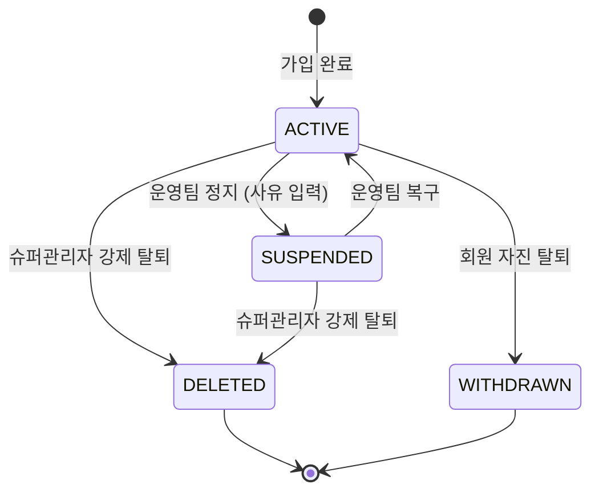
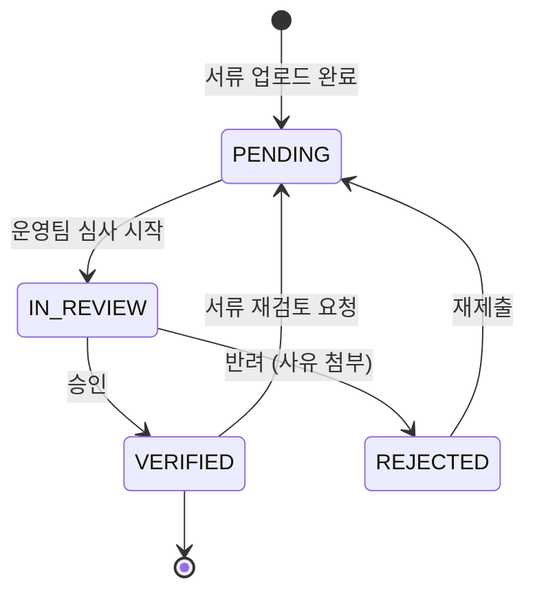

# FS-A-001 회원관리

> 문서 버전: 1.0
> 작성일: 2026-03-30
> 우선순위: P0
> 상태: Draft

---

## 1. 개요

- **기능 설명:** 바야다 플랫폼에 가입한 보호자, 요양보호사, 기관 회원의 전체 계정을 조회, 검색, 관리하고, 요양보호사 자격 인증 심사를 처리하는 관리자 백오피스 기능이다.
- **대상 사용자:**
  - ADMIN (슈퍼관리자): 전체 회원 CRUD, 강제 탈퇴, 역할 변경
  - OPERATOR (운영팀): 회원 조회, 계정 정지/복구, 인증 심사
  - CS팀 (운영팀 하위): 회원 조회, 기본 상태 변경 (읽기 + 제한적 쓰기)
- **관련 PRD 섹션:** 5.1 사용자 관리 / 6.2 보안 요구사항 (RBAC)
- **관련 SERVICE_PLAN 섹션:** 3.4.1 회원 관리

---

## 2. 유저 스토리

| ID | 역할 | 유저 스토리 |
|----|------|-----------|
| US-A-001-01 | 운영팀 | As a 운영팀 담당자, I want to 전체 회원 목록을 검색/필터링하여 조회할 수 있다, so that 특정 회원의 계정 상태를 빠르게 파악할 수 있다. |
| US-A-001-02 | 운영팀 | As a 운영팀 담당자, I want to 회원 상세 정보(프로필, 이용 이력, 신고 이력)를 한 화면에서 확인할 수 있다, so that 회원 문의 및 민원에 신속히 대응할 수 있다. |
| US-A-001-03 | 운영팀 | As a 운영팀 담당자, I want to 위반 회원의 계정을 정지하거나 복구할 수 있다, so that 플랫폼 정책을 위반한 회원에게 즉시 제재 조치를 취할 수 있다. |
| US-A-001-04 | 운영팀 | As a 운영팀 담당자, I want to 요양보호사 인증 신청 큐를 FIFO 순서로 처리할 수 있다, so that 평균 24시간 이내 인증 완료 목표를 달성할 수 있다. |
| US-A-001-05 | 슈퍼관리자 | As a 슈퍼관리자, I want to 회원을 강제 탈퇴 처리하고, 관리자 계정 역할을 변경할 수 있다, so that 심각한 위반자에 대한 최종 조치를 할 수 있다. |
| US-A-001-06 | 슈퍼관리자 | As a 슈퍼관리자, I want to 모든 관리 행위에 대한 감사 로그를 확인할 수 있다, so that 운영팀 행동을 감독하고 투명성을 보장할 수 있다. |

---

## 3. 화면 구성

### 3.1 화면 목록

| 화면 ID | 화면명 | 진입 경로 | 구현 파일 |
|---------|--------|----------|----------|
| SCR-A-001-01 | 회원 목록 | /admin/users | 미구현 |
| SCR-A-001-02 | 회원 상세 | /admin/users/[id] | 미구현 |
| SCR-A-001-03 | 인증 심사 큐 | /admin/certifications | 미구현 |
| SCR-A-001-04 | 인증 심사 상세 | /admin/certifications/[id] | 미구현 |
| SCR-A-001-05 | 감사 로그 | /admin/audit-logs | 미구현 |

### 3.2 화면별 상세

#### SCR-A-001-01: 회원 목록

**레이아웃:**
- 좌측: 관리자 사이드바 (네비게이션)
- 상단: 검색 바 + 필터 영역
- 중앙: 회원 테이블 (페이지네이션)
- 우측 상단: 엑셀 다운로드 버튼

**테이블 컬럼:**
| 컬럼 | 설명 |
|------|------|
| 이름 | 회원명 (클릭 시 상세로 이동) |
| 역할 | GUARDIAN / CAREGIVER / AGENCY |
| 연락처 | 전화번호 (마스킹: 010-****-1234) |
| 이메일 | 이메일 주소 |
| 가입일 | YYYY-MM-DD |
| 상태 | 활성 / 정지 / 탈퇴 (뱃지) |
| 인증 상태 | 요양보호사만: 대기 / 완료 / 반려 |
| 액션 | 상세보기 / 정지 / 복구 드롭다운 |

**필터/검색 옵션:**
- 텍스트 검색: 이름, 이메일, 전화번호
- 역할 필터: 전체 / 보호자 / 요양보호사 / 기관
- 상태 필터: 전체 / 활성 / 정지 / 탈퇴
- 가입일 범위: DateRange Picker
- 인증 상태 필터 (요양보호사): 전체 / 대기 / 완료 / 반려

#### SCR-A-001-02: 회원 상세

**탭 구성:**
1. **기본 정보 탭:** 프로필 정보, 계정 상태, 가입 경로
2. **이용 이력 탭:** 매칭 이력, 돌봄 세션, 계약 목록
3. **결제 이력 탭:** 결제/정산 내역 (보호자: 결제, 요양보호사: 정산)
4. **신고 이력 탭:** 신고 접수/피신고 이력, 제재 기록
5. **감사 로그 탭:** 해당 회원에 대한 관리자 조치 이력

**액션 버튼:**
- 계정 정지 (사유 입력 모달)
- 계정 복구
- 강제 탈퇴 (슈퍼관리자만, 확인 모달)
- 인증 서류 재검토 요청

#### SCR-A-001-03: 인증 심사 큐

**레이아웃:**
- 상단: 대기 건수, 평균 처리 시간, 오늘 처리 건수 통계 카드
- 중앙: 인증 신청 목록 테이블 (FIFO 정렬)

**테이블 컬럼:**
| 컬럼 | 설명 |
|------|------|
| 신청일 | YYYY-MM-DD HH:mm |
| 요양보호사명 | 이름 (클릭 시 심사 상세) |
| 인증 단계 | 현재 certStep (0~7단계) |
| 서류 종류 | 자격증 / 신분증 / 건강검진 등 |
| 대기 시간 | 신청 후 경과 시간 |
| 상태 | 대기 / 심사중 / 완료 / 반려 |
| 담당자 | 배정된 운영팀원 |

#### SCR-A-001-04: 인증 심사 상세

**레이아웃:**
- 좌측: 서류 인라인 뷰어 (이미지/PDF)
- 우측 상단: 요양보호사 기본 정보 요약
- 우측 중앙: 인증 항목 체크리스트
- 우측 하단: 승인/반려 버튼 + 사유 입력

**인증 체크리스트:**
- [ ] 요양보호사 자격증 유효성 확인
- [ ] 신분증 본인 일치 확인
- [ ] 성범죄 경력 조회 결과 확인
- [ ] 건강검진 결과서 유효기간 확인 (선택)
- [ ] 경력증명서 확인 (선택)

---

## 4. 상세 동작 명세

### 4.1 정상 플로우

#### 회원 조회 플로우
```
관리자 로그인
    ↓
회원 관리 메뉴 진입
    ↓
검색/필터 조건 설정
    ↓
회원 목록 조회 (페이지당 20건)
    ↓
회원 클릭 → 상세 페이지 이동
    ↓
탭 전환하여 상세 정보 확인
```

#### 계정 정지 플로우
```
회원 상세 페이지 진입
    ↓
'계정 정지' 버튼 클릭
    ↓
정지 사유 입력 모달 표시
    ↓
정지 사유 선택/입력 (필수)
    ↓
확인 클릭
    ↓
계정 상태 → SUSPENDED (isBanned: true)
    ↓
회원에게 계정 정지 알림 발송
    ↓
감사 로그 기록
```

#### 인증 심사 플로우
```
인증 심사 큐 진입
    ↓
대기 목록에서 최상단 건 클릭
    ↓
서류 뷰어에서 서류 확인
    ↓
체크리스트 항목별 확인
    ↓
[승인 경로]
    승인 버튼 클릭
    → verificationStatus: VERIFIED
    → licenseVerified: true
    → 요양보호사에게 인증 완료 푸시 알림
    → 프로필 검색 결과 노출 활성화

[반려 경로]
    반려 버튼 클릭
    → 반려 사유 선택/입력 (필수)
    → verificationStatus: REJECTED
    → 요양보호사에게 반려 사유 및 재제출 안내 알림
```

### 4.2 예외 플로우

| 예외 상황 | 처리 방법 |
|----------|----------|
| 이미 정지된 계정에 정지 시도 | "이미 정지된 계정입니다" 알림, 버튼 비활성화 |
| 탈퇴 회원에 대한 조치 시도 | "탈퇴한 회원에게 조치할 수 없습니다" 알림 |
| 인증 서류 이미지 로딩 실패 | 대체 텍스트 표시 + 원본 다운로드 링크 제공 |
| 동시에 같은 인증 건 처리 시도 | 낙관적 잠금, "다른 담당자가 처리 중입니다" 알림 |
| 강제 탈퇴 시 진행 중 매칭 존재 | "진행 중인 매칭 N건이 있습니다. 매칭 취소 후 탈퇴 처리하시겠습니까?" 확인 |
| 성범죄 조회 결과 양성 | 자동 반려 + 슈퍼관리자 알림 + 계정 즉시 정지 |

### 4.3 비즈니스 규칙

| 규칙 ID | 규칙 | 설명 |
|---------|------|------|
| BR-A-001-01 | 인증 심사 FIFO | 인증 신청은 접수 순서대로 처리 (신청일 ASC 정렬) |
| BR-A-001-02 | 인증 목표 시간 | 인증 신청 접수 후 24시간 이내 처리 목표 |
| BR-A-001-03 | 정지 사유 필수 | 계정 정지 시 사유 입력 필수 (빈값 불가) |
| BR-A-001-04 | 강제 탈퇴 2차 확인 | 강제 탈퇴 시 슈퍼관리자만 실행 가능, 재확인 모달 필수 |
| BR-A-001-05 | 정지 알림 발송 | 계정 정지/복구 시 대상 회원에게 푸시 알림 + 이메일 발송 |
| BR-A-001-06 | 감사 로그 전량 기록 | 모든 관리 행위(조회 제외)는 감사 로그에 자동 기록 |
| BR-A-001-07 | 개인정보 마스킹 | 목록 화면에서 전화번호, 이메일은 부분 마스킹 표시 |
| BR-A-001-08 | 성범죄 조회 | 요양보호사 최초 인증 시 성범죄 경력 조회 필수, 연 1회 재조회 |
| BR-A-001-09 | 탈퇴 회원 데이터 보존 | 강제 탈퇴 시 개인정보는 익명화하되, 거래 이력은 5년간 보존 (전자상거래법) |

### 4.4 권한 규칙

| 기능 | ADMIN (슈퍼관리자) | OPERATOR (운영팀) | CS팀 |
|------|:-:|:-:|:-:|
| 회원 목록 조회 | O | O | O |
| 회원 상세 조회 | O | O | O |
| 계정 정지 | O | O | X |
| 계정 복구 | O | O | X |
| 강제 탈퇴 | O | X | X |
| 역할 변경 | O | X | X |
| 인증 심사 (승인/반려) | O | O | X |
| 감사 로그 조회 | O | X | X |
| 엑셀 다운로드 | O | O | X |
| 개인정보 전체 열람 (비마스킹) | O | O | X |

---

## 5. 수용 기준 (Acceptance Criteria)

### AC-001: 회원 목록 조회 및 검색
```
Given 운영팀 담당자가 회원 관리 페이지에 접근했을 때
When 역할 필터를 "요양보호사"로, 상태를 "활성"으로 설정하면
Then 활성 상태인 요양보호사 회원 목록만 표시되고, 전화번호는 마스킹(010-****-XXXX) 처리된다
```

### AC-002: 회원 상세 정보 확인
```
Given 운영팀 담당자가 회원 목록에서 특정 회원을 클릭했을 때
When 회원 상세 페이지가 로딩되면
Then 기본 정보, 이용 이력, 결제 이력, 신고 이력 탭이 표시되고
And 각 탭에 해당 회원의 상세 데이터가 정확히 표시된다
```

### AC-003: 계정 정지
```
Given 운영팀 담당자가 활성 상태 회원의 상세 페이지에서 '계정 정지' 버튼을 클릭했을 때
When 정지 사유를 입력하고 확인을 클릭하면
Then 회원 상태가 정지(isBanned: true)로 변경되고
And 해당 회원에게 정지 알림이 발송되며
And 감사 로그에 정지 내역이 기록된다
```

### AC-004: 인증 심사 승인
```
Given 운영팀 담당자가 인증 심사 큐에서 대기 건을 선택했을 때
When 서류를 확인하고 체크리스트를 모두 완료한 후 승인 버튼을 클릭하면
Then 해당 요양보호사의 verificationStatus가 VERIFIED로 변경되고
And licenseVerified가 true로 변경되며
And 요양보호사에게 인증 완료 푸시 알림이 발송되고
And 프로필이 검색 결과에 노출된다
```

### AC-005: 인증 심사 반려
```
Given 운영팀 담당자가 인증 심사 상세에서 반려 사유를 입력했을 때
When 반려 버튼을 클릭하면
Then 해당 요양보호사의 verificationStatus가 REJECTED로 변경되고
And 반려 사유가 rejectionReason에 저장되며
And 요양보호사에게 반려 안내 및 재제출 요청 알림이 발송된다
```

### AC-006: 강제 탈퇴 (슈퍼관리자)
```
Given 슈퍼관리자가 회원 상세 페이지에서 '강제 탈퇴'를 클릭했을 때
When 확인 모달에서 최종 확인을 완료하면
Then 회원 상태가 탈퇴로 변경되고 개인정보가 익명화 처리되며
And 진행 중인 매칭이 있으면 사전 안내가 표시된다

Given OPERATOR 역할의 사용자가 회원 상세에 접근했을 때
When '강제 탈퇴' 버튼 영역을 확인하면
Then 버튼이 표시되지 않거나 비활성화 상태이다
```

---

## 6. API 연동

### 6.1 사용 API 목록

| Method | Endpoint | 설명 | 구현 상태 |
|--------|----------|------|----------|
| GET | /api/admin/users | 회원 목록 조회 (검색/필터/페이지네이션) | ❌ 미구현 |
| GET | /api/admin/users/[id] | 회원 상세 조회 | ❌ 미구현 |
| PATCH | /api/admin/users/[id]/status | 계정 상태 변경 (정지/복구/탈퇴) | ❌ 미구현 |
| PATCH | /api/admin/users/[id]/role | 역할 변경 (슈퍼관리자만) | ❌ 미구현 |
| GET | /api/admin/certifications | 인증 심사 대기 목록 | ❌ 미구현 |
| GET | /api/admin/certifications/[id] | 인증 심사 상세 | ❌ 미구현 |
| PATCH | /api/admin/certifications/[id] | 인증 승인/반려 | ❌ 미구현 |
| GET | /api/admin/audit-logs | 감사 로그 조회 | ❌ 미구현 |
| GET | /api/admin/users/export | 회원 목록 엑셀 다운로드 | ❌ 미구현 |

**참고 — 기존 API:**
| Method | Endpoint | 설명 | 구현 상태 |
|--------|----------|------|----------|
| POST | /api/users | 회원가입 | ✅ 구현됨 |
| GET | /api/users/me | 내 정보 조회 | ✅ 구현됨 |
| GET | /api/caregivers | 요양보호사 목록 | ✅ 구현됨 |

### 6.2 주요 요청/응답 스키마

#### GET /api/admin/users

**Request Query:**
```
GET /api/admin/users?search=홍길동&role=CAREGIVER&status=ACTIVE&page=1&limit=20&sortBy=createdAt&sortOrder=desc
```

**Response:**
```json
{
  "success": true,
  "data": {
    "users": [
      {
        "id": "cuid_xxx",
        "name": "홍길동",
        "phone": "010-****-5678",
        "email": "hong@example.com",
        "role": "CAREGIVER",
        "isActive": true,
        "isBanned": false,
        "createdAt": "2026-03-01T00:00:00Z",
        "caregiverProfile": {
          "verificationStatus": "VERIFIED",
          "licenseVerified": true,
          "averageRating": 4.5,
          "totalCares": 23,
          "grade": "SKILLED"
        }
      }
    ],
    "meta": {
      "page": 1,
      "limit": 20,
      "total": 150,
      "totalPages": 8
    }
  }
}
```

#### PATCH /api/admin/users/[id]/status

**Request Body:**
```json
{
  "action": "SUSPEND",
  "reason": "허위 정보 등록으로 인한 정지"
}
```
- action: `"SUSPEND"` | `"RESTORE"` | `"DELETE"`

**Response:**
```json
{
  "success": true,
  "data": {
    "id": "cuid_xxx",
    "isActive": false,
    "isBanned": true,
    "updatedAt": "2026-03-30T12:00:00Z"
  }
}
```

#### PATCH /api/admin/certifications/[id]

**Request Body:**
```json
{
  "action": "APPROVE",
  "checklist": {
    "licenseValid": true,
    "idMatch": true,
    "criminalCheckClear": true,
    "healthCheckValid": true
  }
}
```
- action: `"APPROVE"` | `"REJECT"`
- REJECT 시 `rejectionReason` 필수

**Response:**
```json
{
  "success": true,
  "data": {
    "id": "cert_xxx",
    "verificationStatus": "VERIFIED",
    "verifiedAt": "2026-03-30T12:00:00Z"
  }
}
```

---

## 7. 상태 다이어그램

### 회원 계정 상태



### 요양보호사 인증 상태



---

## 8. 데이터 모델

### 기존 모델 (사용)

| 모델 | 주요 필드 | 비고 |
|------|----------|------|
| User | id, phone, email, name, role, isActive, isBanned | 회원 기본 정보 |
| GuardianProfile | id, userId, region, address | 보호자 프로필 |
| CaregiverProfile | id, userId, licenseVerified, verificationStatus, backgroundCheck, certStep, grade | 요양보호사 프로필 + 인증 상태 |
| Certificate | id, caregiverId, certType, verificationStatus, rejectionReason, verifiedAt | 인증 서류 |
| Notification | id, userId, type, title, body | 알림 발송 |

### 신규 모델 (필요)

| 모델 | 주요 필드 | 설명 |
|------|----------|------|
| AuditLog | id, adminId, targetUserId, action, reason, metadata, ipAddress, createdAt | 관리자 행위 감사 로그 |
| AccountSanction | id, userId, sanctionType, reason, startDate, endDate, adminId, createdAt | 계정 제재 이력 |

---

## 9. 연관 기능

| 기능 ID | 기능명 | 연관 설명 |
|---------|--------|----------|
| FS-A-002 | 매칭 모니터링 | 회원 상세에서 매칭 이력 조회 시 연동 |
| FS-A-003 | 결제/정산 관리 | 회원 상세에서 결제/정산 이력 탭 연동 |
| FS-A-004 | 신고/분쟁 처리 | 회원 상세에서 신고 이력 탭 연동, 제재 조치 연동 |
| (프론트) | 요양보호사 가입/인증 | 인증 서류 업로드 → 심사 큐 입력 |
| (프론트) | 보호자 회원가입 | 회원 생성 → 관리 대상 등록 |

---

## 10. 구현 현황

| 항목 | 상태 | 비고 |
|------|------|------|
| 회원 목록 페이지 | ❌ | /admin/users 미구현 |
| 회원 상세 페이지 | ❌ | /admin/users/[id] 미구현 |
| 인증 심사 큐 페이지 | ❌ | /admin/certifications 미구현 |
| 인증 심사 상세 페이지 | ❌ | /admin/certifications/[id] 미구현 |
| 감사 로그 페이지 | ❌ | /admin/audit-logs 미구현 |
| Admin 회원 조회 API | ❌ | /api/admin/users 미구현 |
| Admin 계정 상태 변경 API | ❌ | /api/admin/users/[id]/status 미구현 |
| Admin 인증 심사 API | ❌ | /api/admin/certifications 미구현 |
| 감사 로그 API | ❌ | /api/admin/audit-logs 미구현 |
| AuditLog 모델 | ❌ | Prisma 스키마 미추가 |
| AccountSanction 모델 | ❌ | Prisma 스키마 미추가 |
| 기존 User 모델 | ✅ | role, isActive, isBanned 필드 존재 |
| 기존 CaregiverProfile 모델 | ✅ | verificationStatus, licenseVerified, certStep 필드 존재 |
| 기존 Certificate 모델 | ✅ | verificationStatus, rejectionReason 필드 존재 |
| 기존 회원가입 API | ✅ | POST /api/users |
| 기존 내 정보 조회 API | ✅ | GET /api/users/me |
