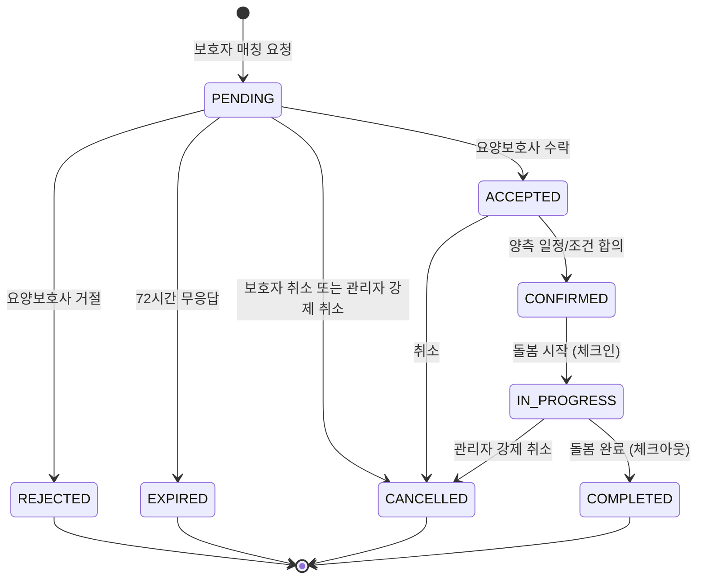
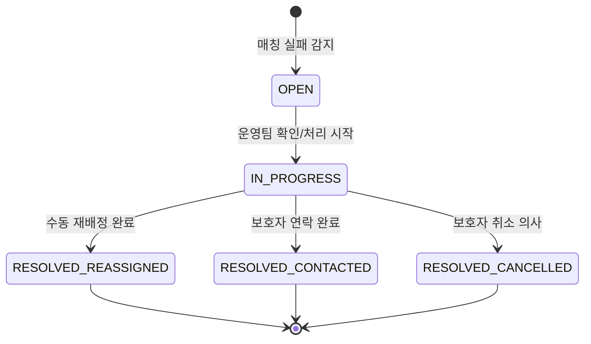

# FS-A-002 매칭 모니터링

> 문서 버전: 1.0
> 작성일: 2026-03-30
> 우선순위: P0
> 상태: Draft

---

## 1. 개요

- **기능 설명:** 플랫폼 전체 매칭 현황을 실시간으로 모니터링하고, 매칭 성공률, 평균 소요 시간, 지역별 수급 현황 등 핵심 KPI를 대시보드 형태로 제공하는 관리자 백오피스 기능이다.
- **대상 사용자:**
  - ADMIN (슈퍼관리자): 전체 대시보드 접근 + 매칭 강제 개입 (취소/재배정)
  - OPERATOR (운영팀): 전체 대시보드 접근 + 매칭 상태 확인, 공석 알림 확인
  - CS팀: 읽기 전용 대시보드 접근
- **관련 PRD 섹션:** 5.2 매칭 현황 대시보드
- **관련 SERVICE_PLAN 섹션:** 3.4.2 매칭 모니터링

---

## 2. 유저 스토리

| ID | 역할 | 유저 스토리 |
|----|------|-----------|
| US-A-002-01 | 운영팀 | As a 운영팀 담당자, I want to 현재 진행 중인 돌봄 건수와 오늘의 매칭 현황을 실시간으로 확인할 수 있다, so that 서비스 운영 상태를 한눈에 파악할 수 있다. |
| US-A-002-02 | 운영팀 | As a 운영팀 담당자, I want to 매칭 성공률과 실패 원인을 분석할 수 있다, so that 매칭 알고리즘 개선 및 공급 부족 지역을 파악할 수 있다. |
| US-A-002-03 | 운영팀 | As a 운영팀 담당자, I want to 매칭 실패 건에 대한 즉시 알림을 받을 수 있다, so that 보호자에게 대체 인력을 수동 배정할 수 있다. |
| US-A-002-04 | 운영팀 | As a 운영팀 담당자, I want to 지역별 수요/공급 현황을 히트맵으로 확인할 수 있다, so that 요양보호사 모집이 필요한 지역을 식별할 수 있다. |
| US-A-002-05 | 슈퍼관리자 | As a 슈퍼관리자, I want to 특정 매칭을 강제 취소하거나 재배정할 수 있다, so that 분쟁 상황에서 즉각 개입할 수 있다. |
| US-A-002-06 | 운영팀 | As a 운영팀 담당자, I want to 일/주/월 단위 매칭 KPI 추이를 확인할 수 있다, so that 서비스 성장 트렌드를 파악할 수 있다. |

---

## 3. 화면 구성

### 3.1 화면 목록

| 화면 ID | 화면명 | 진입 경로 | 구현 파일 |
|---------|--------|----------|----------|
| SCR-A-002-01 | 매칭 대시보드 | /admin/matches | 미구현 |
| SCR-A-002-02 | 매칭 상세 | /admin/matches/[id] | 미구현 |
| SCR-A-002-03 | 매칭 분석 | /admin/matches/analytics | 미구현 |
| SCR-A-002-04 | 공석 알림 목록 | /admin/matches/vacancies | 미구현 |

### 3.2 화면별 상세

#### SCR-A-002-01: 매칭 대시보드

**상단 — 실시간 지표 카드 (4개):**
| 카드 | 지표 | 업데이트 주기 |
|------|------|-------------|
| 진행 중 돌봄 | 현재 IN_PROGRESS 상태 매칭 수 | 실시간 (30초) |
| 오늘 새 매칭 요청 | 오늘 PENDING 생성 건수 | 실시간 (30초) |
| 오늘 매칭 성사 | 오늘 CONFIRMED 전환 건수 | 실시간 (30초) |
| 대기 중 요청 | 현재 PENDING 상태 매칭 수 | 실시간 (30초) |

**중단 — KPI 차트 영역:**
- 매칭 성공률 추이 그래프 (일/주/월 토글)
- 평균 매칭 소요 시간 추이 그래프
- 매칭 실패 원인 파이 차트 (거절, 만료, 취소 비율)

**하단 — 매칭 목록 테이블:**
| 컬럼 | 설명 |
|------|------|
| 매칭 ID | 매칭 고유번호 (클릭 시 상세) |
| 보호자 | 보호자명 |
| 요양보호사 | 요양보호사명 |
| 서비스 유형 | serviceCategory |
| 요청일 | requestedAt |
| 상태 | PENDING / ACCEPTED / CONFIRMED / IN_PROGRESS / COMPLETED / CANCELLED |
| 소요 시간 | 요청~확정 경과 시간 |
| 액션 | 상세보기 / 강제 취소 |

**필터:**
- 상태: 전체 / PENDING / ACCEPTED / CONFIRMED / IN_PROGRESS / COMPLETED / CANCELLED
- 서비스 유형: 전체 / 방문요양 / 병원동행 / 간병 / 목욕 등
- 날짜 범위: DateRange Picker
- 지역: 시/구/동 선택

#### SCR-A-002-02: 매칭 상세

**레이아웃:**
- 상단: 매칭 상태 타임라인 (PENDING → ACCEPTED → CONFIRMED → IN_PROGRESS → COMPLETED)
- 좌측: 보호자 정보 + 어르신(돌봄대상자) 정보
- 우측: 요양보호사 정보 + 프로필 요약
- 중앙: 매칭 상세 정보 (일정, 요금, 특이사항)
- 하단: 관련 돌봄 세션 목록 + 채팅 이력 요약

**액션 버튼:**
- 매칭 강제 취소 (사유 입력 필수, 슈퍼관리자만)
- 매칭 메모 추가 (운영 메모)

#### SCR-A-002-03: 매칭 분석

**차트 구성:**
1. 지역별 매칭 현황 히트맵 (카카오맵 기반)
2. 시간대별 매칭 요청 분포 (히스토그램)
3. 서비스 유형별 매칭 성공률 (막대 차트)
4. 매칭 소요 시간 분포 (박스 플롯)
5. 주간/월간 매칭 건수 추이 (라인 차트)

#### SCR-A-002-04: 공석 알림 목록

**테이블 컬럼:**
| 컬럼 | 설명 |
|------|------|
| 요청일 | 매칭 요청일 |
| 보호자 | 보호자명 |
| 서비스 유형 | 요청한 서비스 유형 |
| 지역 | 돌봄 장소 지역 |
| 실패 원인 | 요양보호사 부족 / 거절 / 시간 만료 |
| 대기 일수 | 매칭 실패 후 경과일 |
| 조치 | 수동 배정 / 보호자 연락 |

---

## 4. 상세 동작 명세

### 4.1 정상 플로우

#### 대시보드 조회 플로우
```
관리자 로그인
    ↓
매칭 모니터링 메뉴 진입
    ↓
실시간 지표 카드 로딩 (30초 간격 자동 갱신)
    ↓
KPI 차트 로딩 (기본: 최근 7일)
    ↓
매칭 목록 테이블 로딩 (기본: 최근 건, 20건/페이지)
    ↓
[선택] 필터/날짜 변경 시 데이터 재조회
```

#### 매칭 강제 취소 플로우
```
매칭 상세 페이지 진입
    ↓
'강제 취소' 버튼 클릭 (슈퍼관리자만)
    ↓
취소 사유 입력 모달 표시
    ↓
취소 사유 입력 (필수)
    ↓
확인 클릭
    ↓
매칭 상태 → CANCELLED (cancelReason 저장)
    ↓
보호자 + 요양보호사 양측 알림 발송
    ↓
진행 중인 돌봄 세션이 있으면 CANCELLED 처리
    ↓
감사 로그 기록
```

#### 공석 알림 처리 플로우
```
매칭 실패 감지 (만료/거절)
    ↓
공석 알림 목록에 자동 등록
    ↓
운영팀 확인
    ↓
[수동 배정] 적합한 요양보호사 검색 → 직접 매칭 생성
[보호자 연락] 보호자에게 상황 안내 + 대안 제시
    ↓
처리 완료 시 공석 알림 상태 변경 (RESOLVED)
```

### 4.2 예외 플로우

| 예외 상황 | 처리 방법 |
|----------|----------|
| 실시간 데이터 로딩 실패 | 마지막 성공 데이터 표시 + "데이터 갱신 실패" 알림 |
| 이미 완료된 매칭 강제 취소 시도 | "완료된 매칭은 취소할 수 없습니다" 알림 |
| 강제 취소 시 결제 처리된 건 존재 | "결제 처리된 건입니다. 환불 처리 후 취소하시겠습니까?" 안내 → 결제/정산 관리 연동 |
| 히트맵 지도 API 로딩 실패 | 텍스트 기반 지역별 테이블로 폴백 |
| 수동 배정 시 요양보호사 스케줄 충돌 | "해당 시간에 이미 배정이 있습니다" 경고 표시 |

### 4.3 비즈니스 규칙

| 규칙 ID | 규칙 | 설명 |
|---------|------|------|
| BR-A-002-01 | 실시간 갱신 주기 | 실시간 지표 카드는 30초마다 자동 갱신 |
| BR-A-002-02 | 매칭 성공률 산출 | 매칭 성공률 = CONFIRMED 이상 건수 / 전체 매칭 요청 건수 * 100 |
| BR-A-002-03 | 평균 매칭 소요 시간 | 요청(requestedAt) → 확정(confirmedAt) 시간 차이의 평균 |
| BR-A-002-04 | 매칭 실패 판정 | PENDING 상태에서 72시간 무응답 시 EXPIRED 자동 전환 |
| BR-A-002-05 | 공석 알림 생성 조건 | 매칭 상태가 EXPIRED 또는 요양보호사 REJECTED일 때 자동 생성 |
| BR-A-002-06 | 강제 취소 권한 | 매칭 강제 취소는 ADMIN(슈퍼관리자)만 가능 |
| BR-A-002-07 | 목표 매칭 성공률 | 85% 이상 (PRD G3 목표) |
| BR-A-002-08 | KPI 기간 필터 | 일/주/월/분기/연 단위 조회 가능 |

### 4.4 권한 규칙

| 기능 | ADMIN (슈퍼관리자) | OPERATOR (운영팀) | CS팀 |
|------|:-:|:-:|:-:|
| 대시보드 조회 | O | O | O (읽기 전용) |
| 매칭 상세 조회 | O | O | O |
| 매칭 분석 차트 | O | O | O |
| 매칭 강제 취소 | O | X | X |
| 수동 매칭 배정 | O | O | X |
| 공석 알림 처리 | O | O | X |
| 데이터 엑셀 다운로드 | O | O | X |

---

## 5. 수용 기준 (Acceptance Criteria)

### AC-001: 실시간 지표 카드 표시
```
Given 운영팀 담당자가 매칭 대시보드에 접근했을 때
When 페이지가 로딩되면
Then 진행 중 돌봄 수, 오늘 새 매칭 요청 수, 오늘 매칭 성사 수, 대기 중 요청 수가 카드 형태로 표시되고
And 30초마다 자동으로 데이터가 갱신된다
```

### AC-002: 매칭 목록 필터링
```
Given 운영팀 담당자가 매칭 목록에서 상태 필터를 "PENDING"으로 설정했을 때
When 필터가 적용되면
Then PENDING 상태의 매칭만 테이블에 표시되고
And 각 매칭의 대기 시간이 정확히 계산되어 표시된다
```

### AC-003: 매칭 성공률 차트
```
Given 운영팀 담당자가 KPI 차트 영역에서 기간을 "월간"으로 설정했을 때
When 차트가 렌더링되면
Then 최근 12개월의 월별 매칭 성공률이 라인 차트로 표시되고
And 목표치(85%)가 기준선으로 표시된다
```

### AC-004: 매칭 강제 취소
```
Given 슈퍼관리자가 IN_PROGRESS 상태 매칭의 상세 페이지에서 '강제 취소'를 클릭했을 때
When 취소 사유를 입력하고 확인을 클릭하면
Then 매칭 상태가 CANCELLED로 변경되고
And 보호자와 요양보호사 양측에 취소 알림이 발송되며
And 관련 돌봄 세션도 CANCELLED로 변경되고
And 감사 로그에 기록된다
```

### AC-005: 공석 알림 자동 생성
```
Given 매칭이 72시간 무응답으로 EXPIRED 상태가 되었을 때
When 상태 전환이 완료되면
Then 공석 알림 목록에 해당 건이 자동 등록되고
And 운영팀에 알림이 발송된다
```

### AC-006: 지역별 히트맵
```
Given 운영팀 담당자가 매칭 분석 페이지에 접근했을 때
When 지역별 히트맵이 로딩되면
Then 지역(구/동 단위)별 매칭 요청 건수가 색상 농도로 표시되고
And 특정 지역 클릭 시 해당 지역의 수요(요청 건수) 대비 공급(활동 요양보호사 수) 상세가 표시된다
```

---

## 6. API 연동

### 6.1 사용 API 목록

| Method | Endpoint | 설명 | 구현 상태 |
|--------|----------|------|----------|
| GET | /api/admin/matches | 매칭 목록 조회 (필터/페이지네이션) | ❌ 미구현 |
| GET | /api/admin/matches/[id] | 매칭 상세 조회 | ❌ 미구현 |
| PATCH | /api/admin/matches/[id]/cancel | 매칭 강제 취소 | ❌ 미구현 |
| POST | /api/admin/matches/assign | 수동 매칭 배정 | ❌ 미구현 |
| GET | /api/admin/matches/stats | 매칭 실시간 지표 | ❌ 미구현 |
| GET | /api/admin/matches/analytics | 매칭 분석 데이터 (KPI, 히트맵) | ❌ 미구현 |
| GET | /api/admin/matches/vacancies | 공석 알림 목록 | ❌ 미구현 |
| PATCH | /api/admin/matches/vacancies/[id] | 공석 알림 처리 완료 | ❌ 미구현 |

**참고 — 기존 API:**
| Method | Endpoint | 설명 | 구현 상태 |
|--------|----------|------|----------|
| GET | /api/matches | 내 매칭 목록 조회 | ✅ 구현됨 |
| POST | /api/matches | 매칭 요청 생성 | ✅ 구현됨 |
| PATCH | /api/matches/[id] | 매칭 상태 변경 (수락/거절) | ✅ 구현됨 |

### 6.2 주요 요청/응답 스키마

#### GET /api/admin/matches/stats

**Response:**
```json
{
  "success": true,
  "data": {
    "realtime": {
      "activeCareSessions": 128,
      "todayNewRequests": 45,
      "todayMatched": 32,
      "pendingRequests": 67
    },
    "updatedAt": "2026-03-30T12:00:30Z"
  }
}
```

#### GET /api/admin/matches/analytics

**Request Query:**
```
GET /api/admin/matches/analytics?period=monthly&startDate=2026-01-01&endDate=2026-03-30
```

**Response:**
```json
{
  "success": true,
  "data": {
    "successRate": {
      "labels": ["2026-01", "2026-02", "2026-03"],
      "values": [82.3, 84.1, 86.7],
      "target": 85.0
    },
    "avgMatchingTime": {
      "labels": ["2026-01", "2026-02", "2026-03"],
      "values": [18.5, 15.2, 12.8],
      "unit": "hours"
    },
    "failureReasons": {
      "expired": 120,
      "rejected": 85,
      "cancelled": 45
    },
    "regionHeatmap": [
      { "region": "서울 강남구", "requests": 45, "activeCaregivers": 120, "ratio": 0.375 },
      { "region": "서울 송파구", "requests": 38, "activeCaregivers": 85, "ratio": 0.447 }
    ]
  }
}
```

#### PATCH /api/admin/matches/[id]/cancel

**Request Body:**
```json
{
  "reason": "보호자 분쟁 접수로 인한 강제 취소",
  "cancelRelatedSessions": true
}
```

**Response:**
```json
{
  "success": true,
  "data": {
    "id": "match_xxx",
    "status": "CANCELLED",
    "cancelReason": "보호자 분쟁 접수로 인한 강제 취소",
    "cancelledAt": "2026-03-30T12:00:00Z",
    "cancelledSessions": 3
  }
}
```

---

## 7. 상태 다이어그램

### 매칭 상태 전이



### 공석 알림 상태



---

## 8. 데이터 모델

### 기존 모델 (사용)

| 모델 | 주요 필드 | 비고 |
|------|----------|------|
| Match | id, guardianId, caregiverId, status, serviceCategory, requestedAt, confirmedAt, cancelledAt, cancelReason | 매칭 정보 |
| CareSession | id, matchId, status, scheduledDate, actualStart, actualEnd | 돌봄 세션 |
| MatchRecipient | matchId, careRecipientId | 매칭-돌봄대상자 연결 |
| CareRecipient | id, guardianId, name, address | 돌봄대상자 (지역 정보) |

### 신규 모델 (필요)

| 모델 | 주요 필드 | 설명 |
|------|----------|------|
| MatchVacancy | id, matchId, reason, region, serviceCategory, status, assignedOperatorId, resolvedAt, resolution | 공석 알림 |
| MatchAnalyticsCache | id, period, periodStart, periodEnd, successRate, avgMatchingHours, totalRequests, totalMatched, regionData, createdAt | 분석 캐시 (배치 계산) |

---

## 9. 연관 기능

| 기능 ID | 기능명 | 연관 설명 |
|---------|--------|----------|
| FS-A-001 | 회원관리 | 매칭 상세에서 보호자/요양보호사 회원 정보 조회 |
| FS-A-003 | 결제/정산 관리 | 매칭 강제 취소 시 결제 환불 처리 연동 |
| FS-A-004 | 신고/분쟁 처리 | 분쟁으로 인한 매칭 강제 취소 시 연동 |
| (프론트) | 매칭 요청 | 보호자 매칭 요청 → 매칭 모니터링에 반영 |
| (프론트) | 매칭 수락/거절 | 요양보호사 응답 → 실시간 지표 갱신 |

---

## 10. 구현 현황

| 항목 | 상태 | 비고 |
|------|------|------|
| 매칭 대시보드 페이지 | ❌ | /admin/matches 미구현 |
| 매칭 상세 페이지 | ❌ | /admin/matches/[id] 미구현 |
| 매칭 분석 페이지 | ❌ | /admin/matches/analytics 미구현 |
| 공석 알림 페이지 | ❌ | /admin/matches/vacancies 미구현 |
| Admin 매칭 목록 API | ❌ | /api/admin/matches 미구현 |
| Admin 매칭 강제 취소 API | ❌ | /api/admin/matches/[id]/cancel 미구현 |
| 매칭 실시간 지표 API | ❌ | /api/admin/matches/stats 미구현 |
| 매칭 분석 API | ❌ | /api/admin/matches/analytics 미구현 |
| 공석 알림 API | ❌ | /api/admin/matches/vacancies 미구현 |
| MatchVacancy 모델 | ❌ | Prisma 스키마 미추가 |
| MatchAnalyticsCache 모델 | ❌ | Prisma 스키마 미추가 |
| 기존 Match 모델 | ✅ | status, requestedAt, confirmedAt, cancelledAt 필드 존재 |
| 기존 CareSession 모델 | ✅ | matchId, status, scheduledDate 필드 존재 |
| 기존 매칭 CRUD API | ✅ | GET/POST /api/matches, PATCH /api/matches/[id] |
