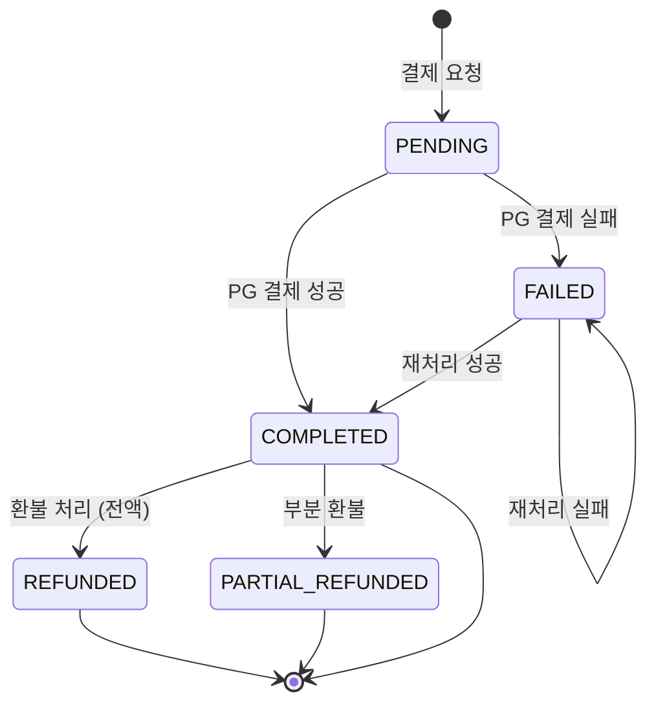
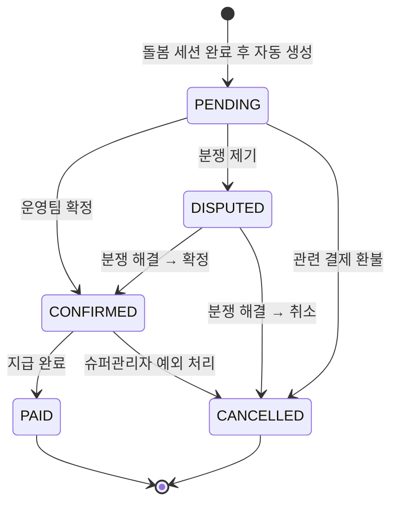

# FS-A-003 결제/정산 관리

> 문서 버전: 1.0
> 작성일: 2026-03-30
> 우선순위: P0
> 상태: Draft

---

## 1. 개요

- **기능 설명:** 플랫폼 전체 결제 내역 조회, 환불 처리, 요양보호사 정산 관리, 수익 현황 분석을 통합적으로 수행하는 관리자 백오피스 기능이다. 보호자 결제(이용권/구독), 요양보호사 정산(서비스 수수료 차감 후 지급), 분쟁 건 환불을 관리한다.
- **대상 사용자:**
  - ADMIN (슈퍼관리자): 전체 결제/정산 관리 + 환불 승인 + 수수료율 설정
  - OPERATOR (운영팀): 결제 내역 조회 + 정산 처리 + 환불 요청
  - CS팀: 결제 내역 읽기 전용 조회
- **관련 PRD 섹션:** 5.3 결제 및 정산 관리
- **관련 SERVICE_PLAN 섹션:** 3.4.3 결제/정산 관리

---

## 2. 유저 스토리

| ID | 역할 | 유저 스토리 |
|----|------|-----------|
| US-A-003-01 | 운영팀 | As a 운영팀 담당자, I want to 전체 결제 내역을 날짜, 금액, 상태별로 조회할 수 있다, so that 결제 현황을 파악하고 이상 건을 식별할 수 있다. |
| US-A-003-02 | 운영팀 | As a 운영팀 담당자, I want to 분쟁 건에 대해 환불 처리를 할 수 있다, so that 보호자 불만을 신속히 해결할 수 있다. |
| US-A-003-03 | 운영팀 | As a 운영팀 담당자, I want to 요양보호사 정산 스케줄을 관리하고 일괄 정산을 처리할 수 있다, so that 정해진 주기에 맞춰 요양보호사에게 수당을 지급할 수 있다. |
| US-A-003-04 | 운영팀 | As a 운영팀 담당자, I want to 정산 내역을 엑셀로 다운로드할 수 있다, so that 재무팀에 정산 데이터를 전달할 수 있다. |
| US-A-003-05 | 슈퍼관리자 | As a 슈퍼관리자, I want to 일/주/월/연 매출 그래프와 상품별 매출 분석을 확인할 수 있다, so that 사업 수익 현황을 파악하고 의사결정에 활용할 수 있다. |
| US-A-003-06 | 운영팀 | As a 운영팀 담당자, I want to 결제 실패 건을 확인하고 재처리할 수 있다, so that 결제 오류로 인한 서비스 중단을 최소화할 수 있다. |
| US-A-003-07 | 슈퍼관리자 | As a 슈퍼관리자, I want to 플랫폼 수수료율을 설정하고, 수수료 수입을 집계할 수 있다, so that 수익 모델을 관리할 수 있다. |

---

## 3. 화면 구성

### 3.1 화면 목록

| 화면 ID | 화면명 | 진입 경로 | 구현 파일 |
|---------|--------|----------|----------|
| SCR-A-003-01 | 결제 내역 | /admin/payments | 미구현 |
| SCR-A-003-02 | 결제 상세 | /admin/payments/[id] | 미구현 |
| SCR-A-003-03 | 정산 관리 | /admin/settlements | 미구현 |
| SCR-A-003-04 | 정산 상세 | /admin/settlements/[id] | 미구현 |
| SCR-A-003-05 | 수익 대시보드 | /admin/revenue | 미구현 |

### 3.2 화면별 상세

#### SCR-A-003-01: 결제 내역

**상단 — 요약 카드 (4개):**
| 카드 | 지표 | 설명 |
|------|------|------|
| 오늘 매출 | 오늘 COMPLETED 결제 합계 | 일간 매출 |
| 이번 달 매출 | 당월 COMPLETED 결제 합계 | 월간 매출 |
| 환불 금액 | 당월 REFUNDED 합계 | 월간 환불 |
| 결제 실패 | 당월 FAILED 건수 | 월간 실패 건 |

**테이블 컬럼:**
| 컬럼 | 설명 |
|------|------|
| 결제 ID | 고유번호 (클릭 시 상세) |
| 결제자 | 보호자명 |
| 상품 유형 | CREDIT (이용권) / SUBSCRIPTION (구독) |
| 금액 | 결제 금액 (원) |
| 상태 | PENDING / COMPLETED / FAILED / REFUNDED (뱃지) |
| PG사 | TOSS / KGINICIS |
| 결제일 | YYYY-MM-DD HH:mm |
| 액션 | 상세보기 / 환불 |

**필터/검색:**
- 텍스트 검색: 결제자명, 결제 ID, PG 거래 ID
- 상태 필터: 전체 / COMPLETED / FAILED / REFUNDED / PENDING
- 상품 유형: 전체 / 이용권 / 구독
- PG사: 전체 / 토스페이먼츠 / KG이니시스
- 날짜 범위: DateRange Picker
- 금액 범위: 최소~최대

#### SCR-A-003-02: 결제 상세

**레이아웃:**
- 상단: 결제 상태 뱃지 + 결제 금액
- 좌측: 결제 정보 (상품, PG 거래 ID, 결제 수단, 결제일)
- 우측: 결제자 정보 (보호자명, 연락처)
- 하단: 관련 매칭/돌봄 세션 정보 + 환불 이력

**액션 버튼:**
- 환불 처리 (사유 입력 모달, 부분/전액 선택)
- 결제 실패 재처리 (FAILED 건만)

#### SCR-A-003-03: 정산 관리

**상단 — 요약 카드 (4개):**
| 카드 | 지표 | 설명 |
|------|------|------|
| 대기 정산 | PENDING 상태 건수 + 총액 | 미처리 정산 |
| 확정 정산 | CONFIRMED 상태 건수 + 총액 | 지급 대기 |
| 이번 달 지급 완료 | PAID 건수 + 총액 | 당월 지급 완료 |
| 분쟁 건 | DISPUTED 건수 | 분쟁 중 정산 |

**테이블 컬럼:**
| 컬럼 | 설명 |
|------|------|
| 정산 ID | 고유번호 (클릭 시 상세) |
| 요양보호사명 | 수령 대상자 |
| 돌봄 세션 | 관련 세션 날짜/시간 |
| 총 금액 | amount |
| 수수료 | platformFee (3%) |
| 실수령액 | netAmount |
| 상태 | PENDING / CONFIRMED / DISPUTED / PAID / CANCELLED (뱃지) |
| 생성일 | createdAt |
| 액션 | 확정 / 분쟁 처리 / 수동 지급 |

**필터:**
- 상태 필터: 전체 / PENDING / CONFIRMED / DISPUTED / PAID / CANCELLED
- 날짜 범위: DateRange Picker
- 요양보호사명 검색

**일괄 액션:**
- 선택 건 일괄 확정
- 선택 건 일괄 지급 처리
- 정산 내역 엑셀 다운로드

#### SCR-A-003-04: 정산 상세

**레이아웃:**
- 상단: 정산 상태 타임라인 (PENDING → CONFIRMED → PAID)
- 좌측: 정산 금액 상세 (총액, 수수료, 실수령)
- 우측: 요양보호사 정보 + 계좌 정보
- 중앙: 관련 돌봄 세션 상세 (날짜, 시간, 시급, 총 시간)
- 하단: 분쟁 이력 (있는 경우)

**액션 버튼:**
- 정산 확정 (PENDING → CONFIRMED)
- 수동 지급 처리 (CONFIRMED → PAID, 지급일/방법 입력)
- 분쟁 처리 (DISPUTED → CONFIRMED 또는 CANCELLED)

#### SCR-A-003-05: 수익 대시보드

**차트 구성:**
1. 매출 추이 그래프 (일/주/월/연 토글, 라인 차트)
2. 상품별 매출 분석 (이용권 vs 구독 비율, 도넛 차트)
3. 월간 수수료 수입 추이 (막대 차트)
4. 환불률 추이 (라인 차트)
5. 결제 실패율 추이 (라인 차트)

---

## 4. 상세 동작 명세

### 4.1 정상 플로우

#### 환불 처리 플로우
```
결제 내역에서 특정 결제 건 선택
    ↓
결제 상세 페이지 진입
    ↓
'환불 처리' 버튼 클릭
    ↓
환불 모달 표시
  ├─ 환불 유형 선택: 전액 환불 / 부분 환불
  ├─ 부분 환불 시 환불 금액 입력
  └─ 환불 사유 입력 (필수)
    ↓
확인 클릭
    ↓
PG사 환불 API 호출
    ↓
결제 상태 → REFUNDED
    ↓
관련 정산 건 CANCELLED 처리
    ↓
보호자에게 환불 완료 알림 발송
    ↓
감사 로그 기록
```

#### 정산 일괄 처리 플로우
```
정산 관리 페이지 진입
    ↓
상태 필터: PENDING 선택
    ↓
대기 정산 목록 확인
    ↓
처리할 건 체크박스 선택 (전체 선택 가능)
    ↓
'일괄 확정' 버튼 클릭
    ↓
확인 모달 (N건, 총 금액 표시)
    ↓
확인 클릭
    ↓
선택 건 상태 → CONFIRMED (confirmedAt 기록)
    ↓
[후속] 재무팀 지급 후 → '일괄 지급 처리'
    ↓
선택 건 상태 → PAID (paidAt, paidMethod 기록)
    ↓
요양보호사에게 정산 완료 알림 발송
```

#### 결제 실패 재처리 플로우
```
결제 내역에서 FAILED 건 선택
    ↓
결제 상세 페이지 진입
    ↓
실패 원인 확인 (PG 응답 코드)
    ↓
'재처리' 버튼 클릭
    ↓
PG사 결제 재시도 API 호출
    ↓
[성공] 상태 → COMPLETED
[실패] 상태 유지 + 실패 사유 업데이트
    ↓
결과 알림 발송
```

### 4.2 예외 플로우

| 예외 상황 | 처리 방법 |
|----------|----------|
| PG사 환불 API 실패 | "PG사 처리 중 오류가 발생했습니다. 잠시 후 다시 시도해주세요." + 재시도 버튼 |
| 이미 환불된 건 재환불 시도 | "이미 환불 처리된 결제입니다" 알림, 환불 버튼 비활성화 |
| 부분 환불 금액이 원결제 금액 초과 | "환불 금액은 원 결제 금액을 초과할 수 없습니다" 유효성 오류 |
| 분쟁 중인 정산 건 확정 시도 | "분쟁 처리 완료 후 확정해주세요" 안내 |
| 일괄 처리 중 일부 건 실패 | 성공/실패 건수 요약 표시, 실패 건 사유 목록 |
| 요양보호사 계좌 정보 미등록 | 지급 처리 불가 + "계좌 정보 미등록" 경고 |
| 정산 금액 0원 | 정산 생성 차단 (돌봄 세션 totalAmount 필수) |

### 4.3 비즈니스 규칙

| 규칙 ID | 규칙 | 설명 |
|---------|------|------|
| BR-A-003-01 | 플랫폼 수수료율 | 기본 수수료율 3% (PRD 기준, totalAmount * 0.03) |
| BR-A-003-02 | 실수령액 계산 | netAmount = amount - platformFee |
| BR-A-003-03 | 환불 사유 필수 | 모든 환불 처리 시 사유 입력 필수 |
| BR-A-003-04 | 에스크로 결제 | 돌봄 완료 후 72시간 이의제기 없으면 자동 결제 확정 |
| BR-A-003-05 | 정산 주기 | 매주 1회 또는 매월 1회 일괄 정산 (설정 가능) |
| BR-A-003-06 | 환불 기한 | 결제 후 7일 이내 전액 환불 가능, 이후 부분 환불만 가능 |
| BR-A-003-07 | 정산 확정 후 변경 불가 | PAID 상태 정산은 수정/취소 불가 (슈퍼관리자 예외 처리만 가능) |
| BR-A-003-08 | 세금계산서 | 월 정산 합계 기준 전자세금계산서 발행 (사업자 요양보호사 대상) |
| BR-A-003-09 | 거래 기록 보존 | 전자상거래법에 따라 결제/정산 기록 5년간 보존 |

### 4.4 권한 규칙

| 기능 | ADMIN (슈퍼관리자) | OPERATOR (운영팀) | CS팀 |
|------|:-:|:-:|:-:|
| 결제 내역 조회 | O | O | O (읽기 전용) |
| 결제 상세 조회 | O | O | O |
| 환불 처리 (전액) | O | O | X |
| 환불 처리 (부분) | O | O | X |
| 결제 실패 재처리 | O | O | X |
| 정산 목록 조회 | O | O | X |
| 정산 일괄 확정 | O | O | X |
| 정산 수동 지급 | O | X | X |
| 수수료율 설정 변경 | O | X | X |
| 수익 대시보드 | O | O | X |
| 엑셀 다운로드 | O | O | X |
| PAID 건 예외 수정 | O | X | X |

---

## 5. 수용 기준 (Acceptance Criteria)

### AC-001: 결제 내역 조회
```
Given 운영팀 담당자가 결제 내역 페이지에 접근했을 때
When 상태 필터를 "FAILED"로 설정하면
Then 결제 실패 건만 표시되고
And 각 건의 PG사, 금액, 결제자명, 실패일시가 정확히 표시된다
```

### AC-002: 환불 처리
```
Given 운영팀 담당자가 COMPLETED 상태의 결제 상세에서 '환불 처리'를 클릭했을 때
When 전액 환불을 선택하고 사유를 입력한 후 확인을 클릭하면
Then PG사 환불 API가 호출되고
And 결제 상태가 REFUNDED로 변경되며
And 관련 정산 건이 CANCELLED로 변경되고
And 보호자에게 환불 완료 알림이 발송되며
And 감사 로그에 환불 내역이 기록된다
```

### AC-003: 정산 일괄 확정
```
Given 운영팀 담당자가 PENDING 상태 정산 건 10건을 선택했을 때
When '일괄 확정' 버튼을 클릭하고 확인하면
Then 10건 모두 CONFIRMED 상태로 변경되고
And confirmedAt이 현재 시각으로 기록되며
And 처리 완료 토스트 메시지가 표시된다
```

### AC-004: 정산 지급 처리
```
Given 슈퍼관리자가 CONFIRMED 상태 정산 건의 상세에서 '수동 지급' 버튼을 클릭했을 때
When 지급일과 지급 방법(계좌이체)을 입력하고 확인하면
Then 정산 상태가 PAID로 변경되고
And paidAt, paidMethod가 기록되며
And 요양보호사에게 정산 완료 알림이 발송된다
```

### AC-005: 수익 대시보드
```
Given 슈퍼관리자가 수익 대시보드에 접근했을 때
When 기간을 "월간"으로 설정하면
Then 최근 12개월 매출 추이 그래프가 표시되고
And 이용권 vs 구독 매출 비율이 도넛 차트로 표시되며
And 월간 플랫폼 수수료 수입이 막대 차트로 표시된다
```

### AC-006: 결제 실패 재처리
```
Given 운영팀 담당자가 FAILED 상태의 결제 상세에서 '재처리' 버튼을 클릭했을 때
When PG사 결제 재시도가 성공하면
Then 결제 상태가 COMPLETED로 변경되고
And 결제 완료 알림이 보호자에게 발송된다

When PG사 결제 재시도가 실패하면
Then 상태가 FAILED로 유지되고
And 최신 실패 사유가 업데이트된다
```

### AC-007: 정산 엑셀 다운로드
```
Given 운영팀 담당자가 정산 관리에서 날짜 범위를 설정하고 '엑셀 다운로드'를 클릭했을 때
When 다운로드가 실행되면
Then 설정한 범위의 정산 내역이 엑셀 파일로 다운로드되고
And 요양보호사명, 정산 금액, 수수료, 실수령액, 상태, 지급일이 포함된다
```

---

## 6. API 연동

### 6.1 사용 API 목록

| Method | Endpoint | 설명 | 구현 상태 |
|--------|----------|------|----------|
| GET | /api/admin/payments | 결제 내역 조회 (필터/페이지네이션) | ❌ 미구현 |
| GET | /api/admin/payments/[id] | 결제 상세 조회 | ❌ 미구현 |
| POST | /api/admin/payments/[id]/refund | 환불 처리 | ❌ 미구현 |
| POST | /api/admin/payments/[id]/retry | 결제 실패 재처리 | ❌ 미구현 |
| GET | /api/admin/payments/stats | 결제 요약 통계 | ❌ 미구현 |
| GET | /api/admin/settlements | 정산 목록 조회 (필터/페이지네이션) | ❌ 미구현 |
| GET | /api/admin/settlements/[id] | 정산 상세 조회 | ❌ 미구현 |
| PATCH | /api/admin/settlements/bulk-confirm | 정산 일괄 확정 | ❌ 미구현 |
| PATCH | /api/admin/settlements/[id]/pay | 정산 지급 처리 | ❌ 미구현 |
| PATCH | /api/admin/settlements/[id]/dispute | 정산 분쟁 처리 | ❌ 미구현 |
| GET | /api/admin/settlements/export | 정산 엑셀 다운로드 | ❌ 미구현 |
| GET | /api/admin/revenue | 수익 대시보드 데이터 | ❌ 미구현 |
| PUT | /api/admin/settings/fee-rate | 수수료율 설정 변경 | ❌ 미구현 |

**참고 — 기존 API:**
| Method | Endpoint | 설명 | 구현 상태 |
|--------|----------|------|----------|
| GET | /api/settlements | 내 정산 목록 조회 | ✅ 구현됨 |
| POST | /api/settlements | 정산 생성 | ✅ 구현됨 |
| PATCH | /api/settlements/[id] | 정산 상태 변경 | ✅ 구현됨 |

### 6.2 주요 요청/응답 스키마

#### GET /api/admin/payments

**Request Query:**
```
GET /api/admin/payments?status=COMPLETED&productType=SUBSCRIPTION&startDate=2026-03-01&endDate=2026-03-30&page=1&limit=20
```

**Response:**
```json
{
  "success": true,
  "data": {
    "payments": [
      {
        "id": "pay_xxx",
        "userId": "user_xxx",
        "userName": "김보호자",
        "productType": "SUBSCRIPTION",
        "productId": "plan_premium",
        "amount": 29900,
        "status": "COMPLETED",
        "pgProvider": "TOSS",
        "pgTransactionId": "toss_tx_xxx",
        "paidAt": "2026-03-15T10:30:00Z"
      }
    ],
    "meta": {
      "page": 1,
      "limit": 20,
      "total": 250,
      "totalPages": 13
    }
  }
}
```

#### POST /api/admin/payments/[id]/refund

**Request Body:**
```json
{
  "refundType": "FULL",
  "amount": null,
  "reason": "돌봄 서비스 불만족으로 인한 전액 환불"
}
```
- refundType: `"FULL"` | `"PARTIAL"`
- PARTIAL 시 `amount` 필수

**Response:**
```json
{
  "success": true,
  "data": {
    "paymentId": "pay_xxx",
    "refundAmount": 29900,
    "refundType": "FULL",
    "status": "REFUNDED",
    "pgRefundId": "toss_refund_xxx",
    "refundedAt": "2026-03-30T12:00:00Z"
  }
}
```

#### PATCH /api/admin/settlements/bulk-confirm

**Request Body:**
```json
{
  "settlementIds": ["stl_001", "stl_002", "stl_003"]
}
```

**Response:**
```json
{
  "success": true,
  "data": {
    "confirmed": 3,
    "failed": 0,
    "totalAmount": 450000,
    "results": [
      { "id": "stl_001", "status": "CONFIRMED", "confirmedAt": "2026-03-30T12:00:00Z" },
      { "id": "stl_002", "status": "CONFIRMED", "confirmedAt": "2026-03-30T12:00:00Z" },
      { "id": "stl_003", "status": "CONFIRMED", "confirmedAt": "2026-03-30T12:00:00Z" }
    ]
  }
}
```

#### GET /api/admin/revenue

**Request Query:**
```
GET /api/admin/revenue?period=monthly&startDate=2025-04-01&endDate=2026-03-31
```

**Response:**
```json
{
  "success": true,
  "data": {
    "revenueTrend": {
      "labels": ["2025-04", "2025-05", "...", "2026-03"],
      "values": [5000000, 8000000, "...", 120000000]
    },
    "productBreakdown": {
      "credit": 65000000,
      "subscription": 55000000
    },
    "platformFeeTrend": {
      "labels": ["2025-04", "2025-05", "...", "2026-03"],
      "values": [150000, 240000, "...", 3600000]
    },
    "refundRate": {
      "labels": ["2025-04", "2025-05", "...", "2026-03"],
      "values": [2.1, 1.8, "...", 1.2]
    }
  }
}
```

---

## 7. 상태 다이어그램

### 결제 상태



### 정산 상태



---

## 8. 데이터 모델

### 기존 모델 (사용)

| 모델 | 주요 필드 | 비고 |
|------|----------|------|
| Settlement | id, careSessionId, caregiverId, amount, platformFee, netAmount, status, confirmedAt, paidAt, paidMethod, disputedAt, disputeReason | 정산 정보 |
| CareSession | id, matchId, totalAmount, totalHours, hourlyRate | 돌봄 세션 (정산 근거) |
| CaregiverProfile | id, userId | 요양보호사 정보 (수령인) |

### 신규 모델 (필요)

| 모델 | 주요 필드 | 설명 |
|------|----------|------|
| Payment | id, userId, productType, productId, amount, status, pgProvider, pgTransactionId, paidAt, refundedAt, refundAmount, refundReason | 결제 내역 (현재 Prisma 스키마에 미존재) |
| PlatformSettings | id, key, value, updatedBy, updatedAt | 플랫폼 설정 (수수료율 등) |
| RefundLog | id, paymentId, adminId, refundType, amount, reason, pgRefundId, createdAt | 환불 이력 |

---

## 9. 연관 기능

| 기능 ID | 기능명 | 연관 설명 |
|---------|--------|----------|
| FS-A-001 | 회원관리 | 회원 상세에서 결제/정산 이력 탭 연동 |
| FS-A-002 | 매칭 모니터링 | 매칭 강제 취소 시 결제 환불 연동 |
| FS-A-004 | 신고/분쟁 처리 | 분쟁 판정 결과에 따라 환불/정산 취소 연동 |
| (프론트) | 보호자 결제 | 이용권/구독 결제 → 결제 내역 반영 |
| (프론트) | 돌봄 세션 완료 | 세션 완료 → 정산 건 자동 생성 |
| (외부) | 토스페이먼츠/KG이니시스 | PG사 결제/환불 API 연동 |

---

## 10. 구현 현황

| 항목 | 상태 | 비고 |
|------|------|------|
| 결제 내역 페이지 | ❌ | /admin/payments 미구현 |
| 결제 상세 페이지 | ❌ | /admin/payments/[id] 미구현 |
| 정산 관리 페이지 | ❌ | /admin/settlements 미구현 |
| 정산 상세 페이지 | ❌ | /admin/settlements/[id] 미구현 |
| 수익 대시보드 페이지 | ❌ | /admin/revenue 미구현 |
| Admin 결제 조회 API | ❌ | /api/admin/payments 미구현 |
| Admin 환불 처리 API | ❌ | /api/admin/payments/[id]/refund 미구현 |
| Admin 정산 관리 API | ❌ | /api/admin/settlements 미구현 |
| Admin 일괄 확정 API | ❌ | /api/admin/settlements/bulk-confirm 미구현 |
| Admin 수익 API | ❌ | /api/admin/revenue 미구현 |
| Payment 모델 | ❌ | Prisma 스키마 미추가 (결제 모델 부재) |
| PlatformSettings 모델 | ❌ | Prisma 스키마 미추가 |
| RefundLog 모델 | ❌ | Prisma 스키마 미추가 |
| 기존 Settlement 모델 | ✅ | amount, platformFee, netAmount, status 필드 존재 |
| 기존 정산 CRUD API | ✅ | GET/POST /api/settlements, PATCH /api/settlements/[id] |
| PG사 연동 | ❌ | 토스페이먼츠/KG이니시스 API 연동 미구현 |
