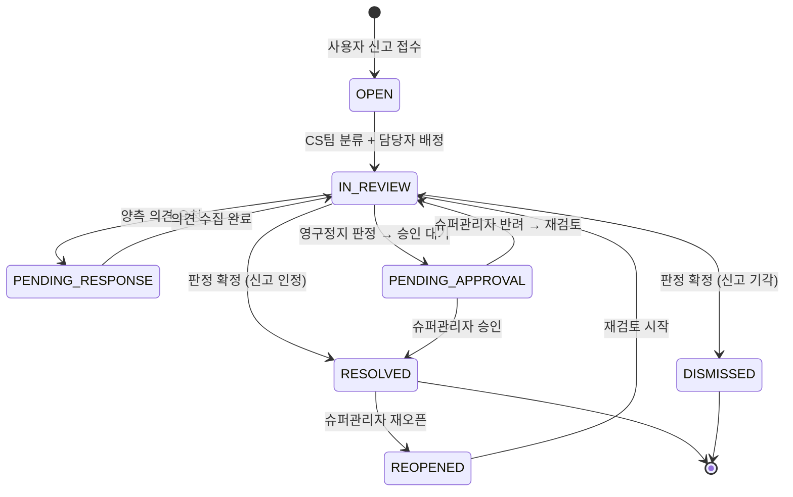
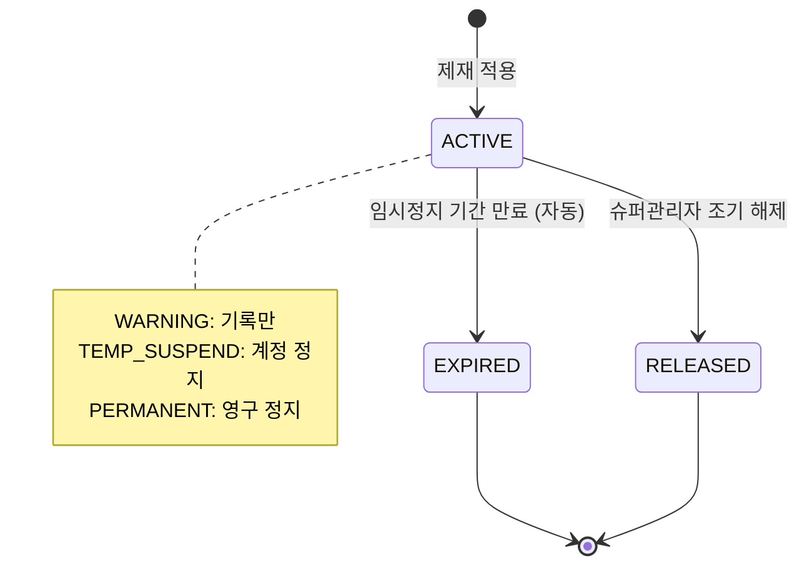

# FS-A-004 신고/분쟁 처리

> 문서 버전: 1.0
> 작성일: 2026-03-30
> 우선순위: P0
> 상태: Draft

---

## 1. 개요

- **기능 설명:** 플랫폼 사용자(보호자, 요양보호사)로부터 접수된 신고를 관리하고, 양측 분쟁을 조정하며, 위반 회원에 대한 제재 조치를 처리하는 관리자 백오피스 기능이다. 신고 접수부터 증거 수집, 양측 의견 청취, 판정, 결과 통보, 계정 조치까지의 전체 프로세스를 관리한다.
- **대상 사용자:**
  - ADMIN (슈퍼관리자): 전체 권한 + 영구 정지 + 제재 정책 설정
  - OPERATOR (운영팀): 신고 접수 처리 + 분쟁 조정 + 일반 제재 (경고, 임시 정지)
  - CS팀: 신고 접수 확인 + 초기 분류 (읽기 + 분류만)
- **관련 PRD 섹션:** 5.4 신고 및 분쟁 처리
- **관련 SERVICE_PLAN 섹션:** 3.4.4 신고/분쟁 처리

---

## 2. 유저 스토리

| ID | 역할 | 유저 스토리 |
|----|------|-----------|
| US-A-004-01 | CS팀 | As a CS팀 담당자, I want to 신규 신고 접수 건을 확인하고 유형별로 분류할 수 있다, so that 적절한 운영팀 담당자에게 배정할 수 있다. |
| US-A-004-02 | 운영팀 | As a 운영팀 담당자, I want to 신고 건의 관련 증거(채팅 이력, 돌봄 일지, 결제 내역)를 한 화면에서 확인할 수 있다, so that 정확한 사실관계를 파악할 수 있다. |
| US-A-004-03 | 운영팀 | As a 운영팀 담당자, I want to 신고 양측(신고자/피신고자)의 의견을 청취하고 기록할 수 있다, so that 공정한 판정을 내릴 수 있다. |
| US-A-004-04 | 운영팀 | As a 운영팀 담당자, I want to 72시간 이내에 판정을 내리고 결과를 통보할 수 있다, so that 신고 처리 SLA를 준수할 수 있다. |
| US-A-004-05 | 운영팀 | As a 운영팀 담당자, I want to 판정 결과에 따라 경고, 임시 정지, 영구 정지 등 제재를 적용할 수 있다, so that 위반 수준에 맞는 조치를 취할 수 있다. |
| US-A-004-06 | 슈퍼관리자 | As a 슈퍼관리자, I want to 전체 제재 이력과 신고 처리 통계를 확인할 수 있다, so that 플랫폼 안전 수준을 모니터링하고 정책을 개선할 수 있다. |
| US-A-004-07 | 슈퍼관리자 | As a 슈퍼관리자, I want to 영구 정지 조치를 최종 승인할 수 있다, so that 중대한 제재의 정확성을 보장할 수 있다. |

---

## 3. 화면 구성

### 3.1 화면 목록

| 화면 ID | 화면명 | 진입 경로 | 구현 파일 |
|---------|--------|----------|----------|
| SCR-A-004-01 | 신고 목록 | /admin/reports | 미구현 |
| SCR-A-004-02 | 신고 상세/처리 | /admin/reports/[id] | 미구현 |
| SCR-A-004-03 | 제재 이력 | /admin/sanctions | 미구현 |
| SCR-A-004-04 | 신고 통계 | /admin/reports/stats | 미구현 |

### 3.2 화면별 상세

#### SCR-A-004-01: 신고 목록

**상단 — 요약 카드 (4개):**
| 카드 | 지표 | 설명 |
|------|------|------|
| 신규 신고 | 오늘 접수된 건수 | 금일 접수 |
| 처리 대기 | OPEN + IN_REVIEW 건수 | 미처리 건 |
| 평균 처리 시간 | 접수~판정 평균 시간 | 목표: 72시간 이내 |
| SLA 초과 | 72시간 초과 미처리 건수 | 긴급 처리 필요 |

**테이블 컬럼:**
| 컬럼 | 설명 |
|------|------|
| 신고 ID | 고유번호 (클릭 시 상세) |
| 신고 유형 | 사기/허위 / 불성실 / 언어폭력 / 성희롱 / 개인정보 / 금전 / 기타 |
| 신고자 | 신고자명 + 역할 |
| 피신고자 | 피신고자명 + 역할 |
| 접수일 | YYYY-MM-DD HH:mm |
| 경과 시간 | 접수 후 경과 시간 (72시간 초과 시 빨간색) |
| 상태 | OPEN / IN_REVIEW / PENDING_RESPONSE / RESOLVED / DISMISSED (뱃지) |
| 심각도 | LOW / MEDIUM / HIGH / CRITICAL |
| 담당자 | 배정된 운영팀원 |
| 액션 | 상세보기 / 배정 |

**필터:**
- 상태: 전체 / OPEN / IN_REVIEW / PENDING_RESPONSE / RESOLVED / DISMISSED
- 신고 유형: 전체 / 사기 / 불성실 / 폭력 / 성희롱 / 개인정보 / 금전 / 기타
- 심각도: 전체 / LOW / MEDIUM / HIGH / CRITICAL
- 날짜 범위: DateRange Picker
- 담당자: 전체 / 미배정 / 특정 담당자
- SLA 초과 여부: 전체 / 초과 건만

#### SCR-A-004-02: 신고 상세/처리

**레이아웃 (6개 섹션):**

**1. 신고 요약 (상단 헤더):**
- 신고 ID, 유형, 심각도, 상태, 접수일, 경과 시간
- 상태 전환 버튼

**2. 당사자 정보 (좌측 상단):**
- 신고자 카드: 이름, 역할, 연락처, 가입일, 과거 신고 횟수
- 피신고자 카드: 이름, 역할, 연락처, 가입일, 과거 피신고 횟수, 현재 제재 상태

**3. 신고 내용 (중앙):**
- 신고자가 작성한 신고 사유 (텍스트)
- 첨부 증거 (이미지, 스크린샷)

**4. 증거 수집 패널 (중앙 하단):**
- **채팅 이력:** 관련 매칭의 InterviewMessage 전체 (타임라인 뷰)
- **돌봄 일지:** 관련 CareSession의 Journal 내역
- **결제/정산:** 관련 Settlement 정보
- **과거 신고 이력:** 피신고자의 과거 피신고 건 목록

**5. 의견 청취 (우측):**
- 신고자 의견: 텍스트 입력 (운영팀이 전화/채팅 후 기록)
- 피신고자 의견: 텍스트 입력
- 의견 요청 발송 버튼 (앱 내 알림으로 의견 제출 요청)

**6. 판정 및 조치 (하단):**
- 판정 결과 선택: 신고 인정 / 신고 기각 / 양측 과실
- 처리 내용 텍스트 입력
- 제재 유형 선택 (해당 시):
  - 경고 (WARNING)
  - 7일 임시 정지 (TEMP_SUSPEND_7D)
  - 30일 임시 정지 (TEMP_SUSPEND_30D)
  - 영구 정지 (PERMANENT_SUSPEND) — 슈퍼관리자 승인 필요
- 부가 조치: 리뷰 숨김, 매칭 취소, 환불 처리 등 체크박스
- 판정 확정 버튼

#### SCR-A-004-03: 제재 이력

**테이블 컬럼:**
| 컬럼 | 설명 |
|------|------|
| 제재 ID | 고유번호 |
| 대상 회원 | 회원명 + 역할 |
| 제재 유형 | WARNING / TEMP_SUSPEND_7D / TEMP_SUSPEND_30D / PERMANENT_SUSPEND |
| 사유 | 제재 사유 (관련 신고 ID 링크) |
| 시작일 | 제재 시작일 |
| 종료일 | 제재 종료일 (영구정지: "-") |
| 처리자 | 운영팀원 이름 |
| 상태 | 진행중 / 만료 / 해제 |

**필터:**
- 제재 유형 필터
- 상태 필터 (진행중 / 만료 / 해제)
- 날짜 범위

#### SCR-A-004-04: 신고 통계

**차트 구성:**
1. 신고 유형별 건수 (막대 차트, 월간)
2. 월별 신고 접수/처리 건수 추이 (라인 차트)
3. 평균 처리 시간 추이 (라인 차트, 72시간 목표선)
4. SLA 준수율 (%) 추이
5. 제재 유형별 비율 (파이 차트)
6. 분쟁 발생률 (전체 매칭 대비 신고 비율, 목표: 1% 미만)

---

## 4. 상세 동작 명세

### 4.1 정상 플로우

#### 신고 처리 전체 플로우 (PRD Step 1~6)
```
Step 1: 신고 접수 (사용자 → 시스템)
    사용자가 앱에서 신고 버튼 클릭
    → 신고 유형 선택 + 사유 입력 + 증거 첨부
    → 신고 건 생성 (상태: OPEN)
    → 운영팀 알림 발송
    ↓
Step 2: 초기 분류 (CS팀)
    CS팀 신고 목록에서 신규 건 확인
    → 심각도 분류 (LOW/MEDIUM/HIGH/CRITICAL)
    → 담당 운영팀원 배정
    → 상태 → IN_REVIEW
    ↓
Step 3: 증거 수집 (운영팀)
    신고 상세에서 증거 패널 확인
    → 채팅 이력 검토
    → 돌봄 일지 검토
    → 결제 내역 확인
    → 과거 신고 이력 확인
    ↓
Step 4: 양측 의견 청취 (운영팀)
    신고자/피신고자에게 의견 제출 요청 발송
    → 상태 → PENDING_RESPONSE
    → 제출된 의견 기록
    → (필요 시 전화 상담 후 기록)
    ↓
Step 5: 운영팀 판정 (72시간 이내)
    증거 + 의견 종합 검토
    → 판정 결과 선택: 신고 인정 / 기각 / 양측 과실
    → 제재 유형 결정 (해당 시)
    → 부가 조치 선택 (리뷰 숨김, 매칭 취소, 환불 등)
    → 판정 확정
    → 상태 → RESOLVED 또는 DISMISSED
    ↓
Step 6: 결과 통보 + 계정 조치
    양측에 판정 결과 알림 발송
    → 제재 적용 (경고/임시정지/영구정지)
    → 영구정지 시 → 슈퍼관리자 최종 승인 대기
    → 부가 조치 실행 (리뷰 숨김, 매칭 취소 등)
    → 감사 로그 기록
```

#### 영구 정지 승인 플로우
```
운영팀이 영구 정지 판정
    ↓
상태 → PENDING_APPROVAL (슈퍼관리자 승인 대기)
    ↓
슈퍼관리자에게 알림 발송
    ↓
슈퍼관리자 신고 상세 확인
    ↓
[승인] → 영구 정지 적용 (isBanned: true) + 결과 통보
[반려] → 운영팀에 재검토 요청 + 사유 피드백
```

### 4.2 예외 플로우

| 예외 상황 | 처리 방법 |
|----------|----------|
| 72시간 내 미처리 건 | SLA 초과 알림을 담당자 + 팀장에게 발송, 목록에서 빨간색 강조 |
| 피신고자 의견 미제출 (48시간) | 자동 리마인더 발송, 미제출 사유 기록 후 판정 진행 가능 |
| 동일 건 중복 신고 | "관련 신고가 N건 있습니다" 표시, 병합 처리 옵션 제공 |
| 허위 신고 판정 | 신고자에게 경고 조치 가능 (악의적 허위 신고 반복 시 제재) |
| 영구 정지 대상에 진행 중 매칭/정산 존재 | 매칭 강제 취소 + 정산 보류 처리 안내 (FS-A-002, FS-A-003 연동) |
| 슈퍼관리자 승인 48시간 초과 | 리마인더 재발송 + 대리 승인자 지정 가능 |
| 이미 처리 완료된 건 재처리 시도 | "이미 처리가 완료된 신고입니다" 알림, 수정 불가 (슈퍼관리자 재오픈만 가능) |

### 4.3 비즈니스 규칙

| 규칙 ID | 규칙 | 설명 |
|---------|------|------|
| BR-A-004-01 | 신고 유형 | 사기/허위정보, 불성실한 돌봄, 언어폭력/성희롱, 개인정보 무단 사용, 금전 요구/횡령, 기타 (PRD 정의) |
| BR-A-004-02 | 처리 시간 SLA | 신고 접수 후 72시간 이내 판정 완료 목표 |
| BR-A-004-03 | 심각도 자동 분류 | 성희롱/금전 횡령 → CRITICAL 자동 분류, 기타 → CS팀 수동 분류 |
| BR-A-004-04 | 영구 정지 승인 | 영구 정지(PERMANENT_SUSPEND)는 반드시 슈퍼관리자(ADMIN) 승인 필요 |
| BR-A-004-05 | 임시 정지 자동 해제 | 임시 정지는 종료일 도래 시 자동으로 계정 복구 |
| BR-A-004-06 | 3진 아웃 | 경고 누적 3회 시 자동으로 7일 임시 정지 권고 표시 |
| BR-A-004-07 | 분쟁 발생률 목표 | 전체 매칭 대비 신고 비율 1% 미만 유지 (PRD 품질 지표) |
| BR-A-004-08 | 증거 보존 | 신고 관련 증거(채팅, 일지, 사진)는 판정 후 2년간 보존 |
| BR-A-004-09 | 익명성 보장 | 신고자 정보는 피신고자에게 공개하지 않음 (운영팀만 열람) |
| BR-A-004-10 | 환불 연동 | 신고 인정 시 관련 결제 건 자동 환불 옵션 제공 (FS-A-003 연동) |

### 4.4 권한 규칙

| 기능 | ADMIN (슈퍼관리자) | OPERATOR (운영팀) | CS팀 |
|------|:-:|:-:|:-:|
| 신고 목록 조회 | O | O | O |
| 신고 상세 조회 | O | O | O |
| 심각도 분류 | O | O | O |
| 담당자 배정 | O | O | O |
| 증거 수집/확인 | O | O | X |
| 의견 청취 기록 | O | O | X |
| 판정 (경고/임시정지) | O | O | X |
| 판정 (영구정지 요청) | O | O | X |
| 영구정지 최종 승인 | O | X | X |
| 제재 이력 조회 | O | O | X |
| 제재 해제 | O | X | X |
| 처리 완료 건 재오픈 | O | X | X |
| 신고 통계 | O | O | X |
| 제재 정책 설정 | O | X | X |

---

## 5. 수용 기준 (Acceptance Criteria)

### AC-001: 신고 접수 확인
```
Given 사용자가 앱에서 "불성실한 돌봄" 유형으로 신고를 접수했을 때
When CS팀 담당자가 신고 목록을 확인하면
Then 새로운 신고 건이 OPEN 상태로 표시되고
And 신고 유형, 신고자명, 피신고자명, 접수일시가 정확히 표시된다
```

### AC-002: 증거 수집
```
Given 운영팀 담당자가 신고 상세 페이지에서 증거 패널을 확인했을 때
When 관련 매칭 건의 채팅 이력 탭을 클릭하면
Then 해당 매칭의 전체 채팅 메시지가 시간순으로 표시되고
And 돌봄 일지, 결제 내역도 각 탭에서 확인 가능하다
```

### AC-003: 판정 및 제재 (경고)
```
Given 운영팀 담당자가 증거를 확인하고 "신고 인정"으로 판정했을 때
When 제재 유형을 "경고(WARNING)"로 선택하고 확정을 클릭하면
Then 신고 상태가 RESOLVED로 변경되고
And 피신고자의 제재 이력에 경고가 추가되며
And 양측에 판정 결과 알림이 발송되고
And 감사 로그에 기록된다
```

### AC-004: 영구 정지 승인 프로세스
```
Given 운영팀 담당자가 "영구 정지"를 판정했을 때
When 판정을 확정하면
Then 상태가 PENDING_APPROVAL로 변경되고
And 슈퍼관리자에게 승인 요청 알림이 발송된다

Given 슈퍼관리자가 영구 정지를 승인했을 때
When 승인 버튼을 클릭하면
Then 피신고자 계정이 즉시 정지(isBanned: true)되고
And 진행 중 매칭이 강제 취소되며
And 양측에 최종 결과가 통보된다
```

### AC-005: SLA 초과 알림
```
Given 신고 건이 접수 후 72시간을 초과했을 때
When SLA 초과가 감지되면
Then 담당자 + 팀장에게 알림이 발송되고
And 신고 목록에서 해당 건의 경과 시간이 빨간색으로 강조 표시된다
```

### AC-006: 3진 아웃 규칙
```
Given 특정 회원이 경고(WARNING)를 2회 누적 보유하고 있을 때
When 3번째 경고 판정을 시도하면
Then "경고 3회 누적입니다. 7일 임시 정지를 권고합니다." 안내가 표시되고
And 운영팀 담당자가 7일 임시 정지로 변경할 수 있는 옵션이 제공된다
```

### AC-007: 신고 통계
```
Given 슈퍼관리자가 신고 통계 페이지에 접근했을 때
When 기간을 최근 3개월로 설정하면
Then 신고 유형별 건수 차트, 월별 접수/처리 추이, 평균 처리 시간, SLA 준수율이 표시되고
And 분쟁 발생률(전체 매칭 대비)이 1% 목표선과 함께 표시된다
```

---

## 6. API 연동

### 6.1 사용 API 목록

| Method | Endpoint | 설명 | 구현 상태 |
|--------|----------|------|----------|
| GET | /api/admin/reports | 신고 목록 조회 (필터/페이지네이션) | ❌ 미구현 |
| GET | /api/admin/reports/[id] | 신고 상세 조회 (증거 포함) | ❌ 미구현 |
| PATCH | /api/admin/reports/[id]/assign | 담당자 배정 | ❌ 미구현 |
| PATCH | /api/admin/reports/[id]/classify | 심각도 분류 | ❌ 미구현 |
| POST | /api/admin/reports/[id]/opinions | 의견 기록 추가 | ❌ 미구현 |
| POST | /api/admin/reports/[id]/verdict | 판정 확정 + 제재 적용 | ❌ 미구현 |
| PATCH | /api/admin/reports/[id]/approve | 영구정지 최종 승인 (슈퍼관리자) | ❌ 미구현 |
| GET | /api/admin/reports/[id]/evidence | 증거 데이터 조회 (채팅, 일지, 결제) | ❌ 미구현 |
| GET | /api/admin/sanctions | 제재 이력 조회 | ❌ 미구현 |
| PATCH | /api/admin/sanctions/[id]/release | 제재 해제 | ❌ 미구현 |
| GET | /api/admin/reports/stats | 신고/분쟁 통계 | ❌ 미구현 |
| POST | /api/admin/reports/[id]/reopen | 처리 완료 건 재오픈 (슈퍼관리자) | ❌ 미구현 |

**참고 — 기존 모델/API:**
| 항목 | 설명 | 구현 상태 |
|------|------|----------|
| Review.isReported 필드 | 리뷰 신고 플래그 | ✅ 스키마 존재 |
| Review.reportReason 필드 | 리뷰 신고 사유 | ✅ 스키마 존재 |
| InterviewMessage 모델 | 채팅 증거 조회 | ✅ 구현됨 |
| Journal 모델 | 돌봄 일지 증거 조회 | ✅ 구현됨 |
| Settlement 모델 | 정산 증거 조회 | ✅ 구현됨 |

### 6.2 주요 요청/응답 스키마

#### GET /api/admin/reports

**Request Query:**
```
GET /api/admin/reports?status=OPEN&type=VERBAL_ABUSE&severity=HIGH&slaExceeded=true&page=1&limit=20
```

**Response:**
```json
{
  "success": true,
  "data": {
    "reports": [
      {
        "id": "rpt_xxx",
        "type": "VERBAL_ABUSE",
        "severity": "HIGH",
        "status": "OPEN",
        "reporter": {
          "id": "user_001",
          "name": "김보호자",
          "role": "GUARDIAN"
        },
        "reportee": {
          "id": "user_002",
          "name": "이요양보호사",
          "role": "CAREGIVER"
        },
        "relatedMatchId": "match_xxx",
        "description": "돌봄 중 언어폭력을 사용했습니다...",
        "createdAt": "2026-03-28T10:00:00Z",
        "elapsedHours": 50,
        "slaExceeded": false,
        "assignedTo": null
      }
    ],
    "meta": {
      "page": 1,
      "limit": 20,
      "total": 15,
      "totalPages": 1
    }
  }
}
```

#### POST /api/admin/reports/[id]/verdict

**Request Body:**
```json
{
  "verdict": "UPHELD",
  "verdictNote": "채팅 이력에서 언어폭력이 확인되었습니다.",
  "sanction": {
    "type": "TEMP_SUSPEND_7D",
    "targetUserId": "user_002",
    "reason": "언어폭력 사용 확인 (신고 #rpt_xxx)"
  },
  "additionalActions": {
    "hideRelatedReviews": false,
    "cancelRelatedMatch": true,
    "processRefund": false
  }
}
```
- verdict: `"UPHELD"` (신고 인정) | `"DISMISSED"` (기각) | `"BOTH_AT_FAULT"` (양측 과실)
- sanction.type: `"WARNING"` | `"TEMP_SUSPEND_7D"` | `"TEMP_SUSPEND_30D"` | `"PERMANENT_SUSPEND"`
- PERMANENT_SUSPEND 시 상태가 PENDING_APPROVAL로 설정됨

**Response:**
```json
{
  "success": true,
  "data": {
    "reportId": "rpt_xxx",
    "status": "RESOLVED",
    "verdict": "UPHELD",
    "sanction": {
      "id": "sanc_xxx",
      "type": "TEMP_SUSPEND_7D",
      "startDate": "2026-03-30",
      "endDate": "2026-04-06",
      "targetUserId": "user_002"
    },
    "actionsExecuted": {
      "matchCancelled": true,
      "notificationsSent": true
    }
  }
}
```

#### GET /api/admin/reports/[id]/evidence

**Response:**
```json
{
  "success": true,
  "data": {
    "chatMessages": [
      {
        "id": "msg_001",
        "senderId": "user_001",
        "senderName": "김보호자",
        "content": "...",
        "createdAt": "2026-03-27T14:00:00Z"
      }
    ],
    "journals": [
      {
        "id": "jnl_001",
        "title": "3/27 돌봄 일지",
        "content": "...",
        "createdAt": "2026-03-27T18:00:00Z"
      }
    ],
    "settlements": [
      {
        "id": "stl_001",
        "amount": 80000,
        "status": "PENDING"
      }
    ],
    "pastReports": [
      {
        "id": "rpt_old",
        "type": "NEGLIGENT_CARE",
        "verdict": "UPHELD",
        "createdAt": "2026-02-15T10:00:00Z"
      }
    ]
  }
}
```

---

## 7. 상태 다이어그램

### 신고 처리 상태



### 제재 상태



---

## 8. 데이터 모델

### 기존 모델 (사용)

| 모델 | 주요 필드 | 비고 |
|------|----------|------|
| User | id, isBanned | 계정 정지 상태 |
| Review | isReported, reportReason | 리뷰 신고 |
| InterviewMessage | matchId, content, createdAt | 채팅 증거 |
| Journal | careSessionId, content, images | 돌봄 일지 증거 |
| Settlement | amount, status | 정산 증거 |
| Match | id, status | 관련 매칭 |

### 신규 모델 (필요)

| 모델 | 주요 필드 | 설명 |
|------|----------|------|
| Report | id, reporterId, reporteeId, type, severity, status, description, evidence, relatedMatchId, assignedTo, verdictNote, verdict, createdAt, resolvedAt | 신고 건 |
| ReportOpinion | id, reportId, userId, role (reporter/reportee), content, createdAt | 의견 청취 기록 |
| Sanction | id, userId, reportId, type, reason, startDate, endDate, status, approvedBy, createdBy, createdAt, releasedAt, releaseReason | 제재 이력 |

---

## 9. 연관 기능

| 기능 ID | 기능명 | 연관 설명 |
|---------|--------|----------|
| FS-A-001 | 회원관리 | 제재 적용 시 회원 상태 변경 (isBanned), 회원 상세에서 신고 이력 탭 |
| FS-A-002 | 매칭 모니터링 | 신고 인정 시 매칭 강제 취소 연동 |
| FS-A-003 | 결제/정산 관리 | 신고 인정 시 환불 처리 + 정산 보류/취소 연동 |
| (프론트) | 앱 신고 기능 | 사용자 앱에서 신고 접수 → Report 생성 |
| (프론트) | 리뷰 시스템 | 리뷰 신고 → isReported 플래그 → 운영팀 검토 |

---

## 10. 구현 현황

| 항목 | 상태 | 비고 |
|------|------|------|
| 신고 목록 페이지 | ❌ | /admin/reports 미구현 |
| 신고 상세/처리 페이지 | ❌ | /admin/reports/[id] 미구현 |
| 제재 이력 페이지 | ❌ | /admin/sanctions 미구현 |
| 신고 통계 페이지 | ❌ | /admin/reports/stats 미구현 |
| Admin 신고 목록 API | ❌ | /api/admin/reports 미구현 |
| Admin 신고 상세 API | ❌ | /api/admin/reports/[id] 미구현 |
| Admin 판정 API | ❌ | /api/admin/reports/[id]/verdict 미구현 |
| Admin 증거 조회 API | ❌ | /api/admin/reports/[id]/evidence 미구현 |
| Admin 제재 API | ❌ | /api/admin/sanctions 미구현 |
| Admin 통계 API | ❌ | /api/admin/reports/stats 미구현 |
| Report 모델 | ❌ | Prisma 스키마 미추가 |
| ReportOpinion 모델 | ❌ | Prisma 스키마 미추가 |
| Sanction 모델 | ❌ | Prisma 스키마 미추가 |
| 기존 Review 신고 필드 | ✅ | isReported, reportReason 필드 존재 |
| 기존 채팅/일지 모델 | ✅ | InterviewMessage, Journal 모델 존재 |
| 기존 정산 모델 | ✅ | Settlement 모델 존재 |
| 앱 신고 기능 (프론트) | ❌ | 사용자 앱 내 신고 UI 미구현 |
