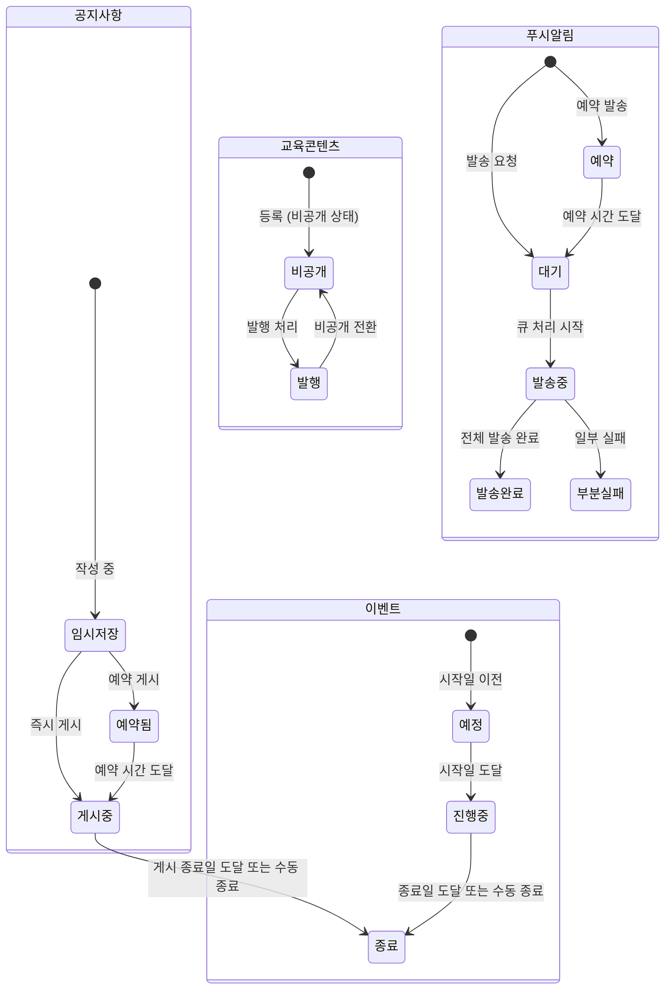

# FS-A-005 콘텐츠 관리

> 문서 버전: 1.0
> 작성일: 2026-03-30
> 우선순위: P1
> 상태: Draft

---

## 1. 개요
- 관리자가 앱 내 공지사항, 교육 콘텐츠, 이벤트/프로모션을 등록하고 관리하며, 세그먼트별 타겟 푸시 알림을 발송하는 백오피스 기능. 앱 사용자(보호자, 요양보호사)에게 전달할 콘텐츠의 생명주기 전체를 관리한다.
- 대상 사용자: 관리자 (백오피스)
- 관련 PRD 섹션: 5.5 콘텐츠 관리

## 2. 유저 스토리
- As a 관리자, I want to 공지사항을 작성하고 발행하여, so that 전체 사용자에게 중요 안내를 전달할 수 있다.
- As a 관리자, I want to 요양보호사 교육 콘텐츠를 등록하여, so that 요양보호사의 전문성 향상을 지원할 수 있다.
- As a 관리자, I want to 이벤트/프로모션을 생성하고 관리하여, so that 사용자 참여를 유도하고 마케팅 효과를 높일 수 있다.
- As a 관리자, I want to 특정 세그먼트에 타겟 푸시 알림을 발송하여, so that 관련 사용자에게만 정확한 정보를 전달할 수 있다.

## 3. 화면 구성

### 3.1 화면 목록
| 화면 ID | 화면명 | 진입 경로 | 구현 파일 |
|---------|--------|-----------|-----------|
| A-005-S1 | 콘텐츠 관리 대시보드 | 백오피스 > 콘텐츠 관리 | 미구현 |
| A-005-S2 | 공지사항 관리 | 콘텐츠 관리 > 공지사항 | 미구현 |
| A-005-S3 | 공지사항 작성/수정 | 공지사항 > 작성/수정 | 미구현 |
| A-005-S4 | 교육 콘텐츠 관리 | 콘텐츠 관리 > 교육 콘텐츠 | 미구현 |
| A-005-S5 | 교육 콘텐츠 등록/수정 | 교육 콘텐츠 > 등록/수정 | 미구현 |
| A-005-S6 | 이벤트/프로모션 관리 | 콘텐츠 관리 > 이벤트 | 미구현 |
| A-005-S7 | 이벤트 생성/수정 | 이벤트 > 생성/수정 | 미구현 |
| A-005-S8 | 푸시 알림 발송 | 콘텐츠 관리 > 푸시 알림 | 미구현 |
| A-005-S9 | 푸시 알림 발송 내역 | 푸시 알림 > 발송 내역 | 미구현 |

### 3.2 화면별 상세

#### A-005-S1 콘텐츠 관리 대시보드
- **헤더**: "콘텐츠 관리"
- **요약 카드** (4열 그리드):
  - 공지사항: 전체 N건, 활성 N건
  - 교육 콘텐츠: 전체 N건, 발행 N건
  - 이벤트/프로모션: 진행 중 N건, 예정 N건
  - 푸시 알림: 이번 달 발송 N건, 전달 N건
- **최근 활동**: 최근 등록/수정된 콘텐츠 목록 (타임라인)
- **퀵 액션 버튼**: "공지 작성", "교육 등록", "이벤트 생성", "푸시 발송"

#### A-005-S2 공지사항 관리
- **헤더**: "공지사항 관리" + "새 공지 작성" 버튼
- **필터**: 상태 (전체/게시중/예약/종료), 대상 (전체/보호자/요양보호사), 검색 (제목)
- **목록 테이블**:
  | 열 | 설명 |
  |----|------|
  | 제목 | 공지사항 제목 (링크) |
  | 대상 | 전체 / 보호자 / 요양보호사 |
  | 상태 | 게시중(green) / 예약(blue) / 종료(gray) / 임시저장(yellow) |
  | 고정 | 상단 고정 여부 (핀 아이콘) |
  | 조회수 | 열람 수 |
  | 작성일 | 작성 날짜 |
  | 작성자 | 관리자 이름 |
- **행 액션**: 수정, 삭제, 상태 변경
- **페이지네이션**: 20건 단위

#### A-005-S3 공지사항 작성/수정
- **입력 필드**:
  - 제목: 텍스트 (최대 100자)
  - 대상: 라디오 (전체 / 보호자만 / 요양보호사만)
  - 본문: 리치 텍스트 에디터 (볼드, 이탤릭, 링크, 이미지, 리스트)
  - 첨부파일: 최대 5개, 각 20MB
  - 상단 고정: 토글 (최대 3개까지 고정 가능)
  - 게시 설정:
    - 즉시 게시
    - 예약 게시 (날짜/시간 선택)
    - 게시 종료일 (선택, 미설정 시 무기한)
  - 푸시 알림 동시 발송: 체크박스
- **액션 버튼**: "임시저장", "미리보기", "게시하기"

#### A-005-S4 교육 콘텐츠 관리
- **헤더**: "교육 콘텐츠 관리" + "새 콘텐츠 등록" 버튼
- **필터**: 카테고리 (전체/필수교육/전문교육/심화과정), 상태 (발행/비공개), 검색
- **목록 테이블**:
  | 열 | 설명 |
  |----|------|
  | 썸네일 | 콘텐츠 대표 이미지 |
  | 제목 | 교육 콘텐츠 제목 |
  | 카테고리 | 필수교육 / 전문교육 / 심화과정 |
  | 유형 | 동영상 / 문서 / 퀴즈 |
  | 수강 대상 | 전체 / 등급별 (신입/일반/숙련/전문/마스터) |
  | 수강자 수 | 수강 완료 인원 |
  | 수강률 | 수강 완료율 (%) |
  | 상태 | 발행(green) / 비공개(gray) |
  | 등록일 | 등록 날짜 |

#### A-005-S5 교육 콘텐츠 등록/수정
- **입력 필드**:
  - 제목: 텍스트 (최대 100자)
  - 카테고리: 드롭다운 (필수교육 / 전문교육 / 심화과정)
  - 유형: 라디오 (동영상 / 문서 / 퀴즈 / 복합)
  - 대표 이미지: 이미지 업로드 (권장 16:9)
  - 설명: 리치 텍스트 에디터
  - 콘텐츠 본문:
    - 동영상: 영상 파일 업로드 또는 URL 입력 (YouTube/Vimeo)
    - 문서: 리치 텍스트 에디터 또는 PDF 업로드
    - 퀴즈: 문항 추가 UI (객관식/OX/단답)
  - 수강 대상: 체크박스 (전체 / 등급별 선택)
  - 예상 수강 시간: 숫자 (분)
  - 필수 여부: 토글 (필수교육은 연간 이수 의무)
  - 수료 기준: 퀴즈 통과 점수 (기본 70점)
- **액션 버튼**: "임시저장", "미리보기", "발행"

#### A-005-S6 이벤트/프로모션 관리
- **헤더**: "이벤트/프로모션" + "새 이벤트 생성" 버튼
- **필터**: 상태 (전체/진행중/예정/종료), 유형 (이벤트/프로모션/쿠폰), 검색
- **목록 테이블**:
  | 열 | 설명 |
  |----|------|
  | 배너 이미지 | 이벤트 배너 |
  | 이벤트명 | 이벤트 제목 |
  | 유형 | 이벤트 / 프로모션 / 쿠폰 발급 |
  | 기간 | 시작일 ~ 종료일 |
  | 대상 | 전체 / 보호자 / 요양보호사 / 신규가입 |
  | 참여자 수 | 참여 인원 |
  | 상태 | 진행중(green) / 예정(blue) / 종료(gray) |

#### A-005-S7 이벤트 생성/수정
- **입력 필드**:
  - 이벤트명: 텍스트 (최대 50자)
  - 유형: 드롭다운 (이벤트 / 프로모션 / 쿠폰 발급)
  - 배너 이미지: 이미지 업로드 (앱 배너용 + 상세 페이지용)
  - 상세 내용: 리치 텍스트 에디터
  - 기간: 시작일시 ~ 종료일시 (DateTimePicker)
  - 대상: 체크박스 (전체 / 보호자 / 요양보호사 / 신규가입 N일 이내)
  - 쿠폰 설정 (유형이 "쿠폰 발급"인 경우):
    - 할인 유형: 정액 / 정률
    - 할인 금액/비율
    - 최소 결제 금액
    - 발급 한도 (총 수량)
    - 사용 기한
  - 참여 조건: 자유 텍스트
  - 앱 내 노출 위치: 체크박스 (홈 배너 / 이벤트 탭 / 팝업)
- **액션 버튼**: "임시저장", "미리보기", "발행"

#### A-005-S8 푸시 알림 발송
- **헤더**: "푸시 알림 발송"
- **입력 필드**:
  - 알림 제목: 텍스트 (최대 40자)
  - 알림 내용: 텍스트 (최대 100자)
  - 딥링크: URL 또는 앱 내 경로 (선택)
  - 타겟 세그먼트:
    - 전체 사용자
    - 역할별: 보호자 / 요양보호사
    - 구독 상태별: 무료 / 스탠다드 / 프리미엄 / 패밀리케어
    - 지역별: 시/도 > 시/군/구 선택
    - 활동 상태별: 활성 (최근 30일 접속) / 휴면 / 신규 (7일 이내 가입)
    - 커스텀 (CSV 업로드: userId 목록)
  - 발송 시점:
    - 즉시 발송
    - 예약 발송 (날짜/시간 선택)
  - 예상 수신자 수: 타겟 선택 시 자동 계산 표시
- **미리보기**: 알림 미리보기 (iOS/Android 목업)
- **액션 버튼**: "발송 테스트 (본인에게)", "발송하기"
- **발송 확인 다이얼로그**: "N명에게 푸시 알림을 발송합니다. 계속하시겠습니까?"

#### A-005-S9 푸시 알림 발송 내역
- **목록 테이블**:
  | 열 | 설명 |
  |----|------|
  | 제목 | 알림 제목 |
  | 대상 | 타겟 세그먼트 요약 |
  | 발송일시 | 발송 시간 |
  | 발송 수 | 총 발송 건수 |
  | 전달 수 | 실제 전달 건수 |
  | 오픈 수 | 알림 클릭 수 |
  | 오픈률 | (오픈/전달) x 100% |
  | 상태 | 발송완료(green) / 발송중(blue) / 예약(yellow) / 실패(red) |

## 4. 상세 동작 명세

### 4.1 정상 플로우

#### 공지사항 작성 및 발행
1. 관리자가 "새 공지 작성" 클릭
2. 제목, 대상, 본문, 첨부파일 입력
3. 게시 설정 선택 (즉시/예약)
4. 푸시 알림 동시 발송 체크 (선택)
5. "게시하기" 클릭 → POST /api/admin/notices
6. 즉시 게시: 앱 공지사항 목록에 즉시 노출
7. 예약 게시: 예약 시간에 자동 게시 (cron job)
8. 푸시 알림 체크 시: 대상 사용자에게 푸시 발송

#### 교육 콘텐츠 등록
1. 관리자가 "새 콘텐츠 등록" 클릭
2. 카테고리, 유형, 콘텐츠 본문(영상/문서/퀴즈) 입력
3. 수강 대상, 필수 여부, 수료 기준 설정
4. "발행" 클릭 → POST /api/admin/education
5. 요양보호사 앱 교육 탭에 콘텐츠 노출
6. 필수교육의 경우: 미수강 요양보호사에게 리마인더 알림

#### 타겟 푸시 알림 발송
1. 관리자가 "푸시 알림 발송" 진입
2. 제목, 내용, 딥링크 입력
3. 타겟 세그먼트 선택 → 예상 수신자 수 확인
4. "발송 테스트" 로 본인 기기에 미리 확인 (선택)
5. "발송하기" → 확인 다이얼로그 → POST /api/admin/push-notifications
6. 백그라운드 큐로 푸시 발송 처리
7. 발송 완료 후 발송 내역에 기록 (전달수, 오픈수 추적)

### 4.2 예외 플로우
- **상단 고정 초과**: 공지사항 상단 고정이 이미 3개인 경우 → "상단 고정은 최대 3개까지 가능합니다. 기존 고정을 해제해주세요."
- **대용량 파일 업로드 실패**: 파일 크기 초과 시 → "파일 크기가 제한(20MB)을 초과합니다" 안내
- **푸시 발송 실패**: FCM/APNs 오류 시 → 실패 건수 기록, 재발송 버튼 제공
- **예약 시간 과거**: 현재 시간 이전 선택 시 → "현재 시간 이후로 설정해주세요" 안내
- **빈 세그먼트**: 조건에 해당하는 사용자 0명 → "대상 사용자가 없습니다. 조건을 변경해주세요."

### 4.3 비즈니스 규칙
- **공지사항 관리**:
  - 상단 고정: 최대 3개
  - 첨부파일: 최대 5개, 각 20MB
  - 대상: 전체 / 보호자 / 요양보호사 세그먼트
  - 임시저장 가능 (게시 전 단계)
  - 게시 후 수정 가능 (수정 이력 기록)
- **교육 콘텐츠**:
  - 카테고리: 필수교육(연간 의무) / 전문교육 / 심화과정
  - 필수교육 미이수 시: 30일마다 리마인더, 90일 경과 시 활동 제한 경고
  - 수료 기준: 퀴즈 70점 이상 (기본, 조정 가능)
  - 수료증 자동 발급 (PDF)
- **이벤트/프로모션**:
  - 쿠폰: 1인 1매 원칙 (중복 발급 차단)
  - 프로모션 기간 종료 시 자동 비활성화
  - 앱 배너 노출: 동시 최대 5개
- **푸시 알림**:
  - 일일 발송 제한: 동일 사용자에게 최대 3회/일
  - 야간 발송 제한: 21:00~08:00 예약 발송 불가 (사용자 불편 방지)
  - 수신 거부 사용자 자동 제외
  - 발송 후 추적: 전달수, 오픈수, 오픈률 집계

## 5. 수용 기준 (Acceptance Criteria)

```
Given 관리자가 공지사항을 작성하고 "즉시 게시"를 선택했을 때
When "게시하기" 버튼을 클릭하면
Then 앱 공지사항 목록에 즉시 노출되고 대상 사용자에게 푸시 알림이 발송된다

Given 관리자가 교육 콘텐츠를 필수교육으로 등록했을 때
When 미이수 요양보호사가 앱에 접속하면
Then 교육 탭에 미이수 필수교육이 표시되고 리마인더 알림이 발송된다

Given 관리자가 이벤트를 생성하고 쿠폰을 설정했을 때
When 대상 사용자가 이벤트에 참여하면
Then 1인 1매 쿠폰이 자동 발급되고 발급 한도 초과 시 참여가 차단된다

Given 관리자가 푸시 알림의 타겟 세그먼트를 "서울 지역 프리미엄 구독 보호자"로 선택했을 때
When 예상 수신자 수를 확인하면
Then 해당 조건에 맞는 사용자 수가 실시간으로 표시된다

Given 관리자가 푸시 알림을 발송한 후
When 발송 내역을 확인하면
Then 발송 수, 전달 수, 오픈 수, 오픈률이 집계되어 표시된다

Given 관리자가 21시 이후 시간으로 푸시 예약 발송을 시도할 때
When 발송 시간을 설정하면
Then "21:00~08:00 시간대는 발송할 수 없습니다" 안내가 표시된다
```

## 6. API 연동

### 6.1 사용 API 목록
| Method | Endpoint | 설명 |
|--------|----------|------|
| GET | `/api/admin/notices` | 공지사항 목록 조회 |
| POST | `/api/admin/notices` | 공지사항 작성 |
| PUT | `/api/admin/notices/[id]` | 공지사항 수정 |
| DELETE | `/api/admin/notices/[id]` | 공지사항 삭제 |
| GET | `/api/admin/education` | 교육 콘텐츠 목록 |
| POST | `/api/admin/education` | 교육 콘텐츠 등록 |
| PUT | `/api/admin/education/[id]` | 교육 콘텐츠 수정 |
| DELETE | `/api/admin/education/[id]` | 교육 콘텐츠 삭제 |
| GET | `/api/admin/education/[id]/stats` | 수강 현황 통계 |
| GET | `/api/admin/events` | 이벤트 목록 |
| POST | `/api/admin/events` | 이벤트 생성 |
| PUT | `/api/admin/events/[id]` | 이벤트 수정 |
| DELETE | `/api/admin/events/[id]` | 이벤트 삭제 |
| POST | `/api/admin/push-notifications` | 푸시 알림 발송 |
| GET | `/api/admin/push-notifications` | 발송 내역 조회 |
| GET | `/api/admin/push-notifications/[id]/stats` | 발송 통계 |
| POST | `/api/admin/push-notifications/test` | 테스트 발송 (본인) |
| GET | `/api/admin/segments/count` | 타겟 세그먼트 수신자 수 조회 |

### 6.2 주요 요청/응답 스키마

#### POST /api/admin/notices
**요청:**
```json
{
  "title": "서비스 이용약관 변경 안내",
  "content": "<p>안녕하세요. 바야다입니다...</p>",
  "target": "ALL",
  "isPinned": false,
  "attachments": ["https://storage.../terms_v2.pdf"],
  "publishType": "IMMEDIATE",
  "publishAt": null,
  "expiresAt": "2026-06-30T23:59:59Z",
  "sendPush": true
}
```

**target Enum:** `ALL`, `GUARDIAN`, `CAREGIVER`
**publishType Enum:** `IMMEDIATE`, `SCHEDULED`, `DRAFT`

#### POST /api/admin/push-notifications
**요청:**
```json
{
  "title": "이번 달 필수교육 안내",
  "body": "학대 예방 교육을 이수해주세요. 미이수 시 활동이 제한될 수 있습니다.",
  "deepLink": "/education/mandatory/2026-q1",
  "segment": {
    "role": "CAREGIVER",
    "subscription": null,
    "region": null,
    "activityStatus": "ACTIVE",
    "customUserIds": null
  },
  "sendType": "IMMEDIATE",
  "scheduledAt": null
}
```

**성공 응답 (201):**
```json
{
  "notification": {
    "id": "cuid...",
    "title": "이번 달 필수교육 안내",
    "estimatedRecipients": 15420,
    "status": "SENDING",
    "createdAt": "2026-03-30T10:00:00Z"
  }
}
```

#### GET /api/admin/segments/count
**요청 (Query Parameters):**
```
?role=CAREGIVER&activityStatus=ACTIVE&region=서울
```

**성공 응답 (200):**
```json
{
  "count": 15420,
  "breakdown": {
    "bySubscription": { "FREE": 12000, "STANDARD": 2500, "PREMIUM": 920 },
    "byRegion": { "서울 강남구": 1200, "서울 도봉구": 800 }
  }
}
```

## 7. 상태 다이어그램


## 8. 데이터 모델

### Notice 테이블 (신규 필요)
| 필드 | 타입 | 설명 |
|------|------|------|
| id | String (cuid) | PK |
| title | String | 제목 (최대 100자) |
| content | String (Text) | 본문 (HTML) |
| target | String | ALL / GUARDIAN / CAREGIVER |
| isPinned | Boolean | 상단 고정 여부 |
| attachments | String (JSON) | 첨부파일 URL 배열 |
| status | String | DRAFT / PUBLISHED / SCHEDULED / EXPIRED |
| publishAt | DateTime? | 예약 게시 시간 |
| expiresAt | DateTime? | 게시 종료 시간 |
| viewCount | Int | 조회수 |
| authorId | String | 작성자 (관리자) ID |
| createdAt | DateTime | 생성일 |
| updatedAt | DateTime | 수정일 |

### EducationContent 테이블 (신규 필요)
| 필드 | 타입 | 설명 |
|------|------|------|
| id | String (cuid) | PK |
| title | String | 제목 |
| category | String | MANDATORY / PROFESSIONAL / ADVANCED |
| contentType | String | VIDEO / DOCUMENT / QUIZ / MIXED |
| thumbnail | String? | 대표 이미지 URL |
| description | String | 설명 |
| content | String (Text) | 콘텐츠 본문 (HTML/JSON) |
| videoUrl | String? | 영상 URL |
| targetAudience | String (JSON) | 대상 등급 배열 |
| isMandatory | Boolean | 필수 여부 |
| passingScore | Int | 수료 기준 점수 (기본 70) |
| estimatedMinutes | Int | 예상 수강 시간 (분) |
| status | String | PUBLISHED / HIDDEN |
| createdAt | DateTime | 생성일 |
| updatedAt | DateTime | 수정일 |

### EducationEnrollment 테이블 (신규 필요)
| 필드 | 타입 | 설명 |
|------|------|------|
| id | String (cuid) | PK |
| educationId | String | EducationContent FK |
| userId | String | User FK |
| status | String | IN_PROGRESS / COMPLETED / FAILED |
| score | Int? | 퀴즈 점수 |
| completedAt | DateTime? | 수료일 |
| createdAt | DateTime | 시작일 |

### Event 테이블 (신규 필요)
| 필드 | 타입 | 설명 |
|------|------|------|
| id | String (cuid) | PK |
| title | String | 이벤트명 |
| eventType | String | EVENT / PROMOTION / COUPON |
| bannerImage | String? | 배너 이미지 URL |
| content | String (Text) | 상세 내용 (HTML) |
| target | String (JSON) | 대상 조건 |
| startAt | DateTime | 시작일시 |
| endAt | DateTime | 종료일시 |
| status | String | UPCOMING / ACTIVE / ENDED |
| couponConfig | String? (JSON) | 쿠폰 설정 (유형, 금액, 한도) |
| participantCount | Int | 참여자 수 |
| displayPositions | String (JSON) | 노출 위치 배열 |
| createdAt | DateTime | 생성일 |
| updatedAt | DateTime | 수정일 |

### PushNotificationLog 테이블 (신규 필요)
| 필드 | 타입 | 설명 |
|------|------|------|
| id | String (cuid) | PK |
| title | String | 알림 제목 |
| body | String | 알림 내용 |
| deepLink | String? | 딥링크 |
| segment | String (JSON) | 타겟 세그먼트 조건 |
| sendType | String | IMMEDIATE / SCHEDULED |
| scheduledAt | DateTime? | 예약 시간 |
| status | String | PENDING / SENDING / COMPLETED / PARTIAL_FAILURE / FAILED |
| totalSent | Int | 총 발송 건수 |
| totalDelivered | Int | 전달 건수 |
| totalOpened | Int | 오픈 건수 |
| senderId | String | 발송자 (관리자) ID |
| createdAt | DateTime | 생성일 |

## 9. 연관 기능
- **선행 기능**: FS-A-001 회원관리 (사용자 세그먼트 데이터, 역할/지역/구독 정보)
- **후행 기능**: 앱 측 공지사항 조회, 교육 콘텐츠 수강, 이벤트 참여 화면 (별도 사용자 앱 명세)
- **의존 기능**: FCM/APNs 푸시 서비스, 파일 스토리지(Supabase Storage), Notification 모델(기존)
- **연관**: FS-A-006 분석 대시보드 (콘텐츠 성과 분석 데이터 활용)

## 10. 구현 현황
| 항목 | 상태 | 비고 |
|------|------|------|
| 백오피스 앱 | ❌ | 관리자 백오피스 전체 미구현 (현재 앱은 보호자/요양보호사 전용) |
| DB 모델 (Notice) | ❌ | 신규 모델 생성 필요 |
| DB 모델 (EducationContent) | ❌ | 신규 모델 생성 필요 |
| DB 모델 (Event) | ❌ | 신규 모델 생성 필요 |
| DB 모델 (PushNotificationLog) | ❌ | 신규 모델 생성 필요 |
| 공지사항 API | ❌ | 미구현 |
| 교육 콘텐츠 API | ❌ | 미구현 |
| 이벤트 API | ❌ | 미구현 |
| 푸시 알림 발송 API | ❌ | 미구현 |
| 세그먼트 수신자 수 조회 | ❌ | 미구현 |
| FCM/APNs 연동 | ❌ | 푸시 서비스 미구현 |
| Notification 모델 (기존) | ✅ | 인앱 알림용 모델 존재, 푸시와 별도 |
