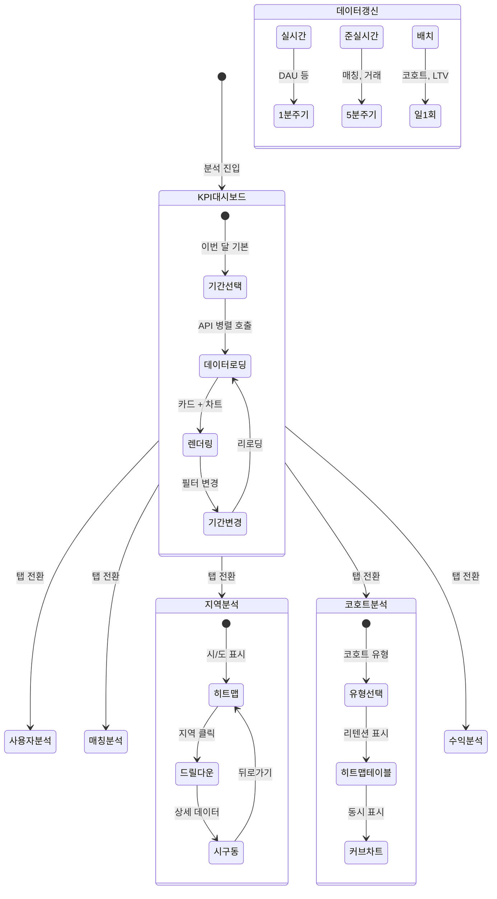

# FS-A-006 분석 대시보드

> 문서 버전: 1.0
> 작성일: 2026-03-30
> 우선순위: P1
> 상태: Draft

---

## 1. 개요
- 관리자가 플랫폼 전체의 핵심 KPI를 한눈에 파악하고, 지역별 수요/공급 분석, 코호트 분석, 수익 분석 등 심층 데이터를 활용하여 사업 의사결정을 지원하는 분석 대시보드. MAU, 매칭 건수, 거래액 등 핵심 지표를 실시간에 가까운 수준으로 제공한다.
- 대상 사용자: 관리자 (백오피스)
- 관련 PRD 섹션: 5.6 통계 및 분석

## 2. 유저 스토리
- As a 관리자, I want to 플랫폼 핵심 KPI(MAU, 매칭건수, 거래액)를 한눈에 확인하여, so that 사업 현황을 빠르게 파악할 수 있다.
- As a 관리자, I want to 지역별 요양보호사 수요와 공급 현황을 분석하여, so that 인력 수급 불균형 지역을 파악하고 마케팅을 집중할 수 있다.
- As a 관리자, I want to 신규 회원 코호트별 리텐션 추이를 분석하여, so that 사용자 이탈 패턴을 파악하고 개선할 수 있다.
- As a 관리자, I want to 서비스 유형별 수익 현황을 분석하여, so that 수익 최적화 전략을 수립할 수 있다.

## 3. 화면 구성

### 3.1 화면 목록
| 화면 ID | 화면명 | 진입 경로 | 구현 파일 |
|---------|--------|-----------|-----------|
| A-006-S1 | KPI 대시보드 (메인) | 백오피스 > 분석 | 미구현 |
| A-006-S2 | 사용자 분석 | 분석 > 사용자 | 미구현 |
| A-006-S3 | 매칭 분석 | 분석 > 매칭 | 미구현 |
| A-006-S4 | 지역별 수요/공급 분석 | 분석 > 지역 분석 | 미구현 |
| A-006-S5 | 코호트 분석 | 분석 > 코호트 | 미구현 |
| A-006-S6 | 수익 분석 | 분석 > 수익 | 미구현 |

### 3.2 화면별 상세

#### A-006-S1 KPI 대시보드 (메인)
- **헤더**: "분석 대시보드" + 기간 선택 (오늘/이번 주/이번 달/분기/커스텀)
- **KPI 카드** (4열 그리드, 전 기간 대비 증감률 표시):
  | 카드 | 지표 | 부연 |
  |------|------|------|
  | DAU | 일간 활성 사용자 수 | 전일 대비 +/-% |
  | MAU | 월간 활성 사용자 수 | 전월 대비 +/-% |
  | 매칭 건수 | 기간 내 성사된 매칭 수 | 전 기간 대비 +/-% |
  | 거래액 (GMV) | 플랫폼 총 거래 금액 | 전 기간 대비 +/-% |
  | 매출 | 플랫폼 수수료 수입 | 전 기간 대비 +/-% |
  | 매칭 성공률 | 요청 대비 매칭 성사 비율 | 목표 85% 대비 |
  | 평균 매칭 시간 | 요청~매칭 성사 소요 시간 | 목표 48h 대비 |
  | NPS | Net Promoter Score | 최근 서베이 기준 |
- **차트 영역** (2열):
  - 좌: 신규 가입자 추이 (일별 라인 차트, 보호자/요양보호사 분리)
  - 우: 매칭 건수 추이 (일별 바 차트)
- **하단 요약 테이블**:
  - 돌봄 유형별 현황 (방문요양, 방문목욕, 병원동행 등)
  - 각 유형별: 요청 수, 매칭 수, 매칭률, 평균 단가

#### A-006-S2 사용자 분석
- **헤더**: "사용자 분석" + 기간 필터
- **탭**: 가입자 | 활성 사용자 | 이탈 분석
- **가입자 탭**:
  - 신규 가입 추이 차트 (일별/주별/월별, 역할별 분리)
  - 가입 채널 분석 (카카오/네이버/구글/애플/이메일 비율 파이 차트)
  - 가입 → 첫 매칭 전환율 퍼널
  - 가입 지역 분포 (시/도 단위 히트맵)
- **활성 사용자 탭**:
  - DAU/MAU 추이 차트
  - DAU/MAU 비율 (Stickiness)
  - 역할별 MAU: 보호자 / 요양보호사
  - 구독별 MAU: 무료 / 스탠다드 / 프리미엄 / 패밀리케어
- **이탈 분석 탭**:
  - 이탈율 추이 (30일 비접속 기준)
  - 이탈 사유 분석 (탈퇴 설문 집계)
  - 이탈 전 마지막 행동 분석 (마지막 접속 화면, 마지막 액션)
  - 이탈 방지 가능 세그먼트 하이라이트

#### A-006-S3 매칭 분석
- **헤더**: "매칭 분석" + 기간 필터
- **핵심 지표 카드**: 총 매칭 요청, 매칭 성사, 매칭 실패, 매칭 성공률, 평균 매칭 시간
- **차트**:
  - 매칭 퍼널: 요청 → 요양보호사 확인 → 면접 → 계약 → 돌봄 시작
  - 매칭 실패 사유 분포 (파이 차트): 응답 없음, 조건 불일치, 일정 충돌, 보호자 취소 등
  - 평균 매칭 단가 추이 (라인 차트)
  - 돌봄 유형별 매칭 현황 (스택 바 차트)
- **테이블**: 매칭 요약 (요청일, 보호자, 요양보호사, 유형, 금액, 소요시간, 상태)

#### A-006-S4 지역별 수요/공급 분석
- **헤더**: "지역 분석"
- **지도 뷰**: 대한민국 시/도 히트맵 (수요/공급 비율 색상 표시)
  - 빨강: 수요 >> 공급 (요양보호사 부족)
  - 초록: 수요 ≈ 공급 (균형)
  - 파랑: 수요 << 공급 (요양보호사 초과)
- **지역 선택 시 상세**:
  - 시/구/동 단위 드릴다운
  - 해당 지역 요청 건수 추이
  - 해당 지역 활동 요양보호사 수
  - 수급비율 = 요청 건수 / 가용 요양보호사 수
  - 평균 매칭 시간 (지역별)
  - 평균 시급 (지역별)
- **테이블**: 지역별 요약 (시/구, 요청수, 요양보호사수, 수급비율, 평균매칭시간, 평균시급)
- **인사이트**: "인력 부족 지역 Top 5" 하이라이트

#### A-006-S5 코호트 분석
- **헤더**: "코호트 분석" + 기간 범위 필터
- **코호트 유형 선택**: 가입 월별 / 첫 매칭 월별
- **역할 필터**: 전체 / 보호자 / 요양보호사
- **리텐션 히트맵 테이블**:
  | 코호트 | 가입 수 | M1 | M2 | M3 | M4 | M5 | M6 |
  |--------|---------|-----|-----|-----|-----|-----|-----|
  | 2026.01 | 5,230 | 68% | 52% | 45% | 41% | 38% | 35% |
  | 2026.02 | 6,120 | 72% | 55% | 48% | - | - | - |
  | 2026.03 | 7,850 | 70% | - | - | - | - | - |
  - 셀 색상: 높은 리텐션(초록) → 낮은 리텐션(빨강) 그라디언트
- **리텐션 커브 차트**: 코호트별 리텐션 라인 차트 (비교용)
- **인사이트 카드**:
  - 평균 M1 리텐션: N%
  - 최고 리텐션 코호트: 2026.02 (이유 분석)
  - 목표 대비 현황: "6개월 리텐션 목표 65% 대비 현재 N%"

#### A-006-S6 수익 분석
- **헤더**: "수익 분석" + 기간 필터
- **핵심 지표 카드**: 총 매출, GMV, 수수료 수입, ARPU, LTV, CAC
- **차트**:
  - 매출 추이 (일별/주별/월별 라인 차트)
  - 매출 구성 비율 (파이 차트): 매칭 수수료 / 이용권 판매 / 구독 / 기관 SaaS
  - GMV 추이 (바 차트)
  - ARPU 추이 (역할별: 보호자/요양보호사)
- **구독 분석**:
  - 구독 플랜별 가입자 수 추이
  - 구독 전환율 (무료 → 스탠다드 → 프리미엄 → 패밀리케어)
  - 구독 이탈율 (Monthly Churn)
  - MRR (Monthly Recurring Revenue)
- **단위 경제**:
  - LTV: 평균 고객 생애 가치
  - CAC: 고객 획득 비용 (마케팅 비용 / 신규 가입자)
  - LTV/CAC 비율 (목표: 3 이상)
  - Payback Period
- **돌봄 유형별 수익**:
  | 유형 | GMV | 매출(수수료) | 매칭 건수 | 건당 평균 금액 |
  |------|-----|-------------|----------|---------------|
  | 방문요양 | OOO만 원 | OOO만 원 | OOO건 | OOO원 |
  | 방문목욕 | OOO만 원 | OOO만 원 | OOO건 | OOO원 |
  | ... | ... | ... | ... | ... |

## 4. 상세 동작 명세

### 4.1 정상 플로우

#### KPI 대시보드 조회
1. 관리자가 "분석 대시보드" 진입
2. 기본 기간: 이번 달 (자동 선택)
3. KPI 카드 데이터 로딩 (각 카드 독립 API 호출, 병렬)
4. 차트 데이터 로딩 (가입자 추이, 매칭 추이)
5. 전 기간 대비 증감률 자동 계산
6. 기간 변경 시 전체 데이터 리로딩

#### 지역별 수요/공급 분석
1. 관리자가 "지역 분석" 진입
2. 대한민국 시/도 히트맵 표시
3. 지역 클릭 → 시/구/동 단위 드릴다운
4. 선택 지역의 요청 건수, 요양보호사 수, 수급비율 표시
5. "인력 부족 지역 Top 5" 자동 하이라이트

#### 코호트 분석
1. 관리자가 "코호트 분석" 진입
2. 코호트 유형 선택 (가입 월별 / 첫 매칭 월별)
3. 역할 필터 선택 (전체/보호자/요양보호사)
4. 리텐션 히트맵 + 리텐션 커브 차트 표시
5. 인사이트 카드에 자동 분석 결과 표시

### 4.2 예외 플로우
- **데이터 미집계**: 실시간 데이터가 아닌 배치 처리 데이터의 경우 → "최종 업데이트: YYYY-MM-DD HH:mm" 표시
- **데이터 없음**: 선택 기간/지역에 데이터가 없는 경우 → "해당 기간에 데이터가 없습니다" + 기간 변경 안내
- **대용량 조회**: 1년 이상 기간 조회 시 → "대용량 데이터 조회 중입니다. 잠시 기다려주세요." + 로딩 프로그레스
- **차트 렌더링 오류**: 데이터 형식 불일치 시 → 테이블 뷰로 폴백
- **동시 접속**: 여러 관리자 동시 접속 시 → 캐시된 데이터 제공 (5분 TTL)

### 4.3 비즈니스 규칙
- **데이터 갱신 주기**:
  - 실시간 지표 (DAU, 현재 활성 세션): 1분 간격
  - 준실시간 지표 (매칭 건수, 거래액): 5분 간격
  - 배치 지표 (코호트, LTV, CAC): 일 1회 (새벽 3시 배치)
- **지표 정의**:
  - DAU: 해당 일 앱 접속한 순 사용자 수
  - MAU: 해당 월 1회 이상 앱 접속한 순 사용자 수
  - Stickiness: DAU / MAU
  - 매칭 성공률: 성사된 매칭 / 전체 매칭 요청 x 100%
  - 평균 매칭 시간: 매칭 요청 → 계약 체결까지 평균 소요 시간
  - GMV: 플랫폼을 통한 총 거래 금액
  - 매출: 플랫폼 수수료 수입 (수수료율 3% 기본)
  - ARPU: 매출 / MAU
  - LTV: ARPU x 평균 이용 기간 (개월)
  - CAC: 마케팅 비용 / 신규 가입자 수
  - MRR: 구독 월간 반복 매출
  - Churn Rate: 구독 취소 사용자 / 전체 구독 사용자 x 100%
- **목표 지표 (PRD 기준)**:
  | 지표 | v1.0 (3M) | v1.5 (6M) | v2.0 (12M) |
  |------|-----------|-----------|------------|
  | MAU | - | - | 30,000 |
  | 매칭 성공률 | 75%+ | 80%+ | 85%+ |
  | 월 GMV | 10억 원 | 30억 원 | 50억 원 |
  | NPS | 40+ | 45+ | 50+ |
  | 6개월 리텐션 | 55%+ | 60%+ | 65%+ |
- **접근 권한**: 관리자 role === "ADMIN" 전용, 읽기 전용 (데이터 수정 불가)
- **데이터 보안**: 개인식별정보(PII) 마스킹, 집계 데이터만 노출

## 5. 수용 기준 (Acceptance Criteria)

```
Given 관리자가 KPI 대시보드에 진입했을 때
When 이번 달 기간을 선택하면
Then MAU, 매칭건수, 거래액 등 핵심 지표가 전월 대비 증감률과 함께 표시된다

Given 관리자가 지역 분석에 진입했을 때
When 시/도 히트맵에서 특정 지역을 선택하면
Then 해당 지역의 요청 건수, 가용 요양보호사 수, 수급비율이 표시된다

Given 관리자가 코호트 분석에 진입했을 때
When 가입 월별 코호트를 선택하면
Then 월별 리텐션 히트맵과 리텐션 커브가 표시된다

Given 관리자가 수익 분석에서 구독 현황을 확인할 때
When 구독 분석 섹션을 조회하면
Then 플랜별 가입자 수, MRR, 전환율, 이탈율이 표시된다

Given 관리자가 매칭 분석에서 퍼널을 확인할 때
When 매칭 퍼널 차트를 조회하면
Then 요청→확인→면접→계약→돌봄시작 단계별 전환율이 표시된다

Given 인력 부족 지역이 존재할 때
When 지역 분석 화면을 조회하면
Then "인력 부족 지역 Top 5"가 자동으로 하이라이트되어 표시된다
```

## 6. API 연동

### 6.1 사용 API 목록
| Method | Endpoint | 설명 |
|--------|----------|------|
| GET | `/api/admin/analytics/kpi` | KPI 요약 지표 |
| GET | `/api/admin/analytics/users` | 사용자 분석 데이터 |
| GET | `/api/admin/analytics/users/funnel` | 가입 → 매칭 전환 퍼널 |
| GET | `/api/admin/analytics/users/churn` | 이탈 분석 데이터 |
| GET | `/api/admin/analytics/matching` | 매칭 분석 데이터 |
| GET | `/api/admin/analytics/matching/funnel` | 매칭 퍼널 데이터 |
| GET | `/api/admin/analytics/region` | 지역별 수요/공급 데이터 |
| GET | `/api/admin/analytics/region/[code]` | 특정 지역 상세 데이터 |
| GET | `/api/admin/analytics/cohort` | 코호트 분석 데이터 |
| GET | `/api/admin/analytics/revenue` | 수익 분석 데이터 |
| GET | `/api/admin/analytics/revenue/subscription` | 구독 분석 데이터 |
| GET | `/api/admin/analytics/revenue/unit-economics` | 단위 경제 지표 |

### 6.2 주요 요청/응답 스키마

#### GET /api/admin/analytics/kpi
**요청 (Query Parameters):**
```
?startDate=2026-03-01&endDate=2026-03-30&compare=previous_period
```

**성공 응답 (200):**
```json
{
  "period": { "start": "2026-03-01", "end": "2026-03-30" },
  "kpis": {
    "dau": { "value": 8520, "change": 12.3, "changeType": "increase" },
    "mau": { "value": 28750, "change": 8.5, "changeType": "increase" },
    "matchingCount": { "value": 3240, "change": 15.2, "changeType": "increase" },
    "gmv": { "value": 2850000000, "change": 22.1, "changeType": "increase" },
    "revenue": { "value": 285000000, "change": 18.7, "changeType": "increase" },
    "matchingSuccessRate": { "value": 82.5, "target": 85, "change": 3.2, "changeType": "increase" },
    "avgMatchingTime": { "value": 36, "unit": "hours", "target": 48, "change": -8.5, "changeType": "decrease" },
    "nps": { "value": 47, "target": 50, "change": 2, "changeType": "increase" }
  },
  "charts": {
    "signupTrend": {
      "labels": ["03/01", "03/02", "..."],
      "guardian": [120, 135, "..."],
      "caregiver": [85, 92, "..."]
    },
    "matchingTrend": {
      "labels": ["03/01", "03/02", "..."],
      "values": [108, 115, "..."]
    }
  },
  "lastUpdated": "2026-03-30T14:55:00Z"
}
```

#### GET /api/admin/analytics/region
**성공 응답 (200):**
```json
{
  "regions": [
    {
      "code": "11",
      "name": "서울특별시",
      "requestCount": 1250,
      "caregiverCount": 3200,
      "supplyDemandRatio": 2.56,
      "avgMatchingTime": 28,
      "avgHourlyRate": 15500,
      "status": "BALANCED"
    },
    {
      "code": "41",
      "name": "경기도",
      "requestCount": 980,
      "caregiverCount": 1100,
      "supplyDemandRatio": 1.12,
      "avgMatchingTime": 52,
      "avgHourlyRate": 14800,
      "status": "SHORTAGE"
    }
  ],
  "topShortageRegions": [
    { "name": "경기도 용인시", "ratio": 0.65, "gap": -120 },
    { "name": "인천 서구", "ratio": 0.72, "gap": -85 }
  ]
}
```

**status Enum:** `SURPLUS` (공급 > 수요), `BALANCED` (균형), `SHORTAGE` (수요 > 공급)

#### GET /api/admin/analytics/cohort
**요청 (Query Parameters):**
```
?cohortType=signup_month&role=ALL&startMonth=2026-01&endMonth=2026-03
```

**성공 응답 (200):**
```json
{
  "cohortType": "signup_month",
  "cohorts": [
    {
      "cohort": "2026-01",
      "size": 5230,
      "retention": {
        "M0": 100,
        "M1": 68,
        "M2": 52
      }
    },
    {
      "cohort": "2026-02",
      "size": 6120,
      "retention": {
        "M0": 100,
        "M1": 72
      }
    }
  ],
  "averageRetention": {
    "M1": 70,
    "M2": 52,
    "target6M": 65
  }
}
```

## 7. 상태 다이어그램


## 8. 데이터 모델

### 분석 데이터는 기존 모델의 집계(Aggregation)로 구성

본 기능은 별도의 주요 DB 모델이 필요하지 않으며, 기존 모델의 데이터를 집계하여 분석 결과를 제공한다.

#### 데이터 소스 맵핑
| 분석 항목 | 데이터 소스 모델 | 집계 방식 |
|-----------|-----------------|-----------|
| DAU/MAU | User (lastLoginAt) | COUNT DISTINCT by date |
| 신규 가입 | User (createdAt) | COUNT by date |
| 매칭 건수 | Match (status, createdAt) | COUNT WHERE status=ACCEPTED |
| 매칭 성공률 | Match (status) | ACCEPTED / total x 100 |
| 평균 매칭 시간 | Match (createdAt, acceptedAt) | AVG(acceptedAt - createdAt) |
| GMV | Payment (amount, createdAt) | SUM(amount) by period |
| 매출 | Payment (platformFee) | SUM(platformFee) by period |
| 지역별 요청 | CareRecipient (address), Match | COUNT by region |
| 지역별 요양보호사 | CaregiverProfile (serviceArea) | COUNT by region |
| 코호트 리텐션 | User (createdAt, lastLoginAt) | 월별 재방문 비율 |
| 구독 현황 | Subscription (plan, status) | COUNT by plan |
| 리뷰 평균 평점 | Review (overallRating) | AVG(overallRating) |

#### AnalyticsCache 테이블 (신규, 성능 최적화용)
| 필드 | 타입 | 설명 |
|------|------|------|
| id | String (cuid) | PK |
| metricType | String | KPI / USER / MATCHING / REGION / COHORT / REVENUE |
| periodType | String | DAILY / WEEKLY / MONTHLY / QUARTERLY |
| periodKey | String | 기간 키 (예: "2026-03-30", "2026-W13", "2026-03") |
| data | String (JSON) | 집계 결과 데이터 |
| computedAt | DateTime | 집계 시간 |
| expiresAt | DateTime | 캐시 만료 시간 |

**인덱스:**
- `[metricType, periodType, periodKey]`: 빠른 캐시 조회

## 9. 연관 기능
- **선행 기능**: FS-A-001 회원관리 (User 데이터), FS-A-002 매칭모니터링 (Match 데이터), FS-A-003 결제/정산관리 (Payment 데이터)
- **후행 기능**: FS-A-005 콘텐츠관리 (분석 결과 기반 타겟 마케팅 의사결정)
- **의존 기능**: 전체 데이터 모델 (User, Match, CareSession, Payment, Review, Subscription 등)
- **참고**: 배치 집계 시스템 (cron job 또는 서버리스 함수) 구축 필요

## 10. 구현 현황
| 항목 | 상태 | 비고 |
|------|------|------|
| 백오피스 앱 | ❌ | 관리자 백오피스 전체 미구현 |
| KPI 대시보드 화면 | ❌ | 미구현 |
| 사용자 분석 화면 | ❌ | 미구현 |
| 매칭 분석 화면 | ❌ | 미구현 |
| 지역별 수요/공급 화면 | ❌ | 미구현 |
| 코호트 분석 화면 | ❌ | 미구현 |
| 수익 분석 화면 | ❌ | 미구현 |
| 분석 API | ❌ | 전체 미구현 |
| 데이터 집계 배치 | ❌ | cron job 또는 서버리스 함수 미구현 |
| AnalyticsCache 모델 | ❌ | 신규 모델 생성 필요 |
| 차트 라이브러리 | ❌ | Chart.js / Recharts 등 미도입 |
| 지도 히트맵 | ❌ | 대한민국 지도 시각화 라이브러리 미도입 |
| 기존 데이터 모델 | ✅ | User, Match, CareSession, Payment, Review 등 기존 모델 존재 |
