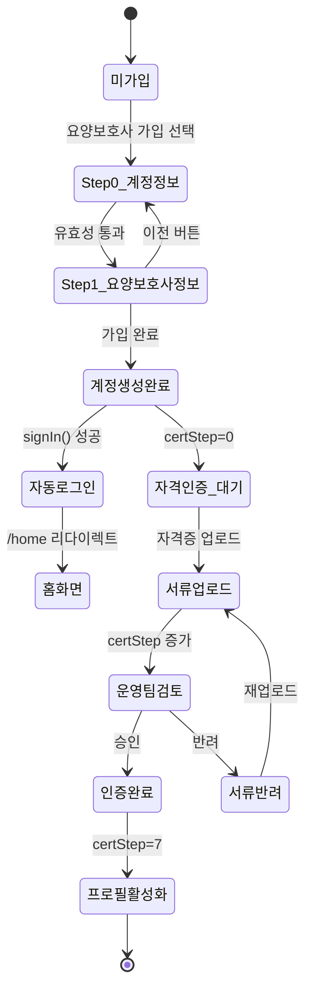

# FS-C-001 회원가입 및 자격 인증

> 문서 버전: 1.0
> 작성일: 2026-03-30
> 우선순위: P0
> 상태: Draft

---

## 1. 개요
- 요양보호사가 플랫폼에 가입하고 자격증, 신분증, 범죄경력 조회 등 7단계 인증을 통해 신뢰를 확보하는 기능이다. 인증 완료 후 프로필이 보호자 검색 결과에 노출된다.
- 대상 사용자: 요양보호사 (요양보호사 자격증 보유자, 간호조무사, 사회복지사, 간호사)
- 관련 PRD 섹션: 3.1 회원가입 및 자격 인증

## 2. 유저 스토리
- As a 요양보호사, I want to 내 자격증과 경력을 플랫폼에서 인증받아, so that 보호자에게 신뢰를 줄 수 있다.
- As a 요양보호사, I want to 앱에서 간편하게 서류를 업로드하고 인증 진행 상태를 확인하여, so that 빠르게 활동을 시작할 수 있다.
- As a 플랫폼 관리자, I want to 요양보호사의 자격증과 신원을 검증하여, so that 보호자에게 안전한 매칭 환경을 제공할 수 있다.

## 3. 화면 구성

### 3.1 화면 목록
| 화면 ID | 화면명 | 진입 경로 | 구현 파일 |
|---------|--------|-----------|-----------|
| SC-C-001-1 | 가입 유형 선택 | /signup | `src/app/(auth)/signup/page.tsx` |
| SC-C-001-2 | 요양보호사 회원가입 (2단계 스텝) | /signup/caregiver | `src/app/(auth)/signup/caregiver/page.tsx` |
| SC-C-001-3 | 자격증 관리 (인증서류 업로드) | /my/certificates | `src/app/(app)/my/certificates/page.tsx` |

### 3.2 화면별 상세

#### SC-C-001-2: 요양보호사 회원가입
- **Step 0 - 계정 정보**
  - UI 구성 요소: 이름 입력, 휴대폰 번호 입력 (010-XXXX-XXXX 자동 포맷), 비밀번호 입력, 비밀번호 확인 입력
  - 데이터 표시: Progress bar (현재 단계 / 전체 단계), 에러 메시지 배너
  - 인터랙션: 유효성 검증 후 "다음" 버튼으로 Step 1 이동
- **Step 1 - 요양보호사 정보**
  - UI 구성 요소: 요양보호사 유형 선택 (2x2 그리드 카드), 지역 선택 (CustomSelect), 구/시 텍스트 입력, 희망 시급 입력 (숫자만), 제공 서비스 복수 선택 (Chip 형태)
  - 데이터 표시: 선택된 유형 하이라이트, 선택된 서비스 태그 표시
  - 인터랙션: "이전" 버튼으로 Step 0 복귀, "가입 완료" 버튼으로 API 호출 후 자동 로그인

#### SC-C-001-3: 자격증 관리
- UI 구성 요소: 자격증 목록 카드, 인증 상태 뱃지 (PENDING/VERIFIED/REJECTED), 새 자격증 추가 폼 (모달/바텀시트), 파일 업로드 영역
- 데이터 표시: 자격증명, 발급기관, 발급일, 인증 상태, 자격증 이미지 미리보기
- 인터랙션: 자격증 추가 → 파일 업로드 → API 저장, 반려된 자격증 재제출

## 4. 상세 동작 명세

### 4.1 정상 플로우
1. 사용자가 /signup 에서 "요양보호사로 가입" 선택
2. Step 0: 이름, 휴대폰 번호, 비밀번호 입력 → 유효성 검증 통과 → "다음" 클릭
3. Step 1: 요양보호사 유형(CARE_WORKER/NURSING_ASSISTANT/SOCIAL_WORKER/NURSE) 선택, 지역/구 입력, 희망 시급 입력, 제공 서비스(HOME_CARE/BATH_CARE/NURSING/COGNITIVE/HOUSEKEEPING) 복수 선택
4. "가입 완료" 클릭 → `POST /api/users` 호출 (role: "CAREGIVER")
5. 성공 시 `signIn("credentials")` 자동 로그인 → /home 으로 리다이렉트
6. 가입 후 /my/certificates 에서 자격증 업로드 및 인증 진행

### 4.2 예외 플로우
- **중복 가입**: 이미 등록된 휴대폰 번호로 가입 시도 → API 400/409 응답 → "이미 가입된 번호입니다" 에러 메시지 표시
- **비밀번호 불일치**: 비밀번호와 확인이 다름 → 클라이언트 유효성 검증 실패 → "비밀번호가 일치하지 않습니다" 표시
- **비밀번호 길이 부족**: 8자 미만 → "비밀번호는 8자 이상이어야 합니다" 표시
- **필수 항목 미입력**: Step별 필수 항목 미입력 시 → "모든 항목을 입력해주세요" 표시
- **자격증 반려**: 운영팀 검토 후 반려 시 → 반려 사유와 함께 재업로드 요청 발송
- **네트워크 오류**: fetch 실패 → "회원가입 중 오류가 발생했습니다" 표시

### 4.3 비즈니스 규칙
- 휴대폰 번호는 `010-XXXX-XXXX` 형식만 허용 (정규식: `/^010-?\d{4}-?\d{4}$/`)
- 비밀번호 최소 8자
- 요양보호사 유형은 4가지: CARE_WORKER, NURSING_ASSISTANT, SOCIAL_WORKER, NURSE
- 제공 서비스는 최소 1개 이상 선택 필수
- 자격 인증은 7단계 프로세스 (certStep 0~7)
  - Step 1: 기본 정보 입력
  - Step 2: 본인인증 (휴대폰 인증)
  - Step 3: 서류 업로드 (자격증 촬영/파일)
  - Step 4: 성범죄 조회 동의
  - Step 5: 운영팀 검토 (1~2 영업일)
  - Step 6: 인증 완료 및 프로필 활성화
  - Step 7: 추가 자격증 인증 (선택)
- 필수 서류: 요양보호사 자격증, 신분증, 본인 명의 계좌, 성범죄·아동학대 경력 조회 동의서
- 선택 서류 (배지 부여): 건강검진 결과서, 치매전문교육 이수증, 경력증명서, 추가 자격증

## 5. 수용 기준 (Acceptance Criteria)

```
Given 요양보호사가 회원가입 화면에서 모든 필수 항목을 입력했을 때
When "가입 완료" 버튼을 탭하면
Then 계정이 생성되고 자동 로그인되어 /home 으로 이동한다

Given 이미 등록된 휴대폰 번호로 가입을 시도했을 때
When API 응답이 실패하면
Then 에러 메시지가 표시되고 가입 폼이 유지된다

Given 요양보호사가 자격증 사진을 업로드했을 때
When 운영팀이 인증을 완료하면
Then 요양보호사에게 푸시 알림이 발송되고 프로필이 검색 결과에 노출된다

Given 서류 검토 결과 반려 시
When 반려 사유와 함께 재업로드 요청이 발송되면
Then 요양보호사가 수정 후 재제출할 수 있다

Given 요양보호사 자격증 번호를 입력했을 때
When 자격 검증 API가 유효한 결과를 반환하면
Then 자격증 상태가 VERIFIED로 변경되고 인증 배지가 부여된다
```

## 6. API 연동

### 6.1 사용 API 목록
| Method | Endpoint | 설명 |
|--------|----------|------|
| POST | `/api/users` | 회원가입 (role: CAREGIVER) |
| POST | `/api/auth/[...nextauth]` | NextAuth 기반 로그인 (credentials provider) |
| GET | `/api/users/me` | 현재 사용자 정보 조회 |
| PATCH | `/api/users/me` | 사용자 정보 수정 |
| GET | `/api/caregivers` | 요양보호사 프로필 조회 (자격증 포함) |
| POST | `/api/upload` | 자격증 이미지 파일 업로드 |

### 6.2 주요 요청/응답 스키마

**POST /api/users (회원가입)**
```json
// Request
{
  "phone": "010-1234-5678",
  "password": "password123",
  "name": "홍길동",
  "role": "CAREGIVER",
  "sitterType": "CARE_WORKER",
  "region": "서울",
  "district": "강남구",
  "hourlyRate": 15000,
  "careTypes": ["HOME_CARE", "BATH_CARE"]
}

// Response (201)
{
  "user": {
    "id": "cuid...",
    "phone": "010-1234-5678",
    "name": "홍길동",
    "role": "CAREGIVER"
  }
}
```

## 7. 상태 다이어그램



## 8. 데이터 모델

### User
| 필드 | 타입 | 설명 |
|------|------|------|
| id | String (cuid) | PK |
| phone | String (unique) | 휴대폰 번호 |
| email | String? | 이메일 (선택) |
| passwordHash | String | 암호화된 비밀번호 |
| name | String | 이름 |
| role | String | "GUARDIAN" / "CAREGIVER" / "ADMIN" |
| profileImage | String? | 프로필 이미지 URL |
| isActive | Boolean | 활성화 여부 |
| isBanned | Boolean | 정지 여부 |

### CaregiverProfile
| 필드 | 타입 | 설명 |
|------|------|------|
| id | String (cuid) | PK |
| userId | String (unique) | User FK |
| gender | String | 성별 |
| region | String | 활동 지역 |
| caregiverType | String | CARE_WORKER / NURSING_AIDE / SOCIAL_WORKER / NURSE |
| serviceCategories | String (JSON) | 제공 서비스 유형 배열 |
| licenseNumber | String? | 자격증 번호 |
| licenseVerified | Boolean | 자격증 인증 여부 |
| idVerified | Boolean | 신분 인증 여부 |
| backgroundCheck | String | 범죄경력 조회 상태 (PENDING/CLEAR/FLAGGED) |
| certStep | Int | 인증 완료 단계 (0~7) |
| profileCompleteness | Int | 프로필 완성도 (0~100%) |

### Certificate
| 필드 | 타입 | 설명 |
|------|------|------|
| id | String (cuid) | PK |
| caregiverId | String | CaregiverProfile FK |
| name | String | 자격증명 |
| certType | String | CARE_WORKER_LICENSE / NURSING_AIDE_LICENSE 등 |
| step | Int | 7단계 중 해당 단계 |
| issuingOrganization | String | 발급 기관 |
| issueDate | DateTime | 발급일 |
| expirationDate | DateTime? | 만료일 |
| certificateNumber | String? | 자격증 번호 |
| imageUrl | String? | 자격증 이미지 URL |
| verificationStatus | String | PENDING / VERIFIED / REJECTED |
| rejectionReason | String? | 반려 사유 |

## 9. 연관 기능
- **FS-C-002 프로필 관리**: 가입 완료 후 프로필 작성 단계로 연결
- **FS-C-004 매칭 요청 수락/거절**: 자격 인증 완료 후 매칭 요청 수신 가능
- **보호자 앱 - 요양보호사 검색**: 인증 완료된 요양보호사만 검색 결과에 노출

## 10. 구현 현황
| 항목 | 상태 | 비고 |
|------|------|------|
| 회원가입 페이지 (2단계 스텝) | ✅ 구현 완료 | `src/app/(auth)/signup/caregiver/page.tsx` |
| POST /api/users (가입 API) | ✅ 구현 완료 | `src/app/api/users/route.ts` |
| NextAuth credentials 로그인 | ✅ 구현 완료 | `src/app/api/auth/[...nextauth]/route.ts` |
| 자격증 관리 페이지 | ✅ 구현 완료 | `src/app/(app)/my/certificates/page.tsx` |
| 파일 업로드 API | ✅ 구현 완료 | `src/app/api/upload/route.ts` |
| 자격증 DB 모델 (Certificate) | ✅ 구현 완료 | `prisma/schema.prisma` |
| 7단계 인증 프로세스 (certStep) | ⚠️ 부분 구현 | DB 스키마 존재, 단계별 UI 플로우 미구현 |
| OCR 자격증 인식 | ❌ 미구현 | PRD 명세 존재, 외부 API 연동 필요 |
| 범죄경력 조회 연동 | ❌ 미구현 | PRD 명세 존재, 외부 API 연동 필요 |
| 얼굴 인식 신원 대조 | ❌ 미구현 | PRD 명세 존재, 외부 API 연동 필요 |
| 사회보장정보시스템 자격 검증 | ❌ 미구현 | PRD 명세 존재, 공단 API 연동 필요 |
