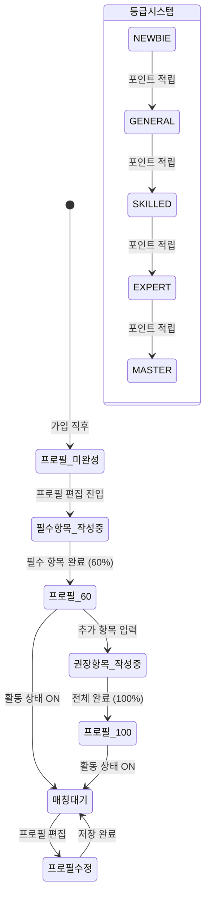

# FS-C-002 프로필 관리

> 문서 버전: 1.0
> 작성일: 2026-03-30
> 우선순위: P0
> 상태: Draft

---

## 1. 개요
- 요양보호사가 프로필 사진, 자기소개, 전문분야, 활동 지역, 희망 시급, 가용 시간 등을 설정하고 관리하는 기능이다. 프로필 완성도가 높을수록 보호자 검색 결과에서 상위 노출된다.
- 대상 사용자: 요양보호사 (가입 완료 후 활동 중인 사용자)
- 관련 PRD 섹션: 3.2 프로필 관리

## 2. 유저 스토리
- As a 요양보호사, I want to 내 전문 분야와 경력을 상세히 등록하여, so that 보호자가 나의 강점을 파악하고 매칭 요청을 보낼 수 있다.
- As a 요양보호사, I want to 프로필 완성도를 확인하여, so that 부족한 항목을 채워 더 많은 매칭 기회를 얻을 수 있다.
- As a 요양보호사, I want to 희망 근무 조건(지역, 시급, 서비스 유형)을 설정하여, so that 내 조건에 맞는 매칭만 수신할 수 있다.

## 3. 화면 구성

### 3.1 화면 목록
| 화면 ID | 화면명 | 진입 경로 | 구현 파일 |
|---------|--------|-----------|-----------|
| SC-C-002-1 | 마이페이지 | /my | `src/app/(app)/my/page.tsx` |
| SC-C-002-2 | 프로필 편집 | /my/profile | `src/app/(app)/my/profile/page.tsx` |
| SC-C-002-3 | 자격증 관리 | /my/certificates | `src/app/(app)/my/certificates/page.tsx` |

### 3.2 화면별 상세

#### SC-C-002-1: 마이페이지
- UI 구성 요소: 프로필 사진/이름 카드, 프로필 완성도 바, 메뉴 리스트 (프로필 편집, 자격증 관리, 계정 설정 등)
- 데이터 표시: 사용자명, 프로필 이미지, 프로필 완성도 %, 활동 상태, 등급(grade)
- 인터랙션: 각 메뉴 탭 시 해당 페이지 이동

#### SC-C-002-2: 프로필 편집
- UI 구성 요소:
  - 프로필 사진 업로드/변경 영역
  - 자기소개 텍스트 에디터 (최대 1,000자)
  - 전문 분야 다중 선택 태그 (치매케어, 뇌졸중, 호스피스, 신체활동 지원 등)
  - 서비스 가능 유형 다중 선택 (방문요양/방문목욕/방문간호/인지활동/가사지원)
  - 활동 지역 선택 (최대 3개 구)
  - 희망 시급 입력
  - 추가 시급 입력 (야간/주말 할증)
  - 경력 연수 입력
  - 경력 상세 입력 (기관명, 기간, 역할)
  - 학력 입력
  - 운전 가능 여부 토글
  - 비흡연 여부 토글
  - 최대 담당 인원 설정
- 데이터 표시: 현재 저장된 프로필 정보 로드
- 인터랙션: 수정 후 "저장" 버튼 → PATCH /api/users/me 호출

#### SC-C-002-3: 자격증 관리
- UI 구성 요소: 등록된 자격증 목록 카드, 인증 상태 뱃지, 자격증 추가 버튼
- 데이터 표시: 자격증명, 발급기관, 발급일, 인증 상태(PENDING/VERIFIED/REJECTED)
- 인터랙션: 새 자격증 추가 → 파일 업로드 → 저장

## 4. 상세 동작 명세

### 4.1 정상 플로우
1. /my 마이페이지에서 프로필 완성도 확인
2. "프로필 편집" 탭 → /my/profile 이동
3. 기본 정보 수정 (자기소개, 전문분야, 지역, 시급 등)
4. "저장" 버튼 클릭 → PATCH /api/users/me 호출
5. 성공 시 프로필 완성도 갱신 → 보호자 검색 결과에 즉시 반영

### 4.2 예외 플로우
- **프로필 사진 업로드 실패**: 파일 크기 초과(10MB) 또는 지원하지 않는 형식 → 에러 메시지 표시
- **자기소개 글자 수 초과**: 1,000자 초과 시 입력 차단 또는 경고
- **시급 범위 이탈**: 최저시급(2026년 기준) 미만 입력 시 경고 표시
- **서버 오류**: API 500 응답 시 "저장 중 오류가 발생했습니다" 표시

### 4.3 비즈니스 규칙
- 프로필 완성도 계산 (profileCompleteness: 0~100%):
  - 필수 항목 (0→60%): 프로필 사진, 자기소개(100자 이상), 전문분야 선택(최대 5개), 보유 자격증 전체 등록, 희망 근무 조건 설정
  - 권장 항목 (60→100%): 동영상 자기소개(30~60초), 경력 증명서 업로드, 가용 일정 상세 등록, 서비스 유형별 요금 설정
- 프로필 완성도 80% 미만 시 앱 진입 시 완성 유도 배너 노출
- 등급 시스템: NEWBIE(신입) → GENERAL(일반) → SKILLED(숙련) → EXPERT(전문) → MASTER(마스터)
- 등급 포인트(gradePoints)는 돌봄 건수, 리뷰 평점, 교육 이수 등으로 적립
- 가용 시간 변경 시 보호자 검색 결과에 즉시 반영
- 소개 영상 업로드 시 자동 가로 최적화 및 섬네일 생성

## 5. 수용 기준 (Acceptance Criteria)

```
Given 요양보호사가 프로필 완성도가 80% 미만일 때
When 앱에 진입하면
Then 프로필 완성 유도 배너가 노출된다 (현재 완성도 % 표시)

Given 요양보호사가 프로필 편집 화면에서 자기소개를 수정했을 때
When "저장" 버튼을 탭하면
Then 변경 사항이 즉시 저장되고 보호자 검색 결과에 반영된다

Given 소개 영상을 업로드했을 때
When 업로드가 완료되면
Then 영상이 자동으로 가로 최적화되고 섬네일이 자동 생성된다

Given 가용 시간을 변경했을 때
When 저장하면
Then 보호자 검색 결과의 가용 시간 정보가 즉시 갱신된다

Given 프로필 완성도가 100%에 도달했을 때
When 마이페이지를 확인하면
Then 프로필 완성도 배너 대신 "프로필이 완성되었습니다" 축하 메시지가 표시된다
```

## 6. API 연동

### 6.1 사용 API 목록
| Method | Endpoint | 설명 |
|--------|----------|------|
| GET | `/api/users/me` | 현재 사용자 정보 + CaregiverProfile 조회 |
| PATCH | `/api/users/me` | 프로필 정보 수정 |
| POST | `/api/upload` | 프로필 사진 / 소개 영상 업로드 |
| PATCH | `/api/users/me/password` | 비밀번호 변경 |

### 6.2 주요 요청/응답 스키마

**PATCH /api/users/me (프로필 수정)**
```json
// Request
{
  "name": "홍길동",
  "profileImage": "https://...",
  "introduction": "치매 전문 8년 경력의 요양보호사입니다.",
  "region": "서울 노원구",
  "hourlyRate": 18000,
  "additionalRate": 3000,
  "serviceCategories": ["HOME_CARE", "DEMENTIA_CARE"],
  "specialties": ["치매케어", "뇌졸중"],
  "experienceYears": 8,
  "experience": "재가요양센터 5년, 개인 활동 3년",
  "canDrive": true,
  "nonsmoker": true,
  "maxRecipients": 2
}

// Response (200)
{
  "user": {
    "id": "...",
    "name": "홍길동",
    "caregiverProfile": {
      "profileCompleteness": 85,
      "grade": "SKILLED",
      ...
    }
  }
}
```

## 7. 상태 다이어그램



## 8. 데이터 모델

### CaregiverProfile (프로필 관련 필드)
| 필드 | 타입 | 설명 |
|------|------|------|
| gender | String | 성별 (MALE/FEMALE) |
| birthDate | DateTime? | 생년월일 |
| region | String | 활동 지역 |
| address | String? | 상세 주소 |
| introduction | String? | 자기소개 (최대 1,000자) |
| experience | String? | 경력 상세 |
| experienceYears | Int | 경력 연수 |
| education | String? | 학력 |
| hourlyRate | Int | 희망 시급 (기본값: 15,000원) |
| additionalRate | Int | 추가 시급 (야간/주말) |
| caregiverType | String | 요양보호사 유형 |
| serviceCategories | String (JSON) | 서비스 가능 유형 배열 |
| specialties | String (JSON) | 전문 분야 배열 |
| maxRecipients | Int | 최대 담당 인원 |
| canDrive | Boolean | 운전 가능 여부 |
| nonsmoker | Boolean | 비흡연 여부 |
| grade | String | NEWBIE/GENERAL/SKILLED/EXPERT/MASTER |
| gradePoints | Int | 등급 포인트 |
| videoIntroUrl | String? | 소개 영상 URL |
| profileCompleteness | Int | 프로필 완성도 (0~100%) |
| averageRating | Float | 평균 평점 |
| totalReviews | Int | 총 리뷰 수 |
| totalCares | Int | 총 돌봄 횟수 |
| responseRate | Float | 응답률 |

## 9. 연관 기능
- **FS-C-001 회원가입/자격인증**: 가입 후 프로필 작성으로 연결
- **FS-C-003 일정/스케줄 관리**: 가용 시간 설정과 연동
- **보호자 앱 - 요양보호사 검색**: 프로필 정보가 검색 필터/결과에 반영
- **보호자 앱 - 요양보호사 상세 프로필**: 프로필 정보가 상세 페이지에 표시

## 10. 구현 현황
| 항목 | 상태 | 비고 |
|------|------|------|
| 마이페이지 | ✅ 구현 완료 | `src/app/(app)/my/page.tsx` |
| 프로필 편집 페이지 | ✅ 구현 완료 | `src/app/(app)/my/profile/page.tsx` |
| 자격증 관리 페이지 | ✅ 구현 완료 | `src/app/(app)/my/certificates/page.tsx` |
| GET/PATCH /api/users/me | ✅ 구현 완료 | `src/app/api/users/me/route.ts` |
| 파일 업로드 API | ✅ 구현 완료 | `src/app/api/upload/route.ts` |
| 프로필 완성도 계산 로직 | ⚠️ 부분 구현 | DB 필드 존재, 자동 계산 로직 미확인 |
| 소개 영상 촬영/업로드 | ❌ 미구현 | PRD 명세 존재, 영상 처리 로직 필요 |
| 등급 시스템 자동 승급 | ❌ 미구현 | DB 필드 존재, 포인트 적립/승급 로직 필요 |
| 프로필 완성도 유도 배너 | ❌ 미구현 | PRD 명세 존재 |
| 경력 증명서 업로드 | ⚠️ 부분 구현 | 업로드 API 존재, 전용 UI 미확인 |
