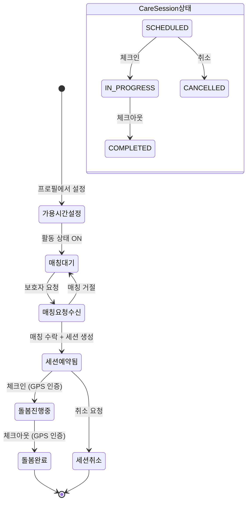

# FS-C-003 일정 및 스케줄 관리

> 문서 버전: 1.0
> 작성일: 2026-03-30
> 우선순위: P0
> 상태: Draft

---

## 1. 개요
- 요양보호사가 가용 시간, 확정 예약, 휴가 등을 캘린더에서 통합 관리하는 기능이다. 가용 시간 설정은 보호자 검색 결과에 반영되며, 일정 충돌 시 자동 경고를 제공한다.
- 대상 사용자: 요양보호사 (가입 및 프로필 설정 완료 후)
- 관련 PRD 섹션: 3.3 일정 및 스케줄 관리, SERVICE_PLAN 3.2.3

## 2. 유저 스토리
- As a 요양보호사, I want to 요일별 가용 시간을 설정하여, so that 내 스케줄에 맞는 매칭만 수신할 수 있다.
- As a 요양보호사, I want to 확정된 돌봄 예약을 캘린더에서 한눈에 확인하여, so that 일정 관리를 효율적으로 할 수 있다.
- As a 요양보호사, I want to 특정 날짜를 휴가로 설정하여, so that 해당 날짜에 매칭 요청이 오지 않도록 할 수 있다.
- As a 요양보호사, I want to 새 매칭 요청이 기존 일정과 겹치는지 확인하여, so that 이중 예약을 방지할 수 있다.

## 3. 화면 구성

### 3.1 화면 목록
| 화면 ID | 화면명 | 진입 경로 | 구현 파일 |
|---------|--------|-----------|-----------|
| SC-C-003-1 | 돌봄 관리 (탭: 예정/진행중/완료) | /care | `src/app/(app)/care/page.tsx` |
| SC-C-003-2 | 돌봄 세션 상세 | /care/[id] | `src/app/(app)/care/[id]/page.tsx` |
| SC-C-003-3 | 프로필 편집 (가용 시간 섹션) | /my/profile | `src/app/(app)/my/profile/page.tsx` |

### 3.2 화면별 상세

#### SC-C-003-1: 돌봄 관리
- UI 구성 요소: 탭 네비게이션 (예정/진행중/완료), 돌봄 세션 카드 리스트, 각 카드에 날짜/시간/어르신 정보/상태 표시
- 데이터 표시: scheduledDate, startTime, endTime, status(SCHEDULED/IN_PROGRESS/COMPLETED/CANCELLED), 돌봄 대상자 이름, 보호자 이름
- 인터랙션: 카드 탭 → 돌봄 세션 상세 이동, 탭 전환으로 상태별 필터링
- 구현 참조: `CareTabs.tsx` 컴포넌트로 탭 전환

#### SC-C-003-2: 돌봄 세션 상세
- UI 구성 요소: 세션 기본 정보 카드, 체크인/체크아웃 버튼, 돌봄 일지 목록, SOS 버튼
- 데이터 표시: 날짜, 시간, 시급, 총 시간, 총 금액, GPS 체크인/아웃 시간, 돌봄 대상자 상세 정보
- 인터랙션: 체크인 → GPS 위치 인증, 체크아웃 → 돌봄 종료 + 일지 작성 유도
- 구현 참조: `CareCheckInOut.tsx`, `SOSButton.tsx` 컴포넌트

#### SC-C-003-3: 가용 시간 설정 (프로필 편집 내)
- UI 구성 요소: 요일별(월~일) 가용 시간대 입력, 시작/종료 시간 설정, 활성화/비활성화 토글
- 데이터 표시: Availability 모델 데이터 (dayOfWeek, startTime, endTime, isActive)
- 인터랙션: 가용 시간 추가/수정/삭제 → API 호출

## 4. 상세 동작 명세

### 4.1 정상 플로우

#### 가용 시간 설정
1. /my/profile 에서 가용 시간 섹션 접근
2. 요일 선택 → 시작 시간 / 종료 시간 설정
3. "저장" 클릭 → Availability 레코드 생성/수정
4. 보호자 검색 시 해당 시간대에 가능한 요양보호사로 노출

#### 돌봄 일정 확인
1. /care 페이지에서 "예정" 탭 확인 → SCHEDULED 상태 세션 목록
2. 세션 카드 탭 → /care/[id] 상세 페이지 이동
3. 체크인 버튼으로 돌봄 시작 (→ FS-C-005 연계)

### 4.2 예외 플로우
- **일정 충돌**: 새 매칭 요청의 시간대가 기존 확정 세션과 겹침 → 캘린더에서 겹치는 일정 시각적 경고 표시
- **휴가 설정 중 기존 예약**: 이미 예약된 날짜를 휴가로 설정 시도 → "해당 날짜에 예약이 있습니다" 경고
- **과거 날짜 수정**: 이미 지난 날짜의 가용 시간 수정 → 차단 또는 무시

### 4.3 비즈니스 규칙
- 가용 시간은 요일 단위로 설정 (MON/TUE/WED/THU/FRI/SAT/SUN)
- 동일 요일에 복수 시간대 설정 가능 (예: 09:00-12:00, 14:00-18:00)
- 같은 요일+시작시간 조합은 유니크 제약 (@@unique([caregiverId, dayOfWeek, startTime]))
- 가용 시간 isActive=false 시 해당 시간대 매칭 비활성화
- 매칭 요청이 수신되면 해당 시간대가 캘린더에 시각적 표시
- 돌봄 세션 상태 전이: SCHEDULED → IN_PROGRESS → COMPLETED (또는 CANCELLED)
- 확정된 예약은 보호자와 협의 없이 일방 취소 불가 (취소 사유 입력 필수)

## 5. 수용 기준 (Acceptance Criteria)

```
Given 새 매칭 요청이 수신되었을 때
When 캘린더에서 해당 날짜를 확인하면
Then 요청된 시간대가 시각적으로 표시되고, 겹치는 일정이 있을 경우 경고가 표시된다

Given 요양보호사가 특정 날짜를 휴가로 설정하면
When 저장하면
Then 해당 날짜에 매칭 요청이 수신되지 않는다

Given 돌봄 관리 화면에서 "예정" 탭을 선택했을 때
When SCHEDULED 상태 세션이 있으면
Then 날짜순으로 정렬된 세션 카드 목록이 표시된다

Given 돌봄 세션 카드를 탭했을 때
When 세션 상세 화면에 진입하면
Then 날짜, 시간, 돌봄 대상자 정보, 체크인/체크아웃 상태가 표시된다

Given 가용 시간을 월요일 09:00~18:00으로 설정했을 때
When 보호자가 월요일 09:00~12:00 시간대로 검색하면
Then 해당 요양보호사가 검색 결과에 노출된다
```

## 6. API 연동

### 6.1 사용 API 목록
| Method | Endpoint | 설명 |
|--------|----------|------|
| GET | `/api/care-sessions` | 돌봄 세션 목록 조회 (CAREGIVER 역할 기반) |
| GET | `/api/care-sessions/[id]` | 돌봄 세션 상세 조회 |
| POST | `/api/care-sessions` | 돌봄 세션 생성 |
| PATCH | `/api/users/me` | 가용 시간 포함 프로필 수정 |
| GET | `/api/matches` | 매칭 요청 목록 (스케줄 정보 포함) |

### 6.2 주요 요청/응답 스키마

**GET /api/care-sessions (세션 목록)**
```json
// Response (200) - CAREGIVER 역할
{
  "sessions": [
    {
      "id": "...",
      "matchId": "...",
      "caregiverId": "...",
      "status": "SCHEDULED",
      "scheduledDate": "2026-04-01T00:00:00Z",
      "startTime": "09:00",
      "endTime": "13:00",
      "hourlyRate": 18000,
      "totalHours": null,
      "totalAmount": null,
      "checkInTime": null,
      "checkOutTime": null,
      "match": {
        "guardian": {
          "user": { "id": "...", "name": "박민준", "profileImage": "..." }
        }
      },
      "recipients": [
        {
          "careRecipient": { "name": "박○○", "gender": "FEMALE", "birthYear": 1947 }
        }
      ],
      "journals": [],
      "review": null
    }
  ]
}
```

## 7. 상태 다이어그램



## 8. 데이터 모델

### Availability (가용 시간)
| 필드 | 타입 | 설명 |
|------|------|------|
| id | String (cuid) | PK |
| caregiverId | String | CaregiverProfile FK |
| dayOfWeek | String | 요일 (MON~SUN) |
| startTime | String | 시작 시간 (예: "09:00") |
| endTime | String | 종료 시간 (예: "18:00") |
| isActive | Boolean | 활성화 여부 |

### CareSession (돌봄 세션) - 스케줄 관련 필드
| 필드 | 타입 | 설명 |
|------|------|------|
| id | String (cuid) | PK |
| matchId | String | Match FK |
| caregiverId | String | CaregiverProfile FK |
| status | String | SCHEDULED / IN_PROGRESS / COMPLETED / CANCELLED |
| scheduledDate | DateTime | 예정 날짜 |
| startTime | String | 예정 시작 시간 |
| endTime | String | 예정 종료 시간 |
| actualStart | DateTime? | 실제 시작 시간 (체크인) |
| actualEnd | DateTime? | 실제 종료 시간 (체크아웃) |

### Match (스케줄 관련 필드)
| 필드 | 타입 | 설명 |
|------|------|------|
| schedule | String (JSON) | 돌봄 스케줄 배열 (요일+시간) |
| startDate | DateTime | 돌봄 시작일 |
| endDate | DateTime? | 돌봄 종료일 |

## 9. 연관 기능
- **FS-C-002 프로필 관리**: 가용 시간 설정은 프로필 편집 화면에서 수행
- **FS-C-004 매칭 요청 수락/거절**: 매칭 수락 시 세션이 SCHEDULED 상태로 생성
- **FS-C-005 돌봄 수행/일지 작성**: 세션 상세에서 체크인/체크아웃 및 일지 작성
- **FS-C-006 수입 관리/정산**: 돌봄 완료(COMPLETED) 세션 기반 정산

## 10. 구현 현황
| 항목 | 상태 | 비고 |
|------|------|------|
| 돌봄 관리 페이지 (탭 UI) | ✅ 구현 완료 | `src/app/(app)/care/page.tsx`, `CareTabs.tsx` |
| 돌봄 세션 상세 페이지 | ✅ 구현 완료 | `src/app/(app)/care/[id]/page.tsx` |
| GET /api/care-sessions | ✅ 구현 완료 | 역할 기반 세션 목록 조회 |
| POST /api/care-sessions | ✅ 구현 완료 | 세션 생성 |
| Availability DB 모델 | ✅ 구현 완료 | `prisma/schema.prisma` |
| 가용 시간 설정 UI | ⚠️ 부분 구현 | 프로필 편집 내 존재 여부 확인 필요 |
| 캘린더 뷰 (달력 형태) | ❌ 미구현 | PRD 명세: 달력 방식 가능/불가 설정 |
| 일정 충돌 자동 경고 | ❌ 미구현 | PRD 명세: 중복 예약 시도 시 자동 경고 |
| 휴가 설정 기능 | ❌ 미구현 | PRD 명세: 특정 날짜 휴가 설정 |
| 반복 일정 자동 등록 | ❌ 미구현 | PRD P1 명세 |
| 외부 캘린더 연동 | ❌ 미구현 | PRD P2 명세 (구글/애플 캘린더) |
