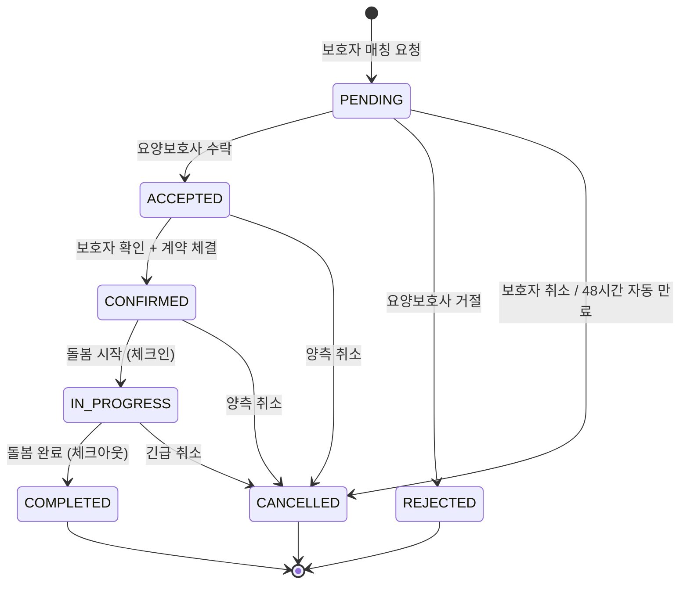

# FS-C-004 매칭 요청 수락/거절

> 문서 버전: 1.0
> 작성일: 2026-03-30
> 우선순위: P0
> 상태: Draft

---

## 1. 개요
- 보호자의 매칭 요청을 수신하고, 어르신 정보/돌봄 조건/보수를 확인한 후 수락 또는 거절하는 기능이다. 수락 시 채팅방이 생성되어 상세 상담이 시작되며, 48시간 미응답 시 자동 만료된다.
- 대상 사용자: 요양보호사 (자격 인증 완료, 프로필 활성화 상태)
- 관련 PRD 섹션: 3.4 돌봄 요청 알림 및 수락/거절, SERVICE_PLAN 3.2.4, 4.2 단계 3

## 2. 유저 스토리
- As a 요양보호사, I want to 내 조건에 맞는 매칭 요청만 푸시 알림으로 수신하여, so that 불필요한 알림 없이 적합한 요청에 집중할 수 있다.
- As a 요양보호사, I want to 요청 상세(어르신 정보, 서비스 내용, 보수)를 확인한 후 수락/거절하여, so that 충분한 정보를 바탕으로 판단할 수 있다.
- As a 요양보호사, I want to 수락 후 보호자와 채팅으로 상세 상담하여, so that 계약 전에 추가 정보를 교환할 수 있다.

## 3. 화면 구성

### 3.1 화면 목록
| 화면 ID | 화면명 | 진입 경로 | 구현 파일 |
|---------|--------|-----------|-----------|
| SC-C-004-1 | 매칭 요청 목록 | /care (매칭 탭) | `src/app/(app)/care/page.tsx` |
| SC-C-004-2 | 매칭 요청 상세 | /care/[id] (매칭 상세) | `src/app/(app)/care/[id]/page.tsx` |
| SC-C-004-3 | 알림 목록 (매칭 관련) | /notifications | 알림 페이지 |
| SC-C-004-4 | 채팅 (매칭 수락 후) | /chat/[matchId] | 채팅 페이지 |

### 3.2 화면별 상세

#### SC-C-004-1: 매칭 요청 목록
- UI 구성 요소: 매칭 요청 카드 리스트, 상태 뱃지 (PENDING/ACCEPTED/REJECTED/CONFIRMED 등), 필터 (상태별)
- 데이터 표시: 보호자 이름, 서비스 유형, 돌봄 시작일, 예상 보수, 요청 시간, 응답 기한(48시간)
- 인터랙션: 카드 탭 → 매칭 상세 이동, 스와이프/버튼으로 빠른 수락/거절

#### SC-C-004-2: 매칭 요청 상세
- UI 구성 요소:
  - 보호자 정보 카드 (이름, 프로필 이미지)
  - 돌봄 대상자(어르신) 정보: 이름, 성별, 나이, 장기요양등급, 주요 질환, 이동능력
  - 서비스 조건: 서비스 유형, 요일/시간 스케줄, 보수(시급), 특수 요청사항
  - 수락/거절 버튼
  - 채팅 메시지 목록 (수락 후)
- 데이터 표시: Match 모델 전체 + Guardian 정보 + CareRecipient 정보
- 인터랙션:
  - "수락" 버튼 → PATCH /api/matches/[id] (status: ACCEPTED)
  - "거절" 버튼 → 거절 사유 선택 모달 → PATCH /api/matches/[id] (status: REJECTED)
  - 수락 후 채팅 메시지 전송 가능

## 4. 상세 동작 명세

### 4.1 정상 플로우

#### 매칭 요청 수신 및 수락
1. 보호자가 POST /api/matches 로 매칭 요청 생성
2. 요양보호사에게 푸시 알림 발송 (설정 조건 일치: 지역/시간/서비스 유형)
3. 요양보호사가 알림 탭 → 매칭 요청 상세 화면 진입
4. 어르신 정보, 서비스 조건, 보수 확인
5. "수락" 버튼 클릭 → PATCH /api/matches/[id] (status: "ACCEPTED")
6. 상태 전이: PENDING → ACCEPTED
7. 보호자에게 수락 알림 발송
8. 채팅방 자동 생성 → 상세 정보 교환
9. 보호자 확인 후 → CONFIRMED → 계약 진행

#### 매칭 요청 거절
1. 매칭 요청 상세에서 "거절" 버튼 클릭
2. 거절 사유 선택 모달 표시
3. 사유 선택 후 "거절" 확정 → PATCH /api/matches/[id] (status: "REJECTED")
4. 보호자에게 거절 알림 발송

### 4.2 예외 플로우
- **48시간 미응답**: 매칭 요청 수신 후 48시간 이내 응답 없음 → 자동 만료 처리, "응답 없음"으로 기록, 반복 시 검색 노출 순위 하락 안내 표시
- **잘못된 상태 전이**: PENDING이 아닌 상태에서 수락/거절 시도 → API 400 응답 ("'ACCEPTED' 상태에서 'ACCEPTED' 상태로 변경할 수 없습니다")
- **매칭 정보 없음**: 삭제되거나 존재하지 않는 매칭 ID → API 404 응답
- **네트워크 오류**: 수락/거절 API 호출 실패 → 재시도 안내

### 4.3 비즈니스 규칙
- 매칭 상태 전이 규칙 (State Machine):
  - PENDING → ACCEPTED, REJECTED, CANCELLED
  - ACCEPTED → CONFIRMED, CANCELLED
  - CONFIRMED → IN_PROGRESS, CANCELLED
  - IN_PROGRESS → COMPLETED, CANCELLED
  - REJECTED, COMPLETED, CANCELLED → (종료 상태, 전이 불가)
- 24시간 내 응답 권장 (SERVICE_PLAN 기준), 48시간 미응답 시 자동 만료 (PRD 기준)
- 거절 사유 옵션:
  1. 해당 기간 스케줄 불가
  2. 이동 거리가 너무 멀음
  3. 케어 조건이 전문분야와 맞지 않음
  4. 다른 매칭을 우선 진행 중
  5. 기타 (직접 입력)
- 수락 시 자동으로 채팅방 생성 (InterviewMessage)
- 보호자는 최대 5명에게 동시 매칭 요청 가능
- 수락 시 respondedAt 타임스탬프 기록
- 거절 시 respondedAt 타임스탬프 기록
- 확정(CONFIRMED) 시 confirmedAt 기록
- 취소(CANCELLED) 시 cancelledAt + cancelReason 기록

## 5. 수용 기준 (Acceptance Criteria)

```
Given 매칭 요청을 수신했을 때
When 푸시 알림을 탭하면
Then 보호자의 돌봄 조건 요약 화면이 표시된다 (어르신 상태, 지역, 시간, 시급)

Given 요양보호사가 수락 버튼을 탭했을 때
When 수락이 완료되면
Then 채팅방이 생성되고 보호자에게 수락 알림이 발송된다

Given 요양보호사가 거절 버튼을 탭했을 때
When 거절 사유를 선택하고 확정하면
Then 매칭 상태가 REJECTED로 변경되고 보호자에게 거절 알림이 발송된다

Given 매칭 요청을 48시간 이내에 응답하지 않으면
When 자동 만료되면
Then "응답 없음"으로 처리되고, 반복 시 검색 노출 순위가 낮아진다는 안내가 표시된다

Given PENDING 상태의 매칭에 대해 수락을 시도할 때
When API가 정상 응답하면
Then 상태가 ACCEPTED로 변경되고 respondedAt이 기록된다
```

## 6. API 연동

### 6.1 사용 API 목록
| Method | Endpoint | 설명 |
|--------|----------|------|
| GET | `/api/matches` | 매칭 요청 목록 조회 (CAREGIVER 역할 기반) |
| GET | `/api/matches/[id]` | 매칭 요청 상세 조회 (어르신 정보, 채팅 포함) |
| PATCH | `/api/matches/[id]` | 매칭 상태 변경 (수락/거절/확정/취소) |
| GET | `/api/matches/[id]/messages` | 채팅 메시지 조회 |
| POST | `/api/matches/[id]/messages` | 채팅 메시지 전송 |
| GET | `/api/notifications` | 알림 목록 (매칭 관련 알림 포함) |

### 6.2 주요 요청/응답 스키마

**GET /api/matches (CAREGIVER 역할)**
```json
// Response (200)
{
  "matches": [
    {
      "id": "...",
      "guardianId": "...",
      "caregiverId": "...",
      "status": "PENDING",
      "serviceCategory": "HOME_CARE",
      "startDate": "2026-04-01T00:00:00Z",
      "schedule": [{ "dayOfWeek": "MON", "startTime": "09:00", "endTime": "13:00" }],
      "specialRequests": "치매 어르신이라 인내심이 필요합니다.",
      "estimatedRate": 18000,
      "requestedAt": "2026-03-30T10:00:00Z",
      "guardian": {
        "user": { "id": "...", "name": "박민준", "profileImage": "..." },
        "careRecipients": [
          { "name": "박○○", "gender": "FEMALE", "birthYear": 1947, "careLevel": "LEVEL_3" }
        ]
      },
      "recipients": [...]
    }
  ]
}
```

**PATCH /api/matches/[id] (수락)**
```json
// Request
{
  "status": "ACCEPTED"
}

// Response (200)
{
  "match": {
    "id": "...",
    "status": "ACCEPTED",
    "respondedAt": "2026-03-30T12:00:00Z",
    "schedule": [...]
  }
}
```

**PATCH /api/matches/[id] (거절)**
```json
// Request
{
  "status": "REJECTED",
  "cancelReason": "해당 기간 스케줄 불가"
}
```

## 7. 상태 다이어그램



## 8. 데이터 모델

### Match
| 필드 | 타입 | 설명 |
|------|------|------|
| id | String (cuid) | PK |
| guardianId | String | GuardianProfile FK |
| caregiverId | String | CaregiverProfile FK |
| status | String | PENDING / ACCEPTED / REJECTED / CONFIRMED / IN_PROGRESS / COMPLETED / CANCELLED |
| serviceCategory | String | 서비스 유형 |
| startDate | DateTime | 돌봄 시작일 |
| endDate | DateTime? | 돌봄 종료일 |
| schedule | String (JSON) | 스케줄 배열 |
| specialRequests | String? | 특수 요청사항 |
| estimatedRate | Int? | 예상 시급 |
| requestedAt | DateTime | 요청 시간 |
| respondedAt | DateTime? | 응답 시간 (수락/거절) |
| confirmedAt | DateTime? | 확정 시간 |
| cancelledAt | DateTime? | 취소 시간 |
| cancelReason | String? | 취소/거절 사유 |
| completedAt | DateTime? | 완료 시간 |

### MatchRecipient
| 필드 | 타입 | 설명 |
|------|------|------|
| matchId | String | Match FK |
| careRecipientId | String | CareRecipient FK |

### InterviewMessage (채팅)
| 필드 | 타입 | 설명 |
|------|------|------|
| id | String (cuid) | PK |
| matchId | String | Match FK |
| senderId | String | User FK |
| content | String | 메시지 내용 |
| messageType | String | TEXT / IMAGE / FILE / SYSTEM / CONTRACT |
| isRead | Boolean | 읽음 여부 |

## 9. 연관 기능
- **FS-C-003 일정/스케줄 관리**: 수락된 매칭에서 CareSession 생성 → 스케줄에 반영
- **FS-C-005 돌봄 수행/일지 작성**: CONFIRMED → IN_PROGRESS 전환 후 돌봄 수행
- **FS-C-006 수입 관리/정산**: 매칭의 estimatedRate가 정산 기준
- **보호자 앱 - 매칭 요청**: 보호자 측 매칭 요청 생성 기능
- **보호자 앱 - 채팅**: 수락 후 양측 채팅 기능

## 10. 구현 현황
| 항목 | 상태 | 비고 |
|------|------|------|
| GET /api/matches (목록) | ✅ 구현 완료 | 역할 기반 매칭 목록 조회 |
| GET /api/matches/[id] (상세) | ✅ 구현 완료 | Guardian, Caregiver, Messages, Recipients 포함 |
| PATCH /api/matches/[id] (상태 변경) | ✅ 구현 완료 | State machine 검증 포함 |
| POST /api/matches (요청 생성) | ✅ 구현 완료 | Zod 스키마 검증, 보호자 전용 |
| 채팅 API (messages) | ✅ 구현 완료 | `src/app/api/matches/[id]/messages/route.ts` |
| 상태 전이 검증 (VALID_STATUS_TRANSITIONS) | ✅ 구현 완료 | `src/lib/validations/match.ts` |
| 매칭 요청 목록 UI | ✅ 구현 완료 | 돌봄 관리 페이지 |
| 매칭 상세 UI | ✅ 구현 완료 | 돌봄 세션 상세 페이지 |
| 푸시 알림 발송 | ❌ 미구현 | PRD 명세 존재, 푸시 서비스 연동 필요 |
| 48시간 자동 만료 | ❌ 미구현 | PRD 명세 존재, 스케줄러/크론 필요 |
| 거절 사유 선택 모달 | ❌ 미구현 | PRD 명세 존재, cancelReason 필드 활용 |
| 역제안 기능 | ❌ 미구현 | SERVICE_PLAN P1 명세 |
| 응답률 기반 노출 순위 조정 | ❌ 미구현 | PRD 명세 존재 |
