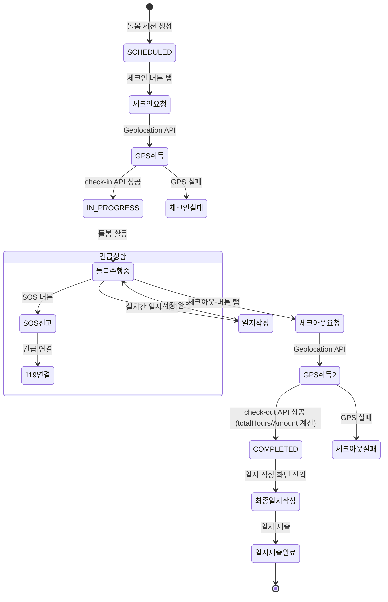

# FS-C-005 돌봄 수행 및 일지 작성

> 문서 버전: 1.0
> 작성일: 2026-03-30
> 우선순위: P0
> 상태: Draft

---

## 1. 개요
- 요양보호사가 방문 돌봄 시 GPS 기반 체크인/체크아웃, 돌봄 활동 기록(일지), 어르신 건강 상태 기록, 사진 첨부를 수행하는 기능이다. 작성된 일지는 보호자에게 실시간 전송되어 돌봄 투명성을 보장한다.
- 대상 사용자: 요양보호사 (매칭 확정 후 돌봄 수행 중)
- 관련 PRD 섹션: 3.5 돌봄 일지 작성, SERVICE_PLAN 3.2.5, 4.2 단계 4

## 2. 유저 스토리
- As a 요양보호사, I want to GPS 인증으로 출퇴근을 기록하여, so that 근무 시간을 정확하게 증명할 수 있다.
- As a 요양보호사, I want to 돌봄 일지를 체계적으로 작성하여, so that 보호자에게 돌봄 내용을 투명하게 전달할 수 있다.
- As a 요양보호사, I want to 어르신의 건강 상태(체온, 혈압, 혈당 등)를 기록하여, so that 건강 변화를 추적하고 보호자에게 보고할 수 있다.
- As a 요양보호사, I want to 특이사항(낙상, 이상 증상)을 즉시 보고하여, so that 보호자가 긴급 상황에 빠르게 대응할 수 있다.

## 3. 화면 구성

### 3.1 화면 목록
| 화면 ID | 화면명 | 진입 경로 | 구현 파일 |
|---------|--------|-----------|-----------|
| SC-C-005-1 | 돌봄 세션 상세 (체크인/아웃) | /care/[id] | `src/app/(app)/care/[id]/page.tsx` |
| SC-C-005-2 | 체크인/체크아웃 컴포넌트 | (세션 상세 내) | `src/app/(app)/care/[id]/CareCheckInOut.tsx` |
| SC-C-005-3 | 돌봄 일지 작성 | /care/[id]/journal | `src/app/(app)/care/[id]/journal/page.tsx` |
| SC-C-005-4 | SOS 긴급 버튼 | (세션 상세 내) | `src/app/(app)/care/[id]/SOSButton.tsx` |

### 3.2 화면별 상세

#### SC-C-005-1: 돌봄 세션 상세
- UI 구성 요소: 세션 정보 카드 (날짜, 시간, 시급), 체크인/체크아웃 버튼 영역, 돌봄 일지 목록, 일지 작성 버튼, SOS 긴급 버튼
- 데이터 표시: scheduledDate, startTime, endTime, hourlyRate, status, checkInTime, checkOutTime, totalHours, totalAmount
- 인터랙션: 상태에 따라 체크인/체크아웃 버튼 활성화, 일지 작성 진입

#### SC-C-005-2: 체크인/체크아웃 컴포넌트 (CareCheckInOut)
- UI 구성 요소: 체크인 버튼 (미체크인 시), 체크아웃 버튼 (체크인 완료 후), GPS 위치 표시, 시간 표시
- 데이터 표시: 현재 GPS 좌표, 체크인/아웃 시간, 주소
- 인터랙션:
  - 체크인: 브라우저 Geolocation API로 위치 취득 → POST /api/care-sessions/[id]/check-in
  - 체크아웃: 위치 취득 → POST /api/care-sessions/[id]/check-out → 자동으로 totalHours, totalAmount 계산

#### SC-C-005-3: 돌봄 일지 작성
- UI 구성 요소:
  - 제목 입력
  - 내용 입력 (자유 텍스트)
  - 활동 기록 선택 (다중 체크): 식사보조, 산책, 운동, 목욕, 배변보조, 투약관리, 인지활동 등
  - 기분/정서 선택: 좋음/보통/우울
  - 식사 기록: 메뉴, 섭취량
  - 건강 상태 입력:
    - 혈압 (bloodPressure: "120/80")
    - 혈당 (bloodSugar: mg/dL)
    - 체온 (temperature: ℃)
    - 수분 섭취 (waterIntake: ml)
  - 배변 기록 (bowelMovement)
  - 투약 여부 (medicationTaken: 체크박스)
  - 운동 기록 (exerciseLog)
  - 정신 상태 (mentalState: 맑음/혼란/무기력)
  - 수면 상태 (sleepQuality)
  - 사진 첨부 (최대 5장)
- 데이터 표시: 기본 정보 자동 입력 (날짜, 돌봄 시작/종료 시간, 총 돌봄 시간)
- 인터랙션: 항목 입력 후 "제출" → POST /api/care-sessions/[id]/journals

#### SC-C-005-4: SOS 긴급 버튼
- UI 구성 요소: 빨간색 SOS 버튼, 확인 모달
- 인터랙션: 탭 → 확인 모달 → POST /api/emergency-sos (119 연결 + 플랫폼 알림)

## 4. 상세 동작 명세

### 4.1 정상 플로우

#### 체크인 → 돌봄 수행 → 체크아웃 → 일지 작성
1. 방문 당일, 돌봄 세션 상세 화면 진입 (/care/[id])
2. "체크인" 버튼 탭 → 브라우저 GPS 위치 취득
3. POST /api/care-sessions/[id]/check-in 호출 (latitude, longitude, address)
4. 세션 상태 SCHEDULED → IN_PROGRESS 변경, checkInTime/checkInLat/checkInLng 기록
5. 보호자에게 "도착 알림" 자동 발송
6. 돌봄 수행 중 일지 실시간 입력 가능
7. 서비스 종료 → "체크아웃" 버튼 탭 → GPS 위치 취득
8. POST /api/care-sessions/[id]/check-out 호출
9. 자동 계산: totalHours = (checkOutTime - checkInTime), totalAmount = totalHours * hourlyRate
10. 세션 상태 IN_PROGRESS → COMPLETED 변경
11. 보호자에게 "종료 알림" 발송
12. 일지 작성 화면 자동 진입 (/care/[id]/journal)
13. 일지 항목 입력 후 "제출" → POST /api/care-sessions/[id]/journals
14. 보호자에게 일지 전송 알림

### 4.2 예외 플로우
- **GPS 위치 취득 실패**: 브라우저 위치 권한 거부 또는 GPS 불가 → "위치 정보(위도, 경도)가 필요합니다" 에러
- **이중 체크인**: 이미 체크인 완료 상태에서 재시도 → "이미 체크인이 완료되었습니다" (400)
- **체크인 없이 체크아웃**: 체크인 미완료 상태에서 체크아웃 시도 → "체크인을 먼저 완료해주세요" (400)
- **이중 체크아웃**: 이미 체크아웃 완료 상태에서 재시도 → "이미 체크아웃이 완료되었습니다" (400)
- **일지 필수 항목 미입력**: 제목 또는 내용 미입력 → "제목과 내용을 입력해주세요" (400)
- **특이사항 기록 시 긴급 알림**: 낙상, 이상 증상 등 특이사항 기록 → 보호자에게 즉시 긴급 알림 (일반 알림과 구분)

### 4.3 비즈니스 규칙
- 체크인/체크아웃은 GPS 좌표(위도, 경도) 필수
- 체크인 시 세션 상태가 IN_PROGRESS로 자동 변경
- 체크아웃 시 totalHours 자동 계산: (체크아웃시간 - 체크인시간) / 3,600,000 (ms→시간), 소수점 둘째자리 반올림
- totalAmount 자동 계산: Math.round(totalHours * hourlyRate)
- 체크아웃 시 세션 상태가 COMPLETED로 자동 변경
- 일지의 activities는 JSON 배열로 저장
- 일지의 images는 JSON 배열로 저장 (파일 URL 목록)
- 일지 제출 시 보호자 앱에 5초 이내 반영 (PRD 기준)
- 하나의 돌봄 세션에 복수 일지 작성 가능 (실시간 입력)
- SOS 긴급 신고 시 EmergencySOS 레코드 생성 + 119 연결

## 5. 수용 기준 (Acceptance Criteria)

```
Given 요양보호사가 돌봄 세션 상세에서 "체크인" 버튼을 탭했을 때
When GPS 위치가 정상 취득되면
Then 체크인이 완료되고 세션 상태가 IN_PROGRESS로 변경되며 보호자에게 도착 알림이 발송된다

Given 체크인 완료 후 "체크아웃" 버튼을 탭했을 때
When 체크아웃이 완료되면
Then 총 돌봄 시간과 금액이 자동 계산되고 세션 상태가 COMPLETED로 변경된다

Given 요양보호사가 돌봄 종료 GPS 인증을 했을 때
When 일지 작성 화면이 자동으로 열리면
Then 당일 돌봄 시작 시간이 자동 입력되어 있다

Given 일지를 제출했을 때
When 제출이 완료되면
Then 보호자에게 푸시 알림이 발송되고, 일지 내용이 보호자 앱에 표시된다

Given 특이사항(낙상, 이상 증상)이 기록된 경우
When 일지를 제출하면
Then 보호자에게 즉시 긴급 알림이 발송된다 (일반 알림과 구분)

Given 이미 체크인이 완료된 세션에서
When 다시 체크인을 시도하면
Then "이미 체크인이 완료되었습니다" 에러가 표시된다
```

## 6. API 연동

### 6.1 사용 API 목록
| Method | Endpoint | 설명 |
|--------|----------|------|
| POST | `/api/care-sessions/[id]/check-in` | GPS 체크인 (위도, 경도, 주소) |
| POST | `/api/care-sessions/[id]/check-out` | GPS 체크아웃 (위도, 경도) |
| GET | `/api/care-sessions/[id]/journals` | 돌봄 일지 목록 조회 |
| POST | `/api/care-sessions/[id]/journals` | 돌봄 일지 작성 |
| GET | `/api/care-sessions/[id]` | 돌봄 세션 상세 조회 |
| POST | `/api/emergency-sos` | 긴급 SOS 신고 |
| POST | `/api/upload` | 일지 사진 업로드 |

### 6.2 주요 요청/응답 스키마

**POST /api/care-sessions/[id]/check-in**
```json
// Request
{
  "latitude": 37.5665,
  "longitude": 126.9780,
  "address": "서울특별시 중구 세종대로 110"
}

// Response (200)
{
  "session": {
    "id": "...",
    "status": "IN_PROGRESS",
    "checkInLat": 37.5665,
    "checkInLng": 126.9780,
    "checkInTime": "2026-04-01T09:00:00Z",
    "checkInAddress": "서울특별시 중구 세종대로 110",
    "actualStart": "2026-04-01T09:00:00Z"
  }
}
```

**POST /api/care-sessions/[id]/check-out**
```json
// Request
{
  "latitude": 37.5665,
  "longitude": 126.9780
}

// Response (200)
{
  "session": {
    "id": "...",
    "status": "COMPLETED",
    "checkOutLat": 37.5665,
    "checkOutLng": 126.9780,
    "checkOutTime": "2026-04-01T13:05:00Z",
    "actualEnd": "2026-04-01T13:05:00Z",
    "totalHours": 4.08,
    "totalAmount": 73440
  }
}
```

**POST /api/care-sessions/[id]/journals**
```json
// Request
{
  "title": "2026-04-01 돌봄 일지",
  "content": "오늘 산책과 식사보조를 수행했습니다. 전반적으로 기분 좋아하셨습니다.",
  "activities": ["식사보조", "산책", "투약관리"],
  "mood": "좋음",
  "meals": "점심: 된장찌개, 밥 (섭취량: 보통)",
  "bloodPressure": "130/85",
  "bloodSugar": 120,
  "temperature": 36.5,
  "waterIntake": 500,
  "bowelMovement": "정상 1회",
  "medicationTaken": true,
  "exerciseLog": "실내 스트레칭 15분",
  "mentalState": "맑음",
  "sleepQuality": "양호",
  "images": ["https://...image1.jpg", "https://...image2.jpg"]
}

// Response (201)
{
  "journal": {
    "id": "...",
    "careSessionId": "...",
    "title": "2026-04-01 돌봄 일지",
    "activities": ["식사보조", "산책", "투약관리"],
    "images": ["https://...image1.jpg", "https://...image2.jpg"],
    ...
  }
}
```

## 7. 상태 다이어그램



## 8. 데이터 모델

### CareSession (돌봄 수행 관련 필드)
| 필드 | 타입 | 설명 |
|------|------|------|
| status | String | SCHEDULED / IN_PROGRESS / COMPLETED / CANCELLED |
| actualStart | DateTime? | 실제 시작 시간 (체크인 시점) |
| actualEnd | DateTime? | 실제 종료 시간 (체크아웃 시점) |
| checkInLat | Float? | 체크인 위도 |
| checkInLng | Float? | 체크인 경도 |
| checkInTime | DateTime? | 체크인 시간 |
| checkInAddress | String? | 체크인 주소 |
| checkOutLat | Float? | 체크아웃 위도 |
| checkOutLng | Float? | 체크아웃 경도 |
| checkOutTime | DateTime? | 체크아웃 시간 |
| totalHours | Float? | 총 돌봄 시간 (자동 계산) |
| totalAmount | Int? | 총 금액 (자동 계산) |
| hourlyRate | Int | 시급 |

### Journal (돌봄 일지)
| 필드 | 타입 | 설명 |
|------|------|------|
| id | String (cuid) | PK |
| careSessionId | String | CareSession FK |
| title | String | 일지 제목 |
| content | String | 일지 내용 (자유 텍스트) |
| activities | String (JSON) | 활동 목록 배열 |
| mood | String? | 기분/정서 (좋음/보통/우울) |
| meals | String? | 식사 기록 |
| bloodPressure | String? | 혈압 (예: "130/85") |
| bloodSugar | Int? | 혈당 (mg/dL) |
| temperature | Float? | 체온 (℃) |
| waterIntake | Int? | 수분 섭취량 (ml) |
| bowelMovement | String? | 배변 기록 |
| medicationTaken | Boolean | 투약 여부 |
| exerciseLog | String? | 운동 기록 |
| mentalState | String? | 정신 상태 (맑음/혼란/무기력) |
| sleepQuality | String? | 수면 상태 |
| images | String (JSON) | 첨부 사진 URL 배열 |

### EmergencySOS
| 필드 | 타입 | 설명 |
|------|------|------|
| id | String (cuid) | PK |
| userId | String | 신고자 User ID |
| careSessionId | String? | 관련 돌봄 세션 ID |
| latitude | Float? | 신고 위치 위도 |
| longitude | Float? | 신고 위치 경도 |
| status | String | ACTIVE / RESOLVED / FALSE_ALARM |
| notes | String? | 메모 |

## 9. 연관 기능
- **FS-C-003 일정/스케줄 관리**: SCHEDULED 세션에서 체크인으로 IN_PROGRESS 전환
- **FS-C-004 매칭 요청 수락/거절**: 매칭 확정 후 생성된 세션에서 돌봄 수행
- **FS-C-006 수입 관리/정산**: 돌봄 완료(COMPLETED) 후 totalAmount 기반 정산 생성
- **보호자 앱 - 돌봄 모니터링**: 일지 작성 즉시 보호자 앱에 반영
- **보호자 앱 - 리뷰**: 돌봄 완료 후 보호자가 리뷰 작성

## 10. 구현 현황
| 항목 | 상태 | 비고 |
|------|------|------|
| 체크인 API (POST check-in) | ✅ 구현 완료 | GPS 좌표 + 상태 변경 + actualStart 기록 |
| 체크아웃 API (POST check-out) | ✅ 구현 완료 | GPS 좌표 + totalHours/Amount 자동 계산 |
| 돌봄 일지 조회 API (GET journals) | ✅ 구현 완료 | JSON 파싱 (activities, images) |
| 돌봄 일지 작성 API (POST journals) | ✅ 구현 완료 | 전체 항목 저장 |
| 체크인/체크아웃 UI 컴포넌트 | ✅ 구현 완료 | `CareCheckInOut.tsx` |
| SOS 긴급 버튼 컴포넌트 | ✅ 구현 완료 | `SOSButton.tsx` |
| 돌봄 일지 작성 페이지 | ✅ 구현 완료 | `src/app/(app)/care/[id]/journal/page.tsx` |
| 긴급 SOS API | ✅ 구현 완료 | `src/app/api/emergency-sos/route.ts` |
| 파일 업로드 API | ✅ 구현 완료 | `src/app/api/upload/route.ts` |
| 체크아웃 후 일지 자동 진입 | ⚠️ 부분 구현 | UI 연결 확인 필요 |
| 보호자 실시간 알림 (5초 이내) | ❌ 미구현 | PRD 명세, 실시간 알림 서비스 필요 |
| 특이사항 긴급 알림 구분 | ❌ 미구현 | PRD 명세, 알림 유형 분류 필요 |
| 사진 첨부 (최대 5장) | ⚠️ 부분 구현 | 업로드 API 존재, 일지 UI 내 연동 확인 필요 |
| 서비스 체크리스트 | ❌ 미구현 | SERVICE_PLAN P1 명세 |
