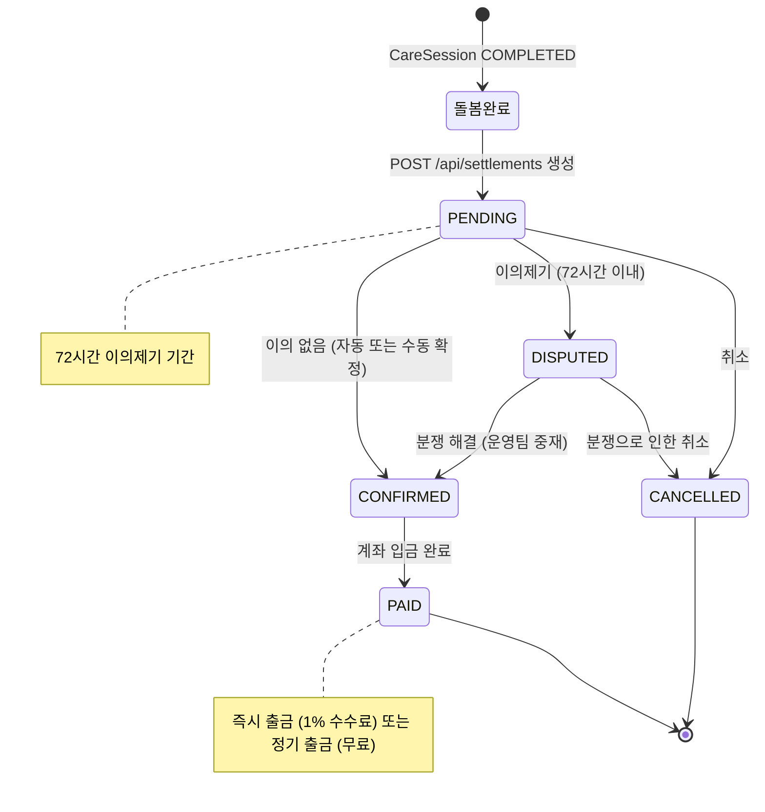

# FS-C-006 수입 관리 및 정산

> 문서 버전: 1.0
> 작성일: 2026-03-30
> 우선순위: P0
> 상태: Draft

---

## 1. 개요
- 요양보호사가 월별/건별 수입 내역, 플랫폼 수수료, 실수령액을 확인하고 정산 처리를 관리하는 기능이다. 돌봄 완료 후 72시간 이의제기 기간을 거쳐 정산이 확정되며, 즉시 출금 또는 정기 출금을 선택할 수 있다.
- 대상 사용자: 요양보호사 (돌봄 세션 완료 후)
- 관련 PRD 섹션: 3.6 수입 관리 및 정산, SERVICE_PLAN 3.2.6, 4.2 단계 5

## 2. 유저 스토리
- As a 요양보호사, I want to 이번 달 총 수입과 정산 예정 금액을 한눈에 확인하여, so that 수입 관리를 효율적으로 할 수 있다.
- As a 요양보호사, I want to 건별 정산 내역(날짜, 시간, 보호자, 금액, 수수료)을 확인하여, so that 정확한 수입을 파악할 수 있다.
- As a 요양보호사, I want to 정산금을 즉시 출금하거나 정기 출금으로 수령하여, so that 내 상황에 맞게 자금을 관리할 수 있다.
- As a 요양보호사, I want to 정산에 이의가 있을 때 이의제기하여, so that 부당한 정산을 바로잡을 수 있다.

## 3. 화면 구성

### 3.1 화면 목록
| 화면 ID | 화면명 | 진입 경로 | 구현 파일 |
|---------|--------|-----------|-----------|
| SC-C-006-1 | 정산 관리 | /care/settlement | `src/app/(app)/care/settlement/page.tsx` |
| SC-C-006-2 | 정산 액션 컴포넌트 | (정산 상세 내) | `src/app/(app)/care/settlement/SettlementActions.tsx` |

### 3.2 화면별 상세

#### SC-C-006-1: 정산 관리
- UI 구성 요소:
  - 월별 수입 요약 카드: 이번 달 총 수입, 총 돌봄 시간, 플랫폼 수수료 합계, 예상 실수령액
  - 정산 내역 리스트: 각 정산 카드에 날짜, 보호자명, 금액, 수수료, 실수령액, 상태 표시
  - 상태 필터: 전체 / 정산 대기(PENDING) / 확정(CONFIRMED) / 이의제기(DISPUTED) / 지급 완료(PAID)
  - 월 선택기: 이전/다음 월 이동
- 데이터 표시: Settlement 목록 + CareSession 정보 + Guardian 정보
- 인터랙션: 정산 카드 탭 → 상세 내역 확인, 상태 필터 전환

#### SC-C-006-2: 정산 액션 (SettlementActions)
- UI 구성 요소: 확정 버튼, 이의제기 버튼, 이의제기 사유 입력 모달
- 데이터 표시: 현재 정산 상태, 이의제기 기한 (D+3)
- 인터랙션:
  - PENDING 상태 → "확정" 버튼 → PATCH /api/settlements/[id] (status: CONFIRMED)
  - PENDING 상태 → "이의제기" 버튼 → 사유 입력 → PATCH /api/settlements/[id] (status: DISPUTED)

## 4. 상세 동작 명세

### 4.1 정상 플로우

#### 정산 생성 → 확정 → 지급
1. 돌봄 세션 완료(COMPLETED) → 체크아웃 시 totalAmount 자동 계산
2. POST /api/settlements 호출 → Settlement 레코드 생성
   - amount: 총 금액 (totalAmount)
   - platformFee: Math.round(amount * 0.03) — 3% 플랫폼 수수료
   - netAmount: amount - platformFee — 실수령액
   - status: PENDING
3. 72시간 이의제기 기간 시작
4. 이의제기 없음 → 자동 정산 확정 (PENDING → CONFIRMED)
5. 정산 확정 → 출금 방식 선택:
   - 즉시 출금 (수수료 1%)
   - 정기 출금 (매주/매월, 수수료 없음)
6. 계좌 입금 완료 → PAID 상태로 변경

#### 수입 내역 조회
1. /care/settlement 페이지 진입
2. 이번 달 수입 요약 카드 표시
3. 정산 내역 리스트 (최신순) 표시
4. 월 선택기로 이전/다음 월 조회
5. 상태 필터로 특정 상태 정산만 조회

### 4.2 예외 플로우
- **이의제기**: PENDING 상태에서 72시간 이내 이의제기 → DISPUTED 상태로 변경 → 운영팀 중재 → 해결 후 CONFIRMED 또는 CANCELLED
- **중복 정산 생성**: 이미 Settlement이 존재하는 세션에 재생성 시도 → "이미 정산이 존재합니다" (409)
- **총 금액 미계산**: totalAmount가 null인 세션에 정산 생성 시도 → "총 금액이 계산되지 않았습니다" (400)
- **세션 미존재**: 존재하지 않는 careSessionId → "돌봄 세션을 찾을 수 없습니다" (404)

### 4.3 비즈니스 규칙
- 플랫폼 수수료: 총 금액의 3% (Math.round(amount * 0.03))
- 실수령액: 총 금액 - 플랫폼 수수료 (netAmount = amount - platformFee)
- 정산 상태 전이:
  - PENDING → CONFIRMED (정산 확정, 이의 없음)
  - PENDING → DISPUTED (이의제기)
  - CONFIRMED → PAID (지급 완료)
  - DISPUTED → CONFIRMED (분쟁 해결 후 확정)
  - DISPUTED → CANCELLED (분쟁으로 인한 취소)
  - PENDING/CONFIRMED/DISPUTED → CANCELLED (취소)
- 72시간 이의제기 기간: 서비스 완료 후 72시간 (3 영업일)
- 즉시 출금 시 수수료 1% 추가 차감
- 정기 출금 시 수수료 없음 (매주 금요일 또는 매월 25일)
- 정산금 D+3 영업일 이내 입금 (PRD 기준)
- 하나의 CareSession에 하나의 Settlement만 존재 (unique 제약)
- 연간 수입 증명서 발급 기능 (1월)
- 사업소득 원천징수: 3.3% (개인 사업소득)

## 5. 수용 기준 (Acceptance Criteria)

```
Given 돌봄이 완료되고 정산이 생성된 후
When 72시간 이내에 이의제기가 없으면
Then 정산이 자동 확정되고 요양보호사에게 확정 알림이 발송된다

Given 정산 확정 후 D+3 영업일에 정산 처리가 완료되면
When 요양보호사 계좌로 입금이 완료되면
Then 앱에서 정산 완료(PAID) 알림이 발송되고 상태가 업데이트된다

Given 수입 내역 화면에서 특정 월을 선택하면
When 해당 월의 내역을 확인하면
Then 날짜별, 보호자별 상세 내역이 표시된다

Given 정산 상세에서 이의제기 버튼을 탭했을 때
When 사유를 입력하고 제출하면
Then 정산 상태가 DISPUTED로 변경되고 운영팀에 알림이 발송된다

Given 정산 관리 화면에 진입했을 때
When 이번 달 정산 데이터가 있으면
Then 총 수입, 총 돌봄 시간, 수수료 합계, 실수령액 요약이 표시된다

Given 이미 정산이 존재하는 세션에 대해
When 중복 정산을 생성하려고 하면
Then "이미 정산이 존재합니다" 에러가 반환된다
```

## 6. API 연동

### 6.1 사용 API 목록
| Method | Endpoint | 설명 |
|--------|----------|------|
| GET | `/api/settlements` | 정산 목록 조회 (CAREGIVER 역할 기반) |
| POST | `/api/settlements` | 정산 생성 (careSessionId 기반) |
| GET | `/api/settlements/[id]` | 정산 상세 조회 |
| PATCH | `/api/settlements/[id]` | 정산 상태 변경 (확정/이의제기/지급) |

### 6.2 주요 요청/응답 스키마

**GET /api/settlements (CAREGIVER 역할)**
```json
// Response (200)
{
  "settlements": [
    {
      "id": "...",
      "careSessionId": "...",
      "caregiverId": "...",
      "amount": 73440,
      "platformFee": 2203,
      "netAmount": 71237,
      "status": "PENDING",
      "confirmedAt": null,
      "paidAt": null,
      "createdAt": "2026-04-01T13:10:00Z",
      "careSession": {
        "id": "...",
        "scheduledDate": "2026-04-01T00:00:00Z",
        "totalHours": 4.08,
        "totalAmount": 73440,
        "match": {
          "guardian": {
            "user": { "id": "...", "name": "박민준" }
          }
        }
      }
    }
  ]
}
```

**POST /api/settlements (정산 생성)**
```json
// Request
{
  "careSessionId": "session-id..."
}

// Response (201)
{
  "settlement": {
    "id": "...",
    "careSessionId": "...",
    "caregiverId": "...",
    "amount": 73440,
    "platformFee": 2203,
    "netAmount": 71237,
    "status": "PENDING"
  }
}
```

**PATCH /api/settlements/[id] (상태 변경)**
```json
// Request (확정)
{
  "status": "CONFIRMED"
}

// Request (이의제기)
{
  "status": "DISPUTED",
  "disputeReason": "실제 돌봄 시간과 차이가 있습니다."
}
```

## 7. 상태 다이어그램



## 8. 데이터 모델

### Settlement (정산)
| 필드 | 타입 | 설명 |
|------|------|------|
| id | String (cuid) | PK |
| careSessionId | String (unique) | CareSession FK (1:1) |
| caregiverId | String | CaregiverProfile FK |
| amount | Int | 총 금액 |
| platformFee | Int | 플랫폼 수수료 (3%, 기본값: 0) |
| netAmount | Int | 실수령액 (amount - platformFee) |
| status | String | PENDING / CONFIRMED / DISPUTED / PAID / CANCELLED |
| confirmedAt | DateTime? | 정산 확정 시간 |
| disputedAt | DateTime? | 이의제기 시간 |
| disputeReason | String? | 이의제기 사유 |
| paidAt | DateTime? | 지급 완료 시간 |
| paidMethod | String? | 지급 방식 (즉시출금/정기출금) |

### 정산 금액 계산 로직
```
amount = careSession.totalAmount  (= totalHours * hourlyRate)
platformFee = Math.round(amount * 0.03)  // 3% 수수료
netAmount = amount - platformFee
```

## 9. 연관 기능
- **FS-C-005 돌봄 수행/일지 작성**: 돌봄 완료(COMPLETED) 후 totalAmount 기반으로 정산 생성
- **FS-C-003 일정/스케줄 관리**: 돌봄 세션 정보가 정산 내역에 표시
- **FS-C-004 매칭 요청 수락/거절**: 매칭의 estimatedRate가 실제 시급(hourlyRate)으로 반영
- **관리자 백오피스 - 정산 관리**: 운영팀 정산 일괄 처리, 환불 처리
- **관리자 백오피스 - 분쟁 처리**: 이의제기 건 중재

## 10. 구현 현황
| 항목 | 상태 | 비고 |
|------|------|------|
| 정산 관리 페이지 | ✅ 구현 완료 | `src/app/(app)/care/settlement/page.tsx` |
| 정산 액션 컴포넌트 | ✅ 구현 완료 | `SettlementActions.tsx` |
| GET /api/settlements (목록) | ✅ 구현 완료 | 역할 기반 정산 목록 조회 |
| POST /api/settlements (생성) | ✅ 구현 완료 | 3% 수수료 자동 계산, 중복 방지 |
| PATCH /api/settlements/[id] | ✅ 구현 완료 | `src/app/api/settlements/[id]/route.ts` |
| Settlement DB 모델 | ✅ 구현 완료 | `prisma/schema.prisma` |
| 수수료 계산 로직 (3%) | ✅ 구현 완료 | POST /api/settlements 내 |
| 72시간 자동 확정 | ❌ 미구현 | PRD 명세 존재, 스케줄러/크론 필요 |
| 즉시 출금 기능 (1% 수수료) | ❌ 미구현 | PRD 명세, 결제 서비스 연동 필요 |
| 정기 출금 설정 | ❌ 미구현 | PRD 명세, 결제 서비스 연동 필요 |
| 월별 수입 요약 집계 | ⚠️ 부분 구현 | 클라이언트 측 합산 가능, 서버 집계 API 미확인 |
| 연간 수입 증명서 발급 | ❌ 미구현 | PRD 명세 |
| 세금 신고 가이드 (3.3%) | ❌ 미구현 | PRD P1 명세 |
| 수입 예측 (확정 예약 기반) | ❌ 미구현 | SERVICE_PLAN P1 명세 |
| 정산 알림 (확정/지급) | ❌ 미구현 | PRD 명세, 푸시 서비스 필요 |
