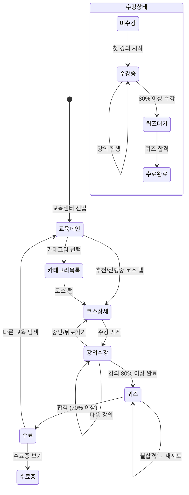

# FS-C-007 교육콘텐츠

> 문서 버전: 1.0
> 작성일: 2026-03-30
> 우선순위: P2
> 상태: Draft

---

## 1. 개요
- 요양보호사가 전문 역량을 향상시킬 수 있는 온라인 교육 콘텐츠를 제공하는 기능. 필수 교육(인권, 개인정보보호, 안전), 전문 심화 교육(치매/재활/응급), 실무 교육, 정서/소통 교육으로 구분하며, 수료 조건 충족 시 수료증을 발급하고 프로필에 배지를 부여한다.
- 대상 사용자: 요양보호사 (30~60대, 자격증 보유자)
- 관련 PRD 섹션: 3.7 교육 콘텐츠

## 2. 유저 스토리
- As a 요양보호사, I want to 연간 필수 교육(인권, 개인정보보호)을 앱에서 수강하여, so that 별도 오프라인 교육 없이 의무 교육을 이수할 수 있다.
- As a 요양보호사, I want to 치매케어, 재활보조 등 심화 교육을 수강하여, so that 전문성을 높이고 더 나은 돌봄 서비스를 제공할 수 있다.
- As a 요양보호사, I want to 교육 수료 시 수료증과 배지를 받아, so that 보호자에게 내 전문성을 증명할 수 있다.
- As a 요양보호사, I want to 필수 교육 기한 알림을 받아, so that 의무 교육 이수 기한을 놓치지 않을 수 있다.

## 3. 화면 구성

### 3.1 화면 목록
| 화면 ID | 화면명 | 진입 경로 | 구현 파일 |
|---------|--------|-----------|-----------|
| C-007-S1 | 교육 메인 | 하단 탭 또는 마이페이지 > 교육 | `src/app/(app)/education/page.tsx` |
| C-007-S2 | 교육 카테고리 목록 | 교육 메인 > 카테고리 탭 | `src/app/(app)/education/category/[type]/page.tsx` |
| C-007-S3 | 교육 상세 (코스) | 카테고리 목록 > 코스 탭 | `src/app/(app)/education/[id]/page.tsx` |
| C-007-S4 | 강의 수강 (영상/텍스트) | 코스 상세 > 강의 시작 | `src/app/(app)/education/[id]/lesson/[lessonId]/page.tsx` |
| C-007-S5 | 퀴즈 | 강의 완료 후 | `src/app/(app)/education/[id]/quiz/page.tsx` |
| C-007-S6 | 수료증 | 코스 수료 후 | `src/app/(app)/education/[id]/certificate/page.tsx` |
| C-007-S7 | 내 교육 이력 | 마이페이지 > 교육 이력 | `src/app/(app)/education/my/page.tsx` |

### 3.2 화면별 상세

#### C-007-S1 교육 메인 화면
- **헤더**: "교육센터" 타이틀
- **필수 교육 알림 배너**: 미이수 필수 교육이 있으면 상단에 경고 카드 ("인권교육 이수 마감 D-7" 등)
- **진행 중인 교육**: 현재 수강 중인 코스 카드 (진행률 프로그레스 바)
- **카테고리 섹션**: 필수 교육 / 전문 심화 / 실무 교육 / 정서·소통 (각 카드 탭 시 카테고리 목록으로 이동)
- **추천 교육**: AI/관리자 추천 코스 캐러셀
- **최근 수료 배지**: 최근 획득한 배지 목록

#### C-007-S2 교육 카테고리 목록 화면
- **헤더**: BackHeader (카테고리명)
- **코스 리스트**: 카드 형태 (썸네일, 코스명, 소요 시간, 난이도 태그, 수료 인원수)
- **필터/정렬**: 인기순 / 최신순 / 난이도순
- **수강 상태 표시**: 미수강 / 수강중(진행률%) / 수료완료 배지

#### C-007-S3 교육 상세 (코스) 화면
- **헤더**: BackHeader (코스명)
- **코스 정보**: 썸네일, 제목, 설명, 소요 시간, 강의 수, 난이도, 수료 조건
- **강의 목록**: 챕터별 강의 리스트 (순서, 제목, 소요 시간, 수강 완료 여부 체크)
- **수료 조건 안내**: "전체 강의 80% 이상 수강 + 퀴즈 통과 시 수료증 발급"
- **CTA 버튼**: "수강 시작" 또는 "이어서 수강" 또는 "수료증 보기"

#### C-007-S4 강의 수강 화면
- **영상 강의**: 영상 플레이어 (재생/일시정지, 배속, 진행 바)
- **텍스트 강의**: 리치 텍스트 콘텐츠 (마크다운 렌더링)
- **진행 추적**: 영상 80% 이상 시청 또는 텍스트 스크롤 완료 시 "수강 완료" 처리
- **다음 강의 버튼**: 수강 완료 후 활성화

#### C-007-S5 퀴즈 화면
- **문제 표시**: 객관식 또는 O/X (문제당 1화면)
- **진행 표시**: "3/10" 프로그레스
- **결과 화면**: 점수, 합격/불합격 표시, 오답 풀이
- **재시도**: 불합격 시 "다시 풀기" 버튼 (횟수 제한 없음)

#### C-007-S6 수료증 화면
- **수료증 카드**: 코스명, 수료자 이름, 수료일, 인증 번호
- **다운로드 버튼**: PDF 수료증 다운로드
- **공유 버튼**: 카카오톡/링크 공유
- **프로필 반영 안내**: "프로필에 배지가 추가되었습니다"

#### C-007-S7 내 교육 이력 화면
- **탭**: 수강중 / 수료완료
- **수강중 리스트**: 코스명, 진행률 프로그레스 바, 마지막 수강일
- **수료완료 리스트**: 코스명, 수료일, 수료증 보기 버튼, 배지 아이콘
- **배지 컬렉션**: 획득한 전체 배지 그리드 (미획득 배지는 잠금 아이콘)

## 4. 상세 동작 명세

### 4.1 정상 플로우

#### 교육 수강 플로우
1. 요양보호사가 교육 메인 화면 진입
2. 카테고리 또는 추천 코스 탭 → 코스 상세 화면
3. "수강 시작" 탭 → 첫 번째 강의 시작
4. 강의 수강 (영상 80% 시청 또는 텍스트 완독) → 수강 완료 처리
5. 다음 강의로 진행 (순차적)
6. 전체 강의 80% 이상 수강 → 퀴즈 화면 활성화
7. 퀴즈 응시 → 70% 이상 정답 시 합격
8. 수료 처리 → 수료증 발급 + 프로필 배지 추가

#### 필수 교육 알림 플로우
1. 시스템이 매년 필수 교육 이수 기한 확인
2. 미이수 시 D-30, D-7, D-Day 푸시 알림 발송
3. 교육 메인 화면 상단에 경고 배너 표시
4. 필수 교육 수료 시 배너 제거 + 이수 완료 알림

### 4.2 예외 플로우
- **수강 중 앱 종료**: 마지막 수강 위치 저장, 재진입 시 이어서 수강
- **퀴즈 불합격**: "다시 풀기" 버튼 노출, 횟수 제한 없음, 문제 순서 랜덤 셔플
- **영상 로딩 실패**: "영상을 불러올 수 없습니다. 네트워크를 확인해주세요." + 재시도 버튼
- **수료증 PDF 생성 실패**: "수료증을 생성하는 중 오류가 발생했습니다." + 재시도
- **비인증 접근**: 로그인 필요 → 로그인 화면으로 리다이렉트
- **요양보호사가 아닌 사용자**: 역할 검증 실패 → "요양보호사만 이용할 수 있습니다." 안내

### 4.3 비즈니스 규칙
- 필수 교육 주기: 연 1회 (매년 1월 1일 기준 초기화)
- 수강 완료 기준: 영상 강의 80% 이상 시청, 텍스트 강의 "수강 완료" 버튼 클릭
- 코스 수료 조건: 전체 강의 80% 이상 수강 + 퀴즈 70% 이상 정답
- 퀴즈 합격 기준: 70% 이상 정답 (재시도 횟수 무제한)
- 수료증: 코스명, 수료자명, 수료일, 고유 인증번호(UUID) 포함
- 배지 부여: 코스 수료 시 해당 카테고리 배지 자동 부여, 프로필에 즉시 반영
- 교육 콘텐츠 관리: 관리자 백오피스에서 코스/강의/퀴즈 CRUD
- 수강 진행률: (완료 강의 수 / 전체 강의 수) * 100
- 교육 대상: 요양보호사 역할(CAREGIVER) 사용자만 접근 가능

## 5. 수용 기준 (Acceptance Criteria)

```
Given 요양보호사가 교육 콘텐츠를 수강 완료했을 때
When 수료 조건(80% 이상 이수, 퀴즈 통과)을 충족하면
Then 수료증이 발급되고 프로필에 배지가 추가된다

Given 연 필수 교육 수강 기한이 도래했을 때
When 미이수 상태이면
Then 30일 전, 7일 전, 당일 알림이 발송된다

Given 요양보호사가 영상 강의를 80% 이상 시청했을 때
When 다음 강의 버튼을 탭하면
Then 해당 강의가 "수강 완료"로 표시되고 다음 강의로 이동한다

Given 요양보호사가 퀴즈에서 70% 미만 정답을 받았을 때
When 결과 화면이 표시되면
Then "불합격" 표시와 오답 풀이가 노출되고 "다시 풀기" 버튼이 활성화된다

Given 요양보호사가 수강 중 앱을 종료했을 때
When 다시 해당 코스에 진입하면
Then 마지막 수강 위치부터 이어서 수강할 수 있다

Given 요양보호사가 수료증을 발급받았을 때
When 수료증 화면에서 다운로드를 탭하면
Then PDF 형식의 수료증이 기기에 저장된다
```

## 6. API 연동

### 6.1 사용 API 목록
| Method | Endpoint | 설명 |
|--------|----------|------|
| GET | `/api/education/courses` | 코스 목록 조회 (카테고리, 정렬 필터) |
| GET | `/api/education/courses/[id]` | 코스 상세 조회 (강의 목록 포함) |
| GET | `/api/education/courses/[id]/lessons/[lessonId]` | 강의 콘텐츠 조회 |
| POST | `/api/education/courses/[id]/lessons/[lessonId]/complete` | 강의 수강 완료 처리 |
| GET | `/api/education/courses/[id]/quiz` | 퀴즈 문제 조회 |
| POST | `/api/education/courses/[id]/quiz/submit` | 퀴즈 답안 제출 |
| GET | `/api/education/courses/[id]/certificate` | 수료증 조회 |
| GET | `/api/education/courses/[id]/certificate/pdf` | 수료증 PDF 다운로드 |
| GET | `/api/education/my` | 내 수강 이력 조회 |
| GET | `/api/education/badges` | 내 배지 목록 조회 |

### 6.2 주요 요청/응답 스키마

#### GET /api/education/courses
**요청 파라미터:**
```
?category=REQUIRED&sort=popular&page=1
```

**성공 응답 (200):**
```json
{
  "courses": [
    {
      "id": "cuid...",
      "title": "노인 인권 교육",
      "description": "연간 필수 이수 교육...",
      "category": "REQUIRED",
      "thumbnailUrl": "/images/education/human-rights.jpg",
      "totalDuration": 60,
      "lessonCount": 5,
      "difficulty": "BASIC",
      "completedCount": 1234,
      "myProgress": null
    }
  ],
  "total": 15
}
```

#### POST /api/education/courses/[id]/quiz/submit
**요청:**
```json
{
  "answers": [
    { "questionId": "q1", "selectedOption": 2 },
    { "questionId": "q2", "selectedOption": 1 }
  ]
}
```

**성공 응답 (200):**
```json
{
  "score": 80,
  "totalQuestions": 10,
  "correctCount": 8,
  "passed": true,
  "certificateId": "cert-cuid...",
  "badgeAwarded": {
    "id": "badge-cuid...",
    "name": "인권교육 이수",
    "iconUrl": "/images/badges/human-rights.png"
  },
  "wrongAnswers": [
    { "questionId": "q3", "correctOption": 1, "explanation": "..." },
    { "questionId": "q7", "correctOption": 3, "explanation": "..." }
  ]
}
```

## 7. 상태 다이어그램



## 8. 데이터 모델

### EducationCourse 테이블 (신규)
| 필드 | 타입 | 설명 |
|------|------|------|
| id | String (cuid) | PK |
| title | String | 코스 제목 |
| description | String | 코스 설명 |
| category | String | 카테고리 (REQUIRED / ADVANCED / PRACTICAL / EMOTIONAL) |
| thumbnailUrl | String? | 썸네일 이미지 URL |
| totalDuration | Int | 총 소요 시간 (분) |
| difficulty | String | 난이도 (BASIC / INTERMEDIATE / ADVANCED) |
| isRequired | Boolean | 필수 교육 여부 (기본 false) |
| requiredPeriod | String? | 필수 교육 주기 (예: "YEARLY") |
| passingScore | Int | 퀴즈 합격 점수 (기본 70) |
| completionThreshold | Int | 수강 완료 기준 % (기본 80) |
| isActive | Boolean | 활성 상태 |
| sortOrder | Int | 정렬 순서 |
| createdAt | DateTime | 생성일 |
| updatedAt | DateTime | 수정일 |

### EducationLesson 테이블 (신규)
| 필드 | 타입 | 설명 |
|------|------|------|
| id | String (cuid) | PK |
| courseId | String | EducationCourse FK |
| title | String | 강의 제목 |
| type | String | 강의 유형 (VIDEO / TEXT) |
| contentUrl | String? | 영상 URL 또는 null |
| textContent | String? | 텍스트 콘텐츠 (마크다운) |
| duration | Int | 소요 시간 (분) |
| sortOrder | Int | 강의 순서 |
| isActive | Boolean | 활성 상태 |

### EducationQuiz 테이블 (신규)
| 필드 | 타입 | 설명 |
|------|------|------|
| id | String (cuid) | PK |
| courseId | String | EducationCourse FK |
| question | String | 문제 텍스트 |
| options | String | 선택지 JSON 배열 |
| correctOption | Int | 정답 인덱스 (0-based) |
| explanation | String? | 해설 |
| sortOrder | Int | 문제 순서 |

### UserCourseProgress 테이블 (신규)
| 필드 | 타입 | 설명 |
|------|------|------|
| id | String (cuid) | PK |
| userId | String | User FK |
| courseId | String | EducationCourse FK |
| status | String | 상태 (IN_PROGRESS / COMPLETED) |
| progress | Int | 진행률 (0~100) |
| lastLessonId | String? | 마지막 수강 강의 ID |
| quizScore | Int? | 최종 퀴즈 점수 |
| completedAt | DateTime? | 수료일 |
| createdAt | DateTime | 생성일 |
| updatedAt | DateTime | 수정일 |

**제약:** `@@unique([userId, courseId])`

### UserLessonProgress 테이블 (신규)
| 필드 | 타입 | 설명 |
|------|------|------|
| id | String (cuid) | PK |
| userId | String | User FK |
| lessonId | String | EducationLesson FK |
| isCompleted | Boolean | 수강 완료 여부 |
| watchedPercent | Int? | 영상 시청률 (%) |
| completedAt | DateTime? | 완료일 |

**제약:** `@@unique([userId, lessonId])`

### Certificate 테이블 (신규)
| 필드 | 타입 | 설명 |
|------|------|------|
| id | String (cuid) | PK |
| userId | String | User FK |
| courseId | String | EducationCourse FK |
| certificateNumber | String (unique) | 수료증 인증번호 (UUID) |
| issuedAt | DateTime | 발급일 |

### UserBadge 테이블 (신규)
| 필드 | 타입 | 설명 |
|------|------|------|
| id | String (cuid) | PK |
| userId | String | User FK |
| badgeType | String | 배지 유형 코드 |
| badgeName | String | 배지 이름 |
| iconUrl | String | 배지 아이콘 URL |
| earnedAt | DateTime | 획득일 |

**제약:** `@@unique([userId, badgeType])`

## 9. 연관 기능
- **선행 기능**: FS-C-001 회원가입/자격인증 (요양보호사 인증 완료 필요)
- **후행 기능**: FS-C-009 포트폴리오 (수료 교육 목록, 배지 연동), FS-C-002 프로필관리 (배지 표시)
- **의존 기능**: 관리자 백오피스 (교육 콘텐츠 CMS), 알림 시스템 (필수 교육 알림), 파일 스토리지 (영상/이미지)

## 10. 구현 현황
| 항목 | 상태 | 비고 |
|------|------|------|
| 프론트엔드 | ❌ | 미구현 |
| API | ❌ | 미구현 |
| DB 모델 | ❌ | EducationCourse, Lesson, Quiz, Progress, Certificate, Badge 모델 미생성 |
| 교육 콘텐츠 | ❌ | 실제 교육 콘텐츠(영상, 텍스트, 퀴즈) 미제작 |
| 알림 연동 | ❌ | 필수 교육 기한 알림 미구현 |
