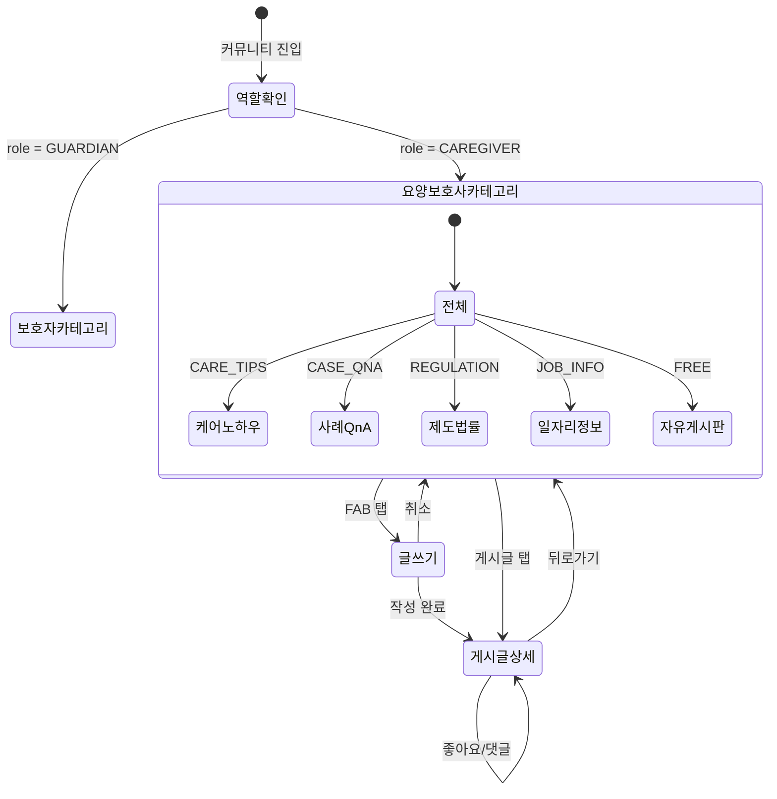

# FS-C-008 커뮤니티

> 문서 버전: 1.0
> 작성일: 2026-03-30
> 우선순위: P2
> 상태: Draft

---

## 1. 개요
- 요양보호사들이 케어 경험을 공유하고, 질문하고, 정보를 교환하는 동료 네트워크 커뮤니티. 보호자 커뮤니티(FS-G-015)와 동일한 기술 인프라(CommunityPost/Comment/Like)를 공유하되, 요양보호사 특화 카테고리(케어 노하우, 사례 Q&A, 제도/법률, 일자리 정보, 자유 게시판)를 제공한다.
- 대상 사용자: 요양보호사 (30~60대, 자격증 보유자)
- 관련 PRD 섹션: 3.8 커뮤니티 (동료 네트워크)

## 2. 유저 스토리
- As a 요양보호사, I want to 케어 경험과 노하우를 동료들과 공유하여, so that 더 나은 돌봄 방법을 함께 배울 수 있다.
- As a 요양보호사, I want to 어려운 케어 사례에 대해 질문하고 답변을 받아, so that 실전 경험에서 해결책을 찾을 수 있다.
- As a 요양보호사, I want to 제도/법률 변경 정보를 확인하여, so that 최신 요양보호 관련 제도를 숙지할 수 있다.
- As a 요양보호사, I want to 일자리 정보를 공유하고 열람하여, so that 좋은 근무 기회를 놓치지 않을 수 있다.
- As a 요양보호사, I want to 자유 게시판에서 일상을 나누어, so that 동료 요양보호사들과 유대감을 형성할 수 있다.

## 3. 화면 구성

### 3.1 화면 목록
| 화면 ID | 화면명 | 진입 경로 | 구현 파일 |
|---------|--------|-----------|-----------|
| C-008-S1 | 요양보호사 커뮤니티 메인 | 하단 탭 > 커뮤니티 (요양보호사 역할) | `src/app/(app)/community/page.tsx` (공용) |
| C-008-S2 | 게시글 상세 | 커뮤니티 메인 > 게시글 탭 | `src/app/(app)/community/[id]/page.tsx` (공용) |
| C-008-S3 | 글쓰기 | 커뮤니티 메인 > 글쓰기 FAB | `src/app/(app)/community/write/page.tsx` (공용) |

### 3.2 화면별 상세

#### C-008-S1 요양보호사 커뮤니티 메인 화면
- **구현 방식**: 보호자 커뮤니티(FS-G-015)와 동일 페이지를 공유하며, 사용자 역할(CAREGIVER)에 따라 카테고리 탭이 다르게 표시된다.
- **헤더**: 고정 헤더, "커뮤니티" 타이틀
- **검색 영역**: 보호자 커뮤니티와 동일 (`CommunitySearch` 공용)
- **카테고리 탭** (요양보호사 전용):
  - 전체 (ALL)
  - 케어 노하우 (CARE_TIPS) — 돌봄 팁, 케어 경험 공유
  - 사례 Q&A (CASE_QNA) — 어려운 케어 상황 질문/답변
  - 제도/법률 (REGULATION) — 요양보호 관련 제도, 법률 변경 정보
  - 일자리 정보 (JOB_INFO) — 요양기관 채용, 돌봄 일자리 공유
  - 자유 게시판 (FREE) — 일상, 잡담, 동료 교류
- **게시글 리스트**: 보호자 커뮤니티와 동일 카드 레이아웃
- **빈 상태 / 글쓰기 FAB**: 보호자 커뮤니티와 동일

#### C-008-S2 게시글 상세 화면
- 보호자 커뮤니티(FS-G-015 G-015-S2)와 동일 구조 (BackHeader, 본문, 좋아요, 댓글 등)
- 차이점: 요양보호사 전용 카테고리 라벨 표시 (케어 노하우, 사례 Q&A 등)

#### C-008-S3 글쓰기 화면
- 보호자 커뮤니티(FS-G-015 G-015-S3)와 동일 구조
- 차이점: 카테고리 선택 시 요양보호사 전용 카테고리 목록 표시

## 4. 상세 동작 명세

### 4.1 정상 플로우

#### 역할 기반 카테고리 분기
1. 사용자가 커뮤니티 화면 진입
2. 세션에서 사용자 역할(role) 확인
3. CAREGIVER: 요양보호사 전용 카테고리 탭 표시 (CARE_TIPS, CASE_QNA, REGULATION, JOB_INFO, FREE)
4. GUARDIAN: 보호자 전용 카테고리 탭 표시 (PARENTING, EDUCATION, CAREGIVER, QNA, POLICY, HEALTH)
5. 각 역할에 해당하는 카테고리의 게시글만 조회

#### 게시글 CRUD 플로우
- 보호자 커뮤니티(FS-G-015)의 4.1 정상 플로우와 동일한 목록 조회, 작성, 상세 조회, 좋아요, 댓글 플로우를 따른다.
- 차이점: 카테고리 코드가 요양보호사 전용 코드로 설정된다.

#### 일자리 정보 게시글
1. 요양보호사가 "일자리 정보" 카테고리로 글 작성
2. 기관명, 지역, 근무 조건 등 자유 형식으로 작성
3. 다른 요양보호사가 해당 게시글을 조회하여 정보 확인

### 4.2 예외 플로우
- **역할 불일치**: 보호자가 요양보호사 전용 카테고리 접근 시 해당 카테고리 게시글이 조회되지 않음 (빈 목록)
- **비로그인 글쓰기/댓글/좋아요**: 보호자 커뮤니티와 동일 (인증 필요)
- **유효성 검증 실패**: 보호자 커뮤니티와 동일 (Zod 스키마 공용)
- **서버 오류**: 보호자 커뮤니티와 동일 에러 처리

### 4.3 비즈니스 규칙
- 요양보호사 커뮤니티 카테고리: CARE_TIPS, CASE_QNA, REGULATION, JOB_INFO, FREE
- 보호자 커뮤니티 카테고리: PARENTING, EDUCATION, CAREGIVER, QNA, POLICY, HEALTH
- 카테고리는 역할별로 분리되어 서로 다른 카테고리의 게시글이 혼재되지 않음
- 게시글/댓글/좋아요의 비즈니스 규칙은 보호자 커뮤니티(FS-G-015)와 동일
- 일자리 정보 게시글: 플랫폼 내 공식 매칭 기능과 별개로 사용자 간 비공식 정보 공유 용도
- 제도/법률 게시글: 관리자가 공지 형태로 작성 가능 (추후 공지사항 기능 연동 검토)

## 5. 수용 기준 (Acceptance Criteria)

```
Given 요양보호사 역할의 사용자가 커뮤니티에 진입했을 때
When 카테고리 탭이 표시되면
Then 케어 노하우, 사례 Q&A, 제도/법률, 일자리 정보, 자유 게시판 카테고리가 노출된다

Given 요양보호사가 "케어 노하우" 카테고리를 선택했을 때
When CARE_TIPS 카테고리 게시글이 존재하면
Then 해당 카테고리의 게시글만 필터링되어 표시된다

Given 요양보호사가 "사례 Q&A" 카테고리에서 글을 작성했을 때
When 제목과 내용을 입력하고 제출하면
Then CASE_QNA 카테고리로 게시글이 생성되고 상세 페이지로 이동한다

Given 요양보호사가 동료의 게시글에 댓글을 작성했을 때
When 댓글을 전송하면
Then 댓글이 게시글 하단에 즉시 표시된다

Given 보호자 역할의 사용자가 커뮤니티에 진입했을 때
When 카테고리 탭이 표시되면
Then 요양보호사 전용 카테고리(케어 노하우, 사례 Q&A 등)는 노출되지 않는다

Given 요양보호사가 "일자리 정보" 카테고리에서 게시글을 조회할 때
When 해당 카테고리 게시글이 존재하면
Then 일자리 관련 게시글이 최신순으로 표시된다
```

## 6. API 연동

### 6.1 사용 API 목록
| Method | Endpoint | 설명 |
|--------|----------|------|
| GET | `/api/community` | 게시글 목록 조회 (category 파라미터로 요양보호사 카테고리 필터) |
| POST | `/api/community` | 게시글 작성 (요양보호사 전용 카테고리 코드 사용) |
| GET | `/api/community/[id]` | 게시글 상세 조회 |
| PATCH | `/api/community/[id]` | 게시글 수정 |
| DELETE | `/api/community/[id]` | 게시글 삭제 (soft delete) |
| GET | `/api/community/[id]/comments` | 댓글 목록 조회 |
| POST | `/api/community/[id]/comments` | 댓글 작성 |
| POST | `/api/community/[id]/like` | 좋아요 토글 |

> **참고**: 보호자 커뮤니티(FS-G-015)와 동일한 API 엔드포인트를 공유한다. 카테고리 코드로 역할별 게시글을 구분한다.

### 6.2 주요 요청/응답 스키마

#### GET /api/community (요양보호사 카테고리 조회)
**요청 파라미터:**
```
?category=CARE_TIPS&sort=latest&page=1
```

**성공 응답 (200):**
```json
{
  "posts": [
    {
      "id": "cuid...",
      "authorId": "caregiver-user-id",
      "title": "치매 어르신 산책 시 유의사항 정리",
      "content": "제가 3년간 치매 어르신을 돌보면서...",
      "category": "CARE_TIPS",
      "images": [],
      "viewCount": 42,
      "isActive": true,
      "createdAt": "2026-03-30T...",
      "likeCount": 8,
      "commentCount": 3
    }
  ],
  "total": 25,
  "page": 1,
  "totalPages": 2
}
```

#### POST /api/community (요양보호사 게시글 작성)
**요청:**
```json
{
  "title": "2026년 요양보호사 처우개선 관련 정리",
  "content": "이번에 변경된 제도 내용을 정리해봤어요...",
  "category": "REGULATION",
  "images": []
}
```

**성공 응답 (201):**
```json
{
  "post": {
    "id": "cuid...",
    "authorId": "caregiver-user-id",
    "title": "2026년 요양보호사 처우개선 관련 정리",
    "content": "이번에 변경된 제도 내용을...",
    "category": "REGULATION",
    "images": [],
    "viewCount": 0,
    "isActive": true,
    "createdAt": "2026-03-30T..."
  }
}
```

## 7. 상태 다이어그램



## 8. 데이터 모델

> 보호자 커뮤니티(FS-G-015)의 CommunityPost, CommunityLike, CommunityComment 테이블을 공유한다.

### CommunityPost 테이블 (기존)
| 필드 | 타입 | 설명 |
|------|------|------|
| id | String (cuid) | PK |
| authorId | String | 작성자 User FK |
| title | String | 게시글 제목 |
| content | String | 게시글 내용 |
| category | String | 카테고리 코드 (보호자/요양보호사 카테고리 공존) |
| images | String | 이미지 URL JSON 배열 |
| viewCount | Int | 조회수 |
| isActive | Boolean | 활성 상태 |
| createdAt | DateTime | 생성일 |
| updatedAt | DateTime | 수정일 |

### 요양보호사 전용 카테고리 코드
| 코드 | 라벨 | 설명 |
|------|------|------|
| CARE_TIPS | 케어 노하우 | 돌봄 팁, 케어 경험 공유 |
| CASE_QNA | 사례 Q&A | 어려운 케어 상황 질문/답변 |
| REGULATION | 제도/법률 | 요양보호 관련 제도, 법률 변경 정보 |
| JOB_INFO | 일자리 정보 | 요양기관 채용, 돌봄 일자리 공유 |
| FREE | 자유 게시판 | 일상, 잡담, 동료 교류 |

### Zod 유효성 스키마
- 보호자 커뮤니티와 동일한 `createPostSchema`, `updatePostSchema`, `createCommentSchema` 공용 (`src/lib/validations/community.ts`)

## 9. 연관 기능
- **선행 기능**: FS-C-001 회원가입/자격인증 (요양보호사 인증 필요)
- **후행 기능**: 없음
- **관련 기능**: FS-G-015 커뮤니티 (보호자) — 동일 기술 인프라 공유
- **의존 기능**: NextAuth 인증 시스템, Prisma ORM, `requireAuth` 헬퍼, Zod 유효성 검증

## 10. 구현 현황
| 항목 | 상태 | 비고 |
|------|------|------|
| 프론트엔드 | ⚠️ | 커뮤니티 공용 UI 구현 완료. 역할별 카테고리 분기 미구현 (현재 보호자 카테고리만 하드코딩) |
| API | ✅ | CommunityPost CRUD + 댓글 + 좋아요 API 구현 완료 (카테고리 코드 추가만 필요) |
| DB 모델 | ✅ | CommunityPost.category 필드로 요양보호사 카테고리 저장 가능 (스키마 변경 불필요) |
| 역할 분기 | ❌ | 사용자 역할에 따른 카테고리 탭 분기 로직 미구현 |
| 카테고리 코드 | ❌ | 요양보호사 전용 카테고리 코드 (CARE_TIPS 등) 프론트엔드 미적용 |
