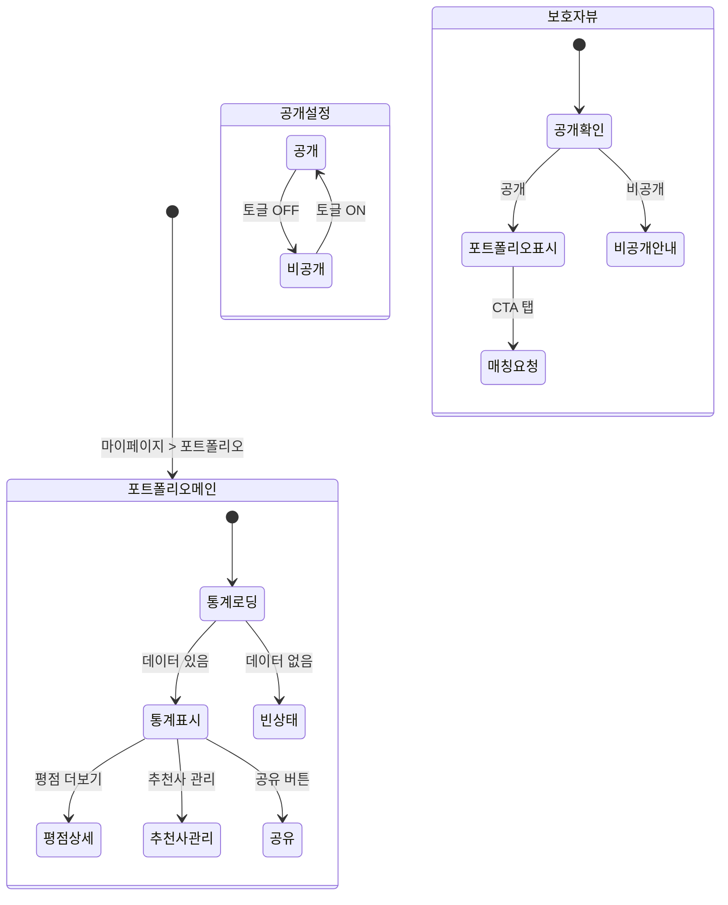

# FS-C-009 포트폴리오

> 문서 버전: 1.0
> 작성일: 2026-03-30
> 우선순위: P2
> 상태: Draft

---

## 1. 개요
- 요양보호사의 플랫폼 내 누적 돌봄 기록, 교육 이수, 평점 데이터를 자동으로 경력 포트폴리오로 구성하는 기능. 보호자에게 전문성과 신뢰를 증명하는 디지털 경력 프로필 역할을 한다.
- 대상 사용자: 요양보호사 (30~60대, 자격증 보유자)
- 관련 PRD 섹션: 3.9 경력 관리 및 포트폴리오

## 2. 유저 스토리
- As a 요양보호사, I want to 플랫폼에서 쌓은 돌봄 경력을 한눈에 볼 수 있는 포트폴리오를 갖고 싶어, so that 보호자에게 내 전문성을 효과적으로 보여줄 수 있다.
- As a 요양보호사, I want to 평균 평점 추이를 확인하여, so that 내 서비스 품질이 개선되고 있는지 확인할 수 있다.
- As a 요양보호사, I want to 수료한 교육 목록이 포트폴리오에 자동으로 반영되어, so that 추가 전문 역량을 별도로 입력하지 않아도 증명할 수 있다.
- As a 보호자, I want to 요양보호사의 경력 포트폴리오를 확인하여, so that 돌봄 역량과 경험을 객관적으로 판단하고 매칭 결정을 내릴 수 있다.

## 3. 화면 구성

### 3.1 화면 목록
| 화면 ID | 화면명 | 진입 경로 | 구현 파일 |
|---------|--------|-----------|-----------|
| C-009-S1 | 내 포트폴리오 | 마이페이지 > 포트폴리오 | `src/app/(app)/portfolio/page.tsx` |
| C-009-S2 | 포트폴리오 공개 뷰 | 요양보호사 프로필 상세 > 포트폴리오 탭 | `src/app/(app)/caregiver/[id]/portfolio/page.tsx` |
| C-009-S3 | 평점 추이 상세 | 포트폴리오 > 평점 추이 더보기 | `src/app/(app)/portfolio/ratings/page.tsx` |
| C-009-S4 | 추천사 관리 | 포트폴리오 > 추천사 관리 | `src/app/(app)/portfolio/testimonials/page.tsx` |

### 3.2 화면별 상세

#### C-009-S1 내 포트폴리오 화면 (요양보호사 본인)
- **헤더**: BackHeader ("내 포트폴리오")
- **프로필 요약 카드**:
  - 프로필 사진, 이름, 경력 연수
  - 종합 평점 (별 아이콘 + 숫자)
  - 총 돌봄 시간, 완료 건수
  - 인증 배지 목록 (자격증, 교육 수료 등)
- **경력 통계 섹션**:
  - 총 돌봄 시간 (플랫폼 내 누적)
  - 담당 케어 유형별 비율 (도넛 차트): 방문요양 / 방문목욕 / 치매케어 / 재활보조 등
  - 월별 돌봄 시간 추이 (바 차트, 최근 6개월)
- **평균 평점 추이 섹션**:
  - 월별 평균 평점 라인 차트 (최근 12개월)
  - 다차원 평점 레이더 차트 (전문성, 시간 준수, 친절함, 청결도, 의사소통)
  - "더보기" 링크 → 평점 추이 상세 화면
- **수료 교육 목록 섹션**:
  - 수료한 교육 코스 리스트 (코스명, 수료일, 배지 아이콘)
  - 빈 상태: "아직 수료한 교육이 없어요. 교육센터에서 수강해보세요!" + CTA
- **보호자 추천사 섹션**:
  - 공개 동의한 보호자 리뷰 발췌 (최대 3건)
  - 추천사 내용 (텍스트) + 작성자 이름(마스킹) + 작성일 + 평점
  - "추천사 관리" 링크 → 추천사 관리 화면
- **포트폴리오 공유 버튼**: "포트폴리오 링크 복사" 또는 "카카오톡 공유"
- **포트폴리오 공개 설정**: 토글 (공개 / 비공개)

#### C-009-S2 포트폴리오 공개 뷰 (보호자가 보는 화면)
- **헤더**: BackHeader ("포트폴리오")
- **내용**: C-009-S1과 동일한 레이아웃이나 읽기 전용
- **차이점**: 편집/설정 버튼 없음, 공개 허용된 항목만 표시
- **CTA**: "매칭 요청" 버튼 (요양보호사 프로필 상세의 매칭 요청과 연동)

#### C-009-S3 평점 추이 상세 화면
- **헤더**: BackHeader ("평점 추이")
- **기간 선택**: 3개월 / 6개월 / 12개월 / 전체
- **종합 평점 라인 차트**: 월별 평균 평점 변화
- **항목별 평점 추이**: 각 평가 항목(전문성, 시간 준수, 친절함, 청결도, 의사소통)별 라인 차트
- **리뷰 요약 통계**: 5점/4점/3점/2점/1점 분포 막대 그래프

#### C-009-S4 추천사 관리 화면
- **헤더**: BackHeader ("추천사 관리")
- **추천사 리스트**: 보호자가 작성한 리뷰 중 추천사로 등록 가능한 항목
- **각 항목**: 리뷰 내용 미리보기, 작성자(마스킹), 평점, 작성일
- **공개 토글**: 각 추천사별 포트폴리오 공개/비공개 토글
- **안내 문구**: "보호자가 작성한 리뷰 중 동의한 리뷰만 포트폴리오에 노출됩니다."

## 4. 상세 동작 명세

### 4.1 정상 플로우

#### 포트폴리오 조회 플로우 (본인)
1. 요양보호사가 마이페이지에서 "포트폴리오" 탭
2. `GET /api/portfolio/me` 호출 → 포트폴리오 데이터 로딩
3. 경력 통계, 평점 추이, 교육 이력, 추천사 등 각 섹션 렌더링
4. 차트 데이터 로딩 (돌봄 시간 추이, 평점 추이 등)

#### 포트폴리오 조회 플로우 (보호자)
1. 보호자가 요양보호사 프로필 상세에서 "포트폴리오" 탭
2. `GET /api/portfolio/[caregiverId]` 호출 → 공개 포트폴리오 데이터 로딩
3. 공개 설정된 항목만 렌더링
4. "매칭 요청" CTA를 통해 매칭 플로우 진입 가능

#### 추천사 관리 플로우
1. 요양보호사가 추천사 관리 화면 진입
2. 보호자가 작성한 리뷰 목록 로딩 (공개 동의 여부 포함)
3. 각 리뷰의 공개 토글을 켜거나 끔
4. `PATCH /api/portfolio/testimonials/[reviewId]` 호출 → 공개 상태 업데이트
5. 포트폴리오 공개 뷰에 즉시 반영

#### 포트폴리오 데이터 자동 집계
1. 돌봄 완료 시: 총 돌봄 시간, 케어 유형별 비율 자동 업데이트
2. 리뷰 작성 시: 평균 평점, 항목별 평점 자동 재계산
3. 교육 수료 시: 수료 교육 목록, 배지 자동 추가
4. 집계는 API 호출 시 실시간 계산 또는 야간 배치 처리

### 4.2 예외 플로우
- **돌봄 이력 없음**: "아직 돌봄 이력이 없어요. 첫 매칭을 시작해보세요!" + 홈으로 이동 CTA
- **평점 없음**: "아직 받은 리뷰가 없어요." 평점 차트 영역에 빈 상태 표시
- **교육 수료 없음**: "아직 수료한 교육이 없어요." + 교육센터 이동 CTA
- **추천사 없음**: "아직 추천사가 없어요. 돌봄을 완료하면 보호자 리뷰가 추천사가 될 수 있어요."
- **포트폴리오 비공개**: 보호자가 비공개 포트폴리오에 접근 시 "포트폴리오가 비공개 상태입니다." 안내
- **차트 데이터 로딩 실패**: 해당 섹션에 "데이터를 불러올 수 없습니다." + 재시도 버튼
- **비인증 접근**: 로그인 필요 → 로그인 화면으로 리다이렉트

### 4.3 비즈니스 규칙
- 총 돌봄 시간: 플랫폼 내 완료된 돌봄 건의 시간 합산
- 케어 유형 비율: 방문요양/방문목욕/치매케어/재활보조/기타별 시간 비율
- 평균 평점: 전체 리뷰의 종합 평점 산술 평균 (소수점 1자리)
- 평점 추이: 월별 접수된 리뷰의 평균 평점
- 다차원 평점: 전문성, 시간 준수, 친절함, 청결도, 의사소통 5개 항목
- 수료 교육: FS-C-007 교육콘텐츠의 Certificate 데이터 연동
- 추천사: 보호자 리뷰 중 요양보호사가 공개 동의한 리뷰만 노출
- 추천사 작성자 표시: 이름 일부 마스킹 (예: "김*동")
- 포트폴리오 공개/비공개: 요양보호사가 직접 설정, 기본값 공개
- 포트폴리오 링크: 고유 URL 생성, 비로그인 상태에서도 공개 포트폴리오 열람 가능
- 데이터 갱신: 돌봄 완료/리뷰 작성/교육 수료 이벤트 발생 시 자동 갱신

## 5. 수용 기준 (Acceptance Criteria)

```
Given 요양보호사가 포트폴리오 화면에 진입했을 때
When 플랫폼 내 돌봄 이력이 존재하면
Then 총 돌봄 시간, 케어 유형별 비율, 평균 평점이 표시된다

Given 요양보호사가 교육 코스를 수료했을 때
When 포트폴리오를 확인하면
Then 수료 교육 목록에 해당 코스와 배지가 자동으로 추가되어 있다

Given 보호자가 요양보호사의 포트폴리오를 조회할 때
When 포트폴리오가 공개 상태이면
Then 경력 통계, 평점 추이, 수료 교육, 공개 추천사가 모두 표시된다

Given 보호자가 요양보호사의 포트폴리오를 조회할 때
When 포트폴리오가 비공개 상태이면
Then "포트폴리오가 비공개 상태입니다." 안내가 표시된다

Given 요양보호사가 추천사 관리에서 특정 리뷰의 공개를 켰을 때
When 보호자가 포트폴리오를 조회하면
Then 해당 리뷰가 추천사 섹션에 표시된다

Given 요양보호사가 포트폴리오 공유 버튼을 탭했을 때
When 링크 복사를 선택하면
Then 고유 포트폴리오 URL이 클립보드에 복사된다

Given 요양보호사에게 아직 돌봄 이력이 없을 때
When 포트폴리오 화면을 확인하면
Then 각 섹션에 적절한 빈 상태 메시지와 CTA가 표시된다
```

## 6. API 연동

### 6.1 사용 API 목록
| Method | Endpoint | 설명 |
|--------|----------|------|
| GET | `/api/portfolio/me` | 내 포트폴리오 조회 (요양보호사 본인) |
| GET | `/api/portfolio/[caregiverId]` | 요양보호사 포트폴리오 공개 조회 (보호자용) |
| PATCH | `/api/portfolio/settings` | 포트폴리오 공개/비공개 설정 |
| GET | `/api/portfolio/ratings` | 평점 추이 상세 조회 (기간 파라미터) |
| GET | `/api/portfolio/testimonials` | 추천사 목록 조회 |
| PATCH | `/api/portfolio/testimonials/[reviewId]` | 추천사 공개/비공개 토글 |
| GET | `/api/portfolio/share/[token]` | 공유 링크를 통한 포트폴리오 조회 |

### 6.2 주요 요청/응답 스키마

#### GET /api/portfolio/me
**성공 응답 (200):**
```json
{
  "portfolio": {
    "caregiverId": "cuid...",
    "name": "김영희",
    "profileImage": "/images/profile/xxx.jpg",
    "experienceYears": 5,
    "isPublic": true,
    "shareToken": "uuid-share-token",
    "stats": {
      "totalCareHours": 2450,
      "totalCompletedCases": 48,
      "averageRating": 4.7,
      "totalReviews": 32,
      "careTypeDistribution": [
        { "type": "방문요양", "percentage": 55 },
        { "type": "치매케어", "percentage": 25 },
        { "type": "방문목욕", "percentage": 12 },
        { "type": "재활보조", "percentage": 8 }
      ],
      "monthlyCareHours": [
        { "month": "2025-10", "hours": 180 },
        { "month": "2025-11", "hours": 195 },
        { "month": "2025-12", "hours": 160 }
      ]
    },
    "ratings": {
      "overall": 4.7,
      "dimensions": {
        "professionalism": 4.8,
        "punctuality": 4.9,
        "kindness": 4.7,
        "cleanliness": 4.5,
        "communication": 4.6
      },
      "monthlyTrend": [
        { "month": "2025-10", "rating": 4.6 },
        { "month": "2025-11", "rating": 4.7 },
        { "month": "2025-12", "rating": 4.8 }
      ]
    },
    "certifications": [
      {
        "courseId": "cuid...",
        "courseName": "치매케어 전문과정",
        "completedAt": "2025-11-15T...",
        "certificateNumber": "CERT-UUID...",
        "badgeIconUrl": "/images/badges/dementia-care.png"
      }
    ],
    "testimonials": [
      {
        "reviewId": "cuid...",
        "guardianName": "박*준",
        "content": "어머니를 정말 잘 돌봐주셔서 감사합니다...",
        "rating": 5,
        "createdAt": "2025-12-01T...",
        "isPublic": true
      }
    ],
    "badges": [
      { "type": "DEMENTIA_EXPERT", "name": "치매케어 전문", "iconUrl": "..." },
      { "type": "HUMAN_RIGHTS", "name": "인권교육 이수", "iconUrl": "..." }
    ]
  }
}
```

#### PATCH /api/portfolio/settings
**요청:**
```json
{
  "isPublic": true
}
```

**성공 응답 (200):**
```json
{
  "isPublic": true,
  "shareUrl": "https://bayada.co.kr/portfolio/share/uuid-token"
}
```

#### PATCH /api/portfolio/testimonials/[reviewId]
**요청:**
```json
{
  "isPublic": false
}
```

**성공 응답 (200):**
```json
{
  "reviewId": "cuid...",
  "isPublic": false
}
```

## 7. 상태 다이어그램



## 8. 데이터 모델

### CaregiverPortfolio 테이블 (신규)
| 필드 | 타입 | 설명 |
|------|------|------|
| id | String (cuid) | PK |
| userId | String (unique) | User FK (요양보호사) |
| isPublic | Boolean | 공개 여부 (기본 true) |
| shareToken | String (unique) | 공유 링크용 토큰 (UUID) |
| createdAt | DateTime | 생성일 |
| updatedAt | DateTime | 수정일 |

### PortfolioTestimonial 테이블 (신규)
| 필드 | 타입 | 설명 |
|------|------|------|
| id | String (cuid) | PK |
| portfolioId | String | CaregiverPortfolio FK |
| reviewId | String (unique) | Review FK (보호자 리뷰) |
| isPublic | Boolean | 추천사 공개 여부 (기본 false) |
| createdAt | DateTime | 생성일 |
| updatedAt | DateTime | 수정일 |

### 연동 테이블 (기존/타 기능)
| 테이블 | 연동 방식 | 설명 |
|--------|-----------|------|
| CareRecord (돌봄 기록) | 집계 쿼리 | 총 돌봄 시간, 케어 유형별 비율 산출 |
| Review (리뷰) | 집계 쿼리 | 평균 평점, 항목별 평점, 월별 추이 산출 |
| Certificate (수료증) | JOIN | 수료 교육 목록, 배지 연동 |
| UserBadge (배지) | JOIN | 획득 배지 목록 |
| CaregiverProfile (프로필) | JOIN | 기본 정보, 경력 연수 |

## 9. 연관 기능
- **선행 기능**: FS-C-001 회원가입/자격인증 (요양보호사 프로필), FS-C-005 돌봄수행/일지작성 (돌봄 이력 데이터), FS-C-007 교육콘텐츠 (수료 교육/배지)
- **후행 기능**: 없음
- **관련 기능**: FS-G-004 요양보호사 프로필상세 (포트폴리오 탭 연동), FS-G-005 매칭요청 (포트폴리오에서 매칭 요청)
- **의존 기능**: 리뷰 시스템, 돌봄 기록 시스템, 교육 수료 시스템, 배지 시스템

## 10. 구현 현황
| 항목 | 상태 | 비고 |
|------|------|------|
| 프론트엔드 | ❌ | 미구현 |
| API | ❌ | 미구현 |
| DB 모델 | ❌ | CaregiverPortfolio, PortfolioTestimonial 모델 미생성 |
| 데이터 집계 | ❌ | 돌봄 시간, 평점 추이 등 집계 로직 미구현 |
| 차트 라이브러리 | ❌ | 도넛/바/라인/레이더 차트 컴포넌트 미구현 |
| 공유 기능 | ❌ | 포트폴리오 공유 URL, 카카오톡 공유 미구현 |
