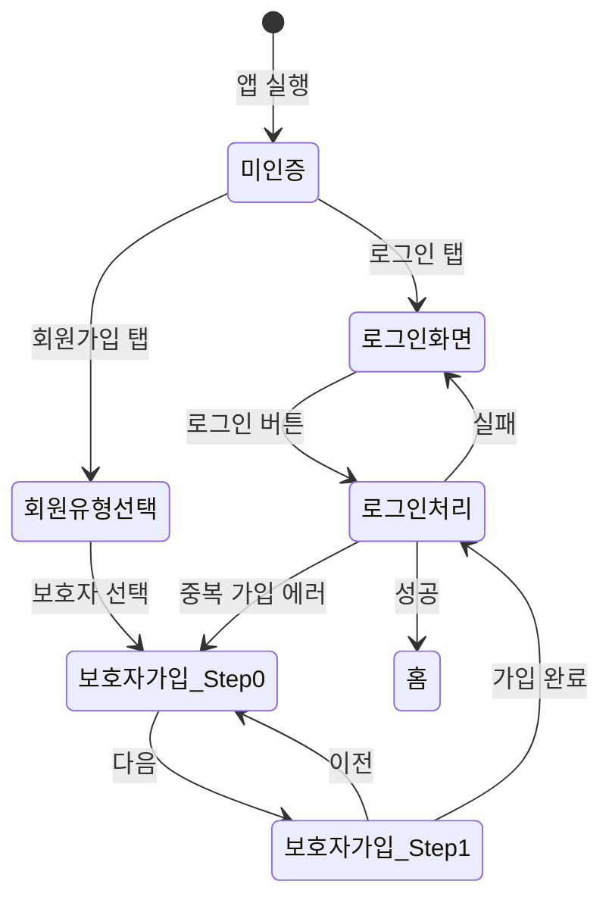

# FS-G-001 회원가입 / 로그인

> 문서 버전: 1.0
> 작성일: 2026-03-30
> 우선순위: P0
> 상태: Draft

---

## 1. 개요
- 보호자가 휴대폰 번호 + 비밀번호 또는 소셜 로그인(카카오/네이버)으로 가입하고 로그인하는 기능. 가입 완료 후 홈 화면으로 자동 이동한다.
- 대상 사용자: 보호자 (40~60대, 부모 돌봄 주체)
- 관련 PRD 섹션: 2.1 회원가입 / 로그인

## 2. 유저 스토리
- As a 보호자, I want to 카카오/네이버 계정으로 빠르게 가입하고, so that 별도 계정 생성 없이 서비스를 이용할 수 있다.
- As a 보호자, I want to 휴대폰 본인인증을 완료하여, so that 플랫폼에서 내 신원이 보증됨을 요양보호사에게 보여줄 수 있다.
- As a 보호자, I want to 앱을 재실행할 때 자동 로그인되어, so that 매번 로그인하는 번거로움이 없다.

## 3. 화면 구성

### 3.1 화면 목록
| 화면 ID | 화면명 | 진입 경로 | 구현 파일 |
|---------|--------|-----------|-----------|
| G-001-S1 | 로그인 | 앱 실행 > 로그인 버튼 | `src/app/(auth)/login/page.tsx` |
| G-001-S2 | 회원유형 선택 | 로그인 > 회원가입 링크 | `src/app/(auth)/signup/page.tsx` |
| G-001-S3 | 보호자 회원가입 | 회원유형 선택 > 보호자 | `src/app/(auth)/signup/guardian/page.tsx` |

### 3.2 화면별 상세

#### G-001-S1 로그인 화면
- **헤더**: BackHeader ("로그인"), 뒤로가기 시 랜딩 페이지(`/`)로 이동
- **로고 영역**: 서비스 슬로건 "어르신의 내일을, 믿음으로 잇다" + "로그인" 타이틀
- **입력 필드**:
  - 휴대폰 번호 (tel 타입, `010-0000-0000` 자동 포매팅)
  - 비밀번호 (password 타입)
- **에러 표시**: 빨간 배경 박스 (bg-red-50) 에 에러 메시지
- **로그인 버튼**: primary-500 배경, 로딩 시 "로그인 중..." 텍스트
- **소셜 로그인**: "또는" 구분선 아래 카카오(#FEE500) / 네이버(#03C75A) 버튼
- **회원가입 링크**: 하단 "아직 회원이 아니신가요?" > `/signup`으로 이동
- **인터랙션**: 폼 제출 시 NextAuth `signIn("credentials")` 호출, 성공 시 `/home` 이동

#### G-001-S2 회원유형 선택 화면
- **카드형 선택**: "보호자로 가입" / "요양보호사로 가입" 두 개 카드
- **인터랙션**: 카드 탭 시 각각 `/signup/guardian`, `/signup/caregiver`로 이동

#### G-001-S3 보호자 회원가입 화면 (2단계 스텝)
- **헤더**: BackHeader ("보호자 회원가입")
- **진행 표시**: 스텝 바 (2단계: "계정 정보" → "지역 및 어르신 정보")
- **Step 0 - 계정 정보**:
  - 이름 (text)
  - 휴대폰 번호 (tel, 자동 포매팅)
  - 비밀번호 (password, 8자 이상)
  - 비밀번호 확인 (password)
- **Step 1 - 지역 및 어르신 정보**:
  - 지역 (CustomSelect: 서울/경기/인천/부산)
  - 구/시 (text, ex: 강남구)
  - 어르신 정보 (동적 리스트): 출생연도 + 성별(남성/여성) + 추가/삭제 버튼
- **하단 버튼**: "이전" / "다음" 또는 "가입 완료"
- **인터랙션**: 가입 완료 시 `POST /api/users` 호출 후 자동 로그인 → `/home` 이동

## 4. 상세 동작 명세

### 4.1 정상 플로우

#### 회원가입 플로우
1. 사용자가 앱 실행 → 랜딩 페이지에서 "회원가입" 또는 로그인 화면의 "회원가입" 링크 탭
2. 회원유형 선택 화면에서 "보호자로 가입" 탭
3. Step 0: 이름, 휴대폰 번호, 비밀번호, 비밀번호 확인 입력 → "다음" 탭
4. Step 1: 지역, 구/시 선택, 어르신 정보(출생연도+성별) 입력 → "가입 완료" 탭
5. `POST /api/users` API 호출 (role: "GUARDIAN")
6. API 성공 시 NextAuth `signIn("credentials")` 자동 실행
7. 로그인 성공 후 `/home`으로 리다이렉트

#### 로그인 플로우
1. 사용자가 로그인 화면에서 휴대폰 번호, 비밀번호 입력
2. "로그인" 버튼 탭
3. NextAuth `signIn("credentials", { phone, password })` 호출
4. 성공 시 `/home`으로 이동

#### 소셜 로그인 플로우 (현재 UI만 구현)
1. 카카오 또는 네이버 버튼 탭
2. (현재 미연동) OAuth 인증 후 계정 생성/연결 → 홈 이동

### 4.2 예외 플로우
- **중복 가입 시도**: `POST /api/users`에서 409 응답 → "이미 가입된 전화번호입니다." 에러 메시지 표시
- **비밀번호 불일치**: 클라이언트 측 검증 → "비밀번호가 일치하지 않습니다." 표시
- **비밀번호 길이 부족**: "비밀번호는 8자 이상이어야 합니다." 표시
- **필수 입력 누락**: "모든 항목을 입력해주세요." 표시
- **잘못된 전화번호 형식**: 정규식 검증 실패 → "올바른 전화번호를 입력해주세요." 표시
- **로그인 실패**: NextAuth 에러 → "전화번호 또는 비밀번호가 올바르지 않습니다." 표시
- **서버 오류**: "회원가입 중 오류가 발생했습니다." 또는 "서버 오류가 발생했습니다." 표시

### 4.3 비즈니스 규칙
- 전화번호: 010으로 시작하는 11자리 숫자, `010-XXXX-XXXX` 형식으로 정규화하여 저장
- 비밀번호: 최소 8자 이상, bcrypt 해시(salt round 12)로 저장
- 회원 역할: 가입 시 `GUARDIAN` 역할 고정 지정
- 보호자 프로필: 가입 시 `GuardianProfile` 자동 생성 (빈 프로필)
- 어르신 정보: 회원가입 시 최소 1명 등록 가능 (출생연도 + 성별)
- 자동 로그인: NextAuth 세션 기반, 토큰 만료 시 재로그인 필요

## 5. 수용 기준 (Acceptance Criteria)

```
Given 미가입 사용자가 앱을 처음 실행했을 때
When 카카오 소셜 로그인 버튼을 탭하면
Then 카카오 OAuth 인증 후 BAYADA 계정이 생성되고 온보딩 화면으로 이동한다

Given 회원가입 화면에서 모든 필수 항목을 입력하고 "가입 완료"를 탭했을 때
When API 호출이 성공하면
Then 자동 로그인 후 홈 화면(/home)으로 이동한다

Given 이미 가입된 전화번호로 회원가입을 시도할 때
When "가입 완료"를 탭하면
Then "이미 가입된 전화번호입니다." 에러 메시지가 표시된다

Given 비밀번호와 비밀번호 확인이 일치하지 않을 때
When "다음" 버튼을 탭하면
Then "비밀번호가 일치하지 않습니다." 에러 메시지가 표시된다

Given 로그인 상태에서
When 앱을 재실행하면
Then 자동 로그인되어 메인 화면으로 이동한다

Given 잘못된 전화번호/비밀번호로 로그인 시도 시
When "로그인" 버튼을 탭하면
Then "전화번호 또는 비밀번호가 올바르지 않습니다." 메시지가 표시된다
```

## 6. API 연동

### 6.1 사용 API 목록
| Method | Endpoint | 설명 |
|--------|----------|------|
| POST | `/api/users` | 회원가입 (User + GuardianProfile 생성) |
| POST | `/api/auth/[...nextauth]` | NextAuth 로그인 (credentials provider) |

### 6.2 주요 요청/응답 스키마

#### POST /api/users
**요청:**
```json
{
  "phone": "010-1234-5678",
  "password": "password123",
  "name": "홍길동",
  "role": "GUARDIAN",
  "region": "서울",
  "district": "강남구",
  "careRecipients": [
    { "birthYear": 1945, "gender": "여성" }
  ]
}
```

**성공 응답 (201):**
```json
{
  "user": {
    "id": "cuid...",
    "email": null,
    "name": "홍길동",
    "phone": "010-1234-5678",
    "role": "GUARDIAN",
    "createdAt": "2026-03-30T..."
  }
}
```

**에러 응답 (409):**
```json
{
  "error": "이미 가입된 전화번호입니다."
}
```

#### NextAuth Credentials Login
**요청:**
```
signIn("credentials", { phone: "010-1234-5678", password: "password123", redirect: false })
```

**응답:** NextAuth 내부 처리, `result.error` 존재 시 로그인 실패

## 7. 상태 다이어그램


## 8. 데이터 모델

### User 테이블
| 필드 | 타입 | 설명 |
|------|------|------|
| id | String (cuid) | PK |
| phone | String (unique) | 휴대폰 번호 (010-XXXX-XXXX) |
| email | String? | 이메일 (선택) |
| passwordHash | String | bcrypt 해시 비밀번호 |
| name | String | 이름 |
| role | String | 역할 (GUARDIAN / CAREGIVER / ADMIN) |
| profileImage | String? | 프로필 이미지 URL |
| isActive | Boolean | 활성 상태 (기본 true) |
| isBanned | Boolean | 차단 상태 (기본 false) |
| createdAt | DateTime | 생성일 |
| updatedAt | DateTime | 수정일 |

### GuardianProfile 테이블
| 필드 | 타입 | 설명 |
|------|------|------|
| id | String (cuid) | PK |
| userId | String (unique) | User FK |
| region | String | 지역 (기본 "") |
| address | String? | 상세 주소 |
| introduction | String? | 자기소개 |
| relationship | String? | 환자와의 관계 |

## 9. 연관 기능
- **선행 기능**: 없음 (서비스 진입점)
- **후행 기능**: FS-G-002 돌봄니즈등록 (가입 후 어르신 상세 등록), FS-G-003 요양보호사 검색
- **의존 기능**: NextAuth 인증 시스템, Prisma ORM

## 10. 구현 현황
| 항목 | 상태 | 비고 |
|------|------|------|
| 프론트엔드 | ⚠️ | 전화번호+비밀번호 로그인/가입 구현. 소셜 로그인은 UI만 존재 (OAuth 미연동) |
| API | ✅ | POST /api/users, NextAuth credentials provider 완전 구현 |
| DB 모델 | ✅ | User, GuardianProfile 모델 완전 구현 |
