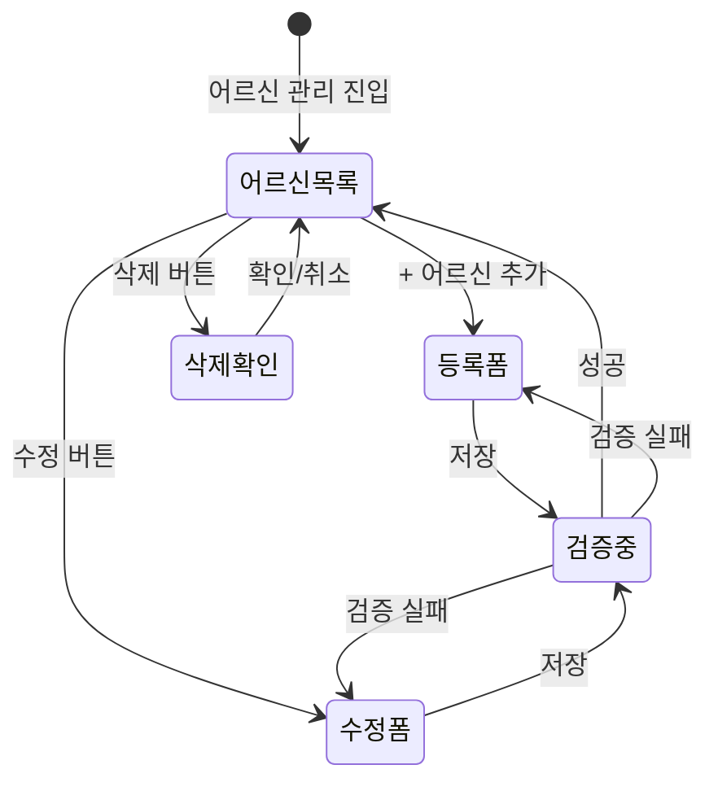

# FS-G-002 돌봄니즈등록

> 문서 버전: 1.0
> 작성일: 2026-03-30
> 우선순위: P0
> 상태: Draft

---

## 1. 개요
- 보호자가 돌봄이 필요한 어르신(환자)의 상태, 돌봄 유형, 필요 시간대, 특수 요구사항을 등록하는 기능. 이 정보를 기반으로 AI 매칭 알고리즘이 적합한 요양보호사를 추천한다.
- 대상 사용자: 보호자 (가입 완료 후)
- 관련 PRD 섹션: 2.2 돌봄 니즈 등록

## 2. 유저 스토리
- As a 보호자, I want to 부모님의 건강 상태와 돌봄 조건을 상세히 입력하여, so that 우리 상황에 맞는 요양보호사를 추천받을 수 있다.
- As a 보호자, I want to 여러 개의 돌봄 프로필을 생성하여, so that 부모님이 두 분 계신 경우 각각 관리할 수 있다.

## 3. 화면 구성

### 3.1 화면 목록
| 화면 ID | 화면명 | 진입 경로 | 구현 파일 |
|---------|--------|-----------|-----------|
| G-002-S1 | 어르신 관리 목록 | 마이페이지 > 어르신 관리 | `src/app/(app)/my/care-recipients/page.tsx` |
| G-002-S2 | 어르신 등록/수정 | 어르신 관리 > 추가/수정 | `src/app/(app)/my/care-recipients/page.tsx` (인라인 폼) |

### 3.2 화면별 상세

#### G-002-S1 어르신 관리 목록
- **헤더**: BackHeader ("어르신 관리")
- **어르신 카드 목록**: 이름, 출생연도, 성별, 장기요양등급, 질환 정보 표시
- **추가 버튼**: "+ 어르신 추가" 버튼
- **각 카드 액션**: 수정/삭제 버튼

#### G-002-S2 어르신 등록/수정 폼
- **기본 정보**:
  - 이름 (text, 필수)
  - 성별 (MALE/FEMALE 선택, 필수)
  - 출생연도 (number, 필수)
  - 프로필 이미지 (파일 업로드, 선택)
- **건강 정보**:
  - 장기요양등급 (선택: LEVEL_1~LEVEL_5, COGNITIVE_SUPPORT, 미신청)
  - 주요 질환 (다중 선택: 치매, 뇌졸중, 파킨슨, 당뇨, 고혈압, 골절/관절염, 암, 기타)
  - 이동 능력 (INDEPENDENT/PARTIALLY_DEPENDENT/FULLY_DEPENDENT/BEDRIDDEN)
  - 체중 (kg, 선택)
  - 신장 (cm, 선택)
- **돌봄 정보**:
  - 복용 약물 (text, 선택)
  - 특이사항 (text, 선택)
  - 긴급 연락처 (text, 선택)
  - 주소 (돌봄 장소, 선택)

## 4. 상세 동작 명세

### 4.1 정상 플로우
1. 보호자가 마이페이지 > "어르신 관리" 진입
2. 기존 등록된 어르신 목록 표시 (GET /api/care-recipients)
3. "+ 어르신 추가" 탭 → 등록 폼 표시
4. 필수 항목(이름, 성별, 출생연도) 및 선택 항목 입력
5. "저장" 탭 → POST /api/care-recipients 호출
6. 성공 시 목록에 새 어르신 카드 추가
7. 수정 시: 기존 카드의 "수정" 탭 → 폼에 기존 데이터 로드 → PATCH /api/care-recipients/[id]

### 4.2 예외 플로우
- **필수 항목 누락**: Zod 검증 실패 → "입력값이 올바르지 않습니다." 에러
- **보호자 프로필 없음**: 404 → "보호자 프로필이 없습니다."
- **인증 없음**: 401 → 로그인 페이지로 리다이렉트

### 4.3 비즈니스 규칙
- 한 보호자가 여러 명의 어르신을 등록할 수 있음 (제한 없음)
- 질환 정보(diseases)는 JSON 배열로 저장
- 이동 능력(mobilityLevel) 기본값: INDEPENDENT
- 장기요양등급 미신청 시 등급 신청 안내 가이드 제공 (PRD 요구)
- 돌봄 조건 수정 시 매칭 추천 목록 즉시 갱신 (PRD 요구, 현재 미구현)

## 5. 수용 기준 (Acceptance Criteria)

```
Given 보호자가 돌봄 니즈 등록 화면에 진입했을 때
When 필수 항목(이름, 성별, 출생연도)을 입력하고 저장하면
Then 돌봄 프로필(CareRecipient)이 생성되고 목록에 추가된다

Given 장기요양등급을 '미신청'으로 선택했을 때
When 등록을 완료하면
Then 등급 신청 가이드 팝업을 노출하고, 등급 신청 안내 페이지로 연결 링크를 제공한다

Given 돌봄 니즈 등록 완료 후
When 조건을 수정하면
Then 수정 즉시 매칭 추천 목록이 갱신된다

Given 어르신 정보를 추가 등록할 때
When "+ 어르신 추가" 버튼을 탭하면
Then 새로운 등록 폼이 표시되고 별도 프로필로 저장된다
```

## 6. API 연동

### 6.1 사용 API 목록
| Method | Endpoint | 설명 |
|--------|----------|------|
| GET | `/api/care-recipients` | 보호자의 어르신 목록 조회 |
| POST | `/api/care-recipients` | 어르신 등록 |
| PATCH | `/api/care-recipients/[id]` | 어르신 정보 수정 |
| DELETE | `/api/care-recipients/[id]` | 어르신 삭제 |

### 6.2 주요 요청/응답 스키마

#### POST /api/care-recipients
**요청:**
```json
{
  "name": "김OO",
  "gender": "FEMALE",
  "birthYear": 1945,
  "careLevel": "LEVEL_3",
  "diseases": ["DEMENTIA", "HYPERTENSION"],
  "mobilityLevel": "PARTIALLY_DEPENDENT",
  "weight": 55,
  "height": 158,
  "specialNotes": "치매 초기, 낮에 혼자 계심",
  "medications": "아리셉트 5mg 1일 1회",
  "emergencyContact": "010-9999-8888",
  "address": "서울시 도봉구 창동 123-45"
}
```

**성공 응답 (201):**
```json
{
  "careRecipient": {
    "id": "cuid...",
    "guardianId": "cuid...",
    "name": "김OO",
    "gender": "FEMALE",
    "birthYear": 1945,
    "careLevel": "LEVEL_3",
    "diseases": "[\"DEMENTIA\",\"HYPERTENSION\"]",
    "mobilityLevel": "PARTIALLY_DEPENDENT",
    "createdAt": "2026-03-30T..."
  }
}
```

## 7. 상태 다이어그램


## 8. 데이터 모델

### CareRecipient 테이블
| 필드 | 타입 | 설명 |
|------|------|------|
| id | String (cuid) | PK |
| guardianId | String | GuardianProfile FK |
| name | String | 어르신 이름 |
| gender | String | 성별 (MALE/FEMALE) |
| birthYear | Int | 출생연도 |
| careLevel | String? | 장기요양등급 (LEVEL_1~5, COGNITIVE_SUPPORT) |
| diseases | String | 질환 목록 (JSON 배열, 기본 "[]") |
| mobilityLevel | String | 이동 능력 (기본 INDEPENDENT) |
| weight | Float? | 체중 (kg) |
| height | Float? | 신장 (cm) |
| specialNotes | String? | 특이사항 |
| medications | String? | 복용 약물 |
| emergencyContact | String? | 긴급 연락처 |
| address | String? | 주소 (돌봄 장소) |
| profileImage | String? | 프로필 이미지 URL |

## 9. 연관 기능
- **선행 기능**: FS-G-001 회원가입/로그인 (보호자 계정 필요)
- **후행 기능**: FS-G-003 요양보호사 검색 (어르신 조건 기반 검색), FS-G-005 매칭요청 (어르신 연결)
- **의존 기능**: GuardianProfile 존재 필수

## 10. 구현 현황
| 항목 | 상태 | 비고 |
|------|------|------|
| 프론트엔드 | ✅ | 어르신 관리 목록/등록/수정/삭제 구현 완료 |
| API | ✅ | CRUD API (GET/POST/PATCH/DELETE) 완전 구현, Zod 검증 포함 |
| DB 모델 | ✅ | CareRecipient 모델 구현, GuardianProfile과 1:N 관계 |
