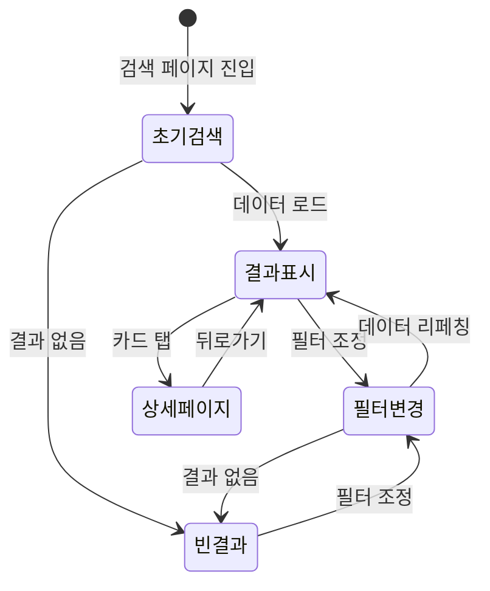

# FS-G-003 요양보호사 검색 및 필터

> 문서 버전: 1.0
> 작성일: 2026-03-30
> 우선순위: P0
> 상태: Draft

---

## 1. 개요
- 보호자가 지역, 서비스 유형, 정렬 기준 등 다양한 조건으로 요양보호사를 검색하고 결과를 카드형 UI로 조회하는 기능.
- 대상 사용자: 보호자 (가입 완료 후)
- 관련 PRD 섹션: 2.3 요양보호사 검색 및 필터

## 2. 유저 스토리
- As a 보호자, I want to 우리 동네에서 치매 케어 경험이 있는 요양보호사를 필터링하여, so that 관련 경험자만 추려서 빠르게 비교할 수 있다.

## 3. 화면 구성

### 3.1 화면 목록
| 화면 ID | 화면명 | 진입 경로 | 구현 파일 |
|---------|--------|-----------|-----------|
| G-003-S1 | 요양보호사 검색 | 하단 탭 "찾기" > 요양보호사 | `src/app/(app)/search/caregiver/page.tsx` |
| G-003-S2 | 검색 필터 | 검색 화면 상단 필터 영역 | `src/app/(app)/search/caregiver/CaregiverSearchFilters.tsx` |

### 3.2 화면별 상세

#### G-003-S1 요양보호사 검색 화면
- **헤더**: "요양보호사 찾기" 타이틀 (sticky, border-b)
- **필터 영역**: CaregiverSearchFilters 컴포넌트 (상단 고정)
- **결과 카운트**: "N명의 요양보호사를 찾았어요"
- **빈 상태**: 검색 결과 없을 시 EmptyState ("검색 조건에 맞는 요양보호사가 없습니다 / 필터를 조정해 보세요")
- **결과 카드 목록**: 각 카드에 표시되는 정보:
  - Avatar (프로필 이미지)
  - 이름
  - 지역 (MapPin 아이콘)
  - 평점 (StarRating) + 리뷰 수
  - 인증 자격증 배지 (Badge: "자격증 N개")
  - 서비스 유형 태그 (Tag: 방문요양, 치매전문 등)
  - 시급 (primary-500 텍스트)
  - 자기소개 미리보기 (2줄 제한)
  - ChevronRight 아이콘 (상세 이동 암시)
- **인터랙션**: 카드 탭 시 `/caregiver/[id]` 상세 페이지로 이동

#### G-003-S2 검색 필터
- **지역 필터**: 드롭다운 (region 파라미터)
- **서비스 유형 필터**: 드롭다운 (careType 파라미터)
- **정렬**: 평점순(기본) / 최신순 (sort 파라미터)
- **인터랙션**: 필터 변경 시 URL searchParams 업데이트 → 서버 컴포넌트 리렌더링

## 4. 상세 동작 명세

### 4.1 정상 플로우
1. 보호자가 하단 탭 "찾기"에서 "요양보호사" 탭 선택
2. 기본 조건으로 요양보호사 목록 로드 (평점 높은 순, 최대 20명)
3. 필터 조건 변경 (지역, 서비스 유형, 정렬)
4. URL searchParams 업데이트 → 서버 사이드 데이터 리페칭
5. 결과 카드 목록 갱신 + 카운트 업데이트
6. 카드 탭 → 요양보호사 상세 프로필(`/caregiver/[id]`)로 이동

### 4.2 예외 플로우
- **검색 결과 없음**: EmptyState 컴포넌트 표시 ("검색 조건에 맞는 요양보호사가 없습니다")
- **서버 오류**: 에러 바운더리 처리

### 4.3 비즈니스 규칙
- 검색 대상: `isActive=true`, `isBanned=false`인 요양보호사만 표시
- 기본 정렬: 평균 평점 높은 순 (averageRating desc)
- 페이지당 최대 20명 표시
- 지역 필터: 부분 문자열 매칭 (`contains`)
- 서비스 유형 필터: serviceCategories JSON 문자열 내 포함 여부 (`contains`)
- 인증된 자격증만 배지로 표시 (verificationStatus === "VERIFIED")
- 서비스 유형 라벨 매핑: HOME_CARE→방문요양, DEMENTIA_CARE→치매전문 등 9종

## 5. 수용 기준 (Acceptance Criteria)

```
Given 보호자가 검색 화면에서 필터를 적용했을 때
When 지역과 서비스 유형 필터를 적용하면
Then 해당 조건에 맞는 요양보호사 목록을 카드형 UI로 표시하고, 결과 없을 시 "필터를 조정해 보세요" 안내를 표시한다

Given 검색 결과가 표시된 상태에서
When 요양보호사 카드를 탭하면
Then 해당 요양보호사의 상세 프로필 페이지(/caregiver/[id])로 이동한다

Given 필터를 변경했을 때
When 새 조건이 적용되면
Then 결과 카운트가 갱신되고 목록이 즉시 업데이트된다

Given 검색 결과에서 요양보호사 카드를 탭한 후
When 뒤로 가기를 하면
Then 이전 필터 상태가 유지되어 결과 목록이 그대로 표시된다
```

## 6. API 연동

### 6.1 사용 API 목록
| Method | Endpoint | 설명 |
|--------|----------|------|
| GET | `/api/caregivers` | 요양보호사 목록 조회 (필터/정렬/페이지네이션) |

### 6.2 주요 요청/응답 스키마

#### GET /api/caregivers
**쿼리 파라미터:**
| 파라미터 | 타입 | 설명 |
|----------|------|------|
| region | string | 지역 필터 (부분 매칭) |
| careType | string | 서비스 유형 (HOME_CARE 등) |
| caregiverType | string | 요양보호사 유형 (CARE_WORKER 등) |
| specialty | string | 전문 분야 |
| minRate | number | 최소 시급 |
| maxRate | number | 최대 시급 |
| sortBy | string | 정렬 기준 (rating/rate/reviews/cares) |
| page | number | 페이지 번호 (기본 1) |

**성공 응답 (200):**
```json
{
  "caregivers": [
    {
      "id": "cuid...",
      "gender": "FEMALE",
      "region": "서울 강남구",
      "experienceYears": 5,
      "hourlyRate": 18000,
      "averageRating": 4.8,
      "totalReviews": 32,
      "serviceCategories": ["HOME_CARE", "DEMENTIA_CARE"],
      "introduction": "치매 전문 5년 경력...",
      "user": { "id": "...", "name": "김OO", "profileImage": "..." },
      "certificates": [{ "name": "요양보호사 자격증", "verificationStatus": "VERIFIED" }],
      "availabilities": [...]
    }
  ],
  "total": 45,
  "page": 1,
  "totalPages": 3
}
```

**참고**: 검색 페이지(SSR)에서는 직접 Prisma 쿼리를 사용하고, API 라우트는 클라이언트 측 호출용으로 별도 존재.

## 7. 상태 다이어그램


## 8. 데이터 모델

### CaregiverProfile 테이블 (검색 관련 필드)
| 필드 | 타입 | 설명 |
|------|------|------|
| id | String (cuid) | PK |
| region | String | 활동 지역 |
| serviceCategories | String | 서비스 유형 (JSON 배열) |
| specialties | String | 전문 분야 (JSON 배열) |
| hourlyRate | Int | 희망 시급 (기본 15,000) |
| averageRating | Float | 평균 평점 (기본 0) |
| totalReviews | Int | 총 리뷰 수 (기본 0) |
| experienceYears | Int | 경력 연수 (기본 0) |
| caregiverType | String | 유형 (기본 CARE_WORKER) |
| grade | String | 등급 (NEWBIE~MASTER) |

### Certificate 테이블 (배지 표시용)
| 필드 | 타입 | 설명 |
|------|------|------|
| name | String | 자격증명 |
| verificationStatus | String | 인증 상태 (PENDING/VERIFIED/REJECTED) |

## 9. 연관 기능
- **선행 기능**: FS-G-001 회원가입/로그인 (인증 필요)
- **후행 기능**: FS-G-004 요양보호사 프로필상세
- **의존 기능**: CaregiverProfile, Certificate 데이터

## 10. 구현 현황
| 항목 | 상태 | 비고 |
|------|------|------|
| 프론트엔드 | ✅ | SSR 기반 검색 목록 + 필터(지역/서비스유형/정렬) 구현 완료 |
| API | ✅ | GET /api/caregivers (필터, 정렬, 페이지네이션) 구현 완료 |
| DB 모델 | ✅ | CaregiverProfile, Certificate 인덱스 포함 완전 구현 |
