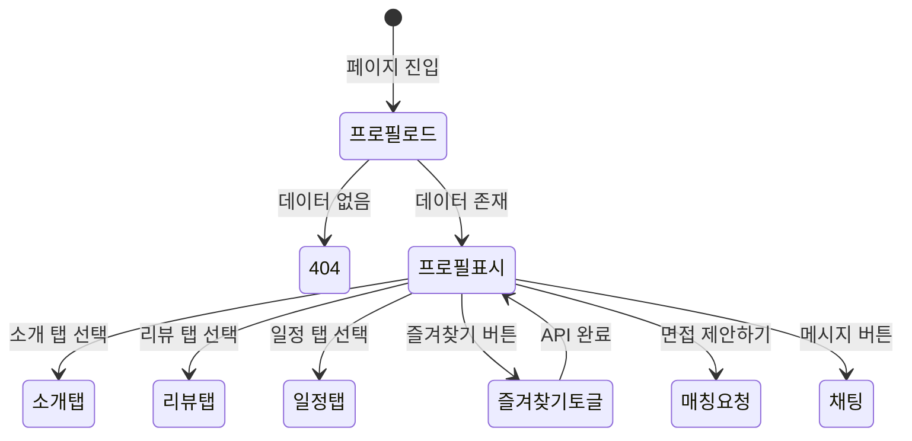

# FS-G-004 요양보호사 프로필 상세

> 문서 버전: 1.0
> 작성일: 2026-03-30
> 우선순위: P0
> 상태: Draft

---

## 1. 개요
- 요양보호사의 경력, 자격증, 리뷰, 가용 시간표, 등급 정보를 한눈에 확인하고 매칭 요청 또는 메시지를 보낼 수 있는 상세 프로필 페이지.
- 대상 사용자: 보호자 (로그인 상태)
- 관련 PRD 섹션: 2.4 요양보호사 프로필 상세

## 2. 유저 스토리
- As a 보호자, I want to 요양보호사의 경력, 자격증, 리뷰를 한눈에 확인하여, so that 우리 어르신에게 적합한 분인지 판단할 수 있다.
- As a 보호자, I want to 프로필에서 바로 매칭 요청이나 메시지를 보낼 수 있어, so that 마음에 드는 요양보호사에게 빠르게 연락할 수 있다.

## 3. 화면 구성

### 3.1 화면 목록
| 화면 ID | 화면명 | 진입 경로 | 구현 파일 |
|---------|--------|-----------|-----------|
| G-004-S1 | 요양보호사 상세 프로필 | 검색 결과 카드 탭 | `src/app/(app)/caregiver/[id]/page.tsx` |
| G-004-S2 | 탭 콘텐츠 (소개/리뷰/일정) | 상세 프로필 내 탭 | `src/app/(app)/caregiver/[id]/CaregiverTabs.tsx` |
| G-004-S3 | 즐겨찾기 버튼 | 상세 프로필 헤더 | `src/app/(app)/caregiver/[id]/BookmarkButton.tsx` |

### 3.2 화면별 상세

#### G-004-S1 프로필 헤더
- **BackHeader**: "요양보호사 프로필", fallback `/search/caregiver`
- **프로필 영역** (bg-white):
  - Avatar (xl 사이즈, 프로필 이미지/이름)
  - 이름 (text-lg, font-black)
  - GradeBadge (등급 배지: 등급 포인트 기반)
  - BookmarkButton (보호자만 표시, 즐겨찾기 토글)
  - 지역 (MapPin 아이콘 + 텍스트)
  - 평점 (StarRating + 숫자) + 리뷰 수 + 경력 N년
- **인증 자격증 배지**: VERIFIED 상태인 자격증만 Badge(success) + CheckCircle 표시
- **서비스 유형 태그**: Tag 컴포넌트로 서비스 유형 나열
- **등급 표시**: bg-gray-50 박스에 GradeBadge + 진행률 바
- **시급 표시**: bg-primary-50 박스에 "희망 시급 XX,XXX원/시간"

#### G-004-S2 탭 콘텐츠
- **소개 탭**: 자기소개 텍스트, 경력사항, 보유 자격증 상세 목록
- **리뷰 탭**: 받은 리뷰 목록 (최신순, 최대 5건), 작성자 이름/프로필/평점/내용
- **일정 탭**: 가용 시간표 (요일별 시작~종료 시간)

#### G-004-S3 하단 고정 CTA
- **메시지 버튼**: border-primary-500, `/chat` 이동, MessageSquare 아이콘
- **면접 제안 버튼** (보호자): bg-primary-500, `/matching/new?caregiverId=[id]` 이동
- **지원하기 버튼** (요양보호사): bg-primary-500, `/matching` 이동

## 4. 상세 동작 명세

### 4.1 정상 플로우
1. 보호자가 검색 결과에서 요양보호사 카드 탭
2. SSR로 해당 요양보호사 데이터 로드 (Prisma 직접 쿼리)
3. 프로필 헤더, 자격증, 서비스 유형, 등급, 시급 정보 표시
4. 탭 전환으로 소개/리뷰/일정 확인
5. 즐겨찾기 버튼 탭 → POST/DELETE `/api/bookmarks` (토글)
6. "면접 제안하기" 탭 → `/matching/new?caregiverId=[id]` 이동
7. "메시지" 탭 → `/chat` 이동

### 4.2 예외 플로우
- **존재하지 않는 ID**: `notFound()` → 404 페이지
- **미로그인 상태**: 프로필은 조회 가능하나 즐겨찾기/매칭요청 버튼 미표시
- **리뷰 없음**: 리뷰 탭에 빈 상태 메시지

### 4.3 비즈니스 규칙
- 프로필 데이터: SSR (서버 컴포넌트)에서 Prisma로 직접 조회
- 리뷰: `isVisible=true`인 리뷰만 표시, 최신순 5건
- 자격증: 전체 자격증 표시하되 VERIFIED만 배지 강조
- 즐겨찾기: User-CaregiverProfile 간 unique 제약 (중복 방지)
- 서비스 유형 라벨: 12종 매핑 (HOME_CARE~HOUSEKEEPING)
- 등급 시스템: NEWBIE → GENERAL → SKILLED → EXPERT → MASTER (gradePoints 기반)
- 하단 CTA: 보호자 역할(GUARDIAN)인 경우만 "면접 제안하기" 표시

## 5. 수용 기준 (Acceptance Criteria)

```
Given 보호자가 요양보호사 프로필 상세 페이지에 진입했을 때
When 페이지가 로드되면
Then 프로필 사진, 이름, 평점, 경력, 자격증, 서비스 유형, 시급 정보가 표시된다

Given 프로필 조회 시
When 자격증 배지를 확인하면
Then VERIFIED 상태인 자격증만 초록 배지로 표시된다

Given 보호자가 즐겨찾기 버튼을 탭했을 때
When 즐겨찾기가 추가/제거되면
Then 버튼 상태가 즉시 토글되고 API가 호출된다

Given 보호자가 "면접 제안하기" 버튼을 탭했을 때
When 버튼을 탭하면
Then /matching/new?caregiverId=[id] 페이지로 이동한다

Given 요양보호사 프로필에 리뷰가 있을 때
When 리뷰 탭을 선택하면
Then 최신순으로 최대 5건의 리뷰가 표시된다
```

## 6. API 연동

### 6.1 사용 API 목록
| Method | Endpoint | 설명 |
|--------|----------|------|
| - | Prisma 직접 쿼리 (SSR) | 요양보호사 프로필 상세 조회 |
| POST | `/api/bookmarks` | 즐겨찾기 추가 |
| DELETE | `/api/bookmarks/[id]` | 즐겨찾기 제거 |

### 6.2 주요 요청/응답 스키마

#### SSR 데이터 로드 (Prisma 쿼리)
```typescript
prisma.caregiverProfile.findUnique({
  where: { id },
  include: {
    user: { select: { name, profileImage, createdAt } },
    certificates: true,
    availabilities: true,
    reviewsReceived: {
      where: { isVisible: true },
      orderBy: { createdAt: "desc" },
      take: 5,
      include: {
        author: { include: { user: { select: { name, profileImage } } } },
      },
    },
  },
});
```

#### POST /api/bookmarks
**요청:**
```json
{
  "caregiverId": "cuid..."
}
```

**성공 응답 (201):**
```json
{
  "bookmark": { "id": "cuid...", "userId": "...", "caregiverId": "..." }
}
```

## 7. 상태 다이어그램


## 8. 데이터 모델

### CaregiverProfile 테이블 (프로필 표시용 주요 필드)
| 필드 | 타입 | 설명 |
|------|------|------|
| id | String (cuid) | PK |
| introduction | String? | 자기소개 (최대 1,000자) |
| experience | String? | 경력 사항 |
| experienceYears | Int | 경력 연수 |
| hourlyRate | Int | 희망 시급 |
| averageRating | Float | 평균 평점 |
| totalReviews | Int | 리뷰 수 |
| grade | String | 등급 (NEWBIE~MASTER) |
| gradePoints | Int | 등급 포인트 |
| videoIntroUrl | String? | 소개 영상 URL |
| profileCompleteness | Int | 프로필 완성도 (0~100%) |

### Bookmark 테이블
| 필드 | 타입 | 설명 |
|------|------|------|
| id | String (cuid) | PK |
| userId | String | User FK |
| caregiverId | String | CaregiverProfile FK |
| createdAt | DateTime | 생성일 |

### Review 테이블 (리뷰 탭용)
| 필드 | 타입 | 설명 |
|------|------|------|
| overallRating | Int | 전체 평점 (1~5) |
| punctuality | Int? | 시간 준수 |
| attitude | Int? | 태도 |
| professionalism | Int? | 전문성 |
| communication | Int? | 의사소통 |
| content | String | 리뷰 내용 |
| isVisible | Boolean | 노출 여부 |

## 9. 연관 기능
- **선행 기능**: FS-G-003 요양보호사 검색 (검색 결과에서 진입)
- **후행 기능**: FS-G-005 매칭요청 (면접 제안), FS-G-009 채팅 (메시지 보내기)
- **의존 기능**: Bookmark API, Review 데이터

## 10. 구현 현황
| 항목 | 상태 | 비고 |
|------|------|------|
| 프론트엔드 | ✅ | SSR 프로필 상세 + 탭(소개/리뷰/일정) + 즐겨찾기 + 하단 CTA 완전 구현 |
| API | ✅ | 즐겨찾기 CRUD, 리뷰 조회 구현 완료 |
| DB 모델 | ✅ | CaregiverProfile, Certificate, Review, Bookmark, Availability 모두 구현 |
