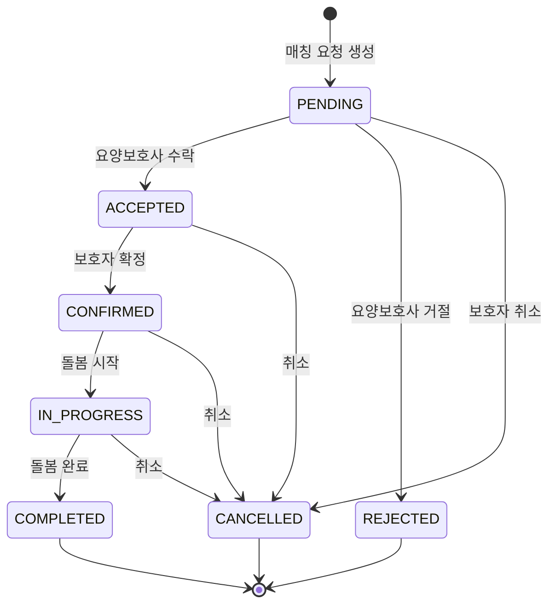

# FS-G-005 매칭요청 및 수락

> 문서 버전: 1.0
> 작성일: 2026-03-30
> 우선순위: P0
> 상태: Draft

---

## 1. 개요
- 보호자가 원하는 요양보호사에게 돌봄 조건을 포함한 매칭 요청을 발송하고, 요양보호사가 수락/거절하며, 전체 매칭 진행 현황을 타임라인으로 추적하는 기능.
- 대상 사용자: 보호자 (매칭 요청 발송), 요양보호사 (수락/거절)
- 관련 PRD 섹션: 2.5 매칭 요청 및 수락

## 2. 유저 스토리
- As a 보호자, I want to 마음에 드는 요양보호사에게 바로 매칭 요청을 보내어, so that 빠르게 돌봄을 시작할 수 있다.
- As a 보호자, I want to 최대 5명에게 동시 요청을 보내어, so that 한 명이 거절해도 다른 요양보호사에게 기회가 있다.
- As a 보호자, I want to 매칭 진행 상태를 실시간으로 확인하여, so that 현재 상황을 파악하고 다음 단계를 준비할 수 있다.

## 3. 화면 구성

### 3.1 화면 목록
| 화면 ID | 화면명 | 진입 경로 | 구현 파일 |
|---------|--------|-----------|-----------|
| G-005-S1 | 매칭 목록 | 하단 탭 "매칭" | `src/app/(app)/matching/page.tsx` |
| G-005-S2 | 매칭 탭 (전체/진행중/완료) | 매칭 목록 상단 | `src/app/(app)/matching/MatchingTabs.tsx` |
| G-005-S3 | 매칭 상세 | 매칭 카드 탭 | `src/app/(app)/matching/[id]/page.tsx` |
| G-005-S4 | 매칭 액션 | 매칭 상세 하단 | `src/app/(app)/matching/[id]/MatchingActions.tsx` |

### 3.2 화면별 상세

#### G-005-S1 매칭 목록
- **헤더**: "매칭 관리"
- **탭 필터**: MatchingTabs (전체/진행중/완료)
- **매칭 카드**: 상대방 정보(아바타/이름), 서비스 유형, 상태 배지, 요청일
- **빈 상태**: "매칭 내역이 없습니다"

#### G-005-S3 매칭 상세
- **BackHeader**: "매칭 상세"
- **상태 헤더**: 현재 상태 배지 + 설명 텍스트
  - PENDING: "대기 중" (yellow) - "요양보호사의 수락을 기다리고 있어요"
  - ACCEPTED: "수락됨" (blue) - "요양보호사가 제안을 수락했어요"
  - REJECTED: "거절됨" (red) - "요양보호사가 제안을 거절했어요"
  - CONFIRMED: "확정됨" (green) - "매칭이 확정되었어요"
  - IN_PROGRESS: "진행 중" (primary) - "요양이 진행 중이에요"
  - COMPLETED: "완료" (gray) - "요양이 완료되었어요"
  - CANCELLED: "취소됨" (gray) - "매칭이 취소되었어요"
- **상대방 카드**: Avatar + 이름 + 서비스 유형 + 채팅 링크 버튼
- **진행 현황 타임라인**: 5단계 (PENDING→ACCEPTED→CONFIRMED→IN_PROGRESS→COMPLETED)
  - 완료된 단계: primary-500 원형 배경
  - 현재 단계: primary-500 + 설명 텍스트
  - 미완료 단계: 회색 원형
- **매칭 정보 카드**: 서비스 유형, 요청일, 시작일, 특별 요청사항
- **연결된 어르신**: MatchRecipient 연결된 어르신 목록
- **계약서 링크**: CONFIRMED/IN_PROGRESS/COMPLETED 상태에서 계약서 페이지 링크

#### G-005-S4 매칭 액션 (하단 고정)
- **보호자 액션**: 상태별 다른 버튼 표시
  - PENDING: "요청 취소" 버튼
  - ACCEPTED: "매칭 확정" / "취소" 버튼
  - CONFIRMED: "돌봄 시작" 버튼
- **요양보호사 액션**:
  - PENDING: "수락" / "거절" 버튼

## 4. 상세 동작 명세

### 4.1 정상 플로우

#### 매칭 요청 발송
1. 보호자가 요양보호사 프로필에서 "면접 제안하기" 탭
2. 매칭 요청 폼: 서비스 유형, 시작일, 종료일, 스케줄, 특별 요청사항, 예상 시급, 어르신 선택
3. POST /api/matches 호출
4. 매칭 생성 (status: PENDING)
5. 매칭 목록에 새 카드 추가

#### 매칭 수락/거절
1. 요양보호사가 매칭 요청 알림 수신
2. 매칭 상세에서 요청 내용 확인
3. "수락" → PATCH /api/matches/[id] (status: ACCEPTED, respondedAt 기록)
4. "거절" → PATCH /api/matches/[id] (status: REJECTED, respondedAt 기록)

#### 매칭 확정
1. 수락 후 보호자가 "매칭 확정" 탭
2. PATCH /api/matches/[id] (status: CONFIRMED, confirmedAt 기록)
3. 계약서 페이지 접근 가능

#### 상태 전이 규칙 (State Machine)
```
PENDING → ACCEPTED | REJECTED | CANCELLED
ACCEPTED → CONFIRMED | CANCELLED
CONFIRMED → IN_PROGRESS | CANCELLED
IN_PROGRESS → COMPLETED | CANCELLED
```

### 4.2 예외 플로우
- **잘못된 상태 전이**: "'PENDING' 상태에서 'COMPLETED' 상태로 변경할 수 없습니다." 400 에러
- **보호자 외 매칭 요청**: "보호자 회원만 매칭을 요청할 수 있습니다." 403 에러
- **존재하지 않는 요양보호사**: "요양보호사를 찾을 수 없습니다." 404 에러
- **48시간 무응답**: 자동 만료 (PRD 요구, 현재 미구현)

### 4.3 비즈니스 규칙
- 매칭 요청: 보호자(GUARDIAN) 역할만 가능
- 동시 요청: 최대 5명에게 동시 발송 가능 (PRD 요구)
- 응답 기한: 48시간 이내 (PRD 요구, 현재 자동 만료 미구현)
- 상태 전이: VALID_STATUS_TRANSITIONS 상수로 관리되는 상태 머신
- 스케줄: JSON 문자열로 저장/파싱
- 어르신 연결: MatchRecipient 테이블로 N:M 관계

## 5. 수용 기준 (Acceptance Criteria)

```
Given 보호자가 이용권을 보유한 상태에서 프로필 페이지에서 "매칭 요청" 버튼을 탭했을 때
When 돌봄 조건 확인 화면에서 요청 메시지를 작성하고 발송하면
Then 요양보호사에게 푸시 알림이 발송되고, 요청 상태가 "대기중"으로 표시된다

Given 매칭 요청이 발송된 후
When 요양보호사가 수락하면
Then 보호자에게 알림이 발송되고, 채팅방이 자동 생성된다

Given 매칭 요청이 발송된 후
When 48시간 이내에 요양보호사가 응답하지 않으면
Then 요청이 자동 만료되고 보호자에게 알림이 발송된다

Given 매칭 상세 화면에서
When 진행 현황 타임라인을 확인하면
Then 현재 단계가 강조 표시되고 완료된 단계는 체크 표시된다

Given 보호자가 수락된 매칭에서 "매칭 확정"을 탭했을 때
When 확정이 완료되면
Then 상태가 CONFIRMED로 변경되고 계약서 링크가 표시된다
```

## 6. API 연동

### 6.1 사용 API 목록
| Method | Endpoint | 설명 |
|--------|----------|------|
| GET | `/api/matches` | 매칭 목록 조회 (보호자/요양보호사 역할별) |
| POST | `/api/matches` | 매칭 요청 생성 |
| GET | `/api/matches/[id]` | 매칭 상세 조회 |
| PATCH | `/api/matches/[id]` | 매칭 상태 변경 (수락/거절/확정/취소 등) |

### 6.2 주요 요청/응답 스키마

#### POST /api/matches
**요청:**
```json
{
  "caregiverId": "cuid...",
  "serviceCategory": "HOME_CARE",
  "startDate": "2026-04-01",
  "endDate": "2026-06-30",
  "schedule": [
    { "dayOfWeek": "MON", "startTime": "09:00", "endTime": "13:00" },
    { "dayOfWeek": "WED", "startTime": "09:00", "endTime": "13:00" }
  ],
  "specialRequests": "치매 초기 어머니, 산책 동행 필요",
  "estimatedRate": 18000,
  "careRecipientIds": ["cuid..."]
}
```

**성공 응답 (201):**
```json
{
  "match": {
    "id": "cuid...",
    "guardianId": "...",
    "caregiverId": "...",
    "status": "PENDING",
    "serviceCategory": "HOME_CARE",
    "startDate": "2026-04-01T...",
    "schedule": [...],
    "requestedAt": "2026-03-30T..."
  }
}
```

#### PATCH /api/matches/[id]
**요청:**
```json
{
  "status": "ACCEPTED"
}
```

**에러 응답 (400 - 잘못된 상태 전이):**
```json
{
  "error": "'PENDING' 상태에서 'COMPLETED' 상태로 변경할 수 없습니다."
}
```

## 7. 상태 다이어그램


## 8. 데이터 모델

### Match 테이블
| 필드 | 타입 | 설명 |
|------|------|------|
| id | String (cuid) | PK |
| guardianId | String | GuardianProfile FK |
| caregiverId | String | CaregiverProfile FK |
| status | String | 상태 (PENDING→ACCEPTED→CONFIRMED→IN_PROGRESS→COMPLETED) |
| serviceCategory | String | 서비스 유형 |
| startDate | DateTime | 돌봄 시작일 |
| endDate | DateTime? | 돌봄 종료일 |
| schedule | String | 스케줄 (JSON 배열) |
| specialRequests | String? | 특별 요청사항 |
| estimatedRate | Int? | 예상 시급 |
| requestedAt | DateTime | 요청 시간 |
| respondedAt | DateTime? | 응답 시간 |
| confirmedAt | DateTime? | 확정 시간 |
| cancelledAt | DateTime? | 취소 시간 |
| cancelReason | String? | 취소 사유 |
| completedAt | DateTime? | 완료 시간 |

### MatchRecipient 테이블
| 필드 | 타입 | 설명 |
|------|------|------|
| id | String (cuid) | PK |
| matchId | String | Match FK |
| careRecipientId | String | CareRecipient FK |

## 9. 연관 기능
- **선행 기능**: FS-G-004 요양보호사 프로필상세 (면접 제안 진입점)
- **후행 기능**: FS-G-006 상담/면접예약, FS-G-007 전자계약, FS-G-009 채팅
- **의존 기능**: GuardianProfile, CaregiverProfile, CareRecipient

## 10. 구현 현황
| 항목 | 상태 | 비고 |
|------|------|------|
| 프론트엔드 | ✅ | 매칭 목록/상세/타임라인/액션 버튼 완전 구현 |
| API | ✅ | CRUD + 상태 머신 검증 (VALID_STATUS_TRANSITIONS) 완전 구현 |
| DB 모델 | ✅ | Match, MatchRecipient 모델 + 인덱스 완전 구현 |
