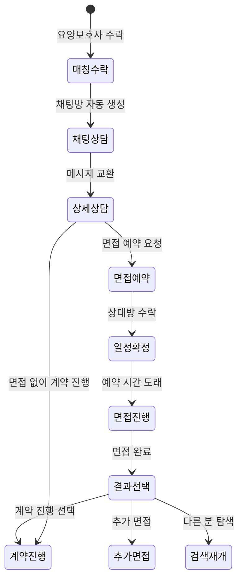

# FS-G-006 상담 / 면접 예약

> 문서 버전: 1.0
> 작성일: 2026-03-30
> 우선순위: P0
> 상태: Draft

---

## 1. 개요
- 매칭 요청 수락 후 보호자와 요양보호사가 채팅으로 상세 상담하고, 화상 또는 대면 면접을 예약하여 적합성을 확인한 후 계약 진행 여부를 결정하는 기능.
- 대상 사용자: 보호자, 요양보호사 (매칭 수락 후)
- 관련 PRD 섹션: 2.6 상담/면접 예약 (화상/대면)

## 2. 유저 스토리
- As a 보호자, I want to 실제 고용 전에 화상으로 요양보호사를 만나보고, so that 신뢰감과 적합성을 확인한 후 계약을 결정할 수 있다.
- As a 보호자, I want to 채팅으로 미리 상세 상담하여, so that 면접 전에 기본적인 적합성을 파악할 수 있다.

## 3. 화면 구성

### 3.1 화면 목록
| 화면 ID | 화면명 | 진입 경로 | 구현 파일 |
|---------|--------|-----------|-----------|
| G-006-S1 | 채팅 상담 | 매칭 상세 > 채팅 버튼 | `src/app/(app)/chat/[id]/page.tsx` |
| G-006-S2 | 면접 예약 | 채팅방 내 면접 예약 기능 | (채팅방 내 인터랙션) |

### 3.2 화면별 상세

#### G-006-S1 채팅 상담 화면
- **헤더**: 상대방 이름 + 상태 배지 (매칭 상태)
- **메시지 영역**:
  - 발신 메시지: primary-500 배경, 우측 정렬
  - 수신 메시지: gray-100 배경, 좌측 정렬
  - 시스템 메시지: 중앙 정렬, 회색 텍스트
  - 메시지 유형: TEXT, IMAGE, FILE, SYSTEM, CONTRACT
  - 읽음 확인: isRead 필드 기반
  - 이미지 미리보기: imageUrl이 있는 경우 인라인 표시
- **입력 영역**: 텍스트 입력 + 이미지 첨부 + 파일 첨부 + 전송 버튼
- **실시간 업데이트**: Supabase Realtime 구독 (postgres_changes)

#### G-006-S2 면접 예약 (PRD 요구사항)
- **캘린더 선택**: 가능 시간대에서 면접 일정 선택 (PRD 요구, 별도 UI 미구현)
- **면접 유형**: 화상 면접 (인앱 영상통화) / 대면 면접
- **리마인더**: 면접 30분 전 푸시 알림 (PRD 요구, 미구현)
- **면접 결과**: 계약 진행 / 다른 요양보호사 탐색 / 추가 면접 예약 중 선택 (PRD 요구, 미구현)

## 4. 상세 동작 명세

### 4.1 정상 플로우

#### 채팅 상담 플로우
1. 매칭 수락 후 채팅방 자동 생성 (Match 기반)
2. 보호자/요양보호사 각자 채팅방 진입
3. 텍스트/이미지/파일 메시지 교환
4. POST /api/chat/[matchId] 로 메시지 발송
5. Supabase Realtime으로 실시간 수신
6. 읽음 상태 자동 업데이트

#### 면접 예약 플로우 (PRD 기준)
1. 채팅방에서 "면접 예약" 버튼 탭
2. 캘린더에서 가능 시간대 선택
3. 면접 일정 제안 → 상대방 확인
4. 면접 30분 전 리마인더 알림
5. 화상 면접: 인앱 영상통화 (Agora/WebRTC)
6. 면접 완료 후 결과 선택 (계약 진행 / 탐색 / 추가 면접)

### 4.2 예외 플로우
- **채팅방 없음**: 매칭이 REJECTED/CANCELLED 상태면 채팅 불가
- **메시지 발송 실패**: 네트워크 오류 시 재시도 안내
- **실시간 구독 오류**: 콘솔 에러 로깅, 폴백 없음

### 4.3 비즈니스 규칙
- 채팅방: Match 1개당 1개 채팅방 (matchId 기반)
- 메시지 발송: 매칭 당사자(보호자/요양보호사)만 가능
- 메시지 유형: TEXT(기본), IMAGE, FILE, SYSTEM, CONTRACT
- 파일 첨부: 최대 10MB (PRD 요구)
- 음성 메시지: 최대 2분 (PRD 요구, 미구현)
- 읽음 확인: isRead 플래그, readAt 시간 기록
- 실시간: Supabase Realtime (postgres_changes on InterviewMessage)
- 화상 면접: 최대 60분, Agora/WebRTC 기반 (PRD 요구, 미구현)
- 면접 리마인더: 30분 전 푸시 알림 (PRD 요구, 미구현)

## 5. 수용 기준 (Acceptance Criteria)

```
Given 채팅방이 개설된 후
When 보호자가 메시지를 입력하고 전송하면
Then 상대방에게 실시간으로 메시지가 표시된다

Given 채팅방에서
When 이미지를 첨부하여 전송하면
Then 이미지가 업로드되고 인라인으로 미리보기가 표시된다

Given 채팅방이 개설된 후
When 보호자가 "면접 예약" 버튼을 탭하면
Then 캘린더에서 가능 시간대를 선택하는 화면이 노출되고, 선택한 일정이 요양보호사에게 제안된다

Given 면접 일정이 확정된 후
When 면접 30분 전이 되면
Then 보호자와 요양보호사 모두에게 리마인더 푸시 알림이 발송된다

Given 화상 면접 예약 시
When 예약된 시간에 "입장" 버튼을 탭하면
Then 화상통화가 시작된다 (최대 60분)

Given 면접 완료 후
When 보호자가 면접 결과를 선택하면
Then 계약 진행 / 다른 요양보호사 탐색 / 추가 면접 예약 중 선택할 수 있다
```

## 6. API 연동

### 6.1 사용 API 목록
| Method | Endpoint | 설명 |
|--------|----------|------|
| GET | `/api/chat/[matchId]` | 채팅 메시지 목록 조회 |
| POST | `/api/chat/[matchId]` | 메시지 발송 |
| GET | `/api/matches/[id]` | 매칭 정보 + 메시지 전체 조회 |

### 6.2 주요 요청/응답 스키마

#### POST /api/chat/[matchId]
**요청:**
```json
{
  "content": "안녕하세요, 어머니 돌봄에 관해 상의드리고 싶습니다.",
  "messageType": "TEXT"
}
```

**이미지 메시지 요청:**
```json
{
  "content": "어머니 약 목록입니다",
  "messageType": "IMAGE",
  "imageUrl": "https://storage.../image.jpg"
}
```

**성공 응답 (201):**
```json
{
  "message": {
    "id": "cuid...",
    "matchId": "...",
    "senderId": "...",
    "content": "안녕하세요...",
    "messageType": "TEXT",
    "isRead": false,
    "createdAt": "2026-03-30T..."
  }
}
```

## 7. 상태 다이어그램


## 8. 데이터 모델

### InterviewMessage 테이블
| 필드 | 타입 | 설명 |
|------|------|------|
| id | String (cuid) | PK |
| matchId | String | Match FK |
| senderId | String | User FK (발신자) |
| content | String | 메시지 내용 |
| messageType | String | 유형 (TEXT/IMAGE/FILE/SYSTEM/CONTRACT) |
| imageUrl | String? | 이미지 URL |
| fileName | String? | 파일명 |
| fileUrl | String? | 파일 URL |
| isRead | Boolean | 읽음 여부 (기본 false) |
| readAt | DateTime? | 읽음 시간 |
| createdAt | DateTime | 생성일 |

## 9. 연관 기능
- **선행 기능**: FS-G-005 매칭요청 (수락 후 채팅방 생성)
- **후행 기능**: FS-G-007 전자계약 (면접 후 계약 진행)
- **의존 기능**: Match 모델 (채팅방 = Match), Supabase Realtime

## 10. 구현 현황
| 항목 | 상태 | 비고 |
|------|------|------|
| 프론트엔드 | ⚠️ | 채팅 UI + Supabase Realtime 구현. 면접 예약 UI/화상통화 미구현 |
| API | ✅ | 채팅 메시지 CRUD 완전 구현 (GET/POST) |
| DB 모델 | ✅ | InterviewMessage 모델 완전 구현 |
