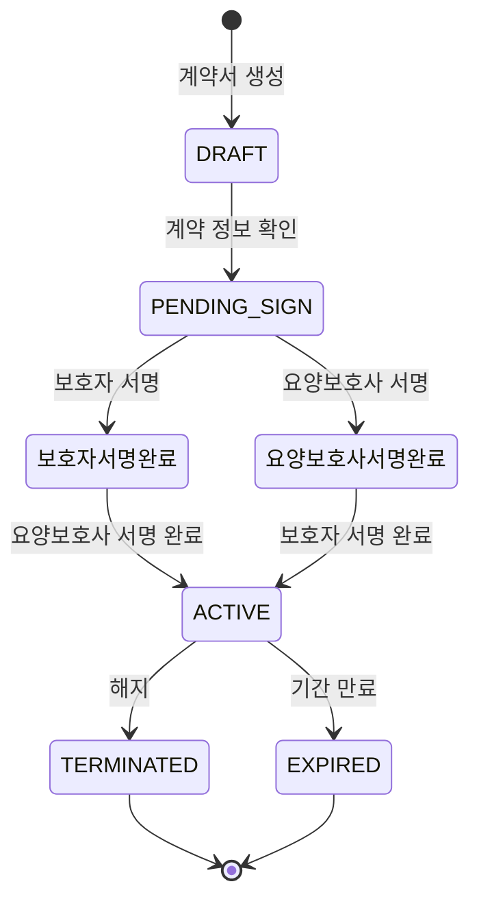

# FS-G-007 전자계약

> 문서 버전: 1.0
> 작성일: 2026-03-30
> 우선순위: P0
> 상태: Draft

---

## 1. 개요
- 면접 후 돌봄 시작 전에 BAYADA 표준 돌봄 계약서를 전자서명으로 체결하는 기능. 계약서에는 돌봄 조건, 보수, 기간, 해지 조건이 명시되며, 양측 모두 서명 완료 시 계약이 체결된다.
- 대상 사용자: 보호자, 요양보호사 (매칭 확정 후)
- 관련 PRD 섹션: 2.7 전자 계약 체결

## 2. 유저 스토리
- As a 보호자, I want to 앱 안에서 바로 계약서에 서명하여, so that 별도 서류 작성 없이 법적 효력 있는 계약을 체결할 수 있다.
- As a 보호자, I want to 계약 내용을 미리 확인하고 수정을 요청할 수 있어, so that 합의된 조건으로 계약할 수 있다.

## 3. 화면 구성

### 3.1 화면 목록
| 화면 ID | 화면명 | 진입 경로 | 구현 파일 |
|---------|--------|-----------|-----------|
| G-007-S1 | 계약서 화면 | 매칭 상세 > 계약서 버튼 | `src/app/(app)/matching/[id]/contract/page.tsx` |

### 3.2 화면별 상세

#### G-007-S1 계약서 화면
- **BackHeader**: "계약서", fallback `/matching`
- **계약 상태 배너**:
  - 서명 대기: primary-50 배경, FileText 아이콘, "계약서 서명 대기 / 양측 모두 서명하면 계약이 체결됩니다"
  - 체결 완료: green-50 배경, CheckCircle 아이콘, "계약 체결 완료 / 양측 모두 서명을 완료했습니다"
- **계약 정보 카드** (bg-white rounded-2xl):
  - FileText 아이콘 + "계약 정보" 타이틀
  - 서비스 유형: 매칭의 serviceCategory 라벨
  - 보호자: guardian.user.name
  - 요양보호사: caregiver.user.name
  - 시작일: match.startDate
  - 특별 요청사항: match.specialRequests (있는 경우)
- **서명 현황 카드**:
  - 보호자 행: 이름 + 서명 상태 (CheckCircle 초록 "서명 완료" / Clock 회색 "대기 중")
  - 요양보호사 행: 이름 + 서명 상태
- **하단 고정 서명 버튼** (서명 미완료 시만 표시):
  - "보호자 서명" 버튼 (primary-500) / "보호자 서명 완료" (green-50, 비활성)
  - "요양보호사 서명" 버튼 (blue-500) / "요양보호사 서명 완료" (green-50, 비활성)
  - PenTool 아이콘 포함

## 4. 상세 동작 명세

### 4.1 정상 플로우

#### 계약서 생성
1. 매칭 상태가 CONFIRMED 이상일 때 매칭 상세에서 "계약서" 카드 탭
2. 계약서 페이지 진입, 매칭 정보 기반 계약 정보 자동 표시
3. (필요 시) POST /api/contracts로 계약서 레코드 생성
4. Contract 레코드: matchId, serviceCategory, hourlyRate, schedule, startDate 자동 채움

#### 전자서명 플로우
1. 보호자가 "보호자 서명" 버튼 탭
2. 서명 처리 중 (signing 상태, 버튼 비활성)
3. POST /api/matches/[matchId]/contract (party: "guardian") 호출
4. 성공 시 guardianSigned = true, 버튼 → "보호자 서명 완료"
5. 요양보호사도 동일하게 "요양보호사 서명" 탭
6. 양측 모두 서명 완료 시 → 상태 배너 "계약 체결 완료"로 변경

#### 계약서 포함 항목 (PRD 기준)
1. 당사자 정보 (보호자, 요양보호사)
2. 돌봄 대상자 정보
3. 서비스 내용 (돌봄 유형, 요일, 시간)
4. 보수 (시급/월급, 지급일, 지급 방법)
5. 4대보험 적용 여부
6. 계약 기간 및 갱신 조건
7. 해지 조건 (사전 통보 기간)
8. 비밀유지 조항
9. 개인정보 처리 동의
10. 분쟁 해결 방법

### 4.2 예외 플로우
- **매칭 정보 로딩 실패**: 로딩 스피너 표시 (무한 대기 가능)
- **서명 API 실패**: 조용히 무시 (현재 catch 블록에서 무시)
- **이미 계약 존재**: POST /api/contracts에서 409 → "이미 계약서가 존재합니다."
- **매칭 미존재**: 404 → "매칭 정보를 찾을 수 없습니다."

### 4.3 비즈니스 규칙
- 계약서 접근: CONFIRMED, IN_PROGRESS, COMPLETED 상태에서만 접근 가능
- 계약서 생성: Match당 1개만 생성 가능 (matchId unique)
- 시급: estimatedRate(매칭 요청 시급) 우선, 없으면 caregiver.hourlyRate 사용
- 계약 상태: DRAFT → PENDING_SIGN → ACTIVE → TERMINATED → EXPIRED
- 서명: 보호자/요양보호사 각각 독립적으로 서명, 양측 완료 시 체결
- PDF 생성: PRD 요구 (양측 이메일 발송), 현재 미구현
- 계약 변경: PRD 요구 (요양보호사 동의 후 변경서 추가 서명), 현재 미구현

## 5. 수용 기준 (Acceptance Criteria)

```
Given 면접 완료 후 계약 진행을 선택했을 때
When 계약서 화면에 진입하면
Then BAYADA 표준 계약서 템플릿이 돌봄 조건에 맞게 자동 채워진다

Given 계약서 확인 후
When 보호자가 전자서명을 완료하면
Then 요양보호사에게 서명 요청 알림이 발송된다

Given 양측 모두 서명 완료 시
When 계약이 체결되면
Then "계약 체결 완료" 배너가 표시되고, PDF 계약서가 생성되어 양측 이메일로 발송되며 앱 내 저장된다

Given 계약 체결 후
When 보호자가 계약 기간 중 수정을 원하면
Then 요양보호사 동의 후 계약 변경서를 추가 서명한다
```

## 6. API 연동

### 6.1 사용 API 목록
| Method | Endpoint | 설명 |
|--------|----------|------|
| GET | `/api/matches/[id]` | 매칭 정보 + 계약 정보 조회 |
| POST | `/api/contracts` | 계약서 생성 |
| GET | `/api/contracts` | 계약서 목록 조회 |
| GET | `/api/contracts/[id]` | 계약서 상세 조회 |
| PATCH | `/api/contracts/[id]` | 계약서 상태 변경 / 서명 |

### 6.2 주요 요청/응답 스키마

#### POST /api/contracts
**요청:**
```json
{
  "matchId": "cuid..."
}
```

**성공 응답 (201):**
```json
{
  "contract": {
    "id": "cuid...",
    "matchId": "...",
    "serviceCategory": "HOME_CARE",
    "hourlyRate": 18000,
    "schedule": "[...]",
    "startDate": "2026-04-01T...",
    "status": "DRAFT",
    "guardianSigned": false,
    "caregiverSigned": false
  }
}
```

**에러 응답 (409):**
```json
{
  "error": "이미 계약서가 존재합니다."
}
```

## 7. 상태 다이어그램


## 8. 데이터 모델

### Contract 테이블
| 필드 | 타입 | 설명 |
|------|------|------|
| id | String (cuid) | PK |
| matchId | String (unique) | Match FK (1:1) |
| serviceCategory | String | 서비스 유형 |
| hourlyRate | Int | 시급 |
| schedule | String | 스케줄 (JSON, 기본 "[]") |
| startDate | DateTime | 시작일 |
| endDate | DateTime? | 종료일 |
| specialTerms | String? | 특별 조건 |
| guardianSigned | Boolean | 보호자 서명 여부 (기본 false) |
| guardianSignedAt | DateTime? | 보호자 서명 시간 |
| caregiverSigned | Boolean | 요양보호사 서명 여부 (기본 false) |
| caregiverSignedAt | DateTime? | 요양보호사 서명 시간 |
| status | String | 상태 (DRAFT/PENDING_SIGN/ACTIVE/TERMINATED/EXPIRED) |
| terminatedAt | DateTime? | 해지 시간 |
| terminationReason | String? | 해지 사유 |

## 9. 연관 기능
- **선행 기능**: FS-G-005 매칭요청 (CONFIRMED 상태), FS-G-006 상담/면접 (면접 후 계약 진행)
- **후행 기능**: FS-G-008 결제/구독 (계약 체결 후 결제)
- **의존 기능**: Match 모델 (1:1 관계)

## 10. 구현 현황
| 항목 | 상태 | 비고 |
|------|------|------|
| 프론트엔드 | ⚠️ | 계약 정보 표시 + 양측 서명 UI 구현. PDF 생성/이메일 발송/계약 변경 미구현 |
| API | ✅ | 계약서 CRUD + 서명 API 구현 완료 |
| DB 모델 | ✅ | Contract 모델 완전 구현 (Match 1:1 관계) |
