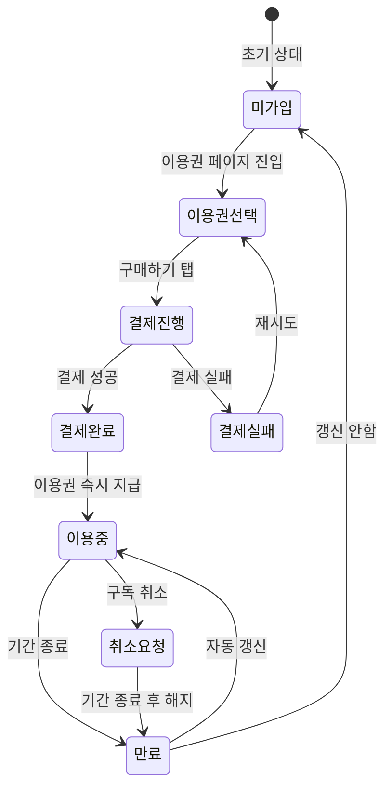

# FS-G-008 결제 및 구독

> 문서 버전: 1.0
> 작성일: 2026-03-30
> 우선순위: P0
> 상태: Draft

---

## 1. 개요
- 보호자가 매칭 요청을 위한 이용권을 구매하거나 구독 플랜에 가입하는 기능. 현재 이용권(7일/30일/90일) 선택 UI와 결제 플로우가 구현되어 있으며, 실제 PG 결제 연동은 준비 중이다.
- 대상 사용자: 보호자 (로그인 상태)
- 관련 PRD 섹션: 2.9 결제 및 구독

## 2. 유저 스토리
- As a 보호자, I want to 이용권을 구매하여 프리미엄 서비스를 이용하고, so that 더 많은 요양보호사에게 접근하고 우선 매칭을 받을 수 있다.
- As a 보호자, I want to 구독 기간과 가격을 한눈에 비교하여, so that 나에게 맞는 플랜을 선택할 수 있다.

## 3. 화면 구성

### 3.1 화면 목록
| 화면 ID | 화면명 | 진입 경로 | 구현 파일 |
|---------|--------|-----------|-----------|
| G-008-S1 | 이용권 구매 | 마이페이지 > 이용권 | `src/app/(app)/my/pass/page.tsx` |

### 3.2 화면별 상세

#### G-008-S1 이용권 구매 화면
- **BackHeader**: "이용권", fallback `/my`
- **현재 이용권 상태 배너**: 그래디언트(primary-500→primary-400) 배경
  - Crown 아이콘 + "현재 이용권"
  - 현재 상태: "미가입" (기본)
  - 안내 텍스트: "이용권 구매 후 프리미엄 서비스를 이용하세요"
- **이용권 선택 목록** (3개 옵션):
  - **7일권**: 9,900원 (정가 14,900원), 일 1,414원
    - 혜택: 프로필 무제한 열람, 메시지 무제한 발송, 우선 매칭
  - **30일권** (인기): 29,900원 (정가 44,900원), 일 997원
    - 혜택: 7일권 전체 + 전문 컨설팅 1회
    - "인기" 배지 표시
  - **90일권**: 69,900원 (정가 134,900원), 일 777원
    - 혜택: 30일권 전체 + 전문 컨설팅 3회 + 전담 매니저 배정
- **각 옵션 카드**:
  - 라디오 선택 UI (border-2, 선택 시 primary-400 + primary-50 배경)
  - 이용권명 (font-black)
  - 가격 (primary-500, font-black) + 정가 취소선
  - 일 단가 계산
- **이용권 혜택 목록**: 선택된 이용권의 혜택 CheckCircle 리스트
- **하단 고정 구매 버튼**: "XX,XXX원 구매하기" (primary-500)
- **AlertDialog**: "결제 기능은 준비 중입니다." 안내

## 4. 상세 동작 명세

### 4.1 정상 플로우
1. 보호자가 마이페이지 > "이용권" 탭
2. 현재 이용권 상태 확인 (미가입/이용 중)
3. 이용권 3개 옵션 중 하나 선택 (기본: 30일권)
4. 선택한 이용권의 혜택 목록 확인
5. "XX,XXX원 구매하기" 버튼 탭
6. (현재) AlertDialog "결제 기능은 준비 중입니다." 표시
7. (향후) 토스페이먼츠 결제 화면 → 결제 완료 → 이용권 즉시 지급

### 4.2 예외 플로우
- **결제 실패**: 카드 정보 오류/잔액 부족 시 실패 사유 + 재시도/결제수단 변경 안내 (PRD 요구, 미구현)
- **구독 취소**: 현재 구독 기간 종료일까지 유지, 이후 자동 갱신 중단 (PRD 요구, 미구현)
- **환불**: 미사용 이용권 환불 처리 (미구현)

### 4.3 비즈니스 규칙

#### 이용권 구조 (현재 구현)
| 이용권 | 가격 | 정가 | 기간 | 일 단가 |
|--------|------|------|------|---------|
| 7일권 | 9,900원 | 14,900원 | 7일 | 1,414원 |
| 30일권 | 29,900원 | 44,900원 | 30일 | 997원 |
| 90일권 | 69,900원 | 134,900원 | 90일 | 777원 |

#### PRD 정의 이용권 구조 (건별 구매)
| 이용권 | 가격 | 설명 |
|--------|------|------|
| 기본 이용권 | 3,900원/1회 | 요양보호사 1명에게 매칭 요청 |
| 5회 이용권 | 15,000원 | 회당 3,000원 |
| 10회 이용권 | 25,000원 | 회당 2,500원 |

#### PRD 정의 구독 플랜
| 플랜 | 가격 | 주요 혜택 |
|------|------|-----------|
| 스탠다드 | 29,900원/월 | 무제한 매칭, 채팅 우선 응답, 돌봄일지 무제한 |
| 프리미엄 | 59,900원/월 | + 전담 매니저, 긴급 매칭 우선, AI 매칭 Top 3 |
| 패밀리케어 | 99,900원/월 | + 최대 3인, 정기 리포트, 등급 신청 대행 |

#### 결제 수단 (PRD 요구)
- 토스페이먼츠 연동
- 카카오페이, 네이버페이, 토스페이, 신용카드
- 에스크로 결제 (돌봄 완료 후 자동 지급, 72시간 이의제기 기간)

## 5. 수용 기준 (Acceptance Criteria)

```
Given 보호자가 이용권 구매 화면에 진입했을 때
When 이용권 옵션을 선택하면
Then 해당 이용권의 가격, 혜택 목록이 표시된다

Given 이용권을 선택하고 구매 버튼을 탭했을 때
When 결제를 진행하면
Then 토스페이먼츠를 통해 결제되고 이용권이 즉시 지급된다

Given 구독 중인 사용자가 구독 취소를 요청하면
When 취소를 확정하면
Then 현재 구독 기간 종료일까지 서비스가 유지되고, 그 이후 자동 갱신이 중단된다

Given 결제 실패 시
When 카드 정보 오류 또는 잔액 부족이 발생하면
Then 명확한 실패 사유와 함께 재시도 또는 결제 수단 변경 안내를 표시한다
```

## 6. API 연동

### 6.1 사용 API 목록
| Method | Endpoint | 설명 |
|--------|----------|------|
| - | (미구현) | 이용권 구매/결제 API |
| - | (미구현) | 구독 관리 API |
| - | (미구현) | 결제 수단 등록/변경 API |

### 6.2 주요 요청/응답 스키마

현재 결제 API는 미구현 상태. 향후 구현 시 예상 스키마:

#### POST /api/payments/purchase (예상)
**요청:**
```json
{
  "passType": "30days",
  "paymentMethod": "TOSS",
  "amount": 29900
}
```

**성공 응답:**
```json
{
  "payment": {
    "id": "cuid...",
    "passType": "30days",
    "amount": 29900,
    "status": "COMPLETED",
    "expiresAt": "2026-04-29T...",
    "createdAt": "2026-03-30T..."
  }
}
```

## 7. 상태 다이어그램


## 8. 데이터 모델

현재 별도 Payment/Subscription 테이블은 미구현. 향후 구현 예정 모델:

### Payment 테이블 (예상)
| 필드 | 타입 | 설명 |
|------|------|------|
| id | String (cuid) | PK |
| userId | String | User FK |
| passType | String | 이용권 유형 (7days/30days/90days) |
| amount | Int | 결제 금액 |
| status | String | 결제 상태 (PENDING/COMPLETED/FAILED/REFUNDED) |
| paymentMethod | String | 결제 수단 |
| pgTransactionId | String? | PG 거래 ID |
| expiresAt | DateTime | 이용권 만료일 |
| createdAt | DateTime | 생성일 |

### Settlement 테이블 (기존 구현)
| 필드 | 타입 | 설명 |
|------|------|------|
| id | String (cuid) | PK |
| careSessionId | String (unique) | CareSession FK |
| caregiverId | String | CaregiverProfile FK |
| amount | Int | 총 금액 |
| platformFee | Int | 플랫폼 수수료 (3%) |
| netAmount | Int | 실수령액 |
| status | String | PENDING/CONFIRMED/DISPUTED/PAID/CANCELLED |

## 9. 연관 기능
- **선행 기능**: FS-G-007 전자계약 (계약 체결 후 결제), FS-G-005 매칭요청 (이용권 필요)
- **후행 기능**: 돌봄 서비스 이용 (이용권 활성 시)
- **의존 기능**: (향후) 토스페이먼츠 PG 연동

## 10. 구현 현황
| 항목 | 상태 | 비고 |
|------|------|------|
| 프론트엔드 | ⚠️ | 이용권 선택 UI + 혜택 표시 구현. 실제 결제 연동 미구현 (AlertDialog "준비 중") |
| API | ❌ | 결제/구독 API 미구현 |
| DB 모델 | ⚠️ | Settlement 모델만 존재. Payment/Subscription 모델 미구현 |
