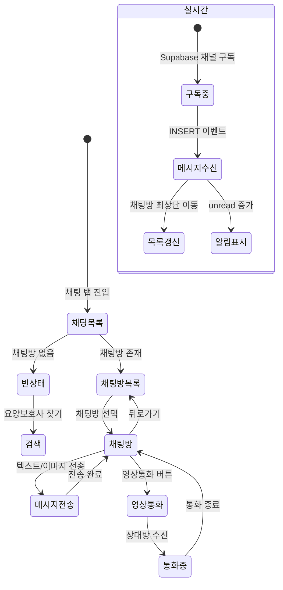

# FS-G-009 채팅 및 영상통화

> 문서 버전: 1.0
> 작성일: 2026-03-30
> 우선순위: P0
> 상태: Draft

---

## 1. 개요
- 매칭 수락 이후 보호자와 요양보호사가 실시간 채팅으로 소통하고, 필요 시 영상통화를 할 수 있는 기능. 채팅은 Supabase Realtime 기반 실시간 메시지 전송을 지원한다.
- 대상 사용자: 보호자, 요양보호사 (매칭 수락 후)
- 관련 PRD 섹션: 2.11 채팅 및 영상통화

## 2. 유저 스토리
- As a 보호자, I want to 매칭된 요양보호사와 앱 내에서 채팅하여, so that 돌봄 관련 사항을 빠르게 소통할 수 있다.
- As a 보호자, I want to 돌봄 중 영상통화로 어르신 상태를 확인하여, so that 원격에서도 안심할 수 있다.

## 3. 화면 구성

### 3.1 화면 목록
| 화면 ID | 화면명 | 진입 경로 | 구현 파일 |
|---------|--------|-----------|-----------|
| G-009-S1 | 채팅 목록 | 하단 탭 "채팅" | `src/app/(app)/chat/page.tsx` |
| G-009-S2 | 채팅방 | 채팅 목록 > 대화방 선택 | `src/app/(app)/chat/[id]/page.tsx` |

### 3.2 화면별 상세

#### G-009-S1 채팅 목록 화면
- **헤더**: "채팅" (bg-white, border-b)
- **빈 상태**: EmptyState (MessageSquare 아이콘)
  - "아직 대화가 없습니다"
  - "요양보호사와 매칭되면 채팅이 시작됩니다"
  - 액션 버튼: 보호자 → "요양보호사 찾기", 요양보호사 → "일자리 찾기"
- **채팅방 목록** (divide-y):
  - Avatar (상대방 프로필 이미지)
  - 상대방 이름 (font-bold)
  - 마지막 메시지 미리보기 (truncate)
  - 마지막 메시지 날짜 (월/일)
  - 읽지 않은 메시지 수 배지 (primary-500 원형, 99+)
- **실시간 업데이트**: Supabase Realtime 구독
  - InterviewMessage INSERT 이벤트 감지
  - 새 메시지 수신 시 해당 채팅방 최상단 이동
  - 상대방 메시지 시 unreadCount 증가
  - 알 수 없는 matchId 메시지 시 전체 refetch
- **인터랙션**: 채팅방 탭 → `/chat/[matchId]` 이동

#### G-009-S2 채팅방 화면
- **헤더**: 상대방 이름, 뒤로가기
- **메시지 영역**:
  - 발신 메시지: 우측 정렬, primary 배경색
  - 수신 메시지: 좌측 정렬, gray 배경색
  - 시스템 메시지: 중앙, 회색 텍스트
  - 이미지 메시지: 인라인 미리보기
  - 파일 메시지: 파일명 + 다운로드 링크
  - 시간 표시: 각 메시지 하단
  - 읽음 확인: "읽음" 표시
- **입력 영역**:
  - 텍스트 입력 필드
  - 이미지 첨부 버튼 (카메라/갤러리)
  - 파일 첨부 버튼
  - 전송 버튼
- **실시간 수신**: Supabase Realtime 구독으로 새 메시지 즉시 표시
- **영상통화 버튼**: (PRD 요구, 현재 미구현)

## 4. 상세 동작 명세

### 4.1 정상 플로우

#### 채팅 목록 조회
1. 보호자가 하단 탭 "채팅" 진입
2. GET /api/chat 호출 → 매칭 기반 채팅방 목록 반환
3. 각 채팅방: matchId, 상태, 마지막 메시지, 상대방 정보
4. REJECTED/CANCELLED 상태 매칭은 제외
5. Supabase Realtime 구독 시작 (chat-list 채널)

#### 채팅 메시지 교환
1. 채팅방 진입 → GET /api/chat/[matchId] 또는 /api/matches/[id] 로 메시지 로드
2. 텍스트 입력 후 전송 → POST /api/chat/[matchId]
3. Supabase Realtime으로 상대방에게 실시간 전달
4. 이미지 첨부: 파일 업로드(POST /api/upload) → imageUrl 포함 메시지 전송

#### 실시간 메시지 수신 (채팅 목록)
1. Supabase channel "chat-list" 구독
2. InterviewMessage 테이블 INSERT 이벤트 감지
3. 해당 matchId 채팅방의 lastMessage 업데이트
4. 상대방 메시지인 경우 unreadCount 증가
5. 해당 채팅방을 목록 최상단으로 이동

#### 영상통화 (PRD 요구)
1. 채팅방에서 영상통화 버튼 탭
2. 상대방에게 영상통화 요청 알림
3. 상대방 수신 → 3초 이내 영상 연결 (Agora SDK)
4. 최대 60분 통화
5. 통화 중 사진 캡처 가능 (보호자 동의 필요)

### 4.2 예외 플로우
- **미인증 상태**: authStatus === "unauthenticated" → `/login` 리다이렉트
- **세션 로딩 중**: 로딩 스피너 표시
- **채팅방 없음 (빈 상태)**: EmptyState 컴포넌트 + 검색 페이지 링크
- **실시간 구독 오류**: console.error 로깅, 기능은 계속 동작 (폴백: 수동 새로고침)
- **상대방 앱 미사용**: 푸시 알림으로 메시지 일부 전달 (민감 정보 미포함, PRD 요구)

### 4.3 비즈니스 규칙
- 채팅방 = Match (1:1 매핑, matchId 기반)
- 채팅 접근: REJECTED, CANCELLED 상태 매칭은 채팅 목록에서 제외
- 메시지 유형: TEXT(기본), IMAGE, FILE, SYSTEM, CONTRACT
- 파일 첨부: 최대 10MB (PRD 요구)
- 음성 메시지: 최대 2분 (PRD 요구, 미구현)
- 읽음 확인: isRead 플래그 + readAt 타임스탬프
- 실시간: Supabase Realtime (postgres_changes, INSERT on InterviewMessage)
- 영상통화: Agora SDK 기반 1:1 화상, 최대 60분 (PRD 요구, 미구현)
- 푸시 알림: 앱 미사용 시 메시지 알림 (PRD 요구, 미구현)

## 5. 수용 기준 (Acceptance Criteria)

```
Given 매칭이 수락된 후
When 채팅방에 진입하면
Then 이전 대화 내역과 함께 파일/영상통화 버튼이 노출된다

Given 채팅방에서 메시지를 전송했을 때
When 상대방이 앱을 사용 중이면
Then 실시간으로 메시지가 표시된다 (Supabase Realtime)

Given 영상통화 버튼을 탭했을 때
When 상대방이 수신하면
Then 3초 이내에 영상이 연결된다 (Agora SDK 활용)

Given 채팅 메시지 발송 시
When 상대방이 앱을 사용 중이 아닐 때
Then 푸시 알림으로 메시지 내용 일부가 전달된다 (민감 정보 미포함)

Given 채팅 목록에서
When 새 메시지가 수신되면
Then 해당 채팅방이 목록 최상단으로 이동하고 읽지 않은 메시지 수가 표시된다
```

## 6. API 연동

### 6.1 사용 API 목록
| Method | Endpoint | 설명 |
|--------|----------|------|
| GET | `/api/chat` | 채팅방 목록 조회 (매칭 기반) |
| GET | `/api/chat/[matchId]` | 채팅 메시지 목록 조회 |
| POST | `/api/chat/[matchId]` | 메시지 발송 |
| POST | `/api/upload` | 파일/이미지 업로드 |
| GET | `/api/matches/[id]` | 매칭 + 메시지 전체 조회 |

### 6.2 주요 요청/응답 스키마

#### GET /api/chat
**성공 응답 (200):**
```json
{
  "rooms": [
    {
      "id": "matchId...",
      "status": "ACCEPTED",
      "lastMessage": {
        "id": "cuid...",
        "content": "내일 오후 2시에 방문 가능합니다.",
        "messageType": "TEXT",
        "createdAt": "2026-03-30T14:30:00Z"
      },
      "updatedAt": "2026-03-30T14:30:00Z",
      "partner": {
        "id": "userId...",
        "name": "김OO",
        "profileImage": "https://..."
      }
    }
  ]
}
```

#### POST /api/chat/[matchId]
**요청 (텍스트):**
```json
{
  "content": "안녕하세요, 내일 방문 가능하신가요?",
  "messageType": "TEXT"
}
```

**요청 (이미지):**
```json
{
  "content": "오늘 어르신 식사 사진입니다",
  "messageType": "IMAGE",
  "imageUrl": "https://storage.../lunch.jpg"
}
```

**성공 응답 (201):**
```json
{
  "message": {
    "id": "cuid...",
    "matchId": "...",
    "senderId": "...",
    "content": "안녕하세요...",
    "messageType": "TEXT",
    "isRead": false,
    "createdAt": "2026-03-30T15:00:00Z"
  }
}
```

#### Supabase Realtime 구독
```typescript
supabase
  .channel("chat-list")
  .on("postgres_changes", {
    event: "INSERT",
    schema: "public",
    table: "InterviewMessage",
  }, (payload) => {
    // 새 메시지 처리: 채팅방 목록 업데이트
  })
  .subscribe();
```

## 7. 상태 다이어그램


## 8. 데이터 모델

### InterviewMessage 테이블
| 필드 | 타입 | 설명 |
|------|------|------|
| id | String (cuid) | PK |
| matchId | String | Match FK (채팅방 식별) |
| senderId | String | User FK (발신자) |
| content | String | 메시지 내용 |
| messageType | String | TEXT / IMAGE / FILE / SYSTEM / CONTRACT |
| imageUrl | String? | 이미지 URL |
| fileName | String? | 첨부 파일명 |
| fileUrl | String? | 첨부 파일 URL |
| isRead | Boolean | 읽음 여부 (기본 false) |
| readAt | DateTime? | 읽음 시간 |
| createdAt | DateTime | 생성일 |

**인덱스:**
- `[matchId, createdAt]`: 채팅방별 메시지 정렬 조회
- `[senderId]`: 발신자별 조회

### Match 테이블 (채팅방 역할)
| 필드 | 타입 | 설명 |
|------|------|------|
| id | String | 채팅방 ID (= matchId) |
| guardianId | String | 보호자 프로필 FK |
| caregiverId | String | 요양보호사 프로필 FK |
| status | String | 매칭 상태 (채팅 접근 제어) |
| messages | InterviewMessage[] | 채팅 메시지 목록 |

## 9. 연관 기능
- **선행 기능**: FS-G-005 매칭요청 (수락 후 채팅방 생성)
- **후행 기능**: FS-G-006 상담/면접 (채팅 기반 상담), FS-G-007 전자계약 (채팅에서 계약 진행)
- **의존 기능**: Match 모델, Supabase Realtime, (향후) Agora SDK

## 10. 구현 현황
| 항목 | 상태 | 비고 |
|------|------|------|
| 프론트엔드 | ⚠️ | 채팅 목록 + 채팅방 + Supabase Realtime 구현. 영상통화/음성메시지/푸시알림 미구현 |
| API | ✅ | 채팅 목록(GET /api/chat) + 메시지 CRUD 완전 구현 |
| DB 모델 | ✅ | InterviewMessage 모델 + 인덱스 완전 구현 |
