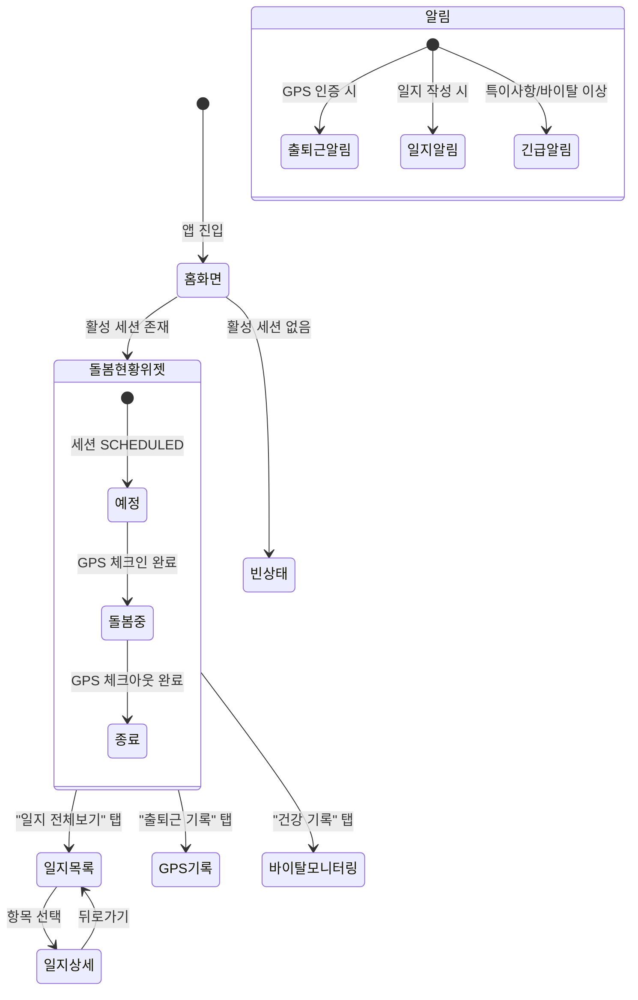

# FS-G-010 실시간 돌봄 모니터링

> 문서 버전: 1.0
> 작성일: 2026-03-30
> 우선순위: P1
> 상태: Draft

---

## 1. 개요
- 요양보호사가 돌봄 중 작성한 일지를 보호자가 실시간으로 확인하고, GPS 기반 출퇴근 인증 기록 및 건강 바이탈 데이터를 모니터링하는 기능. 원거리 보호자나 바쁜 직장인 보호자가 어르신의 돌봄 상태를 앱에서 투명하게 확인할 수 있도록 한다.
- 대상 사용자: 보호자 (매칭 계약 체결 후, 돌봄 진행 중)
- 관련 PRD 섹션: 2.8 실시간 돌봄 모니터링

## 2. 유저 스토리
- As a 보호자, I want to 직장에 있는 동안 요양보호사가 부모님께 무엇을 하고 있는지 실시간으로 확인하여, so that 안심하고 일에 집중할 수 있다.
- As a 보호자, I want to 요양보호사의 출퇴근 GPS 인증 기록을 확인하여, so that 정확한 돌봄 시간을 파악할 수 있다.
- As a 보호자, I want to 어르신의 건강 바이탈(혈압, 혈당, 체온 등) 기록을 확인하여, so that 건강 이상 징후를 조기에 파악할 수 있다.
- As a 원거리 보호자, I want to 돌봄 일지를 사진과 함께 확인하여, so that 멀리 있어도 어르신의 상태를 파악할 수 있다.

## 3. 화면 구성

### 3.1 화면 목록
| 화면 ID | 화면명 | 진입 경로 | 구현 파일 |
|---------|--------|-----------|-----------|
| G-010-S1 | 돌봄 현황 대시보드 | 홈 > "돌봄 현황" 카드 | `src/app/(app)/home/page.tsx` (홈 내 위젯) |
| G-010-S2 | 돌봄 일지 목록 | 홈 > 돌봄 현황 > "일지 전체보기" | `src/app/(app)/care/[id]/page.tsx` |
| G-010-S3 | 돌봄 일지 상세 | 일지 목록 > 항목 선택 | `src/app/(app)/care/[id]/journal/page.tsx` (조회 모드) |
| G-010-S4 | GPS 출퇴근 기록 | 돌봄 현황 > "출퇴근 기록" | 미구현 |
| G-010-S5 | 바이탈 모니터링 | 돌봄 현황 > "건강 기록" | 미구현 |

### 3.2 화면별 상세

#### G-010-S1 돌봄 현황 대시보드 (홈 위젯)
- **위치**: 홈 화면 상단 카드 영역
- **표시 정보**:
  - 현재 돌봄 상태 배지: "돌봄 중" (green) / "예정" (blue) / "종료" (gray)
  - 요양보호사 이름 + 프로필 사진
  - 출근 시간 (GPS 인증 시간)
  - 퇴근 시간 (GPS 인증 시간, 미퇴근 시 "-")
  - 총 돌봄 시간 (실시간 카운트)
  - 오늘의 활동 요약 (최근 일지 미리보기)
- **인터랙션**: 카드 탭 → 돌봄 일지 목록 (G-010-S2) 이동

#### G-010-S2 돌봄 일지 목록
- **헤더**: "돌봄 일지" + 뒤로가기
- **필터**: 날짜 범위 선택 (DatePicker)
- **목록 아이템** (divide-y):
  - 날짜 + 요양보호사 이름
  - 돌봄 시간 (시작 ~ 종료)
  - 활동 태그 (식사, 운동, 투약 등)
  - 정서 상태 이모지
  - 사진 첨부 여부 아이콘
  - 특이사항 표시 (빨간 점)
- **빈 상태**: "아직 작성된 일지가 없습니다"

#### G-010-S3 돌봄 일지 상세 (보호자 조회 모드)
- **헤더**: 날짜 + 뒤로가기
- **섹션 구성**:
  - **기본 정보**: 돌봄 날짜, 시간, 요양보호사 이름
  - **활동 내역**: 체크된 활동 태그 (식사, 운동/산책, 투약, 외출, 인지활동, 목욕)
  - **식사 기록**: 섭취 음식, 섭취량, 특이사항
  - **건강 상태 (바이탈)**:
    - 혈압 (수축기/이완기 mmHg)
    - 혈당 (mg/dL)
    - 체온 (도)
    - 수분 섭취량 (mL)
  - **투약 관리**: 투약 여부 체크
  - **배변 상태**: 정상/설사/변비/없음
  - **정서 상태**: 기분 (최고/좋음/보통/힘듦), 정신 상태 (양호/불안/혼란/졸음), 수면 질 (양호/보통/불량)
  - **운동 기록**: 운동 내용 텍스트
  - **특이사항**: 자유 텍스트 (낙상, 통증 호소 등)
  - **사진**: 첨부 이미지 갤러리 (보호자 동의 설정에 따라)
- **알림 연동**: 특이사항 기재 시 푸시 알림 ("긴급 확인 필요" 배지)

#### G-010-S4 GPS 출퇴근 기록 (미구현)
- **헤더**: "출퇴근 기록" + 뒤로가기
- **표시 정보**:
  - 날짜별 출퇴근 목록
  - 출근 시간 + GPS 인증 주소
  - 퇴근 시간 + GPS 인증 주소
  - 지도 (미니맵) 표시 (Kakao/Google Maps)
  - 체크인 위치와 돌봄 주소 간 거리 표시
- **비즈니스 규칙**:
  - GPS 인증 반경: 돌봄 주소 기준 300m 이내 자동 인증
  - 300m 초과 시 수동 사유 입력 필요
  - 체크인 후 20분 이상 300m+ 이탈 시 보호자 알림

#### G-010-S5 바이탈 모니터링 (미구현)
- **헤더**: "건강 기록" + 뒤로가기
- **차트 영역**:
  - 혈압 추이 그래프 (7일/30일)
  - 혈당 추이 그래프
  - 체온 추이 그래프
  - 수분 섭취량 바 차트
- **이상 징후 알림 설정**:
  - 혈압 상한/하한 임계값 설정
  - 혈당 상한/하한 임계값 설정
  - 체온 상한 임계값 설정
  - 임계값 초과 시 자동 푸시 알림
- **데이터 소스**: 돌봄 일지(Journal) 모델의 바이탈 필드

## 4. 상세 동작 명세

### 4.1 정상 플로우

#### 실시간 돌봄 현황 조회
1. 보호자가 홈 화면에 진입
2. 활성 CareSession 조회 (status: IN_PROGRESS)
3. GPS 체크인 정보(checkInTime, checkInAddress) 표시
4. 돌봄 중 상태 배지 + 실시간 돌봄 시간 카운트
5. 최근 일지(Journal) 미리보기 표시

#### 돌봄 일지 실시간 확인
1. 요양보호사가 돌봄 일지 작성 (POST /api/care-sessions/[id]/journals)
2. 저장 완료 시 보호자에게 푸시 알림 발송
3. 보호자 앱에서 일지 목록 새로고침 (pull-to-refresh 또는 자동)
4. 일지 상세 진입 시 모든 바이탈, 활동, 사진 정보 표시
5. 특이사항 기재 시 "긴급 확인 필요" 표시

#### GPS 출퇴근 인증 확인
1. 요양보호사가 돌봄 장소 도착 → GPS 체크인 수행
2. CareSession.checkInTime, checkInLat, checkInLng 업데이트
3. 보호자에게 "출근 알림" 푸시 발송
4. 돌봄 종료 시 체크아웃 → checkOutTime, checkOutLat, checkOutLng 업데이트
5. 보호자에게 "퇴근 알림" 푸시 발송

### 4.2 예외 플로우
- **GPS 인증 실패**: 위치 서비스 비활성화 시 수동 체크인 허용 (사유 입력 필수)
- **일지 미작성**: 돌봄 종료 2시간 후에도 일지 미작성 시 요양보호사에게 리마인더 알림
- **GPS 이탈 감지**: 체크인 후 20분 이상 300m+ 이탈 시 보호자에게 알림
- **바이탈 이상치**: 설정 임계값 초과 시 보호자에게 즉시 푸시 알림 + "긴급 확인 필요" 배지
- **네트워크 오류**: 일지 작성 중 네트워크 끊김 시 로컬 저장 후 복구 시 자동 업로드

### 4.3 비즈니스 규칙
- 돌봄 일지 조회 권한: 해당 CareSession의 매칭 보호자 + 공동보호자(최대 5명)만 열람 가능
- GPS 인증 반경: 돌봄 주소 기준 300m 이내
- 일지 작성 주체: 요양보호사만 작성 가능 (보호자는 조회만)
- 사진 첨부: 보호자 사전 동의 설정에 따라 표시 (동의 미설정 시 사진 미표시)
- 바이탈 기록: 선택 입력 (필수 아님), 입력된 항목만 표시
- 실시간 업데이트: 일지 저장 후 5초 이내 보호자 앱 반영 (PRD 요구)
- 푸시 알림 발송 조건:
  - 출근/퇴근 GPS 인증 시
  - 돌봄 일지 작성 완료 시
  - 특이사항(낙상, 이상 증상) 보고 시 (즉시, "긴급 확인 필요")
  - 바이탈 임계값 초과 시

## 5. 수용 기준 (Acceptance Criteria)

```
Given 요양보호사가 돌봄 시작 GPS 인증을 완료했을 때
When 보호자 앱의 홈 화면을 확인하면
Then "돌봄 중" 상태 배지와 출근 시간이 표시된다

Given 요양보호사가 돌봄 일지를 작성하고 저장했을 때
When 보호자가 앱을 확인하면
Then 5초 이내에 일지 내용이 반영된다 (푸시 알림 포함)

Given 특이사항(낙상, 이상 증상)을 요양보호사가 보고하면
When 보호자 앱에서 알림을 수신하면
Then 즉시 푸시 알림과 함께 "긴급 확인 필요" 배지가 표시된다

Given 보호자가 돌봄 일지 목록에 진입했을 때
When 날짜 범위를 선택하면
Then 해당 기간의 일지만 필터링되어 표시된다

Given 요양보호사가 GPS 체크인 후 20분 이상 300m 밖으로 이탈했을 때
When 시스템이 이탈을 감지하면
Then 보호자에게 "돌봄 장소 이탈" 알림이 발송된다

Given 바이탈 기록에서 혈압이 설정 임계값을 초과했을 때
When 일지가 저장되면
Then 보호자에게 "건강 이상 징후" 긴급 알림이 발송된다
```

## 6. API 연동

### 6.1 사용 API 목록
| Method | Endpoint | 설명 |
|--------|----------|------|
| GET | `/api/care-sessions?status=IN_PROGRESS` | 활성 돌봄 세션 조회 (홈 위젯용) |
| GET | `/api/care-sessions/[id]` | 돌봄 세션 상세 (GPS 체크인/아웃 포함) |
| GET | `/api/care-sessions/[id]/journals` | 돌봄 일지 목록 조회 |
| GET | `/api/care-sessions/[id]/journals/[journalId]` | 돌봄 일지 상세 조회 |
| GET | `/api/care-sessions/[id]/vitals` | 바이탈 추이 데이터 조회 (미구현) |
| PUT | `/api/care-sessions/[id]/check-in` | GPS 체크인 (요양보호사 전용) |
| PUT | `/api/care-sessions/[id]/check-out` | GPS 체크아웃 (요양보호사 전용) |

### 6.2 주요 요청/응답 스키마

#### GET /api/care-sessions?status=IN_PROGRESS
**성공 응답 (200):**
```json
{
  "sessions": [
    {
      "id": "cuid...",
      "matchId": "...",
      "status": "IN_PROGRESS",
      "scheduledDate": "2026-03-30",
      "startTime": "09:00",
      "endTime": "13:00",
      "checkInTime": "2026-03-30T09:02:00Z",
      "checkInAddress": "서울시 도봉구 방학동 123-4",
      "checkOutTime": null,
      "caregiver": {
        "id": "...",
        "name": "김OO",
        "profileImage": "https://..."
      },
      "latestJournal": {
        "id": "...",
        "title": "오전 돌봄 일지",
        "activities": ["meal", "medication"],
        "mood": "good",
        "createdAt": "2026-03-30T11:30:00Z"
      }
    }
  ]
}
```

#### GET /api/care-sessions/[id]/journals
**성공 응답 (200):**
```json
{
  "journals": [
    {
      "id": "cuid...",
      "careSessionId": "...",
      "title": "오전 돌봄 일지",
      "content": "어르신 컨디션 양호합니다.",
      "activities": ["meal", "exercise", "medication"],
      "mood": "good",
      "meals": "현미밥, 된장찌개, 김치 (80% 섭취)",
      "bloodPressure": "130/85",
      "bloodSugar": 110,
      "temperature": 36.5,
      "waterIntake": 500,
      "bowelMovement": "정상",
      "medicationTaken": true,
      "exerciseLog": "동네 산책 30분",
      "mentalState": "양호",
      "sleepQuality": "양호",
      "images": ["https://storage.../photo1.jpg"],
      "createdAt": "2026-03-30T11:30:00Z"
    }
  ],
  "total": 15,
  "page": 1
}
```

## 7. 상태 다이어그램


## 8. 데이터 모델

### CareSession 테이블 (기존, GPS 체크인/아웃 포함)
| 필드 | 타입 | 설명 |
|------|------|------|
| id | String (cuid) | PK |
| matchId | String | Match FK |
| caregiverId | String | CaregiverProfile FK |
| status | String | SCHEDULED / IN_PROGRESS / COMPLETED / CANCELLED |
| scheduledDate | DateTime | 예정 날짜 |
| startTime | String | 시작 시간 |
| endTime | String | 종료 시간 |
| actualStart | DateTime? | 실제 시작 시간 |
| actualEnd | DateTime? | 실제 종료 시간 |
| checkInLat | Float? | 체크인 위도 |
| checkInLng | Float? | 체크인 경도 |
| checkInTime | DateTime? | 체크인 시간 |
| checkInAddress | String? | 체크인 주소 |
| checkOutLat | Float? | 체크아웃 위도 |
| checkOutLng | Float? | 체크아웃 경도 |
| checkOutTime | DateTime? | 체크아웃 시간 |

### Journal 테이블 (기존)
| 필드 | 타입 | 설명 |
|------|------|------|
| id | String (cuid) | PK |
| careSessionId | String | CareSession FK |
| title | String | 일지 제목 |
| content | String | 일지 내용 |
| activities | String (JSON) | 활동 태그 배열 |
| mood | String? | 정서 상태 (great/good/normal/bad) |
| meals | String? | 식사 기록 |
| bloodPressure | String? | 혈압 (mmHg) |
| bloodSugar | Int? | 혈당 (mg/dL) |
| temperature | Float? | 체온 |
| waterIntake | Int? | 수분 섭취량 (mL) |
| bowelMovement | String? | 배변 상태 |
| medicationTaken | Boolean | 투약 여부 |
| exerciseLog | String? | 운동 기록 |
| mentalState | String? | 정신 상태 |
| sleepQuality | String? | 수면 질 |
| images | String (JSON) | 첨부 이미지 URL 배열 |
| createdAt | DateTime | 생성일 |

**인덱스:**
- `[careSessionId, createdAt]`: 세션별 일지 정렬 조회

## 9. 연관 기능
- **선행 기능**: FS-G-005 매칭요청 (매칭 수락 후 CareSession 생성), FS-G-007 전자계약 (계약 체결 후 돌봄 시작)
- **후행 기능**: FS-G-011 리뷰/평점 (돌봄 완료 후 리뷰 작성), FS-G-012 긴급돌봄요청 (긴급 상황 시 대체 인력)
- **의존 기능**: CareSession 모델, Journal 모델, GPS API (Geolocation), 푸시 알림 서비스, (향후) 실시간 구독 (Supabase Realtime)
- **연관 요양보호사 기능**: FS-C-005 돌봄수행/일지작성 (요양보호사 측 일지 작성 화면)

## 10. 구현 현황
| 항목 | 상태 | 비고 |
|------|------|------|
| DB 모델 (CareSession) | ✅ | GPS 체크인/아웃 필드 포함, 완전 구현 |
| DB 모델 (Journal) | ✅ | 바이탈 필드(혈압, 혈당, 체온 등) 포함, 완전 구현 |
| 돌봄 일지 작성 (요양보호사) | ✅ | `src/app/(app)/care/[id]/journal/page.tsx` 구현 완료 |
| 돌봄 일지 조회 (보호자) | ⚠️ | 돌봄 관리 페이지 존재하나 보호자 전용 조회 모드 미분리 |
| 홈 돌봄 현황 위젯 | ⚠️ | 홈 화면에 기본 구조 존재, 실시간 모니터링 위젯 미구현 |
| GPS 출퇴근 기록 조회 (보호자) | ❌ | CareSession에 GPS 필드 존재하나 보호자용 조회 화면 미구현 |
| GPS 이탈 감지 알림 | ❌ | 미구현 |
| 바이탈 추이 차트 | ❌ | Journal에 바이탈 데이터 저장 가능하나 차트 화면 미구현 |
| 바이탈 이상 징후 알림 | ❌ | 미구현 |
| 푸시 알림 (출퇴근/일지/긴급) | ❌ | Notification 모델 존재하나 실시간 푸시 미구현 |
| 공동보호자 일지 공유 | ❌ | 공동보호자 페이지 존재하나 일지 공유 권한 미구현 |
