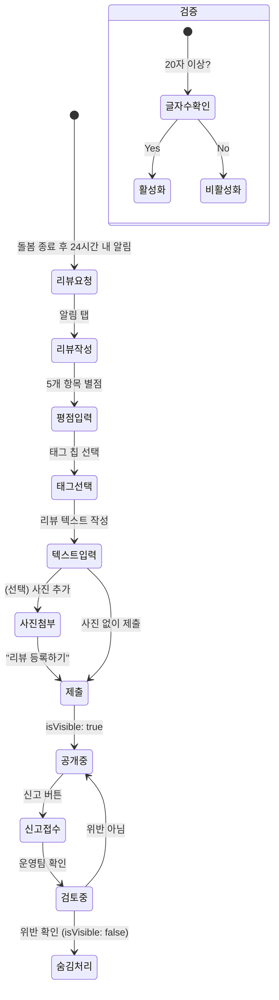

# FS-G-011 리뷰 및 평점

> 문서 버전: 1.0
> 작성일: 2026-03-30
> 우선순위: P1
> 상태: Draft

---

## 1. 개요
- 돌봄 계약 종료 또는 월별로 보호자가 요양보호사에 대한 다차원 평점(5개 항목)과 텍스트 리뷰를 작성하고, 태그를 선택하는 기능. 부적절한 리뷰에 대한 신고 및 운영팀 검토 프로세스를 포함한다.
- 대상 사용자: 보호자 (돌봄 서비스 이용 후)
- 관련 PRD 섹션: 2.10 리뷰 및 평점

## 2. 유저 스토리
- As a 보호자, I want to 돌봄 서비스 완료 후 요양보호사에 대한 상세 평가를 남겨서, so that 다른 보호자가 참고할 수 있고 서비스 품질이 개선된다.
- As a 보호자, I want to 항목별(전문성, 친절함, 신뢰도, 시간 준수, 의사소통) 평점을 개별적으로 매겨서, so that 정확한 평가가 가능하다.
- As a 보호자, I want to 리뷰에 사진을 첨부하여, so that 돌봄 상황을 시각적으로 공유할 수 있다.
- As a 보호자, I want to 부적절한 리뷰를 신고하여, so that 공정한 리뷰 환경이 유지된다.

## 3. 화면 구성

### 3.1 화면 목록
| 화면 ID | 화면명 | 진입 경로 | 구현 파일 |
|---------|--------|-----------|-----------|
| G-011-S1 | 리뷰 작성 | 돌봄 완료 알림 > 리뷰 작성 / 마이 > 리뷰 관리 > 작성 | 미구현 (리뷰 작성 전용 화면) |
| G-011-S2 | 리뷰 관리 (내가 쓴 리뷰) | 마이페이지 > 리뷰 관리 | `src/app/(app)/my/reviews/page.tsx` |
| G-011-S3 | 리뷰 목록 (요양보호사 프로필) | 요양보호사 상세 > 리뷰 탭 | `src/app/(app)/caregiver/[id]/page.tsx` (리뷰 섹션) |

### 3.2 화면별 상세

#### G-011-S1 리뷰 작성 화면
- **헤더**: "리뷰 작성" + 뒤로가기
- **대상 정보**: 요양보호사 이름 + 프로필 이미지 + 돌봄 기간
- **항목별 평점** (각 1~5점 별점):
  - 전문성: "케어 기술 및 지식"
  - 친절함: "환자 및 보호자 대응 태도"
  - 신뢰도: "약속 이행, 정직함"
  - 시간 준수: "출퇴근 시간, 연락 응답"
  - 의사소통: "일지 작성 성실도, 보고 품질"
- **종합 평점**: 5개 항목 평균 자동 계산 표시
- **태그 선택** (다중 선택, 선택형 칩):
  - 치매케어 전문가
  - 정성스러운 케어
  - 소통 잘됨
  - 위생관리 철저
  - 가족처럼 돌봐줌
  - 재이용 의향
- **텍스트 리뷰**:
  - 텍스트 영역 (placeholder: "돌봄 경험을 자세히 알려주세요")
  - 최소 20자, 최대 500자
  - 글자 수 카운터 (20/500)
- **사진 첨부**:
  - 최대 3장
  - 카메라/갤러리 선택
  - 미리보기 + 삭제 버튼
- **제출 버튼**: "리뷰 등록하기" (primary, 최소 글자수 미충족 시 disabled)

#### G-011-S2 리뷰 관리 (내가 쓴 리뷰)
- **헤더**: "리뷰 관리" + 뒤로가기 (BackHeader)
- **통계 카드**:
  - 평균 평점 (큰 숫자 표시)
  - 총 리뷰 수
  - 별점 분포 바 차트
- **리뷰 목록** (divide-y):
  - 요양보호사 이름 + 프로필 이미지
  - 별점 (★) + 작성 날짜
  - 리뷰 텍스트 (최대 2줄 미리보기)
  - 이미지 썸네일 (있는 경우)
- **빈 상태**: "작성한 리뷰가 없습니다"

#### G-011-S3 리뷰 목록 (요양보호사 프로필 내)
- **섹션 헤더**: "리뷰 (N건)" + "전체 보기" 링크
- **항목별 평균 평점**: 전문성/친절함/신뢰도/시간준수/의사소통 각각 표시
- **리뷰 아이템**:
  - 보호자 이름 (익명 처리: "김O준")
  - 별점 + 작성 날짜
  - 태그 배지 (선택한 태그)
  - 리뷰 텍스트
  - 첨부 사진
  - 신고 버튼 (더보기 메뉴)

## 4. 상세 동작 명세

### 4.1 정상 플로우

#### 리뷰 작성
1. 돌봄 계약 종료 또는 월별 평가 시점에 보호자에게 리뷰 요청 알림 발송
2. 알림 탭 → 리뷰 작성 화면 진입
3. 5개 항목 별점 입력 (1~5점 각각)
4. 태그 선택 (0개 이상, 다중 선택)
5. 텍스트 리뷰 입력 (최소 20자)
6. (선택) 사진 첨부 (최대 3장)
7. "리뷰 등록하기" 탭 → POST /api/reviews
8. 성공 시 토스트: "리뷰가 등록되었습니다"
9. 요양보호사 프로필 평균 평점 즉시 갱신

#### 리뷰 신고
1. 요양보호사 프로필 리뷰 목록에서 부적절 리뷰 발견
2. 더보기(⋯) 메뉴 > "신고" 선택
3. 신고 사유 선택: 허위 리뷰 / 욕설·비방 / 개인정보 노출 / 광고·스팸 / 기타
4. (선택) 상세 사유 텍스트 입력
5. "신고 접수" 탭 → POST /api/reviews/[id]/report
6. 성공 시 토스트: "신고가 접수되었습니다. 24시간 내 검토됩니다."
7. 운영팀 검토 → 위반 확인 시 리뷰 숨김(isVisible: false) 처리

### 4.2 예외 플로우
- **중복 리뷰**: 동일 CareSession에 대해 이미 리뷰 작성 시 → "이미 리뷰를 작성하셨습니다" 안내 + 수정 유도
- **최소 글자수 미충족**: 20자 미만 시 제출 버튼 비활성화 + 안내 텍스트 표시
- **이미지 업로드 실패**: "이미지 업로드에 실패했습니다. 다시 시도해주세요" 토스트
- **리뷰 대상 없음**: 완료된 CareSession이 없는 경우 빈 상태 표시
- **리뷰 작성 기한 초과**: 돌봄 종료 후 30일 이내만 작성 가능, 초과 시 "리뷰 작성 기한이 지났습니다" 안내

### 4.3 비즈니스 규칙
- **리뷰 작성 자격**: 보호자만 작성 가능 (role === "GUARDIAN")
- **리뷰 대상**: 해당 보호자와 매칭된 요양보호사만 (CareSession 기반)
- **중복 방지**: CareSession당 1개 리뷰만 허용 (careSessionId unique 제약)
- **평점 범위**: 각 항목 1~5 정수, 종합 평점 = 5개 항목 산술 평균
- **텍스트 제한**: 최소 20자, 최대 500자
- **사진 제한**: 최대 3장, 장당 최대 10MB
- **태그 종류**: 치매케어 전문가 / 정성스러운 케어 / 소통 잘됨 / 위생관리 철저 / 가족처럼 돌봐줌 / 재이용 의향
- **리뷰 공개**: 작성 즉시 공개 (isVisible: true)
- **리뷰 숨김**: 신고 접수 → 운영팀 검토 → 위반 시 isVisible: false
- **신고 검토**: 24시간 이내 운영팀 검토 (SLA)
- **리뷰 작성 기한**: 돌봄 종료 후 30일 이내
- **익명 처리**: 리뷰 작성자 이름은 부분 마스킹 (예: "김O준")
- **리뷰 요청 알림**: 돌봄 종료 후 24시간 이내 자동 발송

## 5. 수용 기준 (Acceptance Criteria)

```
Given 돌봄 계약이 종료된 후
When 보호자가 리뷰 작성 요청 알림을 수신하면
Then 알림 탭 후 리뷰 작성 화면으로 바로 진입할 수 있다

Given 보호자가 5개 항목(전문성, 친절함, 신뢰도, 시간 준수, 의사소통) 평점을 입력했을 때
When 종합 평점 영역을 확인하면
Then 5개 항목의 산술 평균이 자동 계산되어 표시된다

Given 리뷰 텍스트가 20자 미만일 때
When 제출 버튼을 확인하면
Then 버튼이 비활성화 상태이고 "최소 20자 이상 입력해주세요" 안내가 표시된다

Given 리뷰 작성 후 제출하면
When 요양보호사 프로필을 확인하면
Then 즉시 반영되고 평균 평점이 갱신된다

Given 부적절한 내용의 리뷰가 작성된 경우
When 요양보호사 또는 운영자가 신고하면
Then 24시간 이내에 운영팀이 검토하고 위반 시 리뷰가 숨김 처리된다

Given 동일 CareSession에 대해 이미 리뷰를 작성한 경우
When 다시 리뷰 작성을 시도하면
Then "이미 리뷰를 작성하셨습니다" 안내와 함께 수정 옵션이 제공된다
```

## 6. API 연동

### 6.1 사용 API 목록
| Method | Endpoint | 설명 |
|--------|----------|------|
| GET | `/api/reviews?caregiverId={id}` | 요양보호사별 리뷰 목록 (페이지네이션) |
| GET | `/api/reviews/my` | 내가 작성한 리뷰 목록 |
| POST | `/api/reviews` | 리뷰 작성 |
| PUT | `/api/reviews/[id]` | 리뷰 수정 |
| POST | `/api/reviews/[id]/report` | 리뷰 신고 |
| POST | `/api/upload` | 리뷰 사진 업로드 |

### 6.2 주요 요청/응답 스키마

#### POST /api/reviews
**요청:**
```json
{
  "careSessionId": "cuid...",
  "overallRating": 5,
  "professionalism": 5,
  "attitude": 4,
  "reliability": 5,
  "punctuality": 5,
  "communication": 4,
  "content": "치매 어르신 전문적으로 케어해주셔서 정말 감사합니다. 매일 일지도 꼼꼼하게 작성해주시고...",
  "tags": ["치매케어 전문가", "정성스러운 케어", "소통 잘됨"],
  "images": ["https://storage.../review1.jpg", "https://storage.../review2.jpg"]
}
```

**성공 응답 (201):**
```json
{
  "review": {
    "id": "cuid...",
    "careSessionId": "...",
    "authorId": "...",
    "targetId": "...",
    "overallRating": 5,
    "professionalism": 5,
    "attitude": 4,
    "punctuality": 5,
    "communication": 4,
    "content": "치매 어르신 전문적으로 케어해주셔서...",
    "images": ["https://...", "https://..."],
    "tags": ["치매케어 전문가", "정성스러운 케어", "소통 잘됨"],
    "isVisible": true,
    "createdAt": "2026-03-30T15:00:00Z"
  }
}
```

#### POST /api/reviews/[id]/report
**요청:**
```json
{
  "reason": "FAKE_REVIEW",
  "detail": "해당 요양보호사를 이용한 적 없는 사용자의 리뷰입니다."
}
```

**신고 사유 Enum:**
- `FAKE_REVIEW`: 허위 리뷰
- `ABUSIVE`: 욕설/비방
- `PRIVACY`: 개인정보 노출
- `SPAM`: 광고/스팸
- `OTHER`: 기타

## 7. 상태 다이어그램


## 8. 데이터 모델

### Review 테이블 (기존)
| 필드 | 타입 | 설명 |
|------|------|------|
| id | String (cuid) | PK |
| careSessionId | String (unique) | CareSession FK (1:1) |
| authorId | String | GuardianProfile FK (리뷰 작성자) |
| targetId | String | CaregiverProfile FK (리뷰 대상) |
| overallRating | Int | 종합 평점 (1~5) |
| punctuality | Int? | 시간 준수 평점 |
| attitude | Int? | 친절함 평점 |
| professionalism | Int? | 전문성 평점 |
| communication | Int? | 의사소통 평점 |
| healthCareSkill | Int? | 케어 기술 평점 |
| content | String | 리뷰 텍스트 (20~500자) |
| images | String (JSON) | 첨부 이미지 URL 배열 (최대 3장) |
| isVisible | Boolean | 공개 여부 (기본 true) |
| isReported | Boolean | 신고 여부 (기본 false) |
| reportReason | String? | 신고 사유 |
| createdAt | DateTime | 생성일 |
| updatedAt | DateTime | 수정일 |

**인덱스:**
- `[targetId]`: 요양보호사별 리뷰 조회
- `[authorId]`: 보호자별 작성 리뷰 조회

### 추가 필요 필드 (미구현)
| 필드 | 타입 | 설명 |
|------|------|------|
| tags | String (JSON) | 선택한 태그 배열 |
| reliability | Int? | 신뢰도 평점 (현재 healthCareSkill과 분리 필요) |
| reportDetail | String? | 신고 상세 사유 |
| reportedAt | DateTime? | 신고 일시 |
| reviewedAt | DateTime? | 운영팀 검토 일시 |
| reviewedBy | String? | 검토자 ID |

## 9. 연관 기능
- **선행 기능**: FS-G-010 실시간 돌봄모니터링 (돌봄 완료 후 리뷰 작성), FS-G-007 전자계약 (계약 기반 CareSession)
- **후행 기능**: FS-A-004 신고/분쟁처리 (리뷰 신고 → 운영팀 처리)
- **의존 기능**: CareSession 모델, Review 모델, GuardianProfile, CaregiverProfile, 푸시 알림 (리뷰 요청)
- **영향 기능**: FS-G-004 요양보호사 프로필상세 (평균 평점 표시), FS-G-003 검색/필터 (평점 기반 정렬)

## 10. 구현 현황
| 항목 | 상태 | 비고 |
|------|------|------|
| DB 모델 (Review) | ✅ | 기본 필드 구현 완료. tags, reliability, 신고 상세 필드 추가 필요 |
| 리뷰 목록 조회 API | ✅ | GET /api/reviews (caregiverId 필터, 페이지네이션) 구현 |
| 리뷰 작성 API | ✅ | POST /api/reviews 구현 (보호자 전용, validation 포함) |
| 리뷰 관리 페이지 (마이) | ✅ | `src/app/(app)/my/reviews/page.tsx` 구현 (평균 평점, 리뷰 목록) |
| 리뷰 작성 전용 화면 | ❌ | 5개 항목 개별 평점 + 태그 선택 UI 미구현 |
| 태그 선택 기능 | ❌ | DB 모델에 tags 필드 미존재, UI 미구현 |
| 사진 첨부 (리뷰) | ⚠️ | images 필드 존재하나 업로드 UI 미구현 |
| 리뷰 신고 API | ❌ | POST /api/reviews/[id]/report 미구현 |
| 리뷰 신고 UI | ❌ | 신고 사유 선택 모달 미구현 |
| 리뷰 요청 알림 | ❌ | 돌봄 종료 후 자동 알림 발송 미구현 |
| 리뷰 작성 기한 제한 | ❌ | 30일 이내 제한 로직 미구현 |
