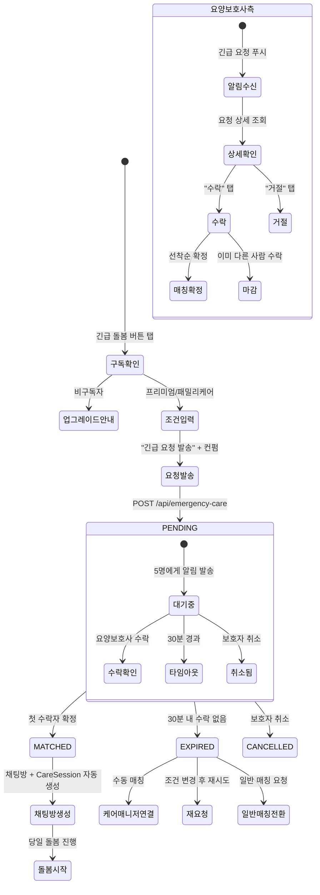

# FS-G-012 긴급 돌봄 요청

> 문서 버전: 1.0
> 작성일: 2026-03-30
> 우선순위: P1
> 상태: Draft

---

## 1. 개요
- 예약 없이 당일 또는 익일 긴급하게 돌봄이 필요한 경우, 가용한 요양보호사 5명에게 동시 긴급 요청을 발송하고, 30분 타임아웃 내 수락 여부를 확인하는 기능. 프리미엄/패밀리케어 구독자 전용 기능이다.
- 대상 사용자: 보호자 (프리미엄 또는 패밀리케어 구독자)
- 관련 PRD 섹션: 2.12 긴급 돌봄 요청

## 2. 유저 스토리
- As a 보호자, I want to 갑자기 부모님 돌봄이 필요한 상황에서 빠르게 요양보호사를 구하여, so that 응급 상황에 대응할 수 있다.
- As a 보호자, I want to 기존 요양보호사가 결근했을 때 3시간 내 대체 인력을 확보하여, so that 어르신이 돌봄 공백 없이 서비스를 받을 수 있다.
- As a 보호자, I want to 긴급 요청의 실시간 진행 상황을 확인하여, so that 대기 중 불안감을 줄일 수 있다.

## 3. 화면 구성

### 3.1 화면 목록
| 화면 ID | 화면명 | 진입 경로 | 구현 파일 |
|---------|--------|-----------|-----------|
| G-012-S1 | 긴급 돌봄 요청 | 홈 > "긴급 돌봄" 버튼 / SOS 버튼 | 미구현 |
| G-012-S2 | 긴급 요청 조건 입력 | 긴급 돌봄 > 조건 입력 | 미구현 |
| G-012-S3 | 매칭 대기 | 조건 입력 > 요청 발송 후 | 미구현 |
| G-012-S4 | 매칭 결과 | 수락 / 만료 시 | 미구현 |

### 3.2 화면별 상세

#### G-012-S1 긴급 돌봄 요청 진입
- **진입 경로**:
  - 홈 화면 상단 "긴급 돌봄" 플로팅 버튼 (red, pulse 애니메이션)
  - 기존 매칭 상세 > "긴급 대체 요청" 버튼 (요양보호사 결근 시)
- **구독 확인**:
  - 프리미엄/패밀리케어 구독자: 바로 조건 입력으로 이동
  - 비구독자: "프리미엄 전용 기능입니다" 안내 + 구독 업그레이드 CTA
  - 스탠다드 구독자: "프리미엄으로 업그레이드하면 긴급 돌봄을 이용할 수 있습니다" + 업그레이드 CTA

#### G-012-S2 긴급 요청 조건 입력
- **헤더**: "긴급 돌봄 요청" + 뒤로가기 (빨간 강조)
- **돌봄 대상 선택**:
  - 등록된 돌봄 대상자(CareRecipient) 목록에서 선택
  - 돌봄 대상자 미등록 시 간이 등록 폼 (이름, 나이, 주요 질환, 주소)
- **긴급 돌봄 조건**:
  - 돌봄 날짜: 오늘 / 내일 (DatePicker, 당일+익일만 선택 가능)
  - 시작 시간: TimePicker (현재 시각 이후만 선택 가능)
  - 돌봄 시간: 2시간 / 4시간 / 6시간 / 8시간 (세그먼트 선택)
  - 돌봄 지역: 돌봄 대상자 주소 자동 입력 (수정 가능)
  - 특이사항: 자유 텍스트 (선택, 예: "치매 어르신, 식사 보조 필요")
- **예상 비용**: 시간 x 긴급 할증 요금 자동 계산 표시
  - 긴급 할증: 기본 요금 대비 1.5배
- **요청 버튼**: "긴급 요청 발송" (빨간 버튼, 컨펌 다이얼로그)
- **컨펌 다이얼로그**: "5명의 요양보호사에게 긴급 요청을 보냅니다. 30분 내 수락자가 없으면 자동 만료됩니다."

#### G-012-S3 매칭 대기 화면
- **헤더**: "긴급 매칭 중" (빨간 배경)
- **타이머**: 30분 카운트다운 (큰 숫자, mm:ss)
- **요청 현황**:
  - 발송된 요양보호사 수: "5명에게 요청 발송됨"
  - 확인 현황: "O명 확인 중 / O명 거절"
  - 각 요양보호사 상태 아이콘 (발송/확인/수락/거절)
- **애니메이션**: 펄스 원형 로딩 애니메이션
- **안내 문구**: "잠시만 기다려주세요. 가까운 요양보호사를 찾고 있습니다."
- **취소 버튼**: "요청 취소" (회색, 하단)

#### G-012-S4 매칭 결과
- **성공 시**:
  - 요양보호사 프로필 카드 (이름, 경력, 평점, 프로필 사진)
  - 도착 예상 시간
  - "채팅 시작" 버튼 → 채팅방 이동
  - "돌봄 상세 확인" 버튼
  - 축하 애니메이션
- **실패 시 (30분 타임아웃)**:
  - "가용한 요양보호사를 찾지 못했습니다"
  - "케어 매니저 연결" 버튼 (전화 / 채팅)
  - "다시 요청" 버튼 (조건 변경 후 재시도)
  - "일반 매칭 요청으로 전환" 버튼

## 4. 상세 동작 명세

### 4.1 정상 플로우

#### 긴급 요청 발송
1. 보호자가 "긴급 돌봄" 버튼 탭
2. 구독 상태 확인 → 프리미엄/패밀리케어만 허용
3. 돌봄 대상 선택 + 긴급 돌봄 조건 입력
4. "긴급 요청 발송" 탭 → 컨펌 다이얼로그 확인
5. POST /api/emergency-care → 긴급 돌봄 요청 생성
6. 서버에서 조건 매칭 요양보호사 5명 선정:
   - 돌봄 지역 반경 5km 이내
   - 해당 시간대 가용 (스케줄 비어있음)
   - 긴급 요청 수신 동의 ON
   - 평점 4.0 이상 우선
7. 5명에게 동시 푸시 알림 발송
8. 30분 타이머 시작

#### 요양보호사 수락
1. 요양보호사 앱에 긴급 요청 푸시 알림 수신
2. 알림 탭 → 긴급 요청 상세 확인 (돌봄 대상, 시간, 위치, 요금)
3. "수락" 탭 → PUT /api/emergency-care/[id]/accept
4. 첫 수락자가 매칭 확정 (선착순)
5. 나머지 4명에게 "마감" 알림 발송
6. 보호자에게 "매칭 성공" 알림 + 채팅방 생성
7. CareSession 자동 생성 (status: SCHEDULED)

#### 30분 타임아웃
1. 30분 내 수락자 없음
2. 긴급 요청 상태 → EXPIRED
3. 보호자에게 "매칭 실패" 알림
4. 케어 매니저 연결 옵션 제공
5. 케어 매니저가 수동으로 추가 요양보호사 접촉 가능

### 4.2 예외 플로우
- **비구독자 접근**: 프리미엄/패밀리케어가 아닌 경우 → 구독 업그레이드 안내
- **가용 요양보호사 부족**: 조건에 맞는 요양보호사 5명 미만 시 → 가용한 인원만 발송 + "N명에게 요청 발송됨" 표시
- **가용 요양보호사 0명**: "현재 해당 지역에 가용한 요양보호사가 없습니다" → 케어 매니저 연결
- **동시 수락**: 여러 요양보호사가 동시 수락 시 서버에서 첫 요청만 처리 (낙관적 락)
- **요청 취소**: 대기 중 보호자가 취소 → 모든 요양보호사에게 "취소" 알림, 상태 CANCELLED
- **요양보호사 수락 후 취소**: 수락 후 30분 이내 취소 시 → 보호자 알림 + 자동 재요청 (남은 4명 중)
- **중복 긴급 요청**: 이미 활성 긴급 요청이 있는 경우 → "이미 진행 중인 긴급 요청이 있습니다" 차단

### 4.3 비즈니스 규칙
- **접근 제한**: 프리미엄(59,900원/월) 또는 패밀리케어(99,900원/월) 구독자 전용
- **요청 대상**: 돌봄 지역 반경 5km 이내, 해당 시간 가용, 긴급 수신 동의 요양보호사
- **동시 발송**: 최대 5명 (가용 인원이 5명 미만이면 가용 인원만)
- **선착순 매칭**: 첫 수락자 확정, 나머지 자동 마감
- **타임아웃**: 30분 (카운트다운 종료 시 자동 만료)
- **긴급 할증**: 기본 시간당 요금 x 1.5배
- **요양보호사 선정 우선순위**:
  1. 거리 (가까운 순)
  2. 평점 (높은 순)
  3. 응답률 (높은 순)
  4. 해당 돌봄 유형 경력
- **일일 긴급 요청 제한**: 1일 최대 3회
- **결근 대체 요청**: 기존 매칭에서 요양보호사 결근 신고 시 긴급 요청 자동 연계

## 5. 수용 기준 (Acceptance Criteria)

```
Given 프리미엄/패밀리케어 구독자가 긴급 돌봄 버튼을 탭했을 때
When 긴급 돌봄 조건(지역, 시간, 시간수)을 입력하고 요청하면
Then 해당 지역의 가용 요양보호사 5명에게 동시에 긴급 요청 알림이 발송된다

Given 긴급 요청 후
When 요양보호사 중 1명이 수락하면
Then 보호자에게 즉시 알림이 발송되고 채팅방이 열린다

Given 30분 내 수락자가 없을 경우
When 자동 만료되면
Then 보호자에게 "매칭 실패" 알림과 함께 케어 매니저 연결 옵션이 제공된다

Given 비구독자(무료/스탠다드)가 긴급 돌봄 버튼을 탭했을 때
When 구독 상태를 확인하면
Then "프리미엄 전용 기능입니다" 안내와 구독 업그레이드 버튼이 표시된다

Given 긴급 요청 대기 중
When 보호자가 "요청 취소" 버튼을 탭하면
Then 모든 요양보호사에게 취소 알림이 발송되고 요청이 CANCELLED 상태로 변경된다

Given 긴급 요청 발송 후
When 매칭 대기 화면을 확인하면
Then 30분 카운트다운 타이머와 요양보호사별 확인/수락/거절 현황이 실시간으로 표시된다
```

## 6. API 연동

### 6.1 사용 API 목록
| Method | Endpoint | 설명 |
|--------|----------|------|
| POST | `/api/emergency-care` | 긴급 돌봄 요청 생성 |
| GET | `/api/emergency-care/[id]` | 긴급 요청 상태 조회 (폴링) |
| PUT | `/api/emergency-care/[id]/accept` | 긴급 요청 수락 (요양보호사) |
| PUT | `/api/emergency-care/[id]/reject` | 긴급 요청 거절 (요양보호사) |
| PUT | `/api/emergency-care/[id]/cancel` | 긴급 요청 취소 (보호자) |
| GET | `/api/emergency-care/available` | 가용 요양보호사 수 확인 (사전 체크) |

### 6.2 주요 요청/응답 스키마

#### POST /api/emergency-care
**요청:**
```json
{
  "careRecipientId": "cuid...",
  "date": "2026-03-30",
  "startTime": "14:00",
  "duration": 4,
  "location": {
    "address": "서울시 도봉구 방학동 123-4",
    "lat": 37.6584,
    "lng": 127.0468
  },
  "notes": "치매 어르신, 식사 보조 필요",
  "careType": "방문요양"
}
```

**성공 응답 (201):**
```json
{
  "emergencyCare": {
    "id": "cuid...",
    "status": "PENDING",
    "requestedAt": "2026-03-30T13:30:00Z",
    "expiresAt": "2026-03-30T14:00:00Z",
    "candidateCount": 5,
    "estimatedCost": 171600,
    "candidates": [
      {
        "caregiverId": "...",
        "status": "SENT",
        "sentAt": "2026-03-30T13:30:00Z"
      }
    ]
  }
}
```

#### GET /api/emergency-care/[id] (실시간 상태 폴링)
**성공 응답 (200):**
```json
{
  "emergencyCare": {
    "id": "cuid...",
    "status": "MATCHED",
    "matchedCaregiver": {
      "id": "...",
      "name": "김OO",
      "profileImage": "https://...",
      "rating": 4.8,
      "experience": "5년",
      "estimatedArrival": "30분"
    },
    "chatRoomId": "matchId...",
    "careSessionId": "cuid..."
  }
}
```

**상태 Enum:**
- `PENDING`: 요청 발송됨, 대기 중
- `MATCHED`: 매칭 성공
- `EXPIRED`: 30분 타임아웃
- `CANCELLED`: 보호자 취소

## 7. 상태 다이어그램


## 8. 데이터 모델

### EmergencyCare 테이블 (신규 필요)
| 필드 | 타입 | 설명 |
|------|------|------|
| id | String (cuid) | PK |
| guardianId | String | GuardianProfile FK |
| careRecipientId | String | CareRecipient FK |
| date | DateTime | 돌봄 날짜 |
| startTime | String | 시작 시간 |
| duration | Int | 돌봄 시간 (시간 단위) |
| address | String | 돌봄 주소 |
| latitude | Float | 위도 |
| longitude | Float | 경도 |
| careType | String | 돌봄 유형 |
| notes | String? | 특이사항 |
| status | String | PENDING / MATCHED / EXPIRED / CANCELLED |
| estimatedCost | Int | 예상 비용 (할증 포함) |
| matchedCaregiverId | String? | 매칭된 요양보호사 ID |
| matchedAt | DateTime? | 매칭 확정 시간 |
| careSessionId | String? | 생성된 CareSession FK |
| expiresAt | DateTime | 만료 시간 (생성 + 30분) |
| createdAt | DateTime | 생성일 |

### EmergencyCareCandidate 테이블 (신규 필요)
| 필드 | 타입 | 설명 |
|------|------|------|
| id | String (cuid) | PK |
| emergencyCareId | String | EmergencyCare FK |
| caregiverId | String | CaregiverProfile FK |
| status | String | SENT / VIEWED / ACCEPTED / REJECTED / EXPIRED |
| sentAt | DateTime | 발송 시간 |
| respondedAt | DateTime? | 응답 시간 |

**참고**: 기존 EmergencySOS 모델은 119 연결 등 SOS용이며, 긴급 돌봄 매칭과는 별도 모델

## 9. 연관 기능
- **선행 기능**: FS-G-008 결제/구독 (프리미엄/패밀리케어 구독 확인), FS-G-002 돌봄니즈등록 (CareRecipient 정보)
- **후행 기능**: FS-G-009 채팅 (매칭 성공 시 채팅방 생성), FS-G-010 실시간 돌봄모니터링 (돌봄 진행)
- **의존 기능**: 구독 상태 확인, 푸시 알림 서비스, 요양보호사 가용 스케줄 데이터, GPS/위치 서비스
- **참고**: EmergencySOS 모델(기존)은 119 긴급 신고용이며, 긴급 돌봄 매칭과는 별도 기능

## 10. 구현 현황
| 항목 | 상태 | 비고 |
|------|------|------|
| DB 모델 (EmergencyCare) | ❌ | 신규 모델 생성 필요 (EmergencySOS와 별도) |
| DB 모델 (EmergencyCareCandidate) | ❌ | 신규 모델 생성 필요 |
| 긴급 요청 API | ❌ | POST/GET/PUT 전체 미구현 |
| 긴급 돌봄 요청 화면 | ❌ | 전체 미구현 |
| 매칭 대기 화면 | ❌ | 30분 타이머 + 실시간 상태 UI 미구현 |
| 매칭 결과 화면 | ❌ | 성공/실패 결과 화면 미구현 |
| 요양보호사 긴급 수신 설정 | ❌ | 설정 화면 + 프로필 필드 미구현 |
| 푸시 알림 (긴급 요청) | ❌ | 미구현 |
| 구독 상태 검증 | ⚠️ | 구독 모델 존재하나 긴급 돌봄 권한 검증 미구현 |
| EmergencySOS API (기존) | ✅ | `/api/emergency-sos` 구현 (119 긴급 신고용, 별도 기능) |
