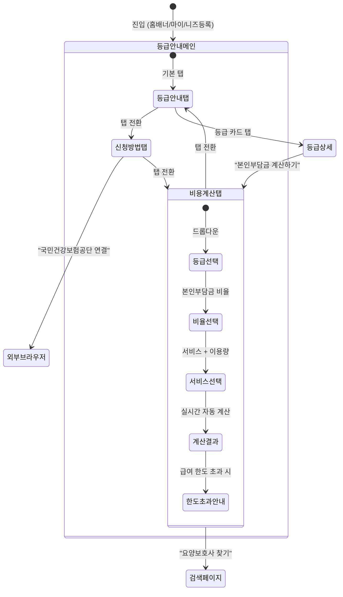

# FS-G-013 장기요양등급 안내

> 문서 버전: 1.0
> 작성일: 2026-03-30
> 우선순위: P1
> 상태: Draft

---

## 1. 개요
- 장기요양등급 미신청자에게 등급별 급여 한도, 신청 절차, 필요 서류를 안내하고, 소득 분위별 본인부담금 자동 계산기를 제공하는 정보 기능. 국민건강보험공단 장기요양 신청 페이지로의 외부 연결을 포함한다.
- 대상 사용자: 보호자 (특히 장기요양등급 미신청 또는 등급 정보가 필요한 보호자)
- 관련 PRD 섹션: 2.13 장기요양등급 안내 및 신청 가이드

## 2. 유저 스토리
- As a 보호자, I want to 장기요양등급별 급여 한도액과 서비스 범위를 한눈에 확인하여, so that 어르신에게 어떤 서비스가 가능한지 파악할 수 있다.
- As a 보호자, I want to 등급 신청 절차와 필요 서류를 단계별로 안내받아서, so that 복잡한 행정 절차를 쉽게 준비할 수 있다.
- As a 보호자, I want to 소득 분위에 따른 본인부담금을 자동으로 계산하여, so that 월별 예상 비용을 사전에 알 수 있다.
- As a 보호자, I want to 앱에서 바로 국민건강보험공단 신청 페이지로 이동하여, so that 별도 검색 없이 바로 신청할 수 있다.

## 3. 화면 구성

### 3.1 화면 목록
| 화면 ID | 화면명 | 진입 경로 | 구현 파일 |
|---------|--------|-----------|-----------|
| G-013-S1 | 장기요양등급 안내 메인 | 홈 > 장기요양등급 안내 배너 / 마이 > 등급 안내 / 돌봄니즈등록 > "미신청" 선택 시 | 미구현 |
| G-013-S2 | 등급별 상세 안내 | 메인 > 등급 카드 선택 | 미구현 |
| G-013-S3 | 신청 절차 가이드 | 메인 > "신청 방법" 탭 | 미구현 |
| G-013-S4 | 본인부담금 계산기 | 메인 > "비용 계산" 탭 | 미구현 |

### 3.2 화면별 상세

#### G-013-S1 장기요양등급 안내 메인
- **헤더**: "장기요양등급 안내" + 뒤로가기
- **탭 네비게이션**: 등급 안내 | 신청 방법 | 비용 계산
- **등급 안내 탭 (기본)**:
  - 장기요양보험 제도 간단 소개 (1~2줄)
  - 등급 카드 목록 (스크롤):
    | 등급 | 점수 기준 | 월 급여 한도 (2026년) | 주요 서비스 |
    |------|-----------|----------------------|------------|
    | 1등급 | 95점 이상 | 약 1,885,000원 | 방문요양+방문목욕+주야간보호+단기보호 |
    | 2등급 | 75~94점 | 약 1,690,000원 | 방문요양+방문목욕+주야간보호 |
    | 3등급 | 60~74점 | 약 1,417,200원 | 방문요양+방문목욕+주야간보호 |
    | 4등급 | 51~59점 | 약 1,306,200원 | 방문요양+방문목욕 |
    | 5등급 | 45~50점 | 약 1,121,100원 | 방문요양+방문목욕 |
    | 인지지원등급 | 45점 미만 (치매) | 약 624,600원 | 인지활동형 방문요양 |
  - 각 카드: 등급 번호 (큰 원형 배지) + 점수 기준 + 월 급여 한도 + 대표 서비스 아이콘
  - 카드 탭 → 등급별 상세 (G-013-S2)

#### G-013-S2 등급별 상세 안내
- **헤더**: "N등급 안내" + 뒤로가기
- **내용**:
  - 등급 기준 상세 설명
  - 인정 조사 평가 항목 안내 (신체기능, 인지기능, 행동변화, 간호처치, 재활)
  - 이용 가능 서비스 목록:
    - 방문요양: 시간당 수가, 이용 한도
    - 방문목욕: 회당 수가
    - 주야간보호: 시간당 수가
    - 단기보호: 일당 수가
    - 복지용구: 연 160만 원 한도
  - 등급별 월 급여 한도액 상세
  - 정부 지원금 안내 (의료급여수급자, 차상위계층 혜택)
- **하단 CTA**: "본인부담금 계산하기" 버튼 → G-013-S4

#### G-013-S3 신청 절차 가이드
- **헤더**: "장기요양등급 신청 방법"
- **단계별 안내** (세로 타임라인 UI):
  - **Step 1: 신청**
    - 국민건강보험공단 지사 방문 또는 온라인 신청
    - 신청 자격: 65세 이상 또는 노인성 질병 진단자
    - 대리 신청 가능 (가족, 의료기관)
  - **Step 2: 방문 조사**
    - 공단 조사원 방문 (신청 후 약 2주 내)
    - 조사 항목: 52개 항목 (신체기능 12개, 인지기능 7개, 행동변화 14개 등)
    - 소요 시간: 약 40~60분
    - 준비 사항: 환자 상태 메모, 복용 약 목록, 병원 진료 기록
  - **Step 3: 등급판정위원회 심의**
    - 방문 조사 후 약 30일 이내 결과 통보
    - 의사 소견서 필요 (신청 후 제출 가능)
    - 심의 후 1~5등급, 인지지원등급, 등급 외 판정
  - **Step 4: 결과 통보 및 수급**
    - 등급 인정서 발급
    - 표준 장기요양 이용 계획서 수령
    - 서비스 이용 시작
- **필요 서류 체크리스트** (체크박스 스타일):
  - [ ] 장기요양인정 신청서
  - [ ] 의사 소견서 (65세 이상이면 면제 가능)
  - [ ] 신분증 (대리 신청 시 대리인 신분증 + 위임장)
  - [ ] 수급권자증 (의료급여수급자의 경우)
- **하단 CTA**: "국민건강보험공단 연결" 버튼 (외부 브라우저)
  - URL: `https://www.longtermcare.or.kr` (장기요양 포털)

#### G-013-S4 본인부담금 계산기
- **헤더**: "본인부담금 계산기"
- **입력 항목**:
  - 장기요양등급 선택 (1~5등급 / 인지지원등급) — Dropdown
  - 본인부담금 비율 선택:
    - 일반: 15%
    - 의료급여수급자: 면제 (0%)
    - 차상위 감경 대상: 6% 또는 9%
  - 희망 서비스 선택 (다중):
    - 방문요양: 주당 이용 시간 입력 (시간)
    - 방문목욕: 월 이용 횟수 입력 (회)
    - 주야간보호: 주당 이용 일수 입력 (일)
- **계산 결과** (자동 계산, 입력 시 실시간 반영):
  - 월 총 이용 금액: OOO,OOO원
  - 장기요양보험 부담: OOO,OOO원
  - **본인부담금: OOO,OOO원** (강조 표시)
  - 월 급여 한도 대비 사용 비율 프로그레스 바 (초과 시 빨간색)
  - 한도 초과 시: "급여 한도를 OOO원 초과합니다. 초과분은 전액 본인 부담입니다." 안내
- **수가 기준 안내**: "2026년 장기요양 수가 기준 적용" + 상세 보기 링크
- **하단 CTA**: "요양보호사 찾기" 버튼 → 검색 페이지

## 4. 상세 동작 명세

### 4.1 정상 플로우

#### 등급 안내 진입
1. 보호자가 다음 경로 중 하나로 진입:
   - 홈 화면 "장기요양등급 안내" 배너 탭
   - 마이페이지 > "장기요양등급 안내"
   - 돌봄 니즈 등록 중 "장기요양등급: 미신청" 선택 시 자동 안내
2. 등급 안내 메인 화면 표시 (기본 탭: 등급 안내)
3. 등급 카드 선택 → 해당 등급 상세 안내

#### 본인부담금 계산
1. "비용 계산" 탭 진입
2. 등급 선택 → 본인부담금 비율 선택 → 서비스 + 이용량 입력
3. 입력값 변경 시 실시간으로 결과 자동 계산
4. 급여 한도 초과 여부 자동 체크 + 안내
5. "요양보호사 찾기" 탭 → 검색 페이지 이동 (등급 정보 자동 필터)

#### 국민건강보험공단 연결
1. "국민건강보험공단 연결" 버튼 탭
2. 확인 다이얼로그: "외부 사이트로 이동합니다."
3. 확인 → 외부 브라우저에서 장기요양 포털 오픈

### 4.2 예외 플로우
- **수가 데이터 미로딩**: 네트워크 오류 시 캐시된 데이터 표시 + "최신 수가 정보를 불러올 수 없습니다" 안내
- **계산기 입력 오류**: 이용 시간이 물리적으로 불가능한 값 (예: 주 168시간 초과) 입력 시 → 범위 제한 + 안내
- **등급별 서비스 제한**: 5등급에서 주야간보호 선택 시 → "5등급은 방문요양과 방문목욕만 이용 가능합니다" 안내
- **외부 링크 오류**: 공단 사이트 접속 불가 시 → "사이트에 접속할 수 없습니다. 잠시 후 다시 시도해주세요" 안내

### 4.3 비즈니스 규칙
- **수가 기준**: 2026년 장기요양 수가 기준 적용 (매년 업데이트 필요)
- **등급별 월 급여 한도 (2026년)**:
  | 등급 | 월 급여 한도 |
  |------|-------------|
  | 1등급 | 1,885,000원 |
  | 2등급 | 1,690,000원 |
  | 3등급 | 1,417,200원 |
  | 4등급 | 1,306,200원 |
  | 5등급 | 1,121,100원 |
  | 인지지원등급 | 624,600원 |
- **본인부담금 비율**:
  - 일반: 15%
  - 의료급여수급자: 0%
  - 차상위 감경 50%: 7.5% (15% x 50%)
  - 차상위 감경 60%: 6% (15% x 40%)
- **서비스 수가 (2026년 기준)**:
  | 서비스 | 단위 | 수가 |
  |--------|------|------|
  | 방문요양 30분 | 30분 | 17,590원 |
  | 방문요양 60분 | 60분 | 28,600원 |
  | 방문요양 90분 | 90분 | 35,200원 |
  | 방문요양 120분 | 120분 | 41,800원 |
  | 방문요양 150분 | 150분 | 47,300원 |
  | 방문요양 180분 | 180분 | 52,800원 |
  | 방문요양 210분 | 210분 | 57,200원 |
  | 방문요양 240분 | 240분 | 61,600원 |
  | 방문목욕(차량) | 1회 | 83,630원 |
  | 방문목욕(가정) | 1회 | 47,810원 |
  | 주야간보호 3시간 | 3시간 | 30,470원 |
  | 주야간보호 6시간 | 6시간 | 49,660원 |
  | 주야간보호 8시간 | 8시간 | 60,150원 |
  | 주야간보호 10시간 | 10시간 | 68,770원 |
  | 주야간보호 12시간 | 12시간 | 77,580원 |
- **등급별 이용 가능 서비스**:
  - 1등급: 방문요양, 방문목욕, 방문간호, 주야간보호, 단기보호, 복지용구
  - 2등급: 방문요양, 방문목욕, 방문간호, 주야간보호, 단기보호, 복지용구
  - 3등급: 방문요양, 방문목욕, 방문간호, 주야간보호, 단기보호, 복지용구
  - 4등급: 방문요양, 방문목욕, 방문간호, 주야간보호, 복지용구
  - 5등급: 방문요양, 방문목욕, 복지용구
  - 인지지원등급: 인지활동형 방문요양, 주야간보호, 복지용구
- **복지용구**: 연간 160만 원 한도 (별도 계산)

## 5. 수용 기준 (Acceptance Criteria)

```
Given 돌봄 니즈 등록 시 '장기요양등급 미신청'을 선택했을 때
When 가이드 페이지에 진입하면
Then 현재 연도(2026년) 기준 정확한 등급별 급여 한도액 정보가 표시된다

Given 본인부담금 계산기에서 등급과 소득 정보를 선택했을 때
When 서비스와 이용량을 입력하면
Then 월 예상 본인부담금이 실시간으로 자동 계산되어 표시된다

Given 계산 결과가 월 급여 한도를 초과할 때
When 결과 화면을 확인하면
Then 초과 금액과 함께 "초과분은 전액 본인 부담" 안내가 표시된다

Given 신청 안내 페이지에서
When "국민건강보험공단 연결" 버튼을 탭하면
Then 국민건강보험공단 장기요양 신청 페이지로 이동한다 (외부 브라우저)

Given 등급 안내 화면에서 특정 등급 카드를 탭했을 때
When 등급별 상세 화면에 진입하면
Then 해당 등급의 점수 기준, 이용 가능 서비스, 수가 정보가 표시된다

Given 5등급을 선택하고 주야간보호를 이용하려 할 때
When 서비스를 선택하면
Then "5등급은 방문요양과 방문목욕만 이용 가능합니다" 안내가 표시된다
```

## 6. API 연동

### 6.1 사용 API 목록
| Method | Endpoint | 설명 |
|--------|----------|------|
| GET | `/api/care-grade/info` | 등급별 안내 정보 조회 |
| GET | `/api/care-grade/rates` | 서비스별 수가 정보 조회 (연도별) |
| POST | `/api/care-grade/calculate` | 본인부담금 계산 |

### 6.2 주요 요청/응답 스키마

#### GET /api/care-grade/info
**성공 응답 (200):**
```json
{
  "year": 2026,
  "grades": [
    {
      "grade": "1등급",
      "scoreRange": "95점 이상",
      "monthlyLimit": 1885000,
      "description": "심신의 기능상태 장애로 일상생활에서 전적으로 다른 사람의 도움이 필요한 자",
      "availableServices": ["방문요양", "방문목욕", "방문간호", "주야간보호", "단기보호", "복지용구"],
      "criteria": "6개월 이상 혼자서 일상생활을 수행하기 어려운 노인"
    }
  ]
}
```

#### POST /api/care-grade/calculate
**요청:**
```json
{
  "grade": "3등급",
  "copaymentRate": 0.15,
  "services": [
    { "type": "방문요양", "minutesPerSession": 120, "sessionsPerWeek": 3 },
    { "type": "방문목욕", "sessionsPerMonth": 2 }
  ]
}
```

**성공 응답 (200):**
```json
{
  "calculation": {
    "grade": "3등급",
    "monthlyLimit": 1417200,
    "totalCost": 668400,
    "insuranceCoverage": 568140,
    "copayment": 100260,
    "copaymentRate": 0.15,
    "limitUsagePercent": 47.2,
    "isOverLimit": false,
    "overLimitAmount": 0,
    "breakdown": [
      {
        "service": "방문요양 120분",
        "unitCost": 41800,
        "quantity": 12,
        "subtotal": 501600
      },
      {
        "service": "방문목욕(차량)",
        "unitCost": 83630,
        "quantity": 2,
        "subtotal": 167260
      }
    ]
  }
}
```

## 7. 상태 다이어그램


## 8. 데이터 모델

### 정적 데이터 (코드 내 상수 또는 CMS)
본 기능은 별도의 DB 모델이 필요하지 않으며, 등급/수가 정보는 정적 데이터로 관리한다.

#### CareGradeInfo (정적 상수)
| 필드 | 타입 | 설명 |
|------|------|------|
| grade | String | 등급명 (1등급~5등급, 인지지원등급) |
| scoreRange | String | 점수 기준 |
| monthlyLimit | Int | 월 급여 한도 (원) |
| description | String | 등급 설명 |
| availableServices | String[] | 이용 가능 서비스 목록 |

#### ServiceRate (정적 상수)
| 필드 | 타입 | 설명 |
|------|------|------|
| serviceType | String | 서비스 유형 |
| unit | String | 단위 (분/회/시간/일) |
| rate | Int | 수가 (원) |
| year | Int | 적용 연도 |

### 기존 모델 연관
- CareRecipient.careLevel: 돌봄 대상자의 장기요양등급 정보 (등급 안내 자동 연결)

## 9. 연관 기능
- **선행 기능**: FS-G-002 돌봄니즈등록 (장기요양등급 "미신청" 선택 시 안내 진입)
- **후행 기능**: FS-G-003 요양보호사 검색 ("요양보호사 찾기" CTA로 연결)
- **의존 기능**: 없음 (독립적 정보 제공 기능)
- **참고**: 등급/수가 데이터는 매년 보건복지부 고시에 따라 업데이트 필요 (2026년 기준)

## 10. 구현 현황
| 항목 | 상태 | 비고 |
|------|------|------|
| 등급 안내 메인 화면 | ❌ | 전체 미구현 |
| 등급별 상세 안내 | ❌ | 미구현 |
| 신청 절차 가이드 | ❌ | 미구현 |
| 본인부담금 계산기 | ❌ | 미구현 |
| 등급/수가 정적 데이터 | ❌ | 상수 데이터 정의 필요 |
| API (등급 정보) | ❌ | 미구현 |
| API (비용 계산) | ❌ | 미구현 |
| 국민건강보험공단 외부 링크 | ❌ | 미구현 |
| 돌봄니즈등록 연계 | ⚠️ | CareRecipient.careLevel 필드 존재하나 등급 안내 자동 연결 미구현 |
| 홈 배너 | ❌ | 미구현 |
