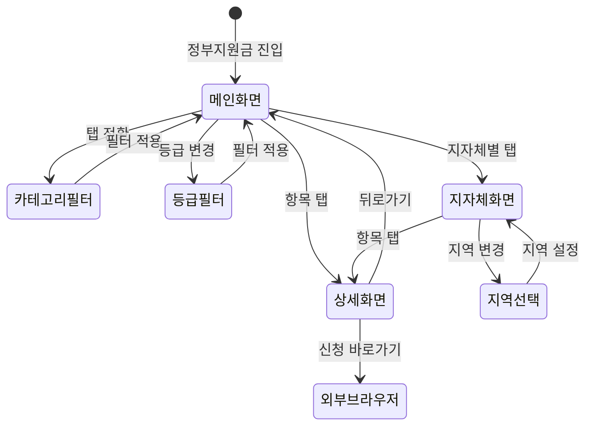

# FS-G-014 정부지원금 안내

> 문서 버전: 1.0
> 작성일: 2026-03-30
> 우선순위: P2
> 상태: Draft

---

## 1. 개요
- 보호자가 받을 수 있는 각종 정부 지원금, 바우처, 세제 혜택을 맞춤형으로 안내하는 기능. 사용자의 지역(시/군/구) 및 어르신 장기요양등급 정보를 기반으로 해당 가능한 지원 항목을 자동 필터링하여 보여준다.
- 대상 사용자: 보호자 (40~60대, 부모 돌봄 주체)
- 관련 PRD 섹션: 2.14 정부 지원금 안내

## 2. 유저 스토리
- As a 보호자, I want to 부모님의 장기요양등급과 거주 지역에 맞는 정부 지원금을 한눈에 확인하여, so that 놓치고 있는 혜택을 빠짐없이 신청할 수 있다.
- As a 보호자, I want to 각 지원 항목의 신청 자격과 절차를 상세히 안내받아, so that 복잡한 행정 절차를 쉽게 진행할 수 있다.
- As a 보호자, I want to 내 지역의 추가 지원 사업을 자동으로 안내받아, so that 지자체별 특화 지원을 빠뜨리지 않을 수 있다.

## 3. 화면 구성

### 3.1 화면 목록
| 화면 ID | 화면명 | 진입 경로 | 구현 파일 |
|---------|--------|-----------|-----------|
| G-014-S1 | 정부지원금 메인 | 홈 > 정부지원금 안내 배너 또는 하단 탭 메뉴 | `src/app/(app)/subsidies/page.tsx` |
| G-014-S2 | 지원금 상세 | 정부지원금 메인 > 항목 탭 | `src/app/(app)/subsidies/[type]/page.tsx` |
| G-014-S3 | 지자체별 지원 | 정부지원금 메인 > 지자체별 지원 탭 | `src/app/(app)/subsidies/local/page.tsx` |

### 3.2 화면별 상세

#### G-014-S1 정부지원금 메인 화면
- **헤더**: BackHeader ("정부지원금 안내"), 뒤로가기 시 홈으로 이동
- **맞춤 안내 배너**: 사용자 프로필(지역, 어르신 장기요양등급) 기반 "받을 수 있는 지원금 N건" 요약 카드
- **지원 항목 카테고리 탭**: 전체 / 장기요양급여 / 노인맞춤돌봄 / 치매지원 / 세금혜택 / 지자체별
- **카드 리스트**: 각 지원 항목별 카드 (아이콘, 제목, 간단 설명, 대상 태그, 신청 가능 여부 배지)
- **필터**: 어르신 장기요양등급 선택 드롭다운 (미신청 / 1~5등급 / 인지지원등급)

#### G-014-S2 지원금 상세 화면
- **헤더**: BackHeader (지원금명)
- **요약 카드**: 지원 금액/혜택, 대상, 신청 기간
- **탭 구성**: 지원 내용 / 신청 자격 / 신청 방법 / 필요 서류 / FAQ
- **CTA 버튼**: "신청 바로가기" (외부 링크: 정부24, 건강보험공단 등)
- **관련 지원금 추천**: 하단에 연관 지원 항목 카드 2~3건

#### G-014-S3 지자체별 지원 화면
- **헤더**: BackHeader ("우리 지역 지원금")
- **지역 표시**: 현재 설정된 지역 + 변경 버튼
- **지역 감지**: 보호자 프로필의 region/district 자동 사용, 없으면 수동 선택
- **지자체 지원 리스트**: 해당 지역에서 운영 중인 추가 돌봄 지원 사업 카드 리스트

## 4. 상세 동작 명세

### 4.1 정상 플로우

#### 지원금 조회 플로우
1. 보호자가 홈 화면의 "정부지원금 안내" 배너 또는 메뉴를 탭
2. 정부지원금 메인 화면 진입, 프로필 기반 맞춤 지원금 요약 배너 노출
3. 전체 지원 항목 카드 리스트 로딩 (카테고리: 전체 기본)
4. 카테고리 탭 전환 시 해당 카테고리 지원 항목만 필터링
5. 카드 탭 시 상세 화면(G-014-S2)으로 이동

#### 상세 조회 플로우
1. 지원금 상세 화면 진입
2. 지원 내용 탭 기본 노출 (금액, 대상, 설명)
3. 탭 전환으로 신청 자격/방법/필요 서류/FAQ 확인
4. "신청 바로가기" 탭 시 외부 브라우저에서 해당 기관 사이트 오픈

#### 지자체별 지원 조회 플로우
1. 지자체별 지원 탭 또는 화면 진입
2. 보호자 프로필의 region + district 자동 적용
3. 해당 지역 지원 사업 리스트 노출
4. 지역 변경 버튼 탭 시 지역 선택 모달 오픈 → 변경 후 리스트 갱신

### 4.2 예외 플로우
- **프로필 미등록**: 지역/장기요양등급 미설정 시 "어르신 정보를 등록하면 맞춤 지원금을 안내해드려요" 안내 + 프로필 등록 유도 CTA
- **해당 지원 없음**: 필터 조건에 맞는 지원금이 없을 때 EmptyState ("조건에 맞는 지원금이 없습니다.")
- **외부 링크 오류**: "신청 바로가기" URL 접속 불가 시 "해당 기관 사이트에 접속할 수 없습니다. 잠시 후 다시 시도해주세요." 안내
- **데이터 로딩 실패**: API 오류 시 "지원금 정보를 불러오는 중 오류가 발생했습니다." + 재시도 버튼

### 4.3 비즈니스 규칙
- 지원금 데이터는 관리자 백오피스에서 CMS 형태로 관리 (제목, 내용, 대상 등급, 지역, 외부 링크 등)
- 장기요양등급별 필터링: 각 지원 항목에 대상 등급 태그 지정, 사용자 어르신 등급과 매칭
- 지역 자동 감지: 보호자 프로필의 `region` + `district` 필드 기반 (GPS 미사용)
- 지원금 정보 갱신 주기: 관리자가 수동 업데이트 (정부 정책 변경 시)
- 지자체별 지원 데이터: 시/군/구 단위로 태깅, 해당 지역만 노출

## 5. 수용 기준 (Acceptance Criteria)

```
Given 보호자가 정부지원금 메인 화면에 진입했을 때
When 프로필에 어르신 장기요양등급과 지역이 등록되어 있으면
Then 해당 조건에 맞는 지원금 항목이 필터링되어 표시되고 맞춤 배너에 건수가 노출된다

Given 보호자가 장기요양등급 필터를 변경했을 때
When "3등급"을 선택하면
Then 3등급 대상 지원 항목만 카드 리스트에 표시된다

Given 보호자가 지원금 상세 화면에서 "신청 바로가기"를 탭했을 때
When 외부 링크가 유효하면
Then 해당 기관 웹사이트가 외부 브라우저에서 열린다

Given 보호자의 프로필에 지역 정보가 없을 때
When 지자체별 지원 화면에 진입하면
Then "지역을 설정해주세요" 안내와 지역 선택 UI가 표시된다

Given 보호자가 카테고리 탭을 "치매지원"으로 전환했을 때
When 치매 관련 지원 항목이 1건 이상 존재하면
Then 치매공공후견 지원, 치매안심센터 등 관련 항목만 리스트에 노출된다
```

## 6. API 연동

### 6.1 사용 API 목록
| Method | Endpoint | 설명 |
|--------|----------|------|
| GET | `/api/subsidies` | 지원금 목록 조회 (카테고리, 등급, 지역 필터) |
| GET | `/api/subsidies/[type]` | 지원금 상세 조회 |
| GET | `/api/subsidies/local` | 지자체별 지원금 조회 (region, district 파라미터) |

### 6.2 주요 요청/응답 스키마

#### GET /api/subsidies
**요청 파라미터:**
```
?category=LONG_TERM_CARE&grade=3&region=서울&district=강남구
```

**성공 응답 (200):**
```json
{
  "subsidies": [
    {
      "id": "cuid...",
      "type": "LONG_TERM_CARE",
      "title": "장기요양급여",
      "summary": "장기요양등급 판정자 대상 재가급여 및 시설급여",
      "targetGrades": ["1", "2", "3", "4", "5"],
      "amount": "등급별 월 한도액 상이",
      "applicationUrl": "https://www.longtermcare.or.kr",
      "region": null,
      "isNationwide": true,
      "iconType": "CARE",
      "createdAt": "2026-03-30T..."
    }
  ],
  "total": 6,
  "matchedCount": 4
}
```

#### GET /api/subsidies/[type]
**성공 응답 (200):**
```json
{
  "subsidy": {
    "id": "cuid...",
    "type": "LONG_TERM_CARE",
    "title": "장기요양급여",
    "description": "상세 설명...",
    "targetGrades": ["1", "2", "3", "4", "5"],
    "eligibility": "장기요양등급 판정을 받은 65세 이상 어르신 또는 노인성 질환자",
    "applicationMethod": "1. 건강보험공단 지사 방문 또는 온라인 신청...",
    "requiredDocuments": ["장기요양인정서", "신분증", "..."],
    "amount": "등급별 월 한도액 (1등급: 약 175만원 ~ 5등급: 약 58만원)",
    "applicationUrl": "https://www.longtermcare.or.kr",
    "faq": [
      { "question": "장기요양등급은 어떻게 받나요?", "answer": "..." }
    ],
    "relatedSubsidies": ["ELDERLY_CARE", "DEMENTIA_SUPPORT"]
  }
}
```

## 7. 상태 다이어그램



## 8. 데이터 모델

### Subsidy 테이블 (신규)
| 필드 | 타입 | 설명 |
|------|------|------|
| id | String (cuid) | PK |
| type | String (unique) | 지원 유형 코드 (LONG_TERM_CARE, ELDERLY_CARE, DEMENTIA_SUPPORT 등) |
| title | String | 지원금 제목 |
| summary | String | 간단 요약 (리스트용) |
| description | String | 상세 설명 |
| category | String | 카테고리 (LONG_TERM_CARE / ELDERLY_CARE / DEMENTIA / TAX / LOCAL) |
| targetGrades | String | 대상 장기요양등급 JSON 배열 (예: '["1","2","3"]') |
| eligibility | String | 신청 자격 상세 |
| applicationMethod | String | 신청 방법 단계별 설명 |
| requiredDocuments | String | 필요 서류 JSON 배열 |
| amount | String | 지원 금액/혜택 설명 |
| applicationUrl | String? | 외부 신청 링크 |
| region | String? | 지자체 지역 (전국 지원은 null) |
| district | String? | 지자체 시/군/구 |
| isNationwide | Boolean | 전국 지원 여부 (기본 true) |
| iconType | String | 아이콘 유형 (CARE / MONEY / SHIELD 등) |
| isActive | Boolean | 활성 상태 (기본 true) |
| sortOrder | Int | 정렬 순서 (기본 0) |
| createdAt | DateTime | 생성일 |
| updatedAt | DateTime | 수정일 |

### SubsidyFaq 테이블 (신규)
| 필드 | 타입 | 설명 |
|------|------|------|
| id | String (cuid) | PK |
| subsidyId | String | Subsidy FK |
| question | String | FAQ 질문 |
| answer | String | FAQ 답변 |
| sortOrder | Int | 정렬 순서 |

## 9. 연관 기능
- **선행 기능**: FS-G-001 회원가입/로그인 (인증 사용자), FS-G-002 돌봄니즈등록 (어르신 등급/지역 정보)
- **후행 기능**: 없음 (정보 제공 기능)
- **의존 기능**: 관리자 백오피스 CMS (지원금 데이터 관리), 보호자 프로필 (region, district, 어르신 등급)

## 10. 구현 현황
| 항목 | 상태 | 비고 |
|------|------|------|
| 프론트엔드 | ❌ | 미구현 |
| API | ❌ | 미구현 |
| DB 모델 | ❌ | Subsidy, SubsidyFaq 모델 미생성 |
| CMS 관리 | ❌ | 관리자 백오피스 지원금 관리 미구현 |
