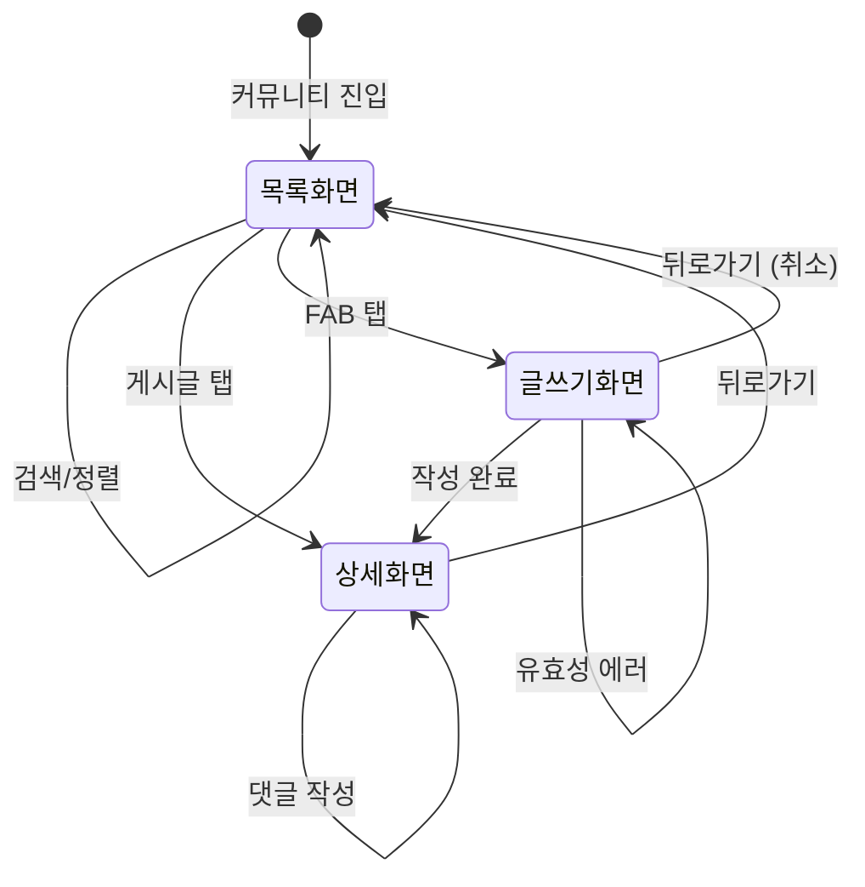

# FS-G-015 커뮤니티

> 문서 버전: 1.0
> 작성일: 2026-03-30
> 우선순위: P2
> 상태: Draft

---

## 1. 개요
- 보호자와 요양보호사가 돌봄 경험, 요양 정보, 질문/상담을 공유하는 커뮤니티 게시판 기능. 카테고리별 게시글 목록, 상세 조회, 글 작성, 댓글, 좋아요, 검색 및 정렬 기능을 제공한다.
- 대상 사용자: 보호자 및 요양보호사 (전체 회원)
- 관련 PRD 섹션: 2.15 (보호자 커뮤니티), 3.8 (요양보호사 커뮤니티)
- 현재 구현 상태: 프론트엔드 + API 구현 완료

## 2. 유저 스토리
- As a 보호자, I want to 다른 보호자들의 돌봄 경험을 읽고 공유하여, so that 어르신 돌봄에 대한 실질적인 팁과 정보를 얻을 수 있다.
- As a 보호자, I want to 요양 제도에 대한 질문을 올리고 답변을 받아, so that 복잡한 제도 정보를 쉽게 이해할 수 있다.
- As a 사용자, I want to 게시글에 댓글과 좋아요를 남겨, so that 유용한 글에 피드백을 줄 수 있다.
- As a 사용자, I want to 카테고리와 검색으로 원하는 글을 빠르게 찾아, so that 필요한 정보에 효율적으로 접근할 수 있다.

## 3. 화면 구성

### 3.1 화면 목록
| 화면 ID | 화면명 | 진입 경로 | 구현 파일 |
|---------|--------|-----------|-----------|
| G-015-S1 | 커뮤니티 메인 (게시글 목록) | 하단 탭 > 커뮤니티 | `src/app/(app)/community/page.tsx` |
| G-015-S2 | 게시글 상세 | 커뮤니티 메인 > 게시글 탭 | `src/app/(app)/community/[id]/page.tsx` |
| G-015-S3 | 글쓰기 | 커뮤니티 메인 > 글쓰기 FAB | `src/app/(app)/community/write/page.tsx` |

### 3.2 화면별 상세

#### G-015-S1 커뮤니티 메인 화면
- **헤더**: 고정 헤더, "커뮤니티" 타이틀 (text-base font-bold)
- **검색 영역** (`CommunitySearch` 컴포넌트):
  - 검색 입력: 둥근 입력 필드 (bg-gray-100, rounded-full), Search 아이콘, placeholder "검색어를 입력하세요"
  - 정렬 토글: "최신순" / "인기순" 버튼 (토글형, 인기순 선택 시 primary-500 배경)
  - 검색 실행: form submit 시 URL 파라미터 `q`에 검색어 반영
  - 정렬 전환: URL 파라미터 `sort`에 `latest` 또는 `popular` 반영
- **카테고리 탭** (`CommunityTabs` 컴포넌트):
  - 수평 스크롤 가능한 필 버튼: 전체 / 돌봄이야기 / 요양정보 / 요양보호사이야기 / 질문/상담 / 제도안내 / 건강정보
  - 카테고리 코드: ALL / PARENTING / EDUCATION / CAREGIVER / QNA / POLICY / HEALTH
  - 선택 상태: primary-500 배경 + 흰색 텍스트, 비선택: gray-500 텍스트
  - 탭 시 URL 파라미터 `category` 변경
- **게시글 리스트**:
  - 카드 형태 (bg-white, rounded-2xl, border border-gray-100)
  - 카테고리 Badge (primary variant, sm 사이즈)
  - 제목 (text-sm font-bold, line-clamp-2)
  - 본문 미리보기 (text-xs text-gray-500, line-clamp-2)
  - 이미지 썸네일 (첫 번째 이미지, h-20 rounded-xl)
  - 하단: 작성자명 (또는 "익명"), 작성일, 좋아요 수, 댓글 수, 조회수
- **빈 상태**: EmptyState 컴포넌트 (MessageSquare 아이콘, "아직 게시글이 없어요", "첫 글을 작성해보세요!")
- **글쓰기 FAB**: 화면 우하단 고정 (bottom-24 right-4), primary-500 원형, PenSquare 아이콘

#### G-015-S2 게시글 상세 화면
- **헤더**: BackHeader ("게시글"), fallbackHref="/community"
- **게시글 본문**:
  - 카테고리 배지 (bg-primary-100, text-primary-600)
  - 제목 (text-lg font-black)
  - 작성자: 원형 아바타 (이름 첫 글자) + 이름 + 작성일
  - 본문 (text-sm, whitespace-pre-wrap)
  - 이미지: grid-cols-2 레이아웃, aspect-square, rounded-xl
- **상호작용 영역** (border-t 구분):
  - 좋아요 버튼 (`CommunityLikeButton`): Heart 아이콘, 좋아요 수, 토글 시 빨간색 fill
  - 저장 버튼: Bookmark 아이콘 (현재 UI만 구현)
  - 조회수: Eye 아이콘 + 숫자
  - 댓글 수: MessageSquare 아이콘 + 숫자
- **댓글 영역** (bg-gray-50):
  - "댓글 N개" 타이틀
  - 댓글 리스트: 아바타 + 작성자명 + 작성일 + 내용
  - 빈 상태: "첫 댓글을 작성해보세요!"
- **댓글 입력** (`CommunityDetailClient`, 하단 고정):
  - 텍스트 입력 (rounded-full, bg-gray-100)
  - 전송 버튼 (primary-500 원형, Send 아이콘)
  - 비로그인: "로그인 후 댓글을 작성할 수 있어요" placeholder + disabled

#### G-015-S3 글쓰기 화면
- **헤더**: BackHeader ("글쓰기"), fallbackHref="/community"
- **카테고리 선택**: 필 버튼 그룹 (6개), 선택 시 border-primary-400 + bg-primary-500
- **제목 입력**: border-bottom 스타일, maxLength=100, placeholder "제목을 입력하세요"
- **내용 입력**: textarea, rows=12, placeholder "내용을 입력하세요..."
- **사진 추가**: 하단 "사진 추가" 버튼 (ImageIcon, 현재 UI만 구현)
- **에러 표시**: 빨간 배경 박스 (bg-red-50, border-red-200)
- **제출**: form submit 시 `POST /api/community` 호출, 성공 시 상세 페이지로 이동

## 4. 상세 동작 명세

### 4.1 정상 플로우

#### 게시글 목록 조회 플로우
1. 사용자가 하단 탭에서 커뮤니티 진입
2. 서버 컴포넌트에서 `GET /api/community` 호출 (기본: category=ALL, sort=latest)
3. 게시글 카드 리스트 렌더링
4. 카테고리 탭 전환 시 URL 파라미터 변경 → 서버 컴포넌트 리렌더링
5. 검색어 입력 후 submit 시 `q` 파라미터 추가 → 제목/내용 기반 검색
6. 정렬 토글 시 `sort` 파라미터 변경 (latest ↔ popular)

#### 게시글 작성 플로우
1. 사용자가 글쓰기 FAB 탭 → `/community/write` 이동
2. 카테고리 선택 (기본: 돌봄이야기)
3. 제목, 내용 입력
4. 제출 버튼 탭 → `POST /api/community` 호출
5. 성공 시 생성된 게시글 상세 페이지로 이동 (`/community/{id}`)

#### 게시글 상세 조회 플로우
1. 게시글 카드 탭 → `/community/{id}` 이동
2. `GET /api/community/{id}` 호출 → 게시글 데이터 + 댓글 로딩
3. 조회수 자동 1 증가 (서버 측)
4. 본문, 이미지, 댓글 렌더링

#### 좋아요 플로우
1. 좋아요 버튼 탭 → `POST /api/community/{id}/like` 호출
2. 기존 좋아요 없으면 생성 (liked: true), 있으면 삭제 (liked: false)
3. 응답의 likeCount로 UI 즉시 반영

#### 댓글 작성 플로우
1. 댓글 입력 필드에 내용 입력
2. 전송 버튼 탭 → `POST /api/community/{id}/comments` 호출
3. 성공 시 입력 필드 초기화 + `router.refresh()`로 댓글 리스트 갱신

### 4.2 예외 플로우
- **비로그인 글쓰기 시도**: 글쓰기 API 호출 시 `requireAuth`에서 401 응답 → 에러 표시
- **비로그인 댓글 작성**: 입력 필드 disabled + "로그인 후 댓글을 작성할 수 있어요" placeholder
- **비로그인 좋아요**: `requireAuth`에서 401 응답 → 무시 (catch 블록)
- **제목 미입력**: "제목을 입력해주세요." 에러 메시지
- **내용 미입력**: "내용을 입력해주세요." 에러 메시지
- **유효성 검증 실패**: API에서 400 응답 (제목 2자 미만, 내용 10자 미만, 내용 5000자 초과)
- **게시글 없음**: `GET /api/community/{id}`에서 404 → `notFound()` 호출 → 404 페이지
- **서버 오류**: 500 응답 → "게시글 작성 중 오류가 발생했습니다." 에러
- **게시글 수정/삭제 권한 없음**: 작성자 본인이 아닌 경우 403 응답

### 4.3 비즈니스 규칙
- 게시글 제목: 2~100자
- 게시글 내용: 10~5,000자
- 댓글 내용: 1~500자
- 이미지: URL 배열 형태로 저장 (JSON 직렬화), 현재 업로드 기능 미구현
- 카테고리: PARENTING(돌봄이야기), EDUCATION(요양정보), CAREGIVER(요양보호사이야기), QNA(질문/상담), POLICY(제도안내), HEALTH(건강정보)
- 정렬: latest(최신순, createdAt DESC), popular(인기순, viewCount DESC)
- 검색: 제목 + 내용 대상 부분 일치 검색 (contains)
- 페이지네이션: 20건 단위 (page 파라미터)
- 삭제: soft delete (isActive = false)
- 좋아요: 사용자당 게시글 1회 (toggle), postId + userId unique 제약
- 조회수: 상세 조회 시 자동 1 증가 (중복 카운트 허용)
- 작성자 표시: 이름 노출, 미설정 시 "익명"

## 5. 수용 기준 (Acceptance Criteria)

```
Given 사용자가 커뮤니티 메인 화면에 진입했을 때
When 게시글이 존재하면
Then 카드 리스트가 최신순으로 표시되고 카테고리, 좋아요 수, 댓글 수, 조회수가 노출된다

Given 사용자가 카테고리 탭에서 "질문/상담"을 선택했을 때
When QNA 카테고리 게시글이 존재하면
Then QNA 카테고리 게시글만 필터링되어 표시된다

Given 사용자가 검색어 "치매"를 입력하고 검색했을 때
When 제목 또는 내용에 "치매"가 포함된 게시글이 있으면
Then 해당 게시글만 검색 결과로 표시된다

Given 로그인한 사용자가 글쓰기 화면에서 카테고리, 제목, 내용을 입력하고 제출했을 때
When 유효성 검증을 통과하면
Then 게시글이 생성되고 해당 게시글 상세 페이지로 이동한다

Given 로그인한 사용자가 게시글 상세에서 좋아요 버튼을 탭했을 때
When 아직 좋아요를 누르지 않았으면
Then 좋아요가 추가되고 Heart 아이콘이 빨간색으로 변경되며 좋아요 수가 1 증가한다

Given 로그인한 사용자가 댓글 입력 후 전송 버튼을 탭했을 때
When 댓글 내용이 유효하면
Then 댓글이 생성되고 댓글 리스트에 즉시 반영된다

Given 비로그인 사용자가 게시글 상세를 볼 때
When 댓글 입력 영역을 확인하면
Then 입력 필드가 비활성화되고 "로그인 후 댓글을 작성할 수 있어요" 안내가 표시된다

Given 게시글이 없는 카테고리를 조회할 때
When 결과가 0건이면
Then EmptyState ("아직 게시글이 없어요", "첫 글을 작성해보세요!") 가 표시된다
```

## 6. API 연동

### 6.1 사용 API 목록
| Method | Endpoint | 설명 |
|--------|----------|------|
| GET | `/api/community` | 게시글 목록 조회 (category, q, sort, page 파라미터) |
| POST | `/api/community` | 게시글 작성 (인증 필요) |
| GET | `/api/community/[id]` | 게시글 상세 조회 + 조회수 증가 |
| PATCH | `/api/community/[id]` | 게시글 수정 (작성자 본인만) |
| DELETE | `/api/community/[id]` | 게시글 삭제 - soft delete (작성자 본인만) |
| GET | `/api/community/[id]/comments` | 댓글 목록 조회 |
| POST | `/api/community/[id]/comments` | 댓글 작성 (인증 필요) |
| POST | `/api/community/[id]/like` | 좋아요 토글 (인증 필요) |

### 6.2 주요 요청/응답 스키마

#### POST /api/community (게시글 작성)
**요청:**
```json
{
  "title": "치매 어르신 돌봄 팁 공유합니다",
  "content": "저희 어머니 돌봄하면서 알게 된 것들을 공유해요...",
  "category": "PARENTING",
  "images": []
}
```

**성공 응답 (201):**
```json
{
  "post": {
    "id": "cuid...",
    "authorId": "user-cuid...",
    "title": "치매 어르신 돌봄 팁 공유합니다",
    "content": "저희 어머니 돌봄하면서...",
    "category": "PARENTING",
    "images": [],
    "viewCount": 0,
    "isActive": true,
    "createdAt": "2026-03-30T..."
  }
}
```

**에러 응답 (400):**
```json
{
  "error": "입력값이 올바르지 않습니다.",
  "details": { "fieldErrors": { "title": ["제목은 2자 이상이어야 합니다."] } }
}
```

#### POST /api/community/[id]/like (좋아요 토글)
**성공 응답 (200):**
```json
{
  "liked": true,
  "likeCount": 15
}
```

#### POST /api/community/[id]/comments (댓글 작성)
**요청:**
```json
{
  "content": "정말 도움이 되는 글이에요!"
}
```

**성공 응답 (201):**
```json
{
  "comment": {
    "id": "cuid...",
    "postId": "post-cuid...",
    "authorId": "user-cuid...",
    "content": "정말 도움이 되는 글이에요!",
    "isActive": true,
    "createdAt": "2026-03-30T...",
    "author": { "id": "user-cuid...", "name": "홍길동", "profileImage": null }
  }
}
```

## 7. 상태 다이어그램



## 8. 데이터 모델

### CommunityPost 테이블
| 필드 | 타입 | 설명 |
|------|------|------|
| id | String (cuid) | PK |
| authorId | String | 작성자 User FK |
| title | String | 게시글 제목 |
| content | String | 게시글 내용 |
| category | String | 카테고리 코드 (PARENTING, EDUCATION 등) |
| images | String | 이미지 URL JSON 배열 (기본 "[]") |
| viewCount | Int | 조회수 (기본 0) |
| isActive | Boolean | 활성 상태 (기본 true, soft delete용) |
| createdAt | DateTime | 생성일 |
| updatedAt | DateTime | 수정일 |

**인덱스:** `[category]`, `[createdAt]`

### CommunityLike 테이블
| 필드 | 타입 | 설명 |
|------|------|------|
| id | String (cuid) | PK |
| postId | String | CommunityPost FK (CASCADE) |
| userId | String | 좋아요 누른 사용자 ID |
| createdAt | DateTime | 생성일 |

**제약:** `@@unique([postId, userId])`, **인덱스:** `[postId]`

### CommunityComment 테이블
| 필드 | 타입 | 설명 |
|------|------|------|
| id | String (cuid) | PK |
| postId | String | CommunityPost FK (CASCADE) |
| authorId | String | 작성자 User ID |
| content | String | 댓글 내용 |
| isActive | Boolean | 활성 상태 (기본 true) |
| createdAt | DateTime | 생성일 |
| updatedAt | DateTime | 수정일 |

**인덱스:** `[postId, createdAt]`

### Zod 유효성 스키마 (`src/lib/validations/community.ts`)
- `createPostSchema`: title(2~100자), content(10~5000자), category(1~50자), images(URL 배열, optional)
- `updatePostSchema`: createPostSchema.partial()
- `createCommentSchema`: content(1~500자)

## 9. 연관 기능
- **선행 기능**: FS-G-001 회원가입/로그인 (글쓰기, 댓글, 좋아요에 인증 필요)
- **후행 기능**: 없음
- **의존 기능**: NextAuth 인증 시스템, Prisma ORM, `requireAuth` 헬퍼, Zod 유효성 검증

## 10. 구현 현황
| 항목 | 상태 | 비고 |
|------|------|------|
| 프론트엔드 | ✅ | 목록/상세/글쓰기/댓글/좋아요 전체 구현. 이미지 업로드는 UI만 존재 (업로드 미연동) |
| API | ✅ | CRUD + 댓글 + 좋아요 전체 구현. Zod 유효성 검증 적용 |
| DB 모델 | ✅ | CommunityPost, CommunityLike, CommunityComment 모델 완전 구현 |
| 검색/필터 | ✅ | 카테고리 필터, 검색어 검색 (title/content contains), 최신순/인기순 정렬 |
| 페이지네이션 | ⚠️ | API에 page 파라미터 구현됨, 프론트엔드 무한 스크롤/페이지 전환 UI 미구현 |
| 이미지 업로드 | ⚠️ | 사진 추가 UI 존재, 실제 파일 업로드 로직 미연동 |
| 저장(북마크) | ⚠️ | 상세 화면에 저장 버튼 UI 존재, 백엔드 미구현 |
| 게시글 수정/삭제 UI | ⚠️ | API 구현 완료 (PATCH/DELETE), 프론트엔드 수정/삭제 버튼 미구현 |
