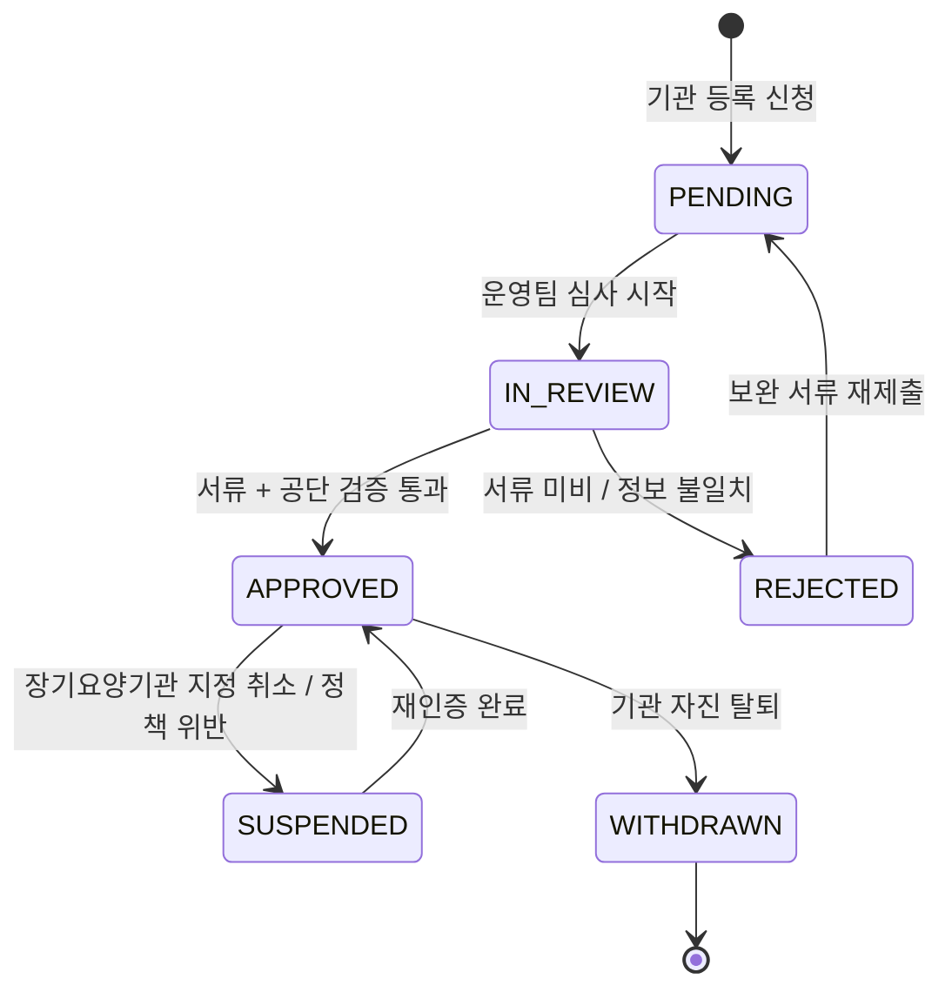
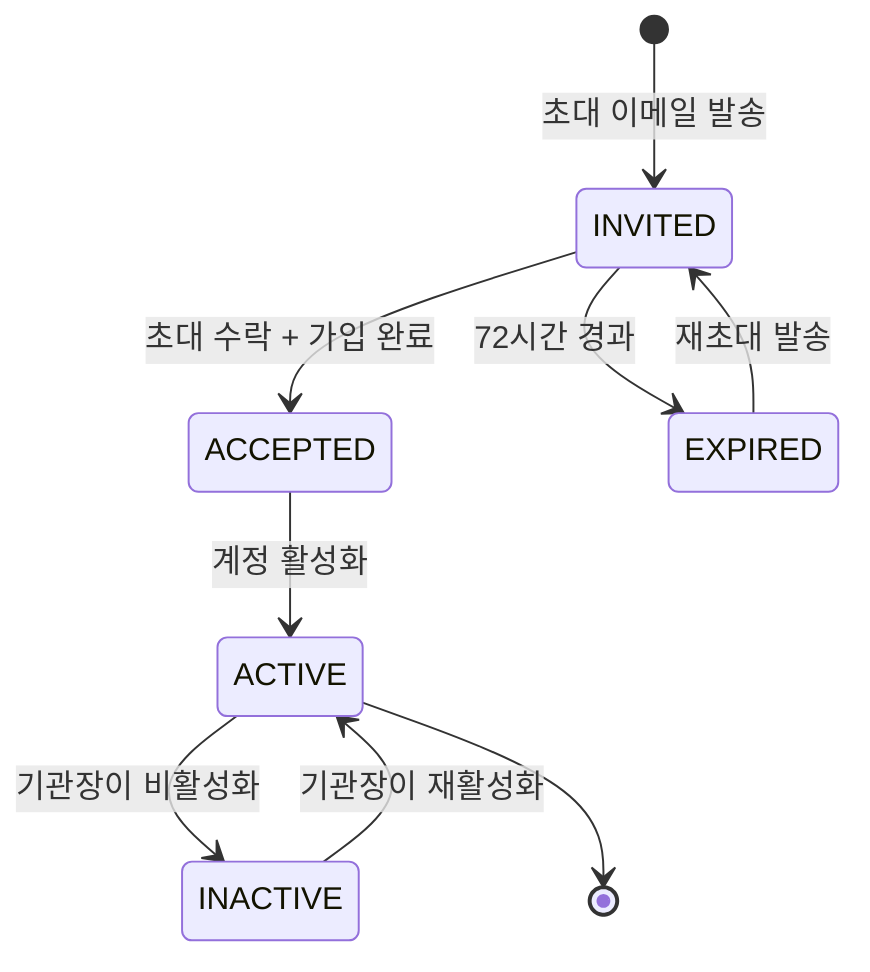

# FS-I-001 기관 등록 및 인증

> 문서 버전: 1.0
> 작성일: 2026-03-30
> 우선순위: P2
> 상태: Draft

---

## 1. 개요

- **기능 설명:** 요양기관(방문요양기관, 주야간보호센터, 노인요양원 등)이 바야다 플랫폼에 기관 정보를 등록하고, 사업자번호 및 장기요양기관 번호를 통해 공식 인증을 받는 기능이다. 국민건강보험공단 장기요양기관 등록 정보 연동을 통해 기관의 유효성을 자동 검증하며, 기관 내 담당자(기관장, 팀장, 사회복지사 등)별 권한 계정을 생성하여 역할 기반 접근 제어를 제공한다.
- **대상 사용자:**
  - 기관장: 기관 등록 신청, 전체 관리 권한
  - 팀장 (사무장/관리팀장): 인력/이용자 관리, 청구 관리
  - 사회복지사: 이용자 관리, 돌봄 기록 조회
  - 요양보호사 관리자: 인력 관리, 스케줄 관리
- **관련 PRD 섹션:** 4.1 소속 요양보호사 관리 (기관 등록 전제)
- **관련 SERVICE_PLAN 섹션:** 3.3.1 기관 등록 및 인증

---

## 2. 유저 스토리

| ID | 역할 | 유저 스토리 |
|----|------|-----------|
| US-I-001-01 | 기관장 | As a 기관장, I want to 기관 정보(기관명, 사업자번호, 장기요양기관 번호)를 등록할 수 있다, so that 바야다 플랫폼에서 기관용 서비스를 이용할 수 있다. |
| US-I-001-02 | 기관장 | As a 기관장, I want to 사업자번호와 장기요양기관 번호의 유효성을 자동으로 검증받을 수 있다, so that 인증 절차를 빠르게 완료할 수 있다. |
| US-I-001-03 | 기관장 | As a 기관장, I want to 소속 직원의 계정을 생성하고 역할(팀장, 사회복지사 등)을 부여할 수 있다, so that 각 직원이 적절한 권한으로 시스템을 사용할 수 있다. |
| US-I-001-04 | 팀장 | As a 팀장, I want to 기관 기본 정보를 수정할 수 있다, so that 변경된 기관 정보를 최신 상태로 유지할 수 있다. |
| US-I-001-05 | 기관장 | As a 기관장, I want to 직원 계정을 비활성화하거나 역할을 변경할 수 있다, so that 퇴사자 접근을 차단하고 업무 변경을 반영할 수 있다. |
| US-I-001-06 | 플랫폼 관리자 | As a 플랫폼 관리자, I want to 기관 등록 신청을 심사하고 승인/반려할 수 있다, so that 부적격 기관의 등록을 방지할 수 있다. |

---

## 3. 화면 구성

### 3.1 화면 목록

| 화면 ID | 화면명 | 진입 경로 | 구현 파일 |
|---------|--------|----------|----------|
| SCR-I-001-01 | 기관 등록 신청 | /institution/register | 미구현 |
| SCR-I-001-02 | 기관 인증 현황 | /institution/verification | 미구현 |
| SCR-I-001-03 | 기관 정보 관리 | /institution/settings | 미구현 |
| SCR-I-001-04 | 담당자 계정 관리 | /institution/members | 미구현 |
| SCR-I-001-05 | 담당자 초대 | /institution/members/invite | 미구현 |

### 3.2 화면별 상세

#### SCR-I-001-01: 기관 등록 신청

**레이아웃:** Step-by-Step 위저드 (4단계)

**Step 1 - 기관 기본 정보:**
- 기관명 (필수)
- 기관 유형 선택: 방문요양기관 / 주야간보호센터 / 노인요양원 / 복합
- 대표자명 (필수)
- 사업자등록번호 (필수, 10자리, 하이픈 자동 입력)
- 장기요양기관 번호 (필수, 건강보험공단 발급)
- 설립일자

**Step 2 - 소재지 및 연락처:**
- 기관 주소 (우편번호 검색 API 연동)
- 상세 주소
- 대표 전화번호
- 대표 팩스번호 (선택)
- 대표 이메일 (필수)

**Step 3 - 인증 서류 업로드:**
- 사업자등록증 사본 (필수, 이미지/PDF)
- 장기요양기관 지정서 사본 (필수, 이미지/PDF)
- 대표자 신분증 사본 (필수)
- 법인등기부등본 (법인인 경우 필수)

**Step 4 - 약관 동의 및 제출:**
- 서비스 이용약관 동의 (필수)
- 개인정보 처리방침 동의 (필수)
- 전자금융거래 이용약관 동의 (필수)
- 마케팅 수신 동의 (선택)
- 등록 신청 버튼

#### SCR-I-001-02: 기관 인증 현황

**레이아웃:**
- 상단: 인증 진행 상태 Progress Bar (신청 → 서류 검토 → 공단 연동 → 완료)
- 중앙: 단계별 상세 상태 및 예상 소요 시간
- 하단: 반려 시 사유 표시 + 재제출 버튼

**표시 정보:**
| 항목 | 설명 |
|------|------|
| 인증 상태 | PENDING / IN_REVIEW / APPROVED / REJECTED |
| 신청일 | YYYY-MM-DD HH:mm |
| 현재 단계 | 서류 검토 / 공단 연동 중 / 최종 승인 대기 |
| 예상 완료일 | 신청 후 영업일 3일 이내 |
| 반려 사유 | (반려 시) 상세 사유 및 보완 안내 |

#### SCR-I-001-03: 기관 정보 관리

**레이아웃:**
- 상단: 기관 인증 뱃지 (인증 완료 / 인증 대기)
- 좌측: 기관 기본 정보 폼 (수정 가능)
- 우측: 인증 서류 목록 (재업로드 가능)
- 하단: 수정 내역 로그

**수정 가능 항목:**
- 기관명, 대표자명, 연락처, 주소, 이메일
- 사업자등록증 재업로드 (변경 시)

**수정 불가 항목 (관리자 승인 필요):**
- 사업자등록번호
- 장기요양기관 번호
- 기관 유형

#### SCR-I-001-04: 담당자 계정 관리

**레이아웃:**
- 상단: 계정 현황 요약 카드 (전체 / 활성 / 비활성)
- 중앙: 담당자 테이블
- 우측 상단: '담당자 초대' 버튼

**테이블 컬럼:**
| 컬럼 | 설명 |
|------|------|
| 이름 | 담당자명 |
| 이메일 | 로그인 이메일 |
| 역할 | 기관장 / 팀장 / 사회복지사 / 요양보호사 관리자 |
| 상태 | 활성 / 비활성 / 초대 대기 |
| 최근 접속 | YYYY-MM-DD HH:mm |
| 가입일 | YYYY-MM-DD |
| 액션 | 역할 변경 / 비활성화 / 삭제 |

#### SCR-I-001-05: 담당자 초대

**레이아웃:**
- 초대 이메일 입력
- 역할 선택 드롭다운
- 접근 권한 커스텀 체크리스트 (선택)
- 초대 메시지 입력 (선택)
- 초대 발송 버튼

---

## 4. 상세 동작 명세

### 4.1 정상 플로우

#### 기관 등록 플로우
```
기관장이 회원가입 시 역할 'INSTITUTION' 선택
    ↓
기관 등록 위저드 진입
    ↓
Step 1: 기관 기본 정보 입력
    ↓
사업자등록번호 실시간 유효성 검증 (국세청 API)
    ↓
장기요양기관 번호 실시간 유효성 검증 (건강보험공단 API)
    ↓
Step 2: 소재지 및 연락처 입력
    ↓
Step 3: 인증 서류 업로드
    ↓
Step 4: 약관 동의 및 신청 제출
    ↓
기관 상태: PENDING (심사 대기)
    ↓
플랫폼 운영팀 심사 시작
    ↓
서류 검토 + 공단 정보 대조
    ↓
[승인] 기관 상태: APPROVED → 대시보드 접근 활성화
    ↓
기관장에게 승인 완료 알림 (이메일 + 푸시)
```

#### 담당자 초대 플로우
```
기관장/팀장이 담당자 계정 관리 진입
    ↓
'담당자 초대' 버튼 클릭
    ↓
이메일 + 역할 입력
    ↓
초대 이메일 발송 (초대 링크 포함, 유효기간 72시간)
    ↓
피초대자가 초대 링크 클릭
    ↓
회원가입 (또는 기존 계정 연결)
    ↓
기관 소속 계정으로 활성화
    ↓
부여된 역할에 따른 메뉴 접근
```

### 4.2 예외 플로우

| 예외 상황 | 처리 방법 |
|----------|----------|
| 사업자등록번호 유효성 검증 실패 | "유효하지 않은 사업자등록번호입니다. 확인 후 다시 입력해 주세요." 에러 표시 |
| 장기요양기관 번호 미등록 | "건강보험공단에 등록되지 않은 기관 번호입니다." 에러, 공단 문의 안내 |
| 이미 등록된 사업자번호로 재등록 시도 | "이미 등록된 기관입니다. 기존 기관 관리자에게 문의하세요." 안내 |
| 인증 서류 형식 오류 | "지원하지 않는 파일 형식입니다. JPG, PNG, PDF만 가능합니다." |
| 인증 서류 용량 초과 | "파일 크기가 10MB를 초과합니다." 에러 |
| 초대 링크 만료 | "초대 링크가 만료되었습니다. 기관 관리자에게 재초대를 요청하세요." |
| 기관장 계정 삭제 시도 | "기관장 계정은 삭제할 수 없습니다. 기관장 변경을 먼저 진행하세요." |
| 건강보험공단 API 장애 | "기관 인증 시스템이 일시적으로 이용 불가합니다. 잠시 후 다시 시도해 주세요." + 수동 심사 전환 |

### 4.3 비즈니스 규칙

| 규칙 ID | 규칙 | 설명 |
|---------|------|------|
| BR-I-001-01 | 기관 유일성 | 동일 사업자등록번호로 중복 등록 불가 |
| BR-I-001-02 | 장기요양기관 번호 필수 | 장기요양보험 급여 청구 기관은 장기요양기관 번호 필수 |
| BR-I-001-03 | 인증 심사 기한 | 기관 등록 신청 후 영업일 3일 이내 심사 완료 목표 |
| BR-I-001-04 | 기관장 필수 | 기관에는 반드시 1명 이상의 기관장 역할 계정이 존재해야 함 |
| BR-I-001-05 | 초대 유효기간 | 담당자 초대 링크 유효기간 72시간, 만료 시 재초대 필요 |
| BR-I-001-06 | 사업자번호 변경 불가 | 사업자등록번호 변경 시 플랫폼 관리자 승인 필요 (기관 재인증) |
| BR-I-001-07 | 서류 보관 기간 | 인증 서류는 기관 탈퇴 후 5년간 보관 (전자상거래법) |
| BR-I-001-08 | 기관 비활성화 조건 | 장기요양기관 지정 취소 시 기관 계정 자동 비활성화 |
| BR-I-001-09 | 담당자 상한 | 기관당 담당자 계정 최대 50개 (추가 필요 시 관리자 문의) |

### 4.4 권한 규칙 (기관장/팀장/직원 역할별)

| 기능 | 기관장 | 팀장 | 사회복지사 | 요양보호사 관리자 |
|------|:-----:|:----:|:---------:|:---------------:|
| 기관 등록 신청 | O | X | X | X |
| 기관 정보 수정 | O | O | X | X |
| 담당자 초대 | O | O | X | X |
| 담당자 역할 변경 | O | X | X | X |
| 담당자 비활성화 | O | O (본인 하위만) | X | X |
| 인증 서류 재업로드 | O | O | X | X |
| 기관 탈퇴 신청 | O | X | X | X |
| 기관 정보 조회 | O | O | O | O |

---

## 5. 수용 기준 (Acceptance Criteria)

### AC-001: 기관 등록 신청
```
Given 기관장이 기관 등록 위저드에서 모든 필수 정보를 입력했을 때
When 사업자등록번호와 장기요양기관 번호가 유효성 검증을 통과하고 제출 버튼을 클릭하면
Then 기관 상태가 PENDING으로 생성되고
And 플랫폼 운영팀에 심사 요청 알림이 발송되며
And 기관장에게 접수 완료 이메일이 발송된다
```

### AC-002: 사업자등록번호 유효성 검증
```
Given 기관장이 사업자등록번호를 입력했을 때
When 국세청 API를 통해 유효성을 검증하면
Then 유효한 경우 녹색 체크 아이콘이 표시되고
And 유효하지 않은 경우 에러 메시지가 표시되며 다음 단계 진행이 차단된다
```

### AC-003: 장기요양기관 번호 검증
```
Given 기관장이 장기요양기관 번호를 입력했을 때
When 건강보험공단 API를 통해 등록 정보를 조회하면
Then 기관명, 기관유형, 소재지가 자동 매핑되어 표시되고
And 조회 실패 시 수동 입력으로 전환되며 운영팀 수동 심사가 필요함을 안내한다
```

### AC-004: 담당자 초대
```
Given 기관장이 담당자 초대 화면에서 이메일과 역할을 입력했을 때
When 초대 발송 버튼을 클릭하면
Then 초대 이메일이 발송되고
And 담당자 목록에 '초대 대기' 상태로 표시되며
And 72시간 이내 수락하지 않으면 초대가 만료된다
```

### AC-005: 기관 인증 승인
```
Given 플랫폼 운영팀이 기관 등록 신청을 심사했을 때
When 서류 검증과 공단 정보 대조가 완료되어 승인 처리하면
Then 기관 상태가 APPROVED로 변경되고
And 기관 대시보드 전체 기능이 활성화되며
And 기관장에게 승인 완료 알림이 발송된다
```

### AC-006: 권한 기반 접근 제어
```
Given 사회복지사 역할의 담당자가 기관 대시보드에 접근했을 때
When 기관 설정 메뉴를 확인하면
Then 기관 정보 수정, 담당자 초대 메뉴는 비활성화되어 있고
And 이용자 관리, 돌봄 기록 조회 메뉴만 접근 가능하다
```

---

## 6. API 연동

### 6.1 사용 API 목록

| Method | Endpoint | 설명 | 구현 상태 |
|--------|----------|------|----------|
| POST | /api/institution/register | 기관 등록 신청 | ❌ 미구현 |
| GET | /api/institution/verification | 기관 인증 현황 조회 | ❌ 미구현 |
| GET | /api/institution/profile | 기관 정보 조회 | ❌ 미구현 |
| PATCH | /api/institution/profile | 기관 정보 수정 | ❌ 미구현 |
| POST | /api/institution/members/invite | 담당자 초대 | ❌ 미구현 |
| GET | /api/institution/members | 담당자 목록 조회 | ❌ 미구현 |
| PATCH | /api/institution/members/[id]/role | 담당자 역할 변경 | ❌ 미구현 |
| DELETE | /api/institution/members/[id] | 담당자 비활성화 | ❌ 미구현 |
| POST | /api/institution/verify-business | 사업자등록번호 유효성 검증 (국세청 API 프록시) | ❌ 미구현 |
| POST | /api/institution/verify-ltc | 장기요양기관 번호 검증 (건강보험공단 API 프록시) | ❌ 미구현 |
| POST | /api/institution/documents | 인증 서류 업로드 | ❌ 미구현 |

### 6.2 주요 요청/응답 스키마

#### POST /api/institution/register

**Request Body:**
```json
{
  "name": "바야다방문요양센터",
  "type": "VISIT_CARE",
  "representativeName": "김대표",
  "businessNumber": "123-45-67890",
  "ltcInstitutionNumber": "12345678",
  "establishedDate": "2020-01-15",
  "address": "서울특별시 강남구 테헤란로 123",
  "addressDetail": "4층",
  "zipCode": "06236",
  "phone": "02-1234-5678",
  "fax": "02-1234-5679",
  "email": "admin@bayada-care.kr",
  "documents": {
    "businessLicense": "s3://documents/business-license-xxx.pdf",
    "ltcDesignation": "s3://documents/ltc-designation-xxx.pdf",
    "representativeId": "s3://documents/rep-id-xxx.jpg",
    "corporateRegistry": "s3://documents/corp-registry-xxx.pdf"
  },
  "agreements": {
    "termsOfService": true,
    "privacyPolicy": true,
    "electronicFinance": true,
    "marketing": false
  }
}
```

**Response:**
```json
{
  "success": true,
  "data": {
    "id": "inst_cuid_xxx",
    "name": "바야다방문요양센터",
    "status": "PENDING",
    "createdAt": "2026-03-30T10:00:00Z",
    "estimatedApprovalDate": "2026-04-02T18:00:00Z"
  }
}
```

#### POST /api/institution/members/invite

**Request Body:**
```json
{
  "email": "teamlead@bayada-care.kr",
  "role": "TEAM_LEADER",
  "message": "바야다 플랫폼 기관 관리 시스템에 초대합니다."
}
```

**Response:**
```json
{
  "success": true,
  "data": {
    "inviteId": "inv_cuid_xxx",
    "email": "teamlead@bayada-care.kr",
    "role": "TEAM_LEADER",
    "status": "PENDING",
    "expiresAt": "2026-04-02T10:00:00Z"
  }
}
```

---

## 7. 상태 다이어그램

### 기관 인증 상태



### 담당자 초대 상태



---

## 8. 데이터 모델

### 기존 모델 (사용)

| 모델 | 주요 필드 | 비고 |
|------|----------|------|
| User | id, phone, email, name, role | 기관 담당자의 기본 계정 (role: INSTITUTION) |
| Notification | id, userId, type, title, body | 인증 결과, 초대 알림 발송 |

### 신규 모델 (필요)

| 모델 | 주요 필드 | 설명 |
|------|----------|------|
| Institution | id, name, type, representativeName, businessNumber, ltcInstitutionNumber, address, phone, email, status, approvedAt, createdAt, updatedAt | 기관 기본 정보 |
| InstitutionDocument | id, institutionId, docType, fileUrl, uploadedAt | 기관 인증 서류 |
| InstitutionMember | id, institutionId, userId, role, status, invitedAt, joinedAt | 기관 소속 담당자 |
| InstitutionInvite | id, institutionId, email, role, token, status, expiresAt, createdAt | 담당자 초대 |
| InstitutionAuditLog | id, institutionId, actorId, action, target, metadata, createdAt | 기관 내 관리 행위 로그 |

### Prisma 스키마 (예상)

```prisma
model Institution {
  id                    String   @id @default(cuid())
  name                  String
  type                  String   // VISIT_CARE, DAY_NIGHT_CARE, NURSING_HOME, COMPLEX
  representativeName    String
  businessNumber        String   @unique
  ltcInstitutionNumber  String?  @unique
  establishedDate       DateTime?
  address               String
  addressDetail         String?
  zipCode               String?
  phone                 String
  fax                   String?
  email                 String
  status                String   @default("PENDING") // PENDING, IN_REVIEW, APPROVED, REJECTED, SUSPENDED, WITHDRAWN
  approvedAt            DateTime?
  rejectionReason       String?

  createdAt DateTime @default(now())
  updatedAt DateTime @updatedAt

  documents  InstitutionDocument[]
  members    InstitutionMember[]
  invites    InstitutionInvite[]
  auditLogs  InstitutionAuditLog[]

  @@index([businessNumber])
  @@index([status])
}

model InstitutionDocument {
  id            String      @id @default(cuid())
  institutionId String
  institution   Institution @relation(fields: [institutionId], references: [id], onDelete: Cascade)
  docType       String      // BUSINESS_LICENSE, LTC_DESIGNATION, REPRESENTATIVE_ID, CORPORATE_REGISTRY
  fileUrl       String
  uploadedAt    DateTime    @default(now())

  @@index([institutionId])
}

model InstitutionMember {
  id            String      @id @default(cuid())
  institutionId String
  institution   Institution @relation(fields: [institutionId], references: [id], onDelete: Cascade)
  userId        String
  role          String      // DIRECTOR, TEAM_LEADER, SOCIAL_WORKER, CARE_MANAGER
  status        String      @default("ACTIVE") // ACTIVE, INACTIVE
  joinedAt      DateTime    @default(now())

  @@unique([institutionId, userId])
  @@index([institutionId])
}

model InstitutionInvite {
  id            String      @id @default(cuid())
  institutionId String
  institution   Institution @relation(fields: [institutionId], references: [id], onDelete: Cascade)
  email         String
  role          String
  token         String      @unique
  status        String      @default("PENDING") // PENDING, ACCEPTED, EXPIRED
  expiresAt     DateTime
  createdAt     DateTime    @default(now())

  @@index([institutionId])
  @@index([token])
}

model InstitutionAuditLog {
  id            String      @id @default(cuid())
  institutionId String
  institution   Institution @relation(fields: [institutionId], references: [id], onDelete: Cascade)
  actorId       String
  action        String      // REGISTER, UPDATE_INFO, INVITE_MEMBER, CHANGE_ROLE, DEACTIVATE_MEMBER
  target        String?
  metadata      String?     // JSON
  createdAt     DateTime    @default(now())

  @@index([institutionId, createdAt])
}
```

---

## 9. 연관 기능

| 기능 ID | 기능명 | 연관 설명 |
|---------|--------|----------|
| FS-I-002 | 인력 채용 관리 | 기관 인증 완료 후 소속 요양보호사 등록 가능 |
| FS-I-003 | 이용자 관리 및 매칭 | 기관 인증 완료 후 이용자 등록 및 매칭 배정 가능 |
| FS-I-004 | 돌봄 기록 및 급여 청구 | 장기요양기관 번호가 급여 청구의 전제 조건 |
| FS-I-005 | 품질 관리 및 보고서 | 기관 정보가 보고서 생성의 기본 데이터 |
| FS-A-001 | 회원 관리 (관리자) | 기관 등록 심사를 관리자 백오피스에서 처리 |

---

## 10. 구현 현황

| 항목 | 상태 | 비고 |
|------|------|------|
| 기관 등록 신청 페이지 | ❌ | /institution/register 미구현 |
| 기관 인증 현황 페이지 | ❌ | /institution/verification 미구현 |
| 기관 정보 관리 페이지 | ❌ | /institution/settings 미구현 |
| 담당자 계정 관리 페이지 | ❌ | /institution/members 미구현 |
| 기관 등록 API | ❌ | POST /api/institution/register 미구현 |
| 사업자번호 검증 API | ❌ | 국세청 API 연동 미구현 |
| 장기요양기관 번호 검증 API | ❌ | 건강보험공단 API 연동 미구현 |
| 담당자 초대 API | ❌ | /api/institution/members/invite 미구현 |
| Institution 모델 | ❌ | Prisma 스키마 미추가 |
| InstitutionDocument 모델 | ❌ | Prisma 스키마 미추가 |
| InstitutionMember 모델 | ❌ | Prisma 스키마 미추가 |
| InstitutionInvite 모델 | ❌ | Prisma 스키마 미추가 |
| InstitutionAuditLog 모델 | ❌ | Prisma 스키마 미추가 |
| 기존 User 모델 | ✅ | role 필드에 INSTITUTION 값 추가 필요 |
| 기존 Notification 모델 | ✅ | 알림 발송에 사용 가능 |
