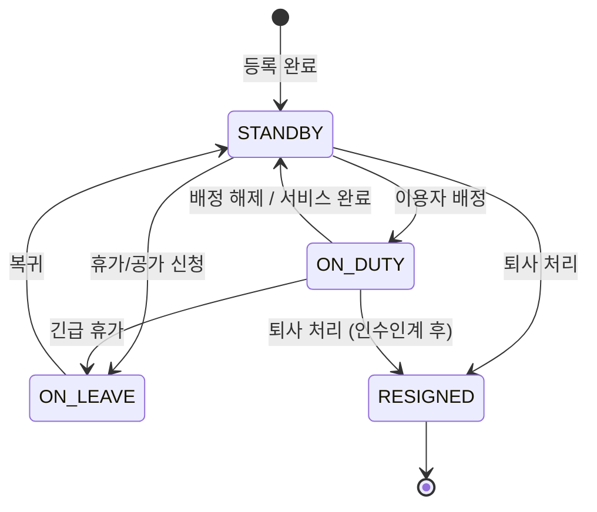
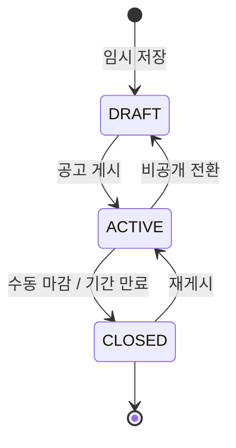
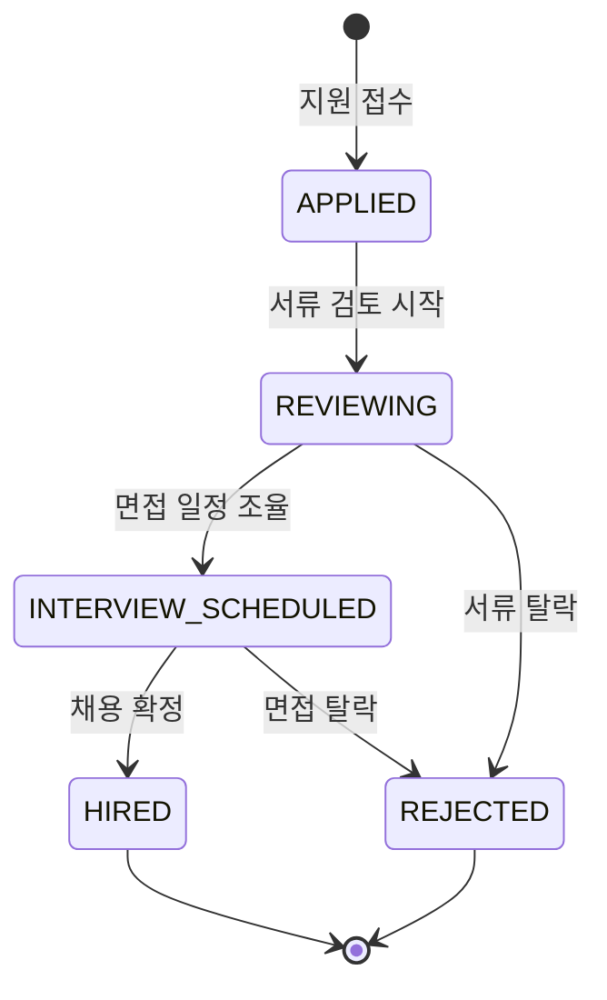

# FS-I-002 인력 채용 관리

> 문서 버전: 1.0
> 작성일: 2026-03-30
> 우선순위: P2
> 상태: Draft

---

## 1. 개요

- **기능 설명:** 요양기관 담당자가 소속 요양보호사를 등록하고, 외부 인력풀(바야다 플랫폼 등록 요양보호사)과 연결하며, 인력 현황을 한눈에 파악하는 대시보드를 제공한다. 자격증 만료 알림, 건강검진 갱신 알림 등으로 법적 자격 관리를 자동화하고, 기관 자체 채용 공고 등록 및 지원자 관리 기능을 포함한다.
- **대상 사용자:**
  - 기관장: 전체 인력 현황 조회, 채용 승인
  - 팀장: 인력 등록/관리, 채용 공고 관리, 일정 관리
  - 요양보호사 관리자: 소속 인력 관리, 자격 관리, 일정 조정
- **관련 PRD 섹션:** 4.1 소속 요양보호사 관리, 4.2 근무 스케줄 관리
- **관련 SERVICE_PLAN 섹션:** 3.3.2 인력 관리

---

## 2. 유저 스토리

| ID | 역할 | 유저 스토리 |
|----|------|-----------|
| US-I-002-01 | 팀장 | As a 팀장, I want to 소속 요양보호사의 기본 정보와 자격 상태를 등록할 수 있다, so that 기관 소속 인력을 체계적으로 관리할 수 있다. |
| US-I-002-02 | 팀장 | As a 팀장, I want to 인력 현황 대시보드에서 근무 중/대기/휴가 상태를 한눈에 확인할 수 있다, so that 인력 배치를 효율적으로 할 수 있다. |
| US-I-002-03 | 요양보호사 관리자 | As a 요양보호사 관리자, I want to 자격증 만료 D-30 알림을 받을 수 있다, so that 소속 요양보호사의 자격 갱신을 사전에 관리할 수 있다. |
| US-I-002-04 | 팀장 | As a 팀장, I want to 플랫폼 내 요양보호사 채용 공고를 등록할 수 있다, so that 추가 인력이 필요할 때 빠르게 채용할 수 있다. |
| US-I-002-05 | 팀장 | As a 팀장, I want to 바야다 플랫폼의 외부 인력풀에서 요양보호사를 요청할 수 있다, so that 긴급 인력 부족 시 외부 인력을 활용할 수 있다. |
| US-I-002-06 | 기관장 | As a 기관장, I want to 연간 교육 이수 현황을 확인할 수 있다, so that 법정 의무 교육 미이수자를 관리할 수 있다. |
| US-I-002-07 | 팀장 | As a 팀장, I want to 주간/월간 캘린더 뷰로 전체 인력 일정을 확인할 수 있다, so that 일정 충돌이나 공백을 사전에 파악할 수 있다. |
| US-I-002-08 | 팀장 | As a 팀장, I want to 결근/공가 시 대체 인력을 빠르게 배정할 수 있다, so that 이용자에 대한 서비스 공백을 최소화할 수 있다. |

---

## 3. 화면 구성

### 3.1 화면 목록

| 화면 ID | 화면명 | 진입 경로 | 구현 파일 |
|---------|--------|----------|----------|
| SCR-I-002-01 | 인력 현황 대시보드 | /institution/staff | 미구현 |
| SCR-I-002-02 | 소속 요양보호사 목록 | /institution/staff/list | 미구현 |
| SCR-I-002-03 | 요양보호사 상세/등록 | /institution/staff/[id] | 미구현 |
| SCR-I-002-04 | 자격 관리 | /institution/staff/certifications | 미구현 |
| SCR-I-002-05 | 근무 스케줄 캘린더 | /institution/schedule | 미구현 |
| SCR-I-002-06 | 채용 공고 관리 | /institution/recruitment | 미구현 |
| SCR-I-002-07 | 채용 공고 상세/등록 | /institution/recruitment/[id] | 미구현 |
| SCR-I-002-08 | 지원자 관리 | /institution/recruitment/[id]/applicants | 미구현 |
| SCR-I-002-09 | 외부 인력 요청 | /institution/staff/external-request | 미구현 |

### 3.2 화면별 상세

#### SCR-I-002-01: 인력 현황 대시보드

**레이아웃:**
- 상단: 요약 통계 카드 (4개)
- 중앙 좌측: 근무 상태별 인력 파이 차트
- 중앙 우측: 자격 만료 임박 목록 (D-30 이내)
- 하단 좌측: 이번 주 스케줄 요약 (일자별 근무 인원)
- 하단 우측: 최근 채용 현황

**통계 카드:**
| 카드 | 설명 |
|------|------|
| 전체 인력 | 소속 요양보호사 총원 |
| 근무 중 | 현재 돌봄 서비스 진행 중 인원 |
| 대기 | 현재 배정 없이 가용한 인원 |
| 휴가/공가 | 현재 부재 중인 인원 |

#### SCR-I-002-02: 소속 요양보호사 목록

**테이블 컬럼:**
| 컬럼 | 설명 |
|------|------|
| 이름 | 요양보호사명 (클릭 시 상세 이동) |
| 자격증 번호 | 요양보호사 자격증 번호 |
| 근무 상태 | 근무 중 / 대기 / 휴가 / 공가 / 퇴사 (뱃지) |
| 담당 이용자 수 | 현재 배정된 이용자 수 |
| 자격 만료일 | YYYY-MM-DD (D-30 이내 빨간색 강조) |
| 건강검진 만료일 | YYYY-MM-DD |
| 입사일 | YYYY-MM-DD |
| 평균 평점 | 4.5/5.0 형식 (보호자 평가 기반) |

**필터/검색:**
- 텍스트 검색: 이름, 자격증 번호
- 근무 상태 필터: 전체 / 근무 중 / 대기 / 휴가 / 퇴사
- 자격 만료 필터: 전체 / 만료 임박 (D-30) / 만료됨
- 정렬: 이름 / 입사일 / 평점 / 담당 이용자 수

#### SCR-I-002-03: 요양보호사 상세/등록

**탭 구성:**
1. **기본 정보 탭:** 개인정보, 연락처, 입사일, 급여 정보
2. **자격/인증 탭:** 자격증, 건강검진, 교육 이수 내역
3. **근무 이력 탭:** 담당 이용자 이력, 근무 시간 통계
4. **평가 탭:** 보호자 리뷰, 평점 추이

**등록 폼 필드:**
- 이름 (필수), 연락처 (필수), 생년월일 (필수)
- 자격증 번호 (필수), 자격증 사본 업로드
- 입사일 (필수)
- 급여 유형: 시급 / 월급
- 급여 금액
- 4대보험 가입 여부

#### SCR-I-002-04: 자격 관리

**레이아웃:**
- 상단: 알림 요약 (만료 임박 N건, 만료됨 N건, 교육 미이수 N건)
- 중앙: 자격 현황 테이블

**테이블 컬럼:**
| 컬럼 | 설명 |
|------|------|
| 요양보호사명 | 이름 |
| 자격증 상태 | 유효 / 만료 임박 / 만료 (뱃지) |
| 자격증 만료일 | YYYY-MM-DD |
| 건강검진 상태 | 유효 / 만료 임박 / 만료 |
| 건강검진 만료일 | YYYY-MM-DD |
| 법정 교육 이수 | 이수 완료 / 미이수 |
| 성범죄 조회 | 완료 / 미완료 / 재조회 필요 |

#### SCR-I-002-05: 근무 스케줄 캘린더

**레이아웃:**
- 상단: 주간/월간 뷰 토글 + 요양보호사별/이용자별 필터
- 중앙: 캘린더 뷰 (색상 코딩: 요양보호사별)
- 하단: 선택 일자 상세 스케줄

**기능:**
- 드래그 앤 드롭 일정 조정
- 일정 충돌 자동 감지 (빨간색 경고)
- 초과 근무 자동 감지 (주 40시간 초과 시 알림)
- 공석 자동 감지 (이용자에게 배정된 요양보호사 없음)

#### SCR-I-002-06: 채용 공고 관리

**테이블 컬럼:**
| 컬럼 | 설명 |
|------|------|
| 공고 제목 | 채용 공고 제목 |
| 채용 유형 | 정규직 / 계약직 / 시간제 |
| 지원자 수 | 현재 지원자 수 |
| 등록일 | YYYY-MM-DD |
| 마감일 | YYYY-MM-DD |
| 상태 | 모집 중 / 마감 / 임시저장 |

---

## 4. 상세 동작 명세

### 4.1 정상 플로우

#### 소속 요양보호사 등록 플로우
```
기관 담당자 (팀장/요양보호사 관리자) 로그인
    ↓
인력 관리 → 소속 요양보호사 목록 진입
    ↓
'요양보호사 등록' 버튼 클릭
    ↓
기본 정보 입력 (이름, 연락처, 자격증 번호)
    ↓
자격증 유효성 자동 검증
    ↓
자격증 사본 업로드
    ↓
급여 정보 입력
    ↓
저장
    ↓
[Case A] 기존 바야다 회원인 경우 → 플랫폼 계정 연결 안내
[Case B] 미가입자인 경우 → 기관 내부 데이터로만 관리
    ↓
소속 목록에 추가 + 상태: 대기
```

#### 채용 공고 등록 및 지원자 관리 플로우
```
팀장이 채용 공고 관리 진입
    ↓
'공고 등록' 버튼 클릭
    ↓
공고 정보 입력 (제목, 업무 내용, 자격 요건, 근무 조건, 급여)
    ↓
공고 게시
    ↓
플랫폼 내 요양보호사에게 노출
    ↓
지원자 접수
    ↓
지원자 목록에서 이력서/자격 확인
    ↓
면접 일정 조율 (인앱 메시지)
    ↓
채용 확정 → 소속 요양보호사로 자동 등록
```

#### 대체 인력 배정 플로우
```
요양보호사 결근/공가 발생
    ↓
스케줄 캘린더에 공석 표시 (빨간색)
    ↓
기관 담당자에게 알림
    ↓
공석 클릭 → 대체 인력 추천 목록 표시
    ↓
[우선 1] 기관 소속 가용 인력 추천
[우선 2] 외부 인력풀 요청
    ↓
대체 인력 선택 및 배정
    ↓
이용자/보호자에게 담당 변경 알림
```

### 4.2 예외 플로우

| 예외 상황 | 처리 방법 |
|----------|----------|
| 자격증 유효성 검증 실패 | "유효하지 않은 자격증 번호입니다. 확인 후 다시 입력해 주세요." |
| 이미 다른 기관에 소속된 요양보호사 등록 시도 | "이미 다른 기관에 소속되어 있습니다. 이전 기관 퇴사 처리 후 등록해 주세요." |
| 만료된 자격증으로 근무 배정 시도 | "자격증이 만료된 요양보호사입니다. 자격 갱신 후 배정 가능합니다." 배정 차단 |
| 초과 근무 감지 | "주 40시간을 초과합니다. 근로기준법에 따라 추가 배정이 제한됩니다." 경고 |
| 일정 충돌 | "해당 시간에 이미 다른 일정이 있습니다." 충돌 상세 표시 |
| 채용 공고 마감일 지난 지원 | "모집이 마감된 공고입니다." |
| 외부 인력 요청 시 가용 인력 없음 | "현재 해당 지역에 가용한 외부 인력이 없습니다. 요청이 대기 목록에 등록됩니다." |

### 4.3 비즈니스 규칙

| 규칙 ID | 규칙 | 설명 |
|---------|------|------|
| BR-I-002-01 | 자격증 필수 | 소속 요양보호사 등록 시 유효한 요양보호사 자격증 번호 필수 |
| BR-I-002-02 | 자격 만료 알림 | 자격증 만료 D-60, D-30, D-7 시점에 알림 발송 |
| BR-I-002-03 | 건강검진 주기 | 건강검진 유효기간 1년, 만료 D-30 알림 |
| BR-I-002-04 | 이중 소속 금지 | 1명의 요양보호사는 동시에 1개 기관에만 소속 가능 |
| BR-I-002-05 | 초과 근무 제한 | 주 40시간 초과 배정 시 경고, 주 52시간 초과 시 배정 차단 |
| BR-I-002-06 | 성범죄 조회 | 소속 요양보호사 연 1회 성범죄 경력 재조회 필수 |
| BR-I-002-07 | 법정 교육 | 연간 법정 의무 교육(치매 전문 교육 등) 미이수 시 근무 배정 제한 알림 |
| BR-I-002-08 | 채용 공고 기간 | 채용 공고 최대 게시 기간 90일 |
| BR-I-002-09 | 대체 인력 알림 | 대체 인력 배정 시 이용자 보호자에게 24시간 전 사전 알림 필수 |

### 4.4 권한 규칙 (기관장/팀장/직원 역할별)

| 기능 | 기관장 | 팀장 | 사회복지사 | 요양보호사 관리자 |
|------|:-----:|:----:|:---------:|:---------------:|
| 인력 대시보드 조회 | O | O | △ (요약만) | O |
| 요양보호사 등록 | O | O | X | O |
| 요양보호사 정보 수정 | O | O | X | O |
| 요양보호사 퇴사 처리 | O | O | X | X |
| 자격 관리 조회 | O | O | X | O |
| 스케줄 조회 | O | O | O | O |
| 스케줄 수정 (배정/변경) | O | O | X | O |
| 채용 공고 등록 | O | O | X | X |
| 지원자 관리 | O | O | X | X |
| 채용 확정 | O | O | X | X |
| 외부 인력 요청 | O | O | X | O |

---

## 5. 수용 기준 (Acceptance Criteria)

### AC-001: 소속 요양보호사 등록
```
Given 팀장이 소속 요양보호사 등록 화면에서 필수 정보를 입력했을 때
When 자격증 번호가 유효성 검증을 통과하고 저장 버튼을 클릭하면
Then 해당 요양보호사가 소속 목록에 '대기' 상태로 추가되고
And 자격증 만료일이 자동으로 등록되며
And 기존 바야다 회원인 경우 플랫폼 계정 연결 안내가 표시된다
```

### AC-002: 인력 현황 대시보드
```
Given 팀장이 인력 현황 대시보드에 접근했을 때
When 페이지가 로딩되면
Then 전체 인력, 근무 중, 대기, 휴가/공가 수가 통계 카드에 표시되고
And 자격 만료 임박(D-30 이내) 인력 목록이 표시되며
And 이번 주 일자별 근무 인원 요약이 표시된다
```

### AC-003: 자격 만료 알림
```
Given 소속 요양보호사의 자격증 만료일이 D-30 이내일 때
When 시스템이 일일 자격 만료 체크를 실행하면
Then 기관 담당자에게 자격 만료 임박 알림이 발송되고
And 자격 관리 화면에서 해당 인력이 '만료 임박' 뱃지로 강조 표시된다
```

### AC-004: 근무 스케줄 관리
```
Given 팀장이 스케줄 캘린더에서 특정 일정을 드래그 앤 드롭으로 이동했을 때
When 이동 대상 시간대에 충돌이 없으면
Then 일정이 변경되고
And 해당 요양보호사와 이용자에게 일정 변경 알림이 발송된다

Given 이동 대상 시간대에 기존 일정이 있을 때
When 드롭하면
Then "해당 시간에 이미 다른 일정이 있습니다" 충돌 경고가 표시되고
And 일정 변경이 차단된다
```

### AC-005: 채용 공고 등록 및 지원
```
Given 팀장이 채용 공고를 등록했을 때
When 공고가 게시되면
Then 플랫폼 내 해당 지역 요양보호사에게 채용 공고가 노출되고
And 지원자가 지원하면 지원자 관리 목록에 표시된다
```

### AC-006: 대체 인력 배정
```
Given 요양보호사가 결근하여 스케줄에 공석이 발생했을 때
When 기관 담당자가 공석을 클릭하면
Then 기관 소속 가용 인력 목록이 우선 추천되고
And 소속 인력이 부족하면 외부 인력풀 요청 옵션이 표시되며
And 대체 인력 배정 시 이용자 보호자에게 알림이 발송된다
```

---

## 6. API 연동

### 6.1 사용 API 목록

| Method | Endpoint | 설명 | 구현 상태 |
|--------|----------|------|----------|
| GET | /api/institution/staff | 소속 요양보호사 목록 | ❌ 미구현 |
| POST | /api/institution/staff | 소속 요양보호사 등록 | ❌ 미구현 |
| GET | /api/institution/staff/[id] | 요양보호사 상세 | ❌ 미구현 |
| PATCH | /api/institution/staff/[id] | 요양보호사 정보 수정 | ❌ 미구현 |
| DELETE | /api/institution/staff/[id] | 요양보호사 퇴사 처리 | ❌ 미구현 |
| GET | /api/institution/staff/dashboard | 인력 현황 대시보드 통계 | ❌ 미구현 |
| GET | /api/institution/staff/certifications | 자격 관리 현황 | ❌ 미구현 |
| GET | /api/institution/schedule | 스케줄 조회 (주간/월간) | ❌ 미구현 |
| POST | /api/institution/schedule | 스케줄 생성 | ❌ 미구현 |
| PATCH | /api/institution/schedule/[id] | 스케줄 수정 | ❌ 미구현 |
| DELETE | /api/institution/schedule/[id] | 스케줄 삭제 | ❌ 미구현 |
| GET | /api/institution/recruitment | 채용 공고 목록 | ❌ 미구현 |
| POST | /api/institution/recruitment | 채용 공고 등록 | ❌ 미구현 |
| GET | /api/institution/recruitment/[id] | 채용 공고 상세 | ❌ 미구현 |
| PATCH | /api/institution/recruitment/[id] | 채용 공고 수정 | ❌ 미구현 |
| GET | /api/institution/recruitment/[id]/applicants | 지원자 목록 | ❌ 미구현 |
| PATCH | /api/institution/recruitment/[id]/applicants/[appId] | 지원자 상태 변경 | ❌ 미구현 |
| POST | /api/institution/staff/external-request | 외부 인력 요청 | ❌ 미구현 |

### 6.2 주요 요청/응답 스키마

#### POST /api/institution/staff

**Request Body:**
```json
{
  "name": "이요양",
  "phone": "010-1234-5678",
  "birthDate": "1980-05-15",
  "licenseNumber": "2020-12345",
  "licenseExpirationDate": "2027-12-31",
  "healthCheckExpirationDate": "2027-03-15",
  "employmentType": "FULL_TIME",
  "payType": "HOURLY",
  "payAmount": 15000,
  "startDate": "2026-04-01",
  "socialInsurance": true,
  "certificateImageUrl": "s3://documents/cert-xxx.jpg"
}
```

**Response:**
```json
{
  "success": true,
  "data": {
    "id": "staff_cuid_xxx",
    "name": "이요양",
    "status": "STANDBY",
    "licenseVerified": true,
    "platformLinked": false,
    "createdAt": "2026-03-30T10:00:00Z"
  }
}
```

#### GET /api/institution/staff/dashboard

**Response:**
```json
{
  "success": true,
  "data": {
    "summary": {
      "total": 45,
      "onDuty": 28,
      "standby": 12,
      "onLeave": 5
    },
    "certExpiringWithin30Days": [
      {
        "id": "staff_xxx",
        "name": "이요양",
        "certificationType": "CARE_WORKER_LICENSE",
        "expirationDate": "2026-04-25",
        "daysRemaining": 26
      }
    ],
    "weeklyScheduleSummary": [
      { "date": "2026-03-30", "onDuty": 28, "vacant": 2 },
      { "date": "2026-03-31", "onDuty": 30, "vacant": 0 }
    ],
    "recentRecruitment": {
      "activePostings": 2,
      "totalApplicants": 15
    }
  }
}
```

#### POST /api/institution/recruitment

**Request Body:**
```json
{
  "title": "방문요양 요양보호사 채용 (서울 강남구)",
  "employmentType": "FULL_TIME",
  "description": "어르신 방문요양 서비스를 담당할 요양보호사를 모집합니다.",
  "requirements": "요양보호사 자격증 소지, 경력 1년 이상 우대",
  "workConditions": "주 5일 근무, 09:00~18:00",
  "salary": "시급 15,000원 이상 (경력에 따라 협의)",
  "region": "서울특별시 강남구",
  "deadline": "2026-06-30"
}
```

**Response:**
```json
{
  "success": true,
  "data": {
    "id": "recruit_cuid_xxx",
    "title": "방문요양 요양보호사 채용 (서울 강남구)",
    "status": "ACTIVE",
    "createdAt": "2026-03-30T10:00:00Z",
    "deadline": "2026-06-30T23:59:59Z"
  }
}
```

---

## 7. 상태 다이어그램

### 소속 요양보호사 근무 상태



### 채용 공고 상태



### 지원자 상태



---

## 8. 데이터 모델

### 기존 모델 (사용)

| 모델 | 주요 필드 | 비고 |
|------|----------|------|
| User | id, phone, email, name, role | 기관 담당자 계정 |
| CaregiverProfile | id, userId, licenseNumber, licenseVerified, averageRating, grade | 플랫폼 연동 시 사용 |
| Certificate | id, caregiverId, certType, expirationDate, verificationStatus | 자격 인증 정보 |
| Availability | id, caregiverId, dayOfWeek, startTime, endTime | 가용 시간 |
| CareSession | id, matchId, caregiverId, scheduledDate | 스케줄 연동 |
| Notification | id, userId, type, title, body | 알림 발송 |

### 신규 모델 (필요)

| 모델 | 주요 필드 | 설명 |
|------|----------|------|
| InstitutionStaff | id, institutionId, caregiverProfileId, name, phone, licenseNumber, status, employmentType, payType, payAmount, startDate, endDate | 기관 소속 요양보호사 |
| InstitutionSchedule | id, institutionId, staffId, recipientId, scheduledDate, startTime, endTime, status | 기관 근무 스케줄 |
| RecruitmentPosting | id, institutionId, title, description, requirements, employmentType, salary, region, deadline, status | 채용 공고 |
| RecruitmentApplicant | id, postingId, caregiverProfileId, resumeUrl, status, appliedAt | 채용 지원자 |
| StaffCertification | id, staffId, certType, expirationDate, status, lastCheckedAt | 소속 인력 자격 관리 |

---

## 9. 연관 기능

| 기능 ID | 기능명 | 연관 설명 |
|---------|--------|----------|
| FS-I-001 | 기관 등록 및 인증 | 기관 인증 완료가 인력 관리 기능의 전제 조건 |
| FS-I-003 | 이용자 관리 및 매칭 | 소속 요양보호사-이용자 매칭 배정에 사용 |
| FS-I-004 | 돌봄 기록 및 급여 청구 | 근무 시간 데이터가 급여 계산 및 청구의 기반 |
| FS-I-005 | 품질 관리 및 보고서 | 인력 현황 데이터가 보고서 생성에 사용 |
| (플랫폼) | 요양보호사 프로필 | 외부 인력풀 연결 시 플랫폼 CaregiverProfile 연동 |

---

## 10. 구현 현황

| 항목 | 상태 | 비고 |
|------|------|------|
| 인력 현황 대시보드 | ❌ | /institution/staff 미구현 |
| 소속 요양보호사 목록 | ❌ | /institution/staff/list 미구현 |
| 요양보호사 등록/상세 | ❌ | /institution/staff/[id] 미구현 |
| 자격 관리 페이지 | ❌ | /institution/staff/certifications 미구현 |
| 근무 스케줄 캘린더 | ❌ | /institution/schedule 미구현 |
| 채용 공고 관리 | ❌ | /institution/recruitment 미구현 |
| 지원자 관리 | ❌ | /institution/recruitment/[id]/applicants 미구현 |
| 외부 인력 요청 | ❌ | /institution/staff/external-request 미구현 |
| 인력 관리 API 전체 | ❌ | /api/institution/staff/* 미구현 |
| 스케줄 API 전체 | ❌ | /api/institution/schedule/* 미구현 |
| 채용 API 전체 | ❌ | /api/institution/recruitment/* 미구현 |
| InstitutionStaff 모델 | ❌ | Prisma 스키마 미추가 |
| InstitutionSchedule 모델 | ❌ | Prisma 스키마 미추가 |
| RecruitmentPosting 모델 | ❌ | Prisma 스키마 미추가 |
| RecruitmentApplicant 모델 | ❌ | Prisma 스키마 미추가 |
| 기존 CaregiverProfile 모델 | ✅ | 플랫폼 연동 시 사용 가능 |
| 기존 Certificate 모델 | ✅ | 자격 인증 정보 연동 가능 |
| 기존 Availability 모델 | ✅ | 가용 시간 데이터 사용 가능 |
