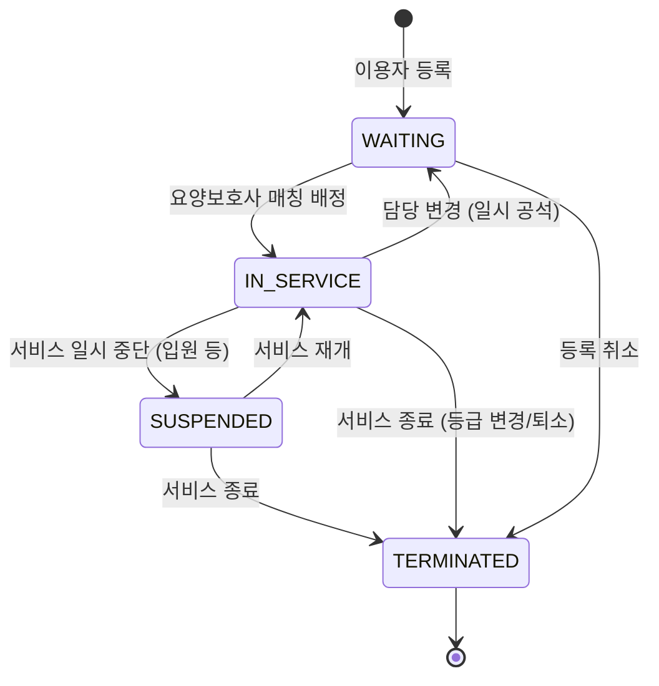
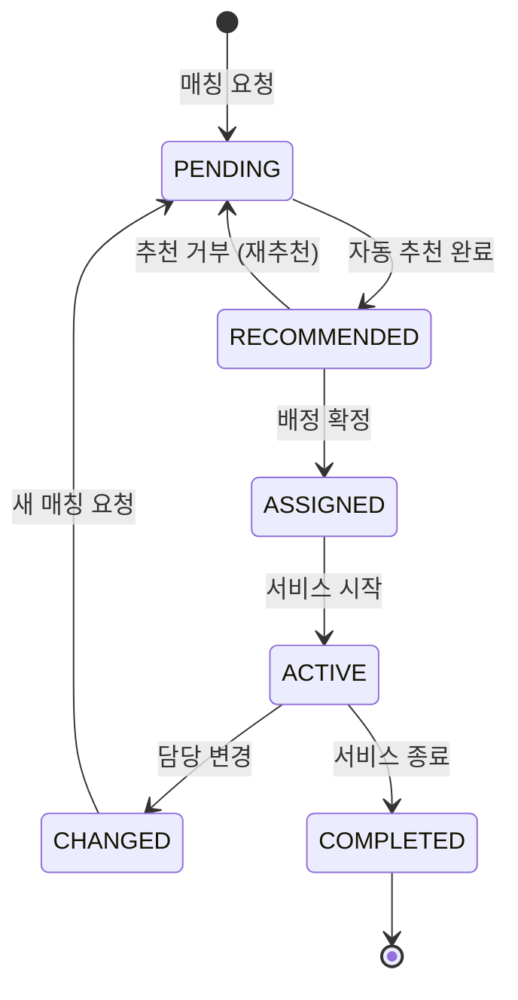

# FS-I-003 이용자 관리 및 매칭

> 문서 버전: 1.0
> 작성일: 2026-03-30
> 우선순위: P2
> 상태: Draft

---

## 1. 개요

- **기능 설명:** 요양기관 담당자가 이용자(어르신/수급자)를 등록하고, 소속 요양보호사와의 최적 매칭을 배정하는 기능이다. 이용자의 건강 상태, 돌봄 등급, 서비스 계획 등을 체계적으로 관리하며, 담당 요양보호사 변경 이력을 추적한다. 결근이나 공가 발생 시 대체 인력을 신속하게 배정하여 서비스 공백을 최소화한다.
- **대상 사용자:**
  - 기관장: 전체 이용자 현황 조회, 매칭 승인
  - 팀장: 이용자 등록/관리, 매칭 배정
  - 사회복지사: 이용자 등록, 건강 상태 관리, 서비스 계획 수립
  - 요양보호사 관리자: 매칭 배정, 대체 인력 배정
- **관련 PRD 섹션:** 4.2 근무 스케줄 관리 (수급자별 방문 일정 관리)
- **관련 SERVICE_PLAN 섹션:** 3.3.3 이용자 관리

---

## 2. 유저 스토리

| ID | 역할 | 유저 스토리 |
|----|------|-----------|
| US-I-003-01 | 사회복지사 | As a 사회복지사, I want to 이용자(어르신)의 기본 정보와 건강 상태를 등록할 수 있다, so that 적절한 돌봄 서비스를 계획할 수 있다. |
| US-I-003-02 | 사회복지사 | As a 사회복지사, I want to 이용자별 서비스 계획(급여 유형, 주간 방문 횟수, 시간)을 수립할 수 있다, so that 개인별 맞춤 돌봄을 제공할 수 있다. |
| US-I-003-03 | 팀장 | As a 팀장, I want to 이용자-요양보호사 최적 매칭을 자동 추천받을 수 있다, so that 매칭 배정의 효율성을 높일 수 있다. |
| US-I-003-04 | 팀장 | As a 팀장, I want to 담당 요양보호사 변경 시 이력을 관리할 수 있다, so that 서비스 연속성과 이용자 만족도를 추적할 수 있다. |
| US-I-003-05 | 요양보호사 관리자 | As a 요양보호사 관리자, I want to 결근 시 대체 인력을 빠르게 배정할 수 있다, so that 이용자에 대한 서비스 공백이 발생하지 않는다. |
| US-I-003-06 | 기관장 | As a 기관장, I want to 전체 이용자 현황(서비스 중/대기/종료)을 한눈에 확인할 수 있다, so that 기관 운영 현황을 파악할 수 있다. |
| US-I-003-07 | 사회복지사 | As a 사회복지사, I want to 이용자의 장기요양등급 정보와 급여 한도를 확인할 수 있다, so that 급여 한도 내에서 서비스를 계획할 수 있다. |

---

## 3. 화면 구성

### 3.1 화면 목록

| 화면 ID | 화면명 | 진입 경로 | 구현 파일 |
|---------|--------|----------|----------|
| SCR-I-003-01 | 이용자 현황 대시보드 | /institution/recipients | 미구현 |
| SCR-I-003-02 | 이용자 목록 | /institution/recipients/list | 미구현 |
| SCR-I-003-03 | 이용자 등록 | /institution/recipients/new | 미구현 |
| SCR-I-003-04 | 이용자 상세 | /institution/recipients/[id] | 미구현 |
| SCR-I-003-05 | 서비스 계획 수립 | /institution/recipients/[id]/service-plan | 미구현 |
| SCR-I-003-06 | 매칭 배정 | /institution/matching | 미구현 |
| SCR-I-003-07 | 매칭 추천 결과 | /institution/matching/recommend | 미구현 |
| SCR-I-003-08 | 담당 변경 이력 | /institution/recipients/[id]/history | 미구현 |
| SCR-I-003-09 | 대체 인력 배정 | /institution/matching/substitute | 미구현 |

### 3.2 화면별 상세

#### SCR-I-003-01: 이용자 현황 대시보드

**레이아웃:**
- 상단: 요약 통계 카드 (4개)
- 중앙 좌측: 장기요양등급별 분포 차트 (도넛 차트)
- 중앙 우측: 서비스 유형별 이용자 수 (막대 차트)
- 하단: 최근 등록/변경 이용자 목록

**통계 카드:**
| 카드 | 설명 |
|------|------|
| 전체 이용자 | 등록된 이용자 총원 |
| 서비스 중 | 현재 돌봄 서비스 진행 중 |
| 대기 | 매칭 배정 대기 중 |
| 서비스 종료 | 서비스 종료/퇴소 |

#### SCR-I-003-02: 이용자 목록

**테이블 컬럼:**
| 컬럼 | 설명 |
|------|------|
| 이름 | 이용자명 (클릭 시 상세 이동) |
| 생년 | YYYY년생 |
| 성별 | 남/여 |
| 장기요양등급 | 1~5등급, 인지지원등급 |
| 서비스 유형 | 방문요양 / 주야간보호 / 방문목욕 등 |
| 담당 요양보호사 | 현재 배정된 요양보호사명 |
| 서비스 상태 | 서비스 중 / 대기 / 종료 (뱃지) |
| 등록일 | YYYY-MM-DD |

**필터/검색:**
- 텍스트 검색: 이름, 보호자명
- 장기요양등급 필터: 전체 / 1등급 / 2등급 / 3등급 / 4등급 / 5등급 / 인지지원
- 서비스 상태 필터: 전체 / 서비스 중 / 대기 / 종료
- 서비스 유형 필터: 방문요양 / 주야간보호 / 방문목욕 / 복합
- 담당 요양보호사 필터: 드롭다운 (소속 인력 목록)

#### SCR-I-003-03: 이용자 등록

**폼 구성:**

**기본 정보 섹션:**
- 이름 (필수)
- 생년월일 (필수)
- 성별 (필수)
- 주소 (필수, 우편번호 검색)
- 연락처 (본인 또는 보호자)
- 보호자명 (필수)
- 보호자 연락처 (필수)
- 보호자 관계 (자녀/배우자/기타)

**건강 상태 섹션:**
- 장기요양등급 (필수): 1~5등급, 인지지원등급, 미등급
- 장기요양인정번호 (등급 보유 시 필수)
- 장기요양 유효기간 시작일/종료일
- 주요 질환 (복수 선택): 치매, 뇌졸중, 파킨슨, 당뇨, 고혈압, 골절 등
- 이동 능력: 독립보행 / 부축필요 / 휠체어 / 와상
- 체중, 신장
- 복용 약물 (텍스트)
- 특이사항 메모

**서비스 정보 섹션:**
- 서비스 유형 (필수): 방문요양 / 주야간보호 / 방문목욕 / 복합
- 월 급여 한도액 (자동 계산: 등급별)
- 서비스 시작 희망일

#### SCR-I-003-04: 이용자 상세

**탭 구성:**
1. **기본 정보 탭:** 개인정보, 건강 상태, 보호자 정보
2. **서비스 계획 탭:** 주간 서비스 계획, 급여 한도 현황
3. **담당 이력 탭:** 담당 요양보호사 변경 이력 (타임라인)
4. **돌봄 기록 탭:** 최근 돌봄 일지 요약 (FS-I-004 연동)
5. **건강 추이 탭:** 바이탈 사인 추이 차트 (혈압, 혈당, 체온)

#### SCR-I-003-06: 매칭 배정

**레이아웃:**
- 좌측: 매칭 대기 이용자 목록
- 우측: 가용 요양보호사 목록
- 중앙 하단: 매칭 추천 결과 (AI 기반)

**매칭 추천 알고리즘 고려 요소:**
- 지리적 근접성 (이용자 주소 ↔ 요양보호사 거주지)
- 전문 분야 매칭 (이용자 질환 ↔ 요양보호사 specialties)
- 경력 수준 (이용자 돌봄 난이도 ↔ 요양보호사 경력)
- 시간대 매칭 (서비스 계획 시간 ↔ 요양보호사 가용 시간)
- 이전 매칭 만족도 (평점, 보호자 피드백)
- 현재 담당 이용자 수 (과부하 방지)

#### SCR-I-003-09: 대체 인력 배정

**레이아웃:**
- 상단: 공석 발생 상세 (이용자 정보, 원래 담당자, 사유)
- 중앙: 대체 인력 추천 목록 (적합도 순)
- 하단: 배정 확정 버튼 + 이용자/보호자 알림 옵션

---

## 4. 상세 동작 명세

### 4.1 정상 플로우

#### 이용자 등록 플로우
```
사회복지사/팀장 로그인
    ↓
이용자 관리 → '이용자 등록' 클릭
    ↓
기본 정보 입력 (이름, 생년월일, 성별, 주소)
    ↓
보호자 정보 입력
    ↓
건강 상태 입력 (장기요양등급, 질환, 이동 능력)
    ↓
장기요양인정번호 입력 시 공단 연동으로 등급/한도 자동 조회
    ↓
서비스 유형 선택
    ↓
저장 → 이용자 상태: 대기
    ↓
서비스 계획 수립 화면으로 이동 안내
```

#### 매칭 배정 플로우
```
팀장/요양보호사 관리자가 매칭 배정 화면 진입
    ↓
매칭 대기 이용자 선택
    ↓
'자동 추천' 버튼 클릭
    ↓
시스템이 매칭 알고리즘으로 적합 요양보호사 3~5명 추천
    ↓
추천 결과 확인 (적합도 점수, 추천 사유 표시)
    ↓
요양보호사 선택
    ↓
서비스 일정 설정 (요일, 시간대)
    ↓
매칭 확정
    ↓
이용자/보호자에게 담당 배정 알림
    ↓
요양보호사에게 배정 알림 + 이용자 정보 공유
```

#### 담당 변경 플로우
```
담당 변경 사유 발생 (퇴사, 요청, 재배정)
    ↓
이용자 상세 → 담당 이력 탭 → '담당 변경' 클릭
    ↓
변경 사유 선택/입력 (필수)
    ↓
새 담당 요양보호사 선택 (자동 추천 또는 수동 지정)
    ↓
인수인계 기간 설정 (선택, 기본 3일)
    ↓
변경 확정
    ↓
이전 담당자: 인수인계 메모 작성 요청
    ↓
새 담당자: 이용자 정보 + 인수인계 메모 전달
    ↓
보호자에게 담당 변경 알림 (새 담당자 정보 포함)
    ↓
변경 이력 기록
```

### 4.2 예외 플로우

| 예외 상황 | 처리 방법 |
|----------|----------|
| 장기요양인정번호 조회 실패 | "공단 정보 조회에 실패했습니다. 수동으로 등급 정보를 입력해 주세요." |
| 장기요양등급 만료 | "장기요양 인정 유효기간이 만료되었습니다. 갱신 신청을 안내하시겠습니까?" |
| 매칭 추천 결과 없음 | "현재 가용한 요양보호사가 없습니다. 외부 인력 요청을 진행하시겠습니까?" |
| 급여 한도 초과 서비스 계획 | "월 급여 한도액(XX만원)을 초과합니다. 서비스 계획을 조정하거나 본인부담금을 안내해 주세요." |
| 이용자 중복 등록 | "동일한 장기요양인정번호로 등록된 이용자가 이미 있습니다." |
| 대체 인력 배정 실패 | "가용한 대체 인력이 없습니다. 이용자 보호자에게 서비스 일시 중단을 안내해 주세요." |
| 인수인계 기간 미완료 | "인수인계 메모가 작성되지 않았습니다. 인수인계 완료 후 담당 변경이 확정됩니다." |

### 4.3 비즈니스 규칙

| 규칙 ID | 규칙 | 설명 |
|---------|------|------|
| BR-I-003-01 | 장기요양등급별 급여 한도 | 등급별 월 급여 한도: 1등급 1,885,000원, 2등급 1,690,000원, 3등급 1,417,200원, 4등급 1,306,200원, 5등급 1,121,100원, 인지지원등급 624,600원 (2026년 기준, 매년 갱신) |
| BR-I-003-02 | 매칭 비율 제한 | 요양보호사 1인당 최대 담당 이용자 수: 방문요양 기준 5명 이내 (주 40시간 기준) |
| BR-I-003-03 | 담당 변경 사유 필수 | 담당 요양보호사 변경 시 변경 사유 입력 필수 |
| BR-I-003-04 | 인수인계 의무 | 담당 변경 시 인수인계 메모 작성 의무 (3일 이내) |
| BR-I-003-05 | 보호자 알림 필수 | 담당 변경 시 보호자에게 사전 알림 필수 (긴급 시 즉시 통보) |
| BR-I-003-06 | 대체 인력 동일 등급 | 대체 인력은 기존 담당자와 동일 이상의 경력/등급 우선 배정 |
| BR-I-003-07 | 장기요양 유효기간 | 장기요양 인정 유효기간 만료 D-60 알림, 갱신 신청 안내 |
| BR-I-003-08 | 서비스 계획 승인 | 서비스 계획 수립/변경 시 팀장 이상 승인 필요 |
| BR-I-003-09 | 이용자 정보 보호 | 이용자 건강 정보는 담당 요양보호사 및 기관 담당자만 열람 가능 |

### 4.4 권한 규칙 (기관장/팀장/직원 역할별)

| 기능 | 기관장 | 팀장 | 사회복지사 | 요양보호사 관리자 |
|------|:-----:|:----:|:---------:|:---------------:|
| 이용자 대시보드 조회 | O | O | O | △ (배정 관련만) |
| 이용자 등록 | O | O | O | X |
| 이용자 정보 수정 | O | O | O | X |
| 이용자 서비스 종료 | O | O | X | X |
| 서비스 계획 수립 | O | O | O | X |
| 서비스 계획 승인 | O | O | X | X |
| 매칭 배정 | O | O | X | O |
| 매칭 추천 조회 | O | O | X | O |
| 담당 변경 | O | O | X | O |
| 대체 인력 배정 | O | O | X | O |
| 담당 변경 이력 조회 | O | O | O | O |
| 건강 정보 조회 | O | O | O | X |

---

## 5. 수용 기준 (Acceptance Criteria)

### AC-001: 이용자 등록
```
Given 사회복지사가 이용자 등록 화면에서 필수 정보를 입력했을 때
When 장기요양인정번호를 입력하고 저장 버튼을 클릭하면
Then 건강보험공단 연동으로 등급 및 급여 한도가 자동 조회되고
And 이용자가 '대기' 상태로 목록에 추가되며
And 서비스 계획 수립 화면으로 이동 안내가 표시된다
```

### AC-002: 매칭 자동 추천
```
Given 팀장이 매칭 배정 화면에서 매칭 대기 이용자를 선택했을 때
When '자동 추천' 버튼을 클릭하면
Then 시스템이 지리적 근접성, 전문 분야, 경력, 시간대를 고려하여 3~5명의 요양보호사를 추천하고
And 각 추천 결과에 적합도 점수와 추천 사유가 표시된다
```

### AC-003: 매칭 배정 확정
```
Given 팀장이 추천된 요양보호사 중 1명을 선택하고 서비스 일정을 설정했을 때
When 매칭 확정 버튼을 클릭하면
Then 이용자 상태가 '서비스 중'으로 변경되고
And 이용자/보호자에게 담당 배정 알림이 발송되며
And 요양보호사에게 배정 알림과 이용자 정보가 공유된다
```

### AC-004: 담당 변경
```
Given 팀장이 이용자 상세에서 '담당 변경' 버튼을 클릭했을 때
When 변경 사유를 입력하고 새 담당 요양보호사를 선택하면
Then 담당 변경이 기록되고
And 이전 담당자에게 인수인계 메모 작성 요청이 발송되며
And 보호자에게 담당 변경 알림이 발송된다
```

### AC-005: 급여 한도 검증
```
Given 사회복지사가 서비스 계획을 수립했을 때
When 계획된 서비스 총액이 월 급여 한도를 초과하면
Then "월 급여 한도액을 초과합니다" 경고가 표시되고
And 초과분에 대한 본인부담금 안내가 표시된다
```

### AC-006: 대체 인력 배정
```
Given 담당 요양보호사 결근으로 서비스 공석이 발생했을 때
When 기관 담당자가 대체 인력 배정 화면에 진입하면
Then 기관 소속 가용 인력이 적합도 순으로 추천되고
And 대체 인력 선택 시 보호자에게 알림이 발송된다
```

---

## 6. API 연동

### 6.1 사용 API 목록

| Method | Endpoint | 설명 | 구현 상태 |
|--------|----------|------|----------|
| GET | /api/institution/recipients | 이용자 목록 조회 | ❌ 미구현 |
| POST | /api/institution/recipients | 이용자 등록 | ❌ 미구현 |
| GET | /api/institution/recipients/[id] | 이용자 상세 조회 | ❌ 미구현 |
| PATCH | /api/institution/recipients/[id] | 이용자 정보 수정 | ❌ 미구현 |
| GET | /api/institution/recipients/dashboard | 이용자 현황 대시보드 | ❌ 미구현 |
| POST | /api/institution/recipients/[id]/service-plan | 서비스 계획 수립 | ❌ 미구현 |
| PATCH | /api/institution/recipients/[id]/service-plan | 서비스 계획 수정 | ❌ 미구현 |
| POST | /api/institution/matching/recommend | 매칭 추천 요청 | ❌ 미구현 |
| POST | /api/institution/matching/assign | 매칭 배정 확정 | ❌ 미구현 |
| POST | /api/institution/matching/substitute | 대체 인력 배정 | ❌ 미구현 |
| POST | /api/institution/recipients/[id]/change-caregiver | 담당 변경 | ❌ 미구현 |
| GET | /api/institution/recipients/[id]/caregiver-history | 담당 변경 이력 조회 | ❌ 미구현 |
| POST | /api/institution/verify-ltc-recipient | 장기요양인정번호 조회 (공단 연동) | ❌ 미구현 |

### 6.2 주요 요청/응답 스키마

#### POST /api/institution/recipients

**Request Body:**
```json
{
  "name": "김어르신",
  "birthDate": "1945-03-15",
  "gender": "FEMALE",
  "address": "서울특별시 강남구 역삼동 123-45",
  "phone": "010-9876-5432",
  "guardianName": "김보호",
  "guardianPhone": "010-1111-2222",
  "guardianRelation": "SON",
  "ltcGrade": "3",
  "ltcCertNumber": "L2026-12345678",
  "ltcValidFrom": "2026-01-01",
  "ltcValidTo": "2027-12-31",
  "diseases": ["DEMENTIA", "DIABETES", "HYPERTENSION"],
  "mobilityLevel": "ASSISTED",
  "weight": 55.0,
  "height": 158.0,
  "medications": "고혈압약 아침 1회, 당뇨약 아침/저녁 2회",
  "specialNotes": "치매 초기 증상, 배회 경향 있음",
  "serviceType": "VISIT_CARE"
}
```

**Response:**
```json
{
  "success": true,
  "data": {
    "id": "recip_cuid_xxx",
    "name": "김어르신",
    "ltcGrade": "3",
    "monthlyBenefitLimit": 1417200,
    "status": "WAITING",
    "createdAt": "2026-03-30T10:00:00Z"
  }
}
```

#### POST /api/institution/matching/recommend

**Request Body:**
```json
{
  "recipientId": "recip_cuid_xxx",
  "preferredSchedule": {
    "days": ["MON", "WED", "FRI"],
    "startTime": "09:00",
    "endTime": "13:00"
  },
  "priorityFactors": ["PROXIMITY", "SPECIALTY", "EXPERIENCE"]
}
```

**Response:**
```json
{
  "success": true,
  "data": {
    "recommendations": [
      {
        "staffId": "staff_xxx",
        "name": "이요양",
        "matchScore": 92,
        "reasons": [
          "거리 2.3km (도보 30분)",
          "치매 돌봄 전문 경력 5년",
          "평균 평점 4.8",
          "해당 시간대 가용"
        ],
        "currentRecipientCount": 3,
        "experienceYears": 5,
        "averageRating": 4.8
      },
      {
        "staffId": "staff_yyy",
        "name": "박요양",
        "matchScore": 85,
        "reasons": [
          "거리 3.1km",
          "치매/뇌졸중 복합 돌봄 경력",
          "평균 평점 4.6"
        ],
        "currentRecipientCount": 4,
        "experienceYears": 7,
        "averageRating": 4.6
      }
    ]
  }
}
```

---

## 7. 상태 다이어그램

### 이용자 서비스 상태



### 매칭 배정 상태



---

## 8. 데이터 모델

### 기존 모델 (사용)

| 모델 | 주요 필드 | 비고 |
|------|----------|------|
| CareRecipient | id, guardianId, name, gender, birthYear, careLevel, diseases, mobilityLevel | 이용자 기본 정보 (확장 필요) |
| CaregiverProfile | id, region, specialties, averageRating, grade | 매칭 추천 시 참조 |
| Match | id, guardianId, caregiverId, status | 기존 매칭 모델 (기관용 확장 필요) |
| CareSession | id, matchId, caregiverId, scheduledDate | 스케줄 연동 |
| Notification | id, userId, type, title, body | 알림 발송 |

### 신규 모델 (필요)

| 모델 | 주요 필드 | 설명 |
|------|----------|------|
| InstitutionRecipient | id, institutionId, name, birthDate, gender, address, guardianName, guardianPhone, ltcGrade, ltcCertNumber, ltcValidFrom, ltcValidTo, diseases, mobilityLevel, serviceType, status | 기관 소속 이용자 |
| RecipientServicePlan | id, recipientId, serviceType, schedule, monthlyBenefitLimit, plannedAmount, approvedBy, approvedAt, status | 이용자 서비스 계획 |
| InstitutionMatching | id, institutionId, recipientId, staffId, matchScore, status, assignedAt, endedAt, endReason | 기관 내 매칭 배정 |
| CaregiverChangeHistory | id, recipientId, previousStaffId, newStaffId, changeReason, handoverNote, changedAt, changedBy | 담당 변경 이력 |

---

## 9. 연관 기능

| 기능 ID | 기능명 | 연관 설명 |
|---------|--------|----------|
| FS-I-001 | 기관 등록 및 인증 | 기관 인증 완료가 이용자 등록의 전제 조건 |
| FS-I-002 | 인력 채용 관리 | 소속 요양보호사 데이터가 매칭 배정의 기반 |
| FS-I-004 | 돌봄 기록 및 급여 청구 | 이용자별 돌봄 기록 연동, 급여 한도 기반 청구 |
| FS-I-005 | 품질 관리 및 보고서 | 이용자 만족도, 서비스 현황 보고서 |
| (플랫폼) | 보호자 앱 | 보호자에게 담당 변경, 서비스 현황 알림 연동 |

---

## 10. 구현 현황

| 항목 | 상태 | 비고 |
|------|------|------|
| 이용자 현황 대시보드 | ❌ | /institution/recipients 미구현 |
| 이용자 목록/등록/상세 | ❌ | /institution/recipients/* 미구현 |
| 서비스 계획 수립 | ❌ | /institution/recipients/[id]/service-plan 미구현 |
| 매칭 배정 화면 | ❌ | /institution/matching 미구현 |
| 매칭 추천 알고리즘 | ❌ | 추천 로직 미구현 |
| 담당 변경 이력 | ❌ | /institution/recipients/[id]/history 미구현 |
| 대체 인력 배정 | ❌ | /institution/matching/substitute 미구현 |
| 이용자 관련 API 전체 | ❌ | /api/institution/recipients/* 미구현 |
| 매칭 관련 API 전체 | ❌ | /api/institution/matching/* 미구현 |
| 장기요양인정번호 공단 조회 | ❌ | 건강보험공단 API 연동 미구현 |
| InstitutionRecipient 모델 | ❌ | Prisma 스키마 미추가 |
| RecipientServicePlan 모델 | ❌ | Prisma 스키마 미추가 |
| InstitutionMatching 모델 | ❌ | Prisma 스키마 미추가 |
| CaregiverChangeHistory 모델 | ❌ | Prisma 스키마 미추가 |
| 기존 CareRecipient 모델 | ✅ | 기본 이용자 모델 존재 (기관용 확장 필요) |
| 기존 Match 모델 | ✅ | 개인 매칭 모델 존재 (기관용 확장 필요) |
