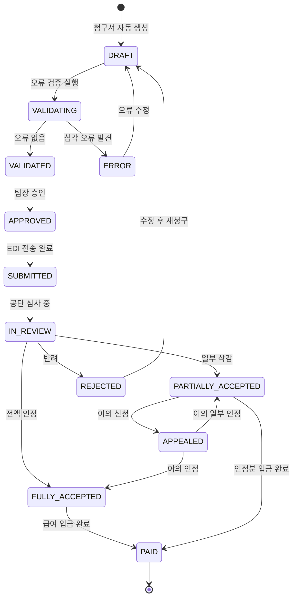
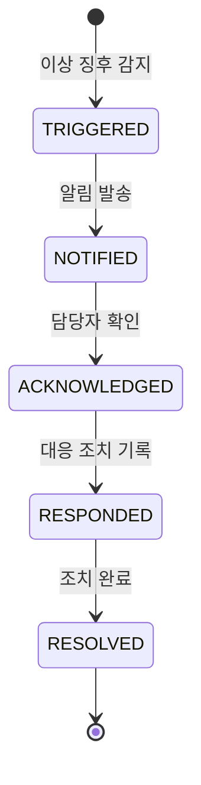

# FS-I-004 돌봄 기록 및 급여 청구

> 문서 버전: 1.0
> 작성일: 2026-03-30
> 우선순위: P2
> 상태: Draft

---

## 1. 개요

- **기능 설명:** 요양기관 담당자가 소속 요양보호사의 돌봄 일지를 통합 대시보드에서 조회하고, 이상 징후 발생 시 즉시 알림을 받으며, 장기요양보험 급여 청구서를 돌봄 기록 기반으로 자동 생성하는 기능이다. 건강보험공단 EDI(전자문서교환) 연동을 통한 전자 청구, 청구 전 오류 자동 검증, 심사 결과 관리까지 급여 청구의 전 과정을 자동화한다.
- **대상 사용자:**
  - 기관장: 전체 돌봄 기록 현황, 청구/수납 총괄 조회
  - 팀장: 돌봄 기록 관리, 급여 청구 승인
  - 사회복지사: 돌봄 일지 조회, 특이사항 대응, 서비스 기록 관리
  - 청구 담당자 (팀장/사무장): 급여 청구서 생성, EDI 전송, 오류 수정
- **관련 PRD 섹션:** 4.3 정산 및 급여 관리, 4.4 품질 관리
- **관련 SERVICE_PLAN 섹션:** 3.3.4 돌봄 기록 관리, 3.3.5 급여 청구 자동화

---

## 2. 유저 스토리

| ID | 역할 | 유저 스토리 |
|----|------|-----------|
| US-I-004-01 | 사회복지사 | As a 사회복지사, I want to 전체 이용자의 돌봄 일지를 통합 대시보드에서 조회할 수 있다, so that 서비스 전달 현황을 한눈에 파악할 수 있다. |
| US-I-004-02 | 사회복지사 | As a 사회복지사, I want to 이상 징후(낙상, 급격한 상태 변화 등) 기록 시 즉시 알림을 받을 수 있다, so that 긴급 상황에 신속히 대응할 수 있다. |
| US-I-004-03 | 팀장 | As a 팀장, I want to 돌봄 기록 기반으로 장기요양급여 청구서를 자동 생성할 수 있다, so that 수작업 청구 업무를 최소화할 수 있다. |
| US-I-004-04 | 팀장 | As a 팀장, I want to 청구 전 오류 항목을 자동 감지할 수 있다, so that 공단 심사 반려율을 줄일 수 있다. |
| US-I-004-05 | 팀장 | As a 팀장, I want to 건강보험공단 EDI를 통해 전자 청구를 제출할 수 있다, so that 청구 프로세스를 디지털화할 수 있다. |
| US-I-004-06 | 기관장 | As a 기관장, I want to 월별 청구 현황과 수납 현황을 확인할 수 있다, so that 기관의 재정 상태를 관리할 수 있다. |
| US-I-004-07 | 팀장 | As a 팀장, I want to 공단 심사 결과를 확인하고 조정 청구를 할 수 있다, so that 삭감된 급여를 최소화할 수 있다. |
| US-I-004-08 | 사회복지사 | As a 사회복지사, I want to 이용자별 급여 제공 기록을 장기요양 기준으로 관리할 수 있다, so that 정확한 청구 근거를 확보할 수 있다. |

---

## 3. 화면 구성

### 3.1 화면 목록

| 화면 ID | 화면명 | 진입 경로 | 구현 파일 |
|---------|--------|----------|----------|
| SCR-I-004-01 | 돌봄 기록 통합 대시보드 | /institution/care-records | 미구현 |
| SCR-I-004-02 | 이용자별 돌봄 일지 | /institution/care-records/[recipientId] | 미구현 |
| SCR-I-004-03 | 돌봄 일지 상세 | /institution/care-records/journal/[id] | 미구현 |
| SCR-I-004-04 | 특이사항 알림 목록 | /institution/care-records/alerts | 미구현 |
| SCR-I-004-05 | 급여 청구 대시보드 | /institution/claims | 미구현 |
| SCR-I-004-06 | 청구서 생성 | /institution/claims/new | 미구현 |
| SCR-I-004-07 | 청구서 상세/오류 검증 | /institution/claims/[id] | 미구현 |
| SCR-I-004-08 | EDI 전자 청구 | /institution/claims/[id]/submit | 미구현 |
| SCR-I-004-09 | 심사 결과 관리 | /institution/claims/results | 미구현 |
| SCR-I-004-10 | 수납 현황 | /institution/claims/payments | 미구현 |

### 3.2 화면별 상세

#### SCR-I-004-01: 돌봄 기록 통합 대시보드

**레이아웃:**
- 상단: 요약 통계 카드 (4개)
- 중앙 좌측: 일지 제출 현황 (일자별 막대 차트)
- 중앙 우측: 특이사항 알림 최근 목록
- 하단: 오늘 서비스 진행 현황 테이블

**통계 카드:**
| 카드 | 설명 |
|------|------|
| 오늘 서비스 건수 | 오늘 예정된 돌봄 서비스 건수 |
| 일지 제출율 | 이번 달 일지 제출 건수 / 서비스 완료 건수 (%) |
| 특이사항 알림 | 미확인 특이사항 건수 |
| GPS 인증 준수율 | GPS 체크인/아웃 준수 건수 / 전체 서비스 건수 (%) |

#### SCR-I-004-02: 이용자별 돌봄 일지

**레이아웃:**
- 상단: 이용자 기본 정보 요약 (이름, 등급, 담당 요양보호사)
- 중앙: 돌봄 일지 타임라인 (최신순)
- 우측 사이드바: 바이탈 사인 추이 미니 차트 (혈압, 혈당, 체온)

**일지 항목:**
| 항목 | 설명 |
|------|------|
| 작성일시 | YYYY-MM-DD HH:mm |
| 작성자 | 요양보호사명 |
| 서비스 시간 | 시작~종료 시간 |
| 활동 내용 | 신체활동지원, 인지활동지원, 가사지원 등 |
| 건강 상태 | 혈압, 혈당, 체온, 수분 섭취, 배변 |
| 식사 | 아침/점심/저녁 식사량 |
| 기분/정서 | 좋음/보통/우울/불안 등 |
| 특이사항 | 텍스트 (이상 징후 시 자동 알림 트리거) |
| 사진 | 첨부 이미지 (선택) |

#### SCR-I-004-05: 급여 청구 대시보드

**레이아웃:**
- 상단: 청구 현황 요약 카드 (4개)
- 중앙: 월별 청구/수납 추이 차트 (라인 차트)
- 하단: 최근 청구 내역 테이블

**통계 카드:**
| 카드 | 설명 |
|------|------|
| 이번 달 청구 예정 | 이번 달 청구 예정 총액 |
| 청구 완료 | EDI 제출 완료 건수/금액 |
| 심사 중 | 공단 심사 중인 건수/금액 |
| 수납 완료 | 급여 입금 완료 금액 |

#### SCR-I-004-06: 청구서 생성

**레이아웃:**
- 상단: 청구 대상 월 선택
- 중앙: 이용자별 서비스 내역 자동 집계 테이블
- 하단: 오류 검증 결과 + 청구 확정 버튼

**자동 집계 테이블 컬럼:**
| 컬럼 | 설명 |
|------|------|
| 이용자명 | 수급자명 |
| 장기요양등급 | 1~5등급 |
| 장기요양인정번호 | 공단 인정번호 |
| 서비스 유형 | 방문요양 / 주야간보호 / 방문목욕 |
| 총 서비스 시간 | 월간 총 제공 시간 (자동 합산) |
| 급여 코드 | 장기요양급여 청구 코드 (자동 매핑) |
| 청구 금액 | 급여 기준 단가 x 횟수 (자동 계산) |
| 본인부담금 | 급여 청구액의 15% (일반) / 감경 대상 별도 |
| 공단 부담금 | 급여 청구액의 85% |
| 검증 상태 | 정상 / 오류 (빨간색) / 경고 (노란색) |

#### SCR-I-004-07: 청구서 상세/오류 검증

**레이아웃:**
- 상단: 청구서 기본 정보 (청구 월, 기관 정보)
- 중앙: 이용자별 상세 청구 내역 (접기/펼치기)
- 하단 좌측: 오류 목록 (심각도별)
- 하단 우측: 오류 수정 패널

**오류 유형:**
| 오류 코드 | 심각도 | 설명 |
|----------|--------|------|
| ERR-001 | 심각 | 장기요양인정 유효기간 만료 |
| ERR-002 | 심각 | 월 급여 한도 초과 |
| ERR-003 | 심각 | 요양보호사 자격증 미유효 |
| ERR-004 | 경고 | 서비스 시간과 GPS 기록 불일치 (30분 이상) |
| ERR-005 | 경고 | 돌봄 일지 미제출 서비스 건 |
| ERR-006 | 경고 | 동일 시간대 중복 서비스 |
| ERR-007 | 정보 | 본인부담금 감경 대상 확인 필요 |

#### SCR-I-004-08: EDI 전자 청구

**레이아웃:**
- 상단: 청구 데이터 최종 확인 요약
- 중앙: EDI 전송 진행 상태 (Progress Bar)
- 하단: 전송 결과 (성공/실패 상세)

**전송 프로세스:**
1. 청구 데이터 → 공단 EDI 표준 서식 변환
2. 전자서명 첨부
3. EDI 게이트웨이 전송
4. 접수번호 수신 확인
5. 전송 결과 저장

#### SCR-I-004-09: 심사 결과 관리

**테이블 컬럼:**
| 컬럼 | 설명 |
|------|------|
| 청구 월 | YYYY-MM |
| 접수번호 | 공단 접수번호 |
| 청구 금액 | 원 청구 금액 |
| 심사 결과 | 전액 인정 / 일부 삭감 / 반려 |
| 인정 금액 | 공단 인정 금액 |
| 삭감 금액 | 삭감된 금액 |
| 삭감 사유 | 공단 심사 사유 |
| 상태 | 심사 중 / 결과 확인 / 이의 신청 |
| 액션 | 상세 / 이의 신청 / 조정 청구 |

---

## 4. 상세 동작 명세

### 4.1 정상 플로우

#### 돌봄 기록 모니터링 플로우
```
요양보호사가 돌봄 서비스 완료 후 일지 작성 (앱)
    ↓
일지 데이터가 기관 대시보드에 실시간 반영
    ↓
기관 담당자가 통합 대시보드에서 일지 확인
    ↓
[정상] 일지 내용 확인 완료
[특이사항] 이상 징후 감지 → 즉시 알림 발송
    ↓
사회복지사가 특이사항 확인 및 대응 조치
    ↓
대응 기록 저장
```

#### 급여 청구 플로우
```
매월 1~10일: 전월 서비스 내역 자동 집계 시작
    ↓
시스템이 돌봄 기록 + GPS 인증 데이터 기반 청구 내역 생성
    ↓
급여 코드 자동 매핑 (서비스 유형/시간 → 청구 코드)
    ↓
자동 오류 검증 실행
    ↓
[오류 없음] 청구서 생성 완료 → 담당자 확인 요청
[오류 발견] 오류 목록 표시 → 담당자 수정
    ↓
담당자가 청구서 내용 최종 확인
    ↓
팀장 승인
    ↓
EDI 전자 청구 제출
    ↓
접수번호 수신 → 청구 상태: 심사 중
    ↓
공단 심사 결과 수신 (보통 15~20 영업일)
    ↓
[전액 인정] 수납 대기
[일부 삭감] 삭감 내역 확인 → 이의 신청 또는 수용
[반려] 반려 사유 확인 → 수정 후 재청구
    ↓
급여 입금 확인 → 수납 완료 처리
```

#### 본인부담금 관리 플로우
```
청구서 생성 시 본인부담금 자동 계산
    ↓
[일반] 급여비용의 15%
[감경 대상] 의료급여 수급자 등 6% 또는 면제
    ↓
이용자/보호자에게 본인부담금 고지
    ↓
수납 확인
```

### 4.2 예외 플로우

| 예외 상황 | 처리 방법 |
|----------|----------|
| 돌봄 일지 미제출 (서비스 완료 후 24시간) | 해당 요양보호사에게 일지 작성 독촉 알림, 기관 담당자에게 미제출 건 알림 |
| GPS 기록과 서비스 시간 불일치 | 경고 표시, 담당자 확인 후 수동 보정 또는 해당 건 청구 제외 |
| 급여 한도 초과 청구 시도 | "월 급여 한도를 초과합니다. 초과분은 청구 대상에서 제외됩니다." |
| EDI 전송 실패 | "전자 청구 전송에 실패했습니다. 잠시 후 재시도하거나 수동 청구를 진행하세요." |
| 공단 시스템 점검 | "건강보험공단 시스템 점검 중입니다. 점검 완료 후 자동 재전송됩니다." |
| 장기요양인정 만료 상태에서 청구 | "장기요양 인정이 만료된 이용자입니다. 해당 이용자 건은 청구할 수 없습니다." 자동 제외 |
| 심사 결과 이의 신청 기한 초과 | "이의 신청 기한(90일)이 경과했습니다." |

### 4.3 비즈니스 규칙

| 규칙 ID | 규칙 | 설명 |
|---------|------|------|
| BR-I-004-01 | 청구 기간 | 매월 1~10일 내 전월분 급여 청구 제출 (공단 규정) |
| BR-I-004-02 | 급여 코드 매핑 | 방문요양: 가-1 ~ 가-6 (시간대별), 주야간보호: 나-1 ~ 나-9 (등급/시간별) |
| BR-I-004-03 | 본인부담금 비율 | 일반: 15%, 감경 1단계: 9%, 감경 2단계: 6%, 의료급여 수급자: 면제 |
| BR-I-004-04 | 급여 한도 엄수 | 등급별 월 급여 한도 초과 청구 불가 |
| BR-I-004-05 | 일지 필수 | 돌봄 일지 미작성 서비스 건은 급여 청구 대상 제외 |
| BR-I-004-06 | GPS 인증 기준 | 서비스 시작/종료 시 GPS 체크인/아웃 필수, 이용자 주소 반경 500m 이내 |
| BR-I-004-07 | 중복 청구 방지 | 동일 이용자, 동일 시간대 중복 서비스 청구 불가 |
| BR-I-004-08 | 전자서명 필수 | EDI 청구 시 기관장 또는 위임자의 공인전자서명 필수 |
| BR-I-004-09 | 심사 결과 보관 | 급여 청구 및 심사 결과 데이터 5년간 보관 의무 |
| BR-I-004-10 | 이의 신청 기한 | 심사 결과 통보 후 90일 이내 이의 신청 가능 |
| BR-I-004-11 | 특이사항 알림 즉시성 | 낙상, 의식 변화, 고열(38도 이상), 급격한 혈압 변화 기록 시 기관 담당자에게 5분 이내 알림 |

### 4.4 권한 규칙 (기관장/팀장/직원 역할별)

| 기능 | 기관장 | 팀장 | 사회복지사 | 요양보호사 관리자 |
|------|:-----:|:----:|:---------:|:---------------:|
| 돌봄 기록 대시보드 조회 | O | O | O | △ (소속 인력만) |
| 이용자별 일지 조회 | O | O | O | △ (배정 이용자만) |
| 특이사항 알림 수신 | O | O | O | O |
| 특이사항 대응 기록 | O | O | O | X |
| 급여 청구 대시보드 조회 | O | O | X | X |
| 청구서 생성 | O | O | X | X |
| 청구서 오류 수정 | O | O | X | X |
| 청구 승인 | O | O | X | X |
| EDI 전자 청구 제출 | O | O | X | X |
| 심사 결과 조회 | O | O | X | X |
| 이의 신청 | O | O | X | X |
| 수납 현황 조회 | O | O | X | X |

---

## 5. 수용 기준 (Acceptance Criteria)

### AC-001: 돌봄 기록 통합 대시보드
```
Given 사회복지사가 돌봄 기록 통합 대시보드에 접근했을 때
When 페이지가 로딩되면
Then 오늘 서비스 건수, 일지 제출율, 미확인 특이사항 수, GPS 인증 준수율이 표시되고
And 일자별 일지 제출 현황 차트가 표시된다
```

### AC-002: 특이사항 즉시 알림
```
Given 요양보호사가 돌봄 일지에 "낙상 발생"을 기록했을 때
When 일지가 저장되면
Then 5분 이내 기관 담당자(사회복지사, 팀장)에게 긴급 알림이 발송되고
And 특이사항 알림 목록에 해당 건이 '미확인' 상태로 표시된다
```

### AC-003: 급여 청구서 자동 생성
```
Given 팀장이 청구서 생성 화면에서 전월을 선택했을 때
When '자동 집계' 버튼을 클릭하면
Then 전월 돌봄 기록이 이용자별로 집계되고
And 서비스 유형/시간에 따른 급여 코드가 자동 매핑되며
And 청구 금액, 본인부담금, 공단 부담금이 자동 계산된다
```

### AC-004: 청구 오류 자동 검증
```
Given 청구서가 생성되었을 때
When 자동 오류 검증이 실행되면
Then 장기요양인정 만료, 급여 한도 초과, 자격증 미유효, GPS 불일치, 일지 미제출 등의 오류가 감지되고
And 심각도별(심각/경고/정보)로 분류되어 목록에 표시되며
And 심각 오류가 있으면 청구 제출이 차단된다
```

### AC-005: EDI 전자 청구
```
Given 팀장이 오류 없는 청구서를 확인하고 승인했을 때
When EDI 전자 청구 제출 버튼을 클릭하면
Then 청구 데이터가 공단 EDI 표준 서식으로 변환되고
And 전자서명이 첨부되어 EDI 게이트웨이로 전송되며
And 접수번호를 수신하면 청구 상태가 '심사 중'으로 변경된다
```

### AC-006: 심사 결과 관리
```
Given 공단 심사 결과가 수신되었을 때
When 일부 삭감 결과가 포함되어 있으면
Then 삭감 건별 사유가 표시되고
And 이의 신청 버튼이 활성화되며
And 이의 신청 기한(90일)이 카운트다운으로 표시된다
```

---

## 6. API 연동

### 6.1 사용 API 목록

| Method | Endpoint | 설명 | 구현 상태 |
|--------|----------|------|----------|
| GET | /api/institution/care-records | 돌봄 기록 통합 대시보드 데이터 | ❌ 미구현 |
| GET | /api/institution/care-records/[recipientId] | 이용자별 돌봄 일지 목록 | ❌ 미구현 |
| GET | /api/institution/care-records/journal/[id] | 돌봄 일지 상세 | ❌ 미구현 |
| GET | /api/institution/care-records/alerts | 특이사항 알림 목록 | ❌ 미구현 |
| PATCH | /api/institution/care-records/alerts/[id] | 특이사항 확인/대응 처리 | ❌ 미구현 |
| GET | /api/institution/claims | 급여 청구 대시보드 데이터 | ❌ 미구현 |
| POST | /api/institution/claims/generate | 청구서 자동 생성 | ❌ 미구현 |
| GET | /api/institution/claims/[id] | 청구서 상세 | ❌ 미구현 |
| POST | /api/institution/claims/[id]/validate | 청구 오류 검증 | ❌ 미구현 |
| PATCH | /api/institution/claims/[id] | 청구서 오류 수정 | ❌ 미구현 |
| POST | /api/institution/claims/[id]/approve | 청구 승인 | ❌ 미구현 |
| POST | /api/institution/claims/[id]/submit-edi | EDI 전자 청구 제출 | ❌ 미구현 |
| GET | /api/institution/claims/results | 심사 결과 목록 | ❌ 미구현 |
| POST | /api/institution/claims/[id]/appeal | 이의 신청 | ❌ 미구현 |
| GET | /api/institution/claims/payments | 수납 현황 | ❌ 미구현 |

### 6.2 주요 요청/응답 스키마

#### POST /api/institution/claims/generate

**Request Body:**
```json
{
  "claimMonth": "2026-03",
  "institutionId": "inst_cuid_xxx"
}
```

**Response:**
```json
{
  "success": true,
  "data": {
    "id": "claim_cuid_xxx",
    "claimMonth": "2026-03",
    "status": "DRAFT",
    "summary": {
      "totalRecipients": 35,
      "totalServiceHours": 2800.5,
      "totalClaimAmount": 45230000,
      "totalCopayment": 6784500,
      "totalNhisAmount": 38445500
    },
    "recipients": [
      {
        "recipientId": "recip_xxx",
        "name": "김어르신",
        "ltcGrade": "3",
        "serviceType": "VISIT_CARE",
        "totalHours": 80,
        "claimCodes": [
          { "code": "가-3", "description": "방문요양 120분 이상~150분 미만", "count": 12, "unitPrice": 42930, "amount": 515160 }
        ],
        "claimAmount": 515160,
        "copayment": 77274,
        "nhisAmount": 437886,
        "validationStatus": "VALID"
      }
    ],
    "validationErrors": [],
    "validationWarnings": [
      {
        "code": "ERR-005",
        "severity": "WARNING",
        "recipientName": "박어르신",
        "description": "3월 15일 돌봄 일지 미제출",
        "suggestion": "해당 건을 청구에서 제외하거나, 일지 보완 후 포함"
      }
    ],
    "createdAt": "2026-04-01T09:00:00Z"
  }
}
```

#### POST /api/institution/claims/[id]/submit-edi

**Request Body:**
```json
{
  "digitalSignature": "base64_encoded_signature_xxx",
  "signedBy": "member_cuid_xxx"
}
```

**Response:**
```json
{
  "success": true,
  "data": {
    "id": "claim_cuid_xxx",
    "status": "SUBMITTED",
    "ediReceiptNumber": "EDI-2026-04-001234",
    "submittedAt": "2026-04-05T14:30:00Z",
    "estimatedResultDate": "2026-04-25"
  }
}
```

---

## 7. 상태 다이어그램

### 급여 청구 상태



### 특이사항 알림 상태



---

## 8. 데이터 모델

### 기존 모델 (사용)

| 모델 | 주요 필드 | 비고 |
|------|----------|------|
| Journal | id, careSessionId, title, content, activities, bloodPressure, bloodSugar, temperature | 돌봄 일지 |
| CareSession | id, matchId, caregiverId, scheduledDate, actualStart, actualEnd, checkInLat, checkInLng | GPS 인증 기반 서비스 기록 |
| Notification | id, userId, type, title, body | 알림 발송 |

### 신규 모델 (필요)

| 모델 | 주요 필드 | 설명 |
|------|----------|------|
| InstitutionClaim | id, institutionId, claimMonth, status, totalClaimAmount, totalCopayment, totalNhisAmount, ediReceiptNumber, submittedAt, approvedBy | 급여 청구서 |
| ClaimLineItem | id, claimId, recipientId, staffId, claimCode, serviceDate, serviceHours, unitPrice, amount, copayment, nhisAmount, validationStatus | 청구 상세 항목 |
| ClaimValidationError | id, claimId, errorCode, severity, recipientId, description, suggestion, resolvedAt | 청구 오류 |
| ClaimResult | id, claimId, resultType, acceptedAmount, reducedAmount, reductionReason, resultDate, appealDeadline | 심사 결과 |
| ClaimAppeal | id, claimResultId, reason, supportingDocs, status, submittedAt, resultAt | 이의 신청 |
| CareRecordAlert | id, institutionId, journalId, recipientId, alertType, severity, status, acknowledgedBy, acknowledgedAt, responseNote | 특이사항 알림 |

---

## 9. 연관 기능

| 기능 ID | 기능명 | 연관 설명 |
|---------|--------|----------|
| FS-I-001 | 기관 등록 및 인증 | 장기요양기관 번호가 EDI 청구의 전제 조건 |
| FS-I-002 | 인력 채용 관리 | 요양보호사 자격 상태가 청구 유효성 검증에 사용 |
| FS-I-003 | 이용자 관리 및 매칭 | 이용자 등급/서비스 계획이 청구 코드 매핑의 기반 |
| FS-I-005 | 품질 관리 및 보고서 | 일지 제출율, GPS 준수율이 품질 지표로 사용 |
| (플랫폼) | 요양보호사 앱 | 돌봄 일지 작성, GPS 체크인/아웃 데이터 원천 |
| (외부) | 건강보험공단 EDI | 전자 청구 전송 및 심사 결과 수신 |

---

## 10. 구현 현황

| 항목 | 상태 | 비고 |
|------|------|------|
| 돌봄 기록 통합 대시보드 | ❌ | /institution/care-records 미구현 |
| 이용자별 돌봄 일지 | ❌ | /institution/care-records/[recipientId] 미구현 |
| 특이사항 알림 시스템 | ❌ | 알림 트리거 + 알림 목록 미구현 |
| 급여 청구 대시보드 | ❌ | /institution/claims 미구현 |
| 청구서 자동 생성 | ❌ | 서비스 내역 집계 + 급여 코드 매핑 미구현 |
| 청구 오류 검증 엔진 | ❌ | 7개 오류 유형 검증 로직 미구현 |
| EDI 전자 청구 연동 | ❌ | 건강보험공단 EDI 게이트웨이 연동 미구현 |
| 심사 결과 수신/관리 | ❌ | 공단 심사 결과 수신 연동 미구현 |
| 이의 신청 기능 | ❌ | 이의 신청 프로세스 미구현 |
| 수납 현황 관리 | ❌ | /institution/claims/payments 미구현 |
| 돌봄 기록 관련 API 전체 | ❌ | /api/institution/care-records/* 미구현 |
| 급여 청구 관련 API 전체 | ❌ | /api/institution/claims/* 미구현 |
| InstitutionClaim 모델 | ❌ | Prisma 스키마 미추가 |
| ClaimLineItem 모델 | ❌ | Prisma 스키마 미추가 |
| ClaimValidationError 모델 | ❌ | Prisma 스키마 미추가 |
| ClaimResult 모델 | ❌ | Prisma 스키마 미추가 |
| CareRecordAlert 모델 | ❌ | Prisma 스키마 미추가 |
| 기존 Journal 모델 | ✅ | 돌봄 일지 기본 모델 존재 |
| 기존 CareSession 모델 | ✅ | GPS 체크인/아웃 필드 존재 |
| 기존 Notification 모델 | ✅ | 알림 발송에 사용 가능 |
