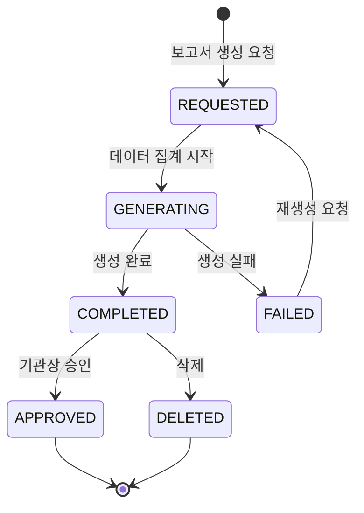
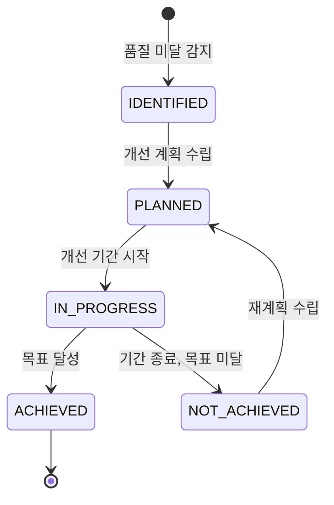

# FS-I-005 품질 관리 및 보고서

> 문서 버전: 1.0
> 작성일: 2026-03-30
> 우선순위: P2
> 상태: Draft

---

## 1. 개요

- **기능 설명:** 요양기관 담당자가 소속 요양보호사의 서비스 품질을 체계적으로 모니터링하고, 이용자 만족도를 추적하며, 지자체 제출용 행정 보고서를 자동 생성하는 기능이다. 일지 제출율, 보호자 평점, GPS 인증 준수율 등 핵심 품질 지표를 대시보드로 제공하고, 월별/분기별 보고서를 엑셀/PDF로 다운로드할 수 있다.
- **대상 사용자:**
  - 기관장: 전체 품질 현황 총괄, 보고서 승인 및 제출
  - 팀장: 품질 지표 모니터링, 개선 조치 관리
  - 사회복지사: 이용자 만족도 관리, 서비스 개선 기록
  - 요양보호사 관리자: 소속 인력 품질 평가
- **관련 PRD 섹션:** 4.4 품질 관리, 4.5 정부 보고서 자동 생성
- **관련 SERVICE_PLAN 섹션:** 3.3.4 돌봄 기록 관리 (보고서 다운로드)

---

## 2. 유저 스토리

| ID | 역할 | 유저 스토리 |
|----|------|-----------|
| US-I-005-01 | 팀장 | As a 팀장, I want to 소속 요양보호사별 품질 지표(일지 제출율, 평점, GPS 준수율)를 확인할 수 있다, so that 서비스 품질이 낮은 인력을 식별하고 개선 조치를 할 수 있다. |
| US-I-005-02 | 사회복지사 | As a 사회복지사, I want to 이용자별 보호자 만족도 추이를 확인할 수 있다, so that 만족도 하락 원인을 분석하고 대응할 수 있다. |
| US-I-005-03 | 기관장 | As a 기관장, I want to 기관 전체의 품질 지표 트렌드를 한눈에 확인할 수 있다, so that 기관 운영 방향을 수립할 수 있다. |
| US-I-005-04 | 기관장 | As a 기관장, I want to 월별 방문요양 서비스 현황 보고서를 자동 생성할 수 있다, so that 지자체 제출 보고서 작성 시간을 절약할 수 있다. |
| US-I-005-05 | 팀장 | As a 팀장, I want to 요양보호사 근무 현황 보고서를 생성할 수 있다, so that 인력 운영 효율성을 분석할 수 있다. |
| US-I-005-06 | 기관장 | As a 기관장, I want to 급여비용 청구 내역 보고서를 생성할 수 있다, so that 기관 재정 상태를 투명하게 관리할 수 있다. |
| US-I-005-07 | 사회복지사 | As a 사회복지사, I want to 이용자 상태 변화 보고서를 생성할 수 있다, so that 장기요양등급 갱신 심사에 활용할 수 있다. |
| US-I-005-08 | 팀장 | As a 팀장, I want to 품질 미달 인력에 대한 개선 계획을 수립하고 추적할 수 있다, so that 체계적인 품질 향상을 이끌 수 있다. |

---

## 3. 화면 구성

### 3.1 화면 목록

| 화면 ID | 화면명 | 진입 경로 | 구현 파일 |
|---------|--------|----------|----------|
| SCR-I-005-01 | 품질 관리 대시보드 | /institution/quality | 미구현 |
| SCR-I-005-02 | 요양보호사별 품질 상세 | /institution/quality/staff/[id] | 미구현 |
| SCR-I-005-03 | 이용자 만족도 | /institution/quality/satisfaction | 미구현 |
| SCR-I-005-04 | 개선 계획 관리 | /institution/quality/improvements | 미구현 |
| SCR-I-005-05 | 보고서 센터 | /institution/reports | 미구현 |
| SCR-I-005-06 | 보고서 생성 | /institution/reports/generate | 미구현 |
| SCR-I-005-07 | 보고서 상세/미리보기 | /institution/reports/[id] | 미구현 |

### 3.2 화면별 상세

#### SCR-I-005-01: 품질 관리 대시보드

**레이아웃:**
- 상단: 핵심 품질 지표 카드 (4개)
- 중앙 좌측: 월별 품질 지표 추이 (라인 차트, 최근 6개월)
- 중앙 우측: 요양보호사 품질 랭킹 Top 5 / Bottom 5
- 하단 좌측: 이용자 만족도 분포 (히스토그램)
- 하단 우측: 개선 필요 항목 알림 목록

**핵심 품질 지표 카드:**
| 카드 | 설명 | 목표 |
|------|------|------|
| 일지 제출율 | 서비스 완료 건 대비 일지 작성 완료율 | 95% 이상 |
| 평균 보호자 평점 | 전체 이용자 보호자 평균 평점 | 4.3/5.0 이상 |
| GPS 인증 준수율 | GPS 체크인/아웃 정상 완료 비율 | 90% 이상 |
| 서비스 시간 준수율 | 계획된 서비스 시간 대비 실제 제공 시간 비율 | 95% 이상 |

**월별 추이 차트:**
- X축: 최근 6개월
- Y축: 각 지표 비율 (%)
- 라인: 일지 제출율, GPS 준수율, 서비스 시간 준수율
- 기준선: 목표값 (점선)

**요양보호사 품질 랭킹:**
| 컬럼 | 설명 |
|------|------|
| 순위 | 1~5위 (Top) / 하위 1~5위 (Bottom) |
| 이름 | 요양보호사명 |
| 종합 품질 점수 | 가중 합산 점수 (100점 만점) |
| 일지 제출율 | % |
| 평균 평점 | /5.0 |
| GPS 준수율 | % |

#### SCR-I-005-02: 요양보호사별 품질 상세

**레이아웃:**
- 상단: 요양보호사 기본 정보 + 종합 품질 점수
- 중앙: 지표별 상세 (탭 또는 섹션)
- 하단: 보호자 리뷰 목록

**지표 상세:**

| 지표 | 항목 |
|------|------|
| 일지 제출 | 월별 제출율 차트, 미제출 건 목록 |
| 보호자 평점 | 평점 추이 차트, 항목별 평점 (정시성, 태도, 전문성, 의사소통) |
| GPS 인증 | 준수율 차트, 미인증 건 목록 (일시/위치) |
| 서비스 시간 | 계획 대비 실제 시간 차트, 조기 종료/지각 건 목록 |
| 교육 이수 | 법정 교육 이수 현황 |

#### SCR-I-005-03: 이용자 만족도

**레이아웃:**
- 상단: 전체 만족도 요약 (평균 점수, 응답률)
- 중앙: 이용자별 만족도 테이블
- 하단: 만족도 항목별 분석 차트 (레이더 차트)

**만족도 조사 항목:**
| 항목 | 설명 |
|------|------|
| 서비스 시간 준수 | 정해진 시간에 방문하는가 |
| 전문적 돌봄 | 돌봄 서비스의 전문성 |
| 태도 및 친절 | 요양보호사의 태도 |
| 의사소통 | 보호자와의 소통 충실도 |
| 건강 상태 관리 | 건강 변화 관찰 및 보고 |
| 전반적 만족도 | 종합 만족도 |

**테이블 컬럼:**
| 컬럼 | 설명 |
|------|------|
| 이용자명 | 이용자 이름 |
| 담당 요양보호사 | 현재 담당자 |
| 최근 만족도 점수 | 최근 조사 결과 |
| 이전 대비 변화 | +/- 점수 (뱃지) |
| 조사일 | YYYY-MM-DD |
| 특이 의견 | 보호자 자유 의견 요약 |

#### SCR-I-005-04: 개선 계획 관리

**레이아웃:**
- 상단: 개선 필요 인력 목록
- 중앙: 개선 계획 테이블 (상태별 필터)
- 하단: 개선 효과 추적 차트

**개선 계획 항목:**
| 컬럼 | 설명 |
|------|------|
| 대상 요양보호사 | 이름 |
| 개선 항목 | 일지 제출 / 시간 준수 / 평점 개선 등 |
| 목표 | 구체적 수치 목표 |
| 기간 | 시작일~종료일 |
| 현재 상태 | 진행 중 / 목표 달성 / 미달성 |
| 담당자 | 개선 관리 담당 (팀장/관리자) |

#### SCR-I-005-05: 보고서 센터

**레이아웃:**
- 상단: 보고서 유형 선택 카드
- 중앙: 생성된 보고서 목록 테이블
- 우측 상단: '보고서 생성' 버튼

**보고서 유형:**
| 유형 | 설명 | 주기 |
|------|------|------|
| 방문요양 서비스 현황 | 수급자별 서비스 제공 현황 (지자체 제출용) | 월별 |
| 요양보호사 근무 현황 | 인력별 근무 시간, 담당 이용자 현황 | 월별 |
| 급여비용 청구 내역 | 월별 청구/수납/삭감 내역 종합 | 월별 |
| 수급자 상태 변화 | 이용자 건강 상태 변화 추이 (등급 갱신용) | 분기별 |
| 품질 관리 종합 | 전체 품질 지표 + 개선 현황 종합 | 분기별 |
| 연간 운영 보고서 | 연간 기관 운영 전체 현황 | 연도별 |

**보고서 목록 테이블:**
| 컬럼 | 설명 |
|------|------|
| 보고서명 | 보고서 유형 + 기간 |
| 생성일 | YYYY-MM-DD |
| 기간 | 대상 기간 |
| 상태 | 생성 중 / 완료 / 승인 완료 |
| 형식 | Excel / PDF |
| 액션 | 다운로드 / 미리보기 / 삭제 |

#### SCR-I-005-06: 보고서 생성

**레이아웃:**
- Step 1: 보고서 유형 선택
- Step 2: 대상 기간 선택 (월/분기/연도)
- Step 3: 포함 항목 선택 (체크리스트)
- Step 4: 출력 형식 선택 (Excel / PDF)
- 생성 버튼

**포함 항목 체크리스트 (방문요양 서비스 현황 예시):**
- [x] 수급자 기본 정보 (이름, 등급, 인정번호)
- [x] 서비스 유형별 제공 시간
- [x] 요양보호사별 제공 현황
- [x] 급여 청구 금액 요약
- [ ] 바이탈 사인 추이 (선택)
- [ ] 보호자 만족도 (선택)

---

## 4. 상세 동작 명세

### 4.1 정상 플로우

#### 품질 모니터링 플로우
```
기관 담당자 로그인
    ↓
품질 관리 대시보드 진입
    ↓
핵심 품질 지표 확인 (일지 제출율, 평점, GPS 준수율, 서비스 시간 준수율)
    ↓
[정상] 모든 지표 목표 달성 → 현황 확인 완료
[미달] 미달 지표 발견 → 하위 랭킹 인력 클릭
    ↓
요양보호사별 품질 상세 확인
    ↓
미달 원인 분석 (미제출 건, 지각 건, 낮은 평점 리뷰 등)
    ↓
개선 계획 수립 (개선 항목, 목표, 기간 설정)
    ↓
개선 효과 추적 (주기적 확인)
```

#### 이용자 만족도 조사 플로우
```
시스템이 정기 만족도 조사 발송 (월 1회, 보호자에게)
    ↓
보호자가 앱에서 만족도 평가 (5점 척도 + 자유 의견)
    ↓
결과가 기관 대시보드에 자동 반영
    ↓
만족도 하락 이용자 감지 시 담당자 알림
    ↓
사회복지사가 원인 파악 및 대응 조치
```

#### 보고서 생성 플로우
```
기관 담당자가 보고서 센터 진입
    ↓
'보고서 생성' 클릭
    ↓
보고서 유형 선택
    ↓
대상 기간 선택
    ↓
포함 항목 선택
    ↓
출력 형식 선택 (Excel / PDF)
    ↓
'생성' 버튼 클릭
    ↓
시스템이 데이터 집계 및 보고서 생성 (비동기)
    ↓
생성 완료 알림
    ↓
보고서 목록에서 다운로드 또는 미리보기
    ↓
[지자체 제출용] 기관장 승인 → 제출
```

### 4.2 예외 플로우

| 예외 상황 | 처리 방법 |
|----------|----------|
| 품질 데이터 부족 (서비스 건수 < 10건/월) | "충분한 데이터가 없어 통계가 부정확할 수 있습니다." 경고 표시 |
| 만족도 조사 무응답 | 미응답 보호자에게 리마인더 발송 (최대 2회), 응답률이 60% 미만이면 경고 |
| 보고서 생성 실패 | "보고서 생성 중 오류가 발생했습니다. 잠시 후 재시도하세요." + 자동 재시도 1회 |
| 대량 데이터 보고서 (이용자 100명 이상) | "보고서 생성에 시간이 소요됩니다. 완료 시 알림을 발송합니다." 비동기 처리 |
| 품질 미달 인력 방치 | 개선 계획 미수립 시 팀장에게 주간 리마인더 알림 |
| 보고서 기간 데이터 누락 | 누락 기간 표시 + "일부 데이터가 누락되어 있습니다. 해당 기간의 기록을 확인하세요." |

### 4.3 비즈니스 규칙

| 규칙 ID | 규칙 | 설명 |
|---------|------|------|
| BR-I-005-01 | 품질 지표 목표 | 일지 제출율 95%, 평균 평점 4.3, GPS 준수율 90%, 서비스 시간 준수율 95% |
| BR-I-005-02 | 품질 점수 가중치 | 종합 품질 점수 = 일지 제출율(25%) + 평점(30%) + GPS 준수율(25%) + 서비스 시간 준수율(20%) |
| BR-I-005-03 | 품질 미달 기준 | 종합 품질 점수 70점 미만 시 '개선 필요' 분류 |
| BR-I-005-04 | 만족도 조사 주기 | 월 1회, 매월 마지막 주 보호자에게 자동 발송 |
| BR-I-005-05 | 만족도 하락 알림 | 전월 대비 0.5점 이상 하락 시 기관 담당자 알림 |
| BR-I-005-06 | 보고서 보관 기간 | 생성된 보고서 3년간 보관 |
| BR-I-005-07 | 지자체 보고서 기한 | 월별 보고서: 익월 15일까지, 분기별: 분기 종료 후 30일 이내 |
| BR-I-005-08 | 개선 계획 기한 | 품질 미달 인력 발견 후 7일 이내 개선 계획 수립 의무 |
| BR-I-005-09 | GPS 준수 기준 | 이용자 주소 반경 500m 이내 체크인, 서비스 시작/종료 전후 15분 이내 |
| BR-I-005-10 | 서비스 시간 준수 기준 | 계획된 서비스 시간의 90% 이상 제공 시 준수로 판정 |

### 4.4 권한 규칙 (기관장/팀장/직원 역할별)

| 기능 | 기관장 | 팀장 | 사회복지사 | 요양보호사 관리자 |
|------|:-----:|:----:|:---------:|:---------------:|
| 품질 대시보드 조회 | O | O | △ (만족도만) | △ (인력 지표만) |
| 요양보호사별 품질 상세 | O | O | X | O |
| 이용자 만족도 조회 | O | O | O | X |
| 만족도 조사 발송 | O | O | O | X |
| 개선 계획 수립 | O | O | X | O |
| 개선 계획 승인 | O | O | X | X |
| 보고서 센터 조회 | O | O | △ (일부 보고서) | X |
| 보고서 생성 | O | O | △ (수급자 상태 변화만) | X |
| 보고서 승인 | O | X | X | X |
| 보고서 다운로드 | O | O | △ (승인된 보고서) | X |

---

## 5. 수용 기준 (Acceptance Criteria)

### AC-001: 품질 대시보드 조회
```
Given 기관 담당자가 품질 관리 대시보드에 진입했을 때
When 페이지가 로딩되면
Then 일지 제출율, 평균 보호자 평점, GPS 인증 준수율, 서비스 시간 준수율이 표시되고
And 최근 6개월 추이 차트가 표시되며
And 품질 상위 5명, 하위 5명 랭킹이 표시된다
```

### AC-002: 요양보호사별 품질 상세
```
Given 팀장이 품질 대시보드에서 특정 요양보호사를 선택했을 때
When 품질 상세 화면이 로딩되면
Then 최근 30일간의 일지 제출율, 평균 평점, GPS 인증 준수율이 표시되고
And 미제출 건, 지각 건 등 구체적인 미달 항목이 목록으로 표시된다
```

### AC-003: 이용자 만족도 조사
```
Given 시스템이 매월 마지막 주에 만족도 조사를 자동 발송했을 때
When 보호자가 만족도 평가를 완료하면
Then 결과가 기관 대시보드에 즉시 반영되고
And 전월 대비 0.5점 이상 하락한 이용자가 있으면 담당자에게 알림이 발송된다
```

### AC-004: 보고서 자동 생성
```
Given 기관장이 보고서 생성 화면에서 '방문요양 서비스 현황' 유형, '2026년 3월', PDF 형식을 선택했을 때
When '생성' 버튼을 클릭하면
Then 해당 월의 수급자별 서비스 현황이 집계되어 보고서가 생성되고
And 보고서 목록에 '완료' 상태로 표시되며
And PDF 다운로드가 가능하다
```

### AC-005: 품질 미달 인력 개선 계획
```
Given 종합 품질 점수가 70점 미만인 요양보호사가 발견되었을 때
When 팀장에게 알림이 발송되면
Then 개선 계획 수립 화면에서 해당 인력의 개선 항목, 목표, 기간을 설정할 수 있고
And 7일 이내 개선 계획이 미수립되면 리마인더가 발송된다
```

### AC-006: 지자체 제출용 보고서
```
Given 기관장이 지자체 제출용 보고서를 승인했을 때
When 보고서 상태가 '승인 완료'로 변경되면
Then 보고서에 기관장 승인일이 기재되고
And 승인된 보고서는 수정이 차단되며
And 지자체 제출 기한까지 남은 일수가 표시된다
```

---

## 6. API 연동

### 6.1 사용 API 목록

| Method | Endpoint | 설명 | 구현 상태 |
|--------|----------|------|----------|
| GET | /api/institution/quality/dashboard | 품질 관리 대시보드 데이터 | ❌ 미구현 |
| GET | /api/institution/quality/staff/[id] | 요양보호사별 품질 상세 | ❌ 미구현 |
| GET | /api/institution/quality/staff/ranking | 품질 랭킹 (Top/Bottom) | ❌ 미구현 |
| GET | /api/institution/quality/satisfaction | 이용자 만족도 현황 | ❌ 미구현 |
| POST | /api/institution/quality/satisfaction/survey | 만족도 조사 발송 | ❌ 미구현 |
| GET | /api/institution/quality/improvements | 개선 계획 목록 | ❌ 미구현 |
| POST | /api/institution/quality/improvements | 개선 계획 수립 | ❌ 미구현 |
| PATCH | /api/institution/quality/improvements/[id] | 개선 계획 수정/상태 변경 | ❌ 미구현 |
| GET | /api/institution/reports | 보고서 목록 | ❌ 미구현 |
| POST | /api/institution/reports/generate | 보고서 생성 | ❌ 미구현 |
| GET | /api/institution/reports/[id] | 보고서 상세/미리보기 | ❌ 미구현 |
| GET | /api/institution/reports/[id]/download | 보고서 다운로드 (Excel/PDF) | ❌ 미구현 |
| PATCH | /api/institution/reports/[id]/approve | 보고서 승인 | ❌ 미구현 |

### 6.2 주요 요청/응답 스키마

#### GET /api/institution/quality/dashboard

**Response:**
```json
{
  "success": true,
  "data": {
    "summary": {
      "journalSubmissionRate": 96.5,
      "averageGuardianRating": 4.4,
      "gpsComplianceRate": 92.3,
      "serviceTimeComplianceRate": 97.1
    },
    "monthlyTrend": [
      {
        "month": "2025-10",
        "journalSubmissionRate": 93.2,
        "averageGuardianRating": 4.2,
        "gpsComplianceRate": 88.5,
        "serviceTimeComplianceRate": 94.8
      },
      {
        "month": "2025-11",
        "journalSubmissionRate": 94.8,
        "averageGuardianRating": 4.3,
        "gpsComplianceRate": 90.1,
        "serviceTimeComplianceRate": 95.5
      }
    ],
    "topStaff": [
      { "staffId": "staff_xxx", "name": "이요양", "qualityScore": 95.2, "journalRate": 100, "rating": 4.8, "gpsRate": 98 }
    ],
    "bottomStaff": [
      { "staffId": "staff_yyy", "name": "김요양", "qualityScore": 65.3, "journalRate": 78, "rating": 3.5, "gpsRate": 72 }
    ],
    "improvementsNeeded": 3
  }
}
```

#### POST /api/institution/reports/generate

**Request Body:**
```json
{
  "reportType": "MONTHLY_SERVICE_STATUS",
  "period": {
    "year": 2026,
    "month": 3
  },
  "includeItems": [
    "RECIPIENT_INFO",
    "SERVICE_HOURS_BY_TYPE",
    "CAREGIVER_SUMMARY",
    "CLAIM_AMOUNT_SUMMARY"
  ],
  "format": "PDF"
}
```

**Response:**
```json
{
  "success": true,
  "data": {
    "id": "report_cuid_xxx",
    "reportType": "MONTHLY_SERVICE_STATUS",
    "period": "2026-03",
    "status": "GENERATING",
    "format": "PDF",
    "estimatedCompletion": "2026-04-01T09:05:00Z",
    "createdAt": "2026-04-01T09:00:00Z"
  }
}
```

#### GET /api/institution/quality/staff/[id]

**Response:**
```json
{
  "success": true,
  "data": {
    "staffId": "staff_xxx",
    "name": "이요양",
    "qualityScore": 95.2,
    "metrics": {
      "journalSubmission": {
        "rate": 100,
        "totalServices": 60,
        "submitted": 60,
        "missing": []
      },
      "guardianRating": {
        "average": 4.8,
        "breakdown": {
          "punctuality": 4.9,
          "attitude": 4.8,
          "professionalism": 4.7,
          "communication": 4.8,
          "healthCareSkill": 4.6
        },
        "monthlyTrend": [
          { "month": "2026-01", "rating": 4.7 },
          { "month": "2026-02", "rating": 4.8 },
          { "month": "2026-03", "rating": 4.8 }
        ]
      },
      "gpsCompliance": {
        "rate": 98,
        "totalSessions": 60,
        "compliant": 59,
        "violations": [
          { "date": "2026-03-15", "type": "LATE_CHECKIN", "delayMinutes": 18 }
        ]
      },
      "serviceTimeCompliance": {
        "rate": 99,
        "totalSessions": 60,
        "compliant": 59,
        "violations": [
          { "date": "2026-03-15", "type": "EARLY_END", "shortMinutes": 12 }
        ]
      }
    },
    "recentReviews": [
      {
        "reviewId": "review_xxx",
        "recipientName": "김어르신",
        "guardianName": "김보호",
        "rating": 5,
        "content": "항상 친절하시고 어머니를 잘 돌봐주셔서 감사합니다.",
        "createdAt": "2026-03-25"
      }
    ],
    "educationStatus": {
      "mandatoryCompleted": true,
      "lastTrainingDate": "2026-02-15",
      "nextTrainingDue": "2027-02-15"
    }
  }
}
```

---

## 7. 상태 다이어그램

### 보고서 상태



### 개선 계획 상태



---

## 8. 데이터 모델

### 기존 모델 (사용)

| 모델 | 주요 필드 | 비고 |
|------|----------|------|
| Journal | id, careSessionId, content, activities, bloodPressure, bloodSugar, temperature | 일지 제출율 계산 |
| CareSession | id, caregiverId, scheduledDate, actualStart, actualEnd, checkInLat, checkInLng, checkInTime, checkOutTime | GPS 준수율, 서비스 시간 준수율 계산 |
| Review | id, careSessionId, authorId, targetId, overallRating, punctuality, attitude, professionalism, communication | 보호자 평점 |
| CaregiverProfile | id, averageRating, totalReviews, totalCares | 요양보호사 누적 지표 |
| Notification | id, userId, type, title, body | 알림 발송 |

### 신규 모델 (필요)

| 모델 | 주요 필드 | 설명 |
|------|----------|------|
| QualityScore | id, institutionId, staffId, period, journalSubmissionRate, averageRating, gpsComplianceRate, serviceTimeComplianceRate, overallScore, calculatedAt | 요양보호사 품질 점수 (월별) |
| SatisfactionSurvey | id, institutionId, recipientId, guardianId, period, punctuality, professionalism, attitude, communication, healthCareSkill, overallScore, comment, submittedAt | 이용자 만족도 조사 |
| ImprovementPlan | id, institutionId, staffId, targetMetric, currentValue, targetValue, startDate, endDate, status, createdBy | 개선 계획 |
| InstitutionReport | id, institutionId, reportType, period, format, status, fileUrl, includeItems, generatedAt, approvedBy, approvedAt | 생성된 보고서 |

---

## 9. 연관 기능

| 기능 ID | 기능명 | 연관 설명 |
|---------|--------|----------|
| FS-I-001 | 기관 등록 및 인증 | 기관 기본 정보가 보고서 헤더에 사용 |
| FS-I-002 | 인력 채용 관리 | 소속 인력 데이터가 품질 평가 대상 |
| FS-I-003 | 이용자 관리 및 매칭 | 이용자 정보, 매칭 이력이 만족도 조사 및 보고서에 사용 |
| FS-I-004 | 돌봄 기록 및 급여 청구 | 일지 데이터, GPS 데이터, 청구 데이터가 품질 지표 및 보고서의 원천 |
| (플랫폼) | 보호자 앱 | 만족도 조사 발송 및 응답 수집 |
| (플랫폼) | 요양보호사 앱 | 일지 작성, GPS 체크인/아웃 원천 데이터 |

---

## 10. 구현 현황

| 항목 | 상태 | 비고 |
|------|------|------|
| 품질 관리 대시보드 | ❌ | /institution/quality 미구현 |
| 요양보호사별 품질 상세 | ❌ | /institution/quality/staff/[id] 미구현 |
| 이용자 만족도 조회 | ❌ | /institution/quality/satisfaction 미구현 |
| 만족도 조사 자동 발송 | ❌ | 스케줄러 + 알림 연동 미구현 |
| 개선 계획 관리 | ❌ | /institution/quality/improvements 미구현 |
| 보고서 센터 | ❌ | /institution/reports 미구현 |
| 보고서 생성 엔진 | ❌ | 데이터 집계 + Excel/PDF 생성 미구현 |
| 보고서 승인 프로세스 | ❌ | 기관장 승인 워크플로우 미구현 |
| 품질 관련 API 전체 | ❌ | /api/institution/quality/* 미구현 |
| 보고서 관련 API 전체 | ❌ | /api/institution/reports/* 미구현 |
| QualityScore 모델 | ❌ | Prisma 스키마 미추가 |
| SatisfactionSurvey 모델 | ❌ | Prisma 스키마 미추가 |
| ImprovementPlan 모델 | ❌ | Prisma 스키마 미추가 |
| InstitutionReport 모델 | ❌ | Prisma 스키마 미추가 |
| 기존 Journal 모델 | ✅ | 일지 데이터 사용 가능 |
| 기존 CareSession 모델 | ✅ | GPS, 서비스 시간 데이터 사용 가능 |
| 기존 Review 모델 | ✅ | 보호자 평점 데이터 사용 가능 |
| 기존 CaregiverProfile 모델 | ✅ | 누적 평점/건수 사용 가능 |
| 기존 Notification 모델 | ✅ | 알림 발송에 사용 가능 |
